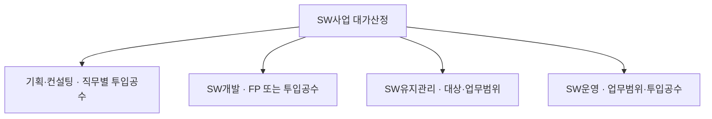
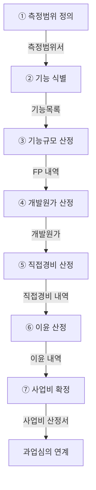

## 지식 로드맵 내 현재 위치

IT 전략·관리 → 공공 SW사업 관리 → **SW사업 대가산정**

## 30초 인출

- 본질: **SW사업 대가산정**은 소프트웨어 진흥법 제46조에 근거하여 기획·개발·운영·유지관리 등 사업 유형에 부합하는 표준 산정방식을 적용해 적정 사업 예산과 계약 대가를 산출하는 공학적 가치 산정 체계이다.
- 메커니즘: 측정범위 정의 → 데이터/트랜잭션 기능 식별(ILF/EIF/EI/EO/EQ) → 기능규모(FP) 및 보정계수 산정 → 개발원가·직접경비·이윤 구분 산정 → 사업비 합산 → 과업심의 연계한다.
- 산출물: SW 기능점수 산정내역서 · 비기능 요구 보정계수표 · SW사업 대가 산정 총괄서 및 계약 변경 Baseline이다.

핵심 용어

- **FP(Function Point)**: 사용자 관점의 논리적 기능을 기준으로 SW 규모를 측정하는 단위. 이는 해당 용어의 역할과 작동을 설명한다.
- **ILF(Internal Logical File)**: 대상 애플리케이션 내부에서 유지되는 논리적 데이터 그룹. 이는 해당 용어의 역할과 작동을 설명한다.
- **EIF(External Interface File)**: 다른 애플리케이션이 유지하고 대상 애플리케이션이 참조하는 논리적 데이터 그룹. 이는 해당 용어의 역할과 작동을 설명한다.
- **EI(External Input)**: 외부 입력으로 내부 데이터 또는 처리 상태를 변경하는 기능. 이는 해당 용어의 역할과 작동을 설명한다.
- **EO(External Output)**: 처리 결과를 외부로 제공하는 출력 기능. 이는 해당 용어의 역할과 작동을 설명한다.
- **EQ(External Inquiry)**: 별도 파생처리 없이 데이터를 조회하는 기능. 이는 해당 용어의 역할과 작동을 설명한다.
- **Traceability**: 요구사항부터 규모·비용·계약범위까지 근거를 추적할 수 있는 성질. 이는 해당 용어의 역할과 작동을 설명한다.

## 예상문제

> SW사업 대가산정의 개념과 사업유형별 산정방식을 설명하고, FP 기반 개발비 산정 절차 및 과업변경 통제방안을 제시하시오.

## Ⅰ. 적정 대가 지급을 위한 SW사업 대가산정의 개요

> 대가산정은 최저 견적을 만드는 계산이 아니라, 사업범위와 비용근거를 연결하여 발주자·사업자의 계약 Baseline을 세우는 활동임.

- 정의: **소프트웨어 진흥법 제46조**와 **SW사업 대가산정 가이드**에 따라 **기능점수(FP)**·직접경비·이윤을 반영해 적정 사업비를 산출하는 활동
- 목적: 사업비 근거와 **과업심의**를 연결해 예산 적정성을 확보하고 불공정 계약·변경 분쟁을 예방하는 것
산정 근거는 **소프트웨어 진흥법 제46조**의 적정 대가 지급 원칙과 KOSA의 **SW사업 대가산정 가이드**에서 확인한다.

## Ⅱ. 사업유형별 대가산정 체계

> 사업 유형별 특성에 맞추어 기능점수(FP) 방식과 투입공수 방식을 선별 적용하며, 산출물의 측정 가능성을 기준으로 산정 모델을 확정함.

## Ⅲ. FP 기반 SW개발비 산정 절차

> 요구사항이 기능 단위로 식별되어야 규모를 측정할 수 있으며, 각 단계의 활동과 산출근거를 함께 남겨야 함.

| 단계 | 활동 |
|---|---|
| ① 측정범위 정의 | 경계·목적 확정 |
| ② 기능 식별 | ILF·EIF·EI·EO·EQ |
| ③ 기능규모 산정 | 복잡도·가중치 적용 |
| ④ 개발원가 산정 | 단가·보정기준 적용 |
| ⑤ 직접경비 산정 | 사업 직접 소요비용 식별 |
| ⑥ 이윤 산정 | 적용 기준 확인 |
| ⑦ 사업비 확정 | 개발원가+직접경비+이윤 |

| 구성 | 산정 관점 | 합산 관계 |
|---|---|---|
| 개발원가 | 기능규모, 단가와 보정요소를 적용한 개발비용 | SW개발비의 원가 부분 |
| 직접경비 | 사업 수행에 직접 필요한 별도 비용 | 개발원가와 구분하여 합산 |
| 이윤 | 관련 산정기준에 따라 개발원가를 기초로 산정 | 개발원가·직접경비와 구분하여 합산 |
| SW개발비 | 개발 사업의 최종 대가 | **개발원가 + 직접경비 + 이윤** |

## Ⅳ. FP 방식과 투입공수 방식 비교

> 기능범위가 명확하면 **기능점수(FP)**, 기능 식별이 곤란하고 전문가 작업량이 핵심이면 투입공수가 적합함.

| 기준 | FP 방식 | 투입공수 방식 |
|---|---|---|
| **측정대상** | 사용자 관점 기능규모 | 인력 등급 및 투입 기간(M/M) |
| **적합사업** | 요구사항이 구체화된 신규 개발 | 기획·컨설팅 · 기능 식별 곤란 고난도 연구 |
| **강점** | 기술·생산성과 분리된 객관적 규모 비교 | 직무별 작업량 중심의 신속한 예산 산정 |
| **통제** | 기능 누락·중복 제거 및 복잡도 검증 | 투입 인력 자격·일정 준수·산출물 검증 |

## Ⅴ. 대가산정의 문제점·대응책

> 오차 자체보다 산정근거가 계약과 단절될 때 무상과업·예산초과·분쟁으로 확대됨.

| 위험 | 대책 | 효과 |
|---|---|---|
| **범위 누락** | 요구사항·기능목록·**FP** 내역 전주기 추적 | 무상과업 발생 방지 및 대가 보전 |
| **공수 부풀림** | 직무·기간·산출물 교차검증 및 표준단가 적용 | 사업비 과다산정 및 예산 낭비 억제 |
| **과업변경 미반영** | **과업심의위원회** 의무 개최 및 변경 대가·기간 산정 | 납기 지연 방지 및 법적 계약분쟁 예방 |

## Ⅵ. 변경비용을 통제하는 기술사적 제언

> 초기 산정값을 고정하는 것보다 변경된 요구사항을 기능규모와 계약대가에 일관되게 반영하는 **과업변경 거버넌스**가 프로젝트 성패를 좌우함.

### 실전 답안용 기술사적 제언

- 판정: 과업변경에 따른 추가 개발 범위를 기능점수로 실측하고 계약금액에 적정 반영하였는가
- 대안: **RTM(Requirements Traceability Matrix)** 연동 **FP 재산정** + **과업심의위원회** 정례화
- 검증: 과업변경 요청서 ↔ 기능점수 증감 내역 ↔ 계약 변경 합의서 정합성 확인
- 효과: 불합리한 무상과업 근절 · SW 사업자 수익성 보장 및 공공 SW 납기 품질 신뢰 확보

## 1교시 10점 답안 발췌

### 1. 정의·목적

- 정의: **SW사업 대가산정**은 소프트웨어 진흥법 제46조에 따라 사업 유형별 표준 가이드를 적용하여 적정 사업 예산과 계약 대가를 객관적으로 산출하는 엔지니어링 활동
- 목적: 적정 사업 대가 보장 · 불합리한 무상과업 방지 · 과업변경 분쟁 예방

### 2. 구성체계 및 방법론

### 3. 핵심 통제

- **Traceability**: 요구사항 ↔ 기능목록 ↔ 기능점수(FP) ↔ 사업비 ↔ 계약 변경선 전주기 일치
- **과업심의위원회**: 과업변경 발생 시 법정 심의를 통해 계약금액 및 사업기간을 공식 조정하여 Baseline 동기화

## 출제 이력과 검증 출처

- 공식 문제지 원문으로 확인한 직접 기출 없음
- [KOSA: SW사업 대가산정 가이드 2025년 개정판](https://www.sw.or.kr/site/sw/ex/board/View.do?bcIdx=63607&cbIdx=276)
- [국가법령정보센터: 소프트웨어 진흥법 제46조](https://www.law.go.kr/법령/소프트웨어진흥법/제46조)
- [국가법령정보센터: 소프트웨어 진흥법 제50조](https://www.law.go.kr/법령/소프트웨어진흥법/제50조)

## 학습 체크

- [ ] Ⅰ. 대가산정의 정의·목적·법적 근거를 재현할 수 있는가?
- [ ] Ⅱ. 기획·개발·유지관리·운영의 산정기준을 구분할 수 있는가?
- [ ] Ⅲ. FP 산정 5단계의 활동·산출을 연결할 수 있는가?
- [ ] Ⅳ. FP와 투입공수를 측정대상·적합사업·통제로 비교할 수 있는가?
- [ ] Ⅴ~Ⅵ. 범위 누락·공수 부풀림·과업변경의 대응책과 Baseline 갱신을 설명할 수 있는가?

## 연결 토픽

- 이전 토픽: [범정부 AI 공통기반](./025_pan_government_ai_common_infrastructure.md)
- 연관 토픽: [ISMP](./001_ismp.md), [RFP](./049_rfp.md), [공공 SW사업 발주·계약](./039_public_sw_contract.md)
- 다음 토픽: [Active-Active 스토리지 DR](./027_active_active_storage_dr.md)
