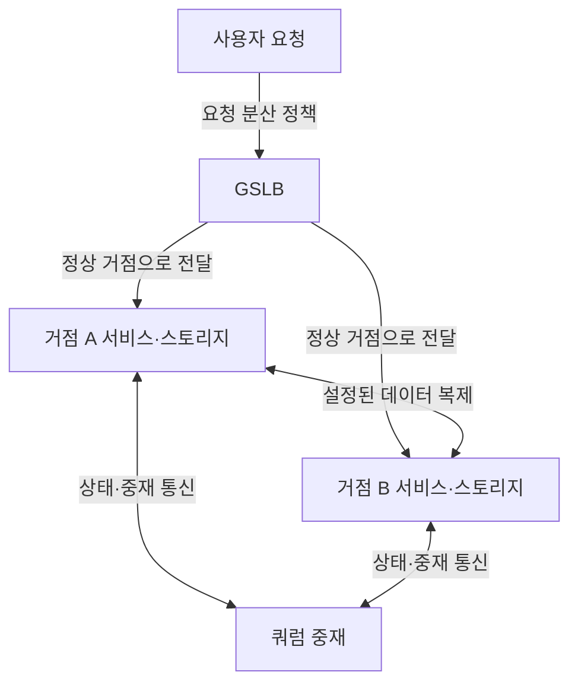
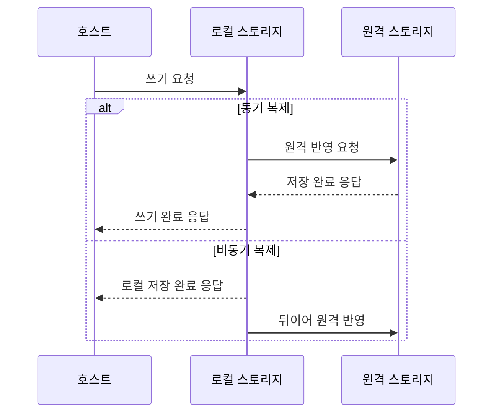

## 지식 로드맵 내 현재 위치

지식 위치: IT 전략·관리 → 재해복구·서비스 연속성 → **액티브-액티브 이중화와 스토리지 DR**

## 30초 인출

- 본질: 액티브-액티브 이중화는 둘 이상의 거점이 평상시 함께 서비스를 처리하는 가용성 구조다. 데이터 복제 방식과 장애 절체 방식은 별도로 설계한다.
- 메커니즘: 트래픽을 정상 거점으로 분산하고, 스토리지는 선택한 방식으로 복제한다. 장애 시에는 단일 쓰기 주체와 복구 가능성을 확인한 뒤 트래픽을 전환한다.
- 핵심: 동기·비동기 복제의 선택은 업무별 **RPO**·지연 조건에 맞춘다. 실제 절체 시험으로 데이터 정합성·잔여 용량·복구시간을 검증한다.

핵심 용어

- **액티브-액티브 스토리지 DR**: 둘 이상의 거점이 서비스를 함께 처리하고, 원격 데이터 복제와 장애 절체를 통해 업무 연속성을 지원하는 구성
- **액티브-액티브(Active-Active)**: 둘 이상의 거점이 평상시 동시에 서비스 요청을 처리하는 구성
- **스토리지 DR(Disaster Recovery)**: 재해 때 데이터를 복구하고 서비스를 재개하도록 원격 복제·복구 절차를 마련하는 것
- **GSLB(Global Server Load Balancing)**: 복수 거점의 상태와 정책을 바탕으로 사용자 요청을 분산하거나 다른 거점으로 유도하는 기능
- **동기 복제(Synchronous Replication)**: 원격 저장 반영을 확인한 후 쓰기 완료를 응답하는 복제 방식
- **비동기 복제(Asynchronous Replication)**: 로컬 쓰기 완료를 먼저 응답하고 원격 반영을 뒤이어 수행하는 복제 방식
- **RPO(Recovery Point Objective)**: 장애 시 허용할 수 있는 데이터 복구 시점의 목표
- **스플릿 브레인(Split-Brain)**: 통신 단절 뒤 복수 거점이 동시에 쓰기 주체로 동작해 데이터 정합성을 해칠 수 있는 상태
- **쿼럼 중재(Quorum Witness)**: 구성된 다수결·중재 정책으로 클러스터의 정상 동작 주체를 결정하는 기능

---

## 1교시 예상문제 (10점)

> 액티브-액티브 이중화와 스토리지 DR의 구성 및 복제·절체 시 정합성 통제를 설명하시오. (예상·10점)

---

## 1교시 10점 답안

### Ⅰ. 개요

| 구분 | 핵심 |
|---|---|
| 정의 | **액티브-액티브 스토리지 DR**은 둘 이상의 거점이 서비스를 함께 처리하고, 원격 데이터 복제와 장애 절체를 통해 업무 연속성을 지원하는 구성이다. |
| 목적 | 장애 때 서비스 중단과 데이터 손실을 업무별 목표 안에서 줄인다. |

### Ⅱ. 거점·트래픽·복제 관계

### Ⅲ. 복제와 절체 통제

- **동기 복제**는 원격 저장 반영 확인 후 쓰기 완료를 응답하며, 응답 완료된 쓰기의 원격 보장을 목표로 한다. 실제 보장은 스토리지 구성·장애 처리에 달린다.
- **비동기 복제**는 로컬 응답을 먼저 하므로 장애 시 마지막 원격 반영 이후의 데이터가 유실될 수 있다.
- **스플릿 브레인**을 막기 위해 중재·펜싱 정책으로 쓰기 주체를 하나로 제한하고, 승격 후 데이터 정합성을 확인한다.

제언: 업무별 RPO·복구시간·쓰기 지연 요구를 정하고 그 조건에서 절체 시험을 수행한다.

---

## 2~4교시 예상문제 (25점)

> 액티브-액티브 이중화와 스토리지 DR의 구성 메커니즘을 설명하고, 동기·비동기 복제의 차이와 스플릿 브레인 방지·복구 방안을 제시하시오. (예상·25점)

---

## 2~4교시 25점 답안

## Ⅰ. 액티브-액티브 스토리지 DR의 개요

| 구분 | 핵심 |
|---|---|
| 정의 | **액티브-액티브 스토리지 DR**은 둘 이상의 거점이 서비스를 함께 처리하고, 원격 데이터 복제와 장애 절체를 통해 업무 연속성을 지원하는 구성이다. |
| 목적 | 장애 때 서비스 중단과 데이터 손실을 업무별 목표 안에서 줄인다. |

## Ⅱ. 거점·트래픽·복제 관계

이 그림은 참조 관계를 나타낸다. 실제로 동시 요청을 처리할 수 있는 범위, 복제 방향, 중재 방식은 애플리케이션·스토리지 제품의 구성과 업무 정합성 요건으로 결정한다.

## Ⅲ. 동기·비동기 복제 비교

동기 복제는 원격 저장 반영을 확인한 뒤 호스트에 완료를 알린다. 비동기 복제는 로컬 저장 후 먼저 응답하고 원격 반영은 뒤따른다.

| 기준 | 동기 복제 | 비동기 복제 |
|---|---|---|
| 완료 응답 | 원격 반영 확인 후 응답 | 로컬 반영 후 먼저 응답 |
| 장애 시 데이터 | 완료 응답된 쓰기의 원격 반영을 목표로 하나, 장애·제품별 보장 조건 확인 필요 | 마지막 원격 반영 이후 쓰기의 손실 가능성 있음 |
| 지연 영향 | 원격 응답 지연이 쓰기 응답시간에 반영될 수 있음 | 로컬 우선 응답으로 쓰기 지연을 줄일 수 있음 |
| 적합 조건 | 업무가 요구하는 데이터 손실 목표와 회선 지연을 함께 충족할 때 | 허용 가능한 복제 지연·데이터 손실 목표를 충족할 때 |

## Ⅳ. 서비스 절체와 데이터 복구의 구분

| 구분 | 서비스 절체 | 데이터 복구 |
|---|---|---|
| 목적 | 사용자의 요청을 정상 거점으로 전달 | 장애 전후 데이터의 정합 상태를 확인하고 필요한 시점으로 복구 |
| 주요 수단 | GSLB 정책, 애플리케이션 가용성·상태 확인 | 복제 상태, 일관성 검사, 백업·복구 절차 |
| 확인 결과 | 서비스 접근 가능 여부 | 데이터 손실 범위와 업무 적용 가능 여부 |

트래픽만 바뀌어도 데이터가 안전하다고 볼 수 없으므로 서비스 상태와 저장 데이터 상태를 각각 검증한다.

## Ⅴ. 주요 실패 위험과 통제

| 위험 | 통제 | 검증 항목 |
|---|---|---|
| 거점 간 통신 단절로 복수 쓰기 주체 발생 | 쿼럼 정책과 **I/O 펜싱**으로 쓰기 권한을 제한하고 격리 상태 확인 | 단일 쓰기 주체·펜싱 동작 |
| 비동기 복제 지연 중 장애 발생 | 업무별 **RPO**에 맞춰 복제 지연을 감시하고, 초과 시 복구 의사결정 절차 실행 | 복제 지연·손실 범위 |
| 장애 거점 부하를 남은 거점이 감당하지 못함 | 거점 상실 시나리오로 용량·부하 우선순위를 검증 | CPU·저장·네트워크 여유 |
| 논리 오류·랜섬웨어가 복제본으로 전파 | 운영 복제와 분리된 백업을 보존하고 복원 시험 | 백업 격리·복원 가능성 |

## Ⅵ. 기술사적 제언 — 업무별 복제·절체 기준 확정

| 문제 | 해결 방안 |
|---|---|
| 한 가지 복제·절체 구성을 모든 업무에 적용하면 데이터 손실 허용치, 쓰기 지연, 복구 우선순위의 차이를 반영하기 어렵다. | 업무별로 **RPO**, 목표 복구시간, 허용 쓰기 지연, 정합성 확인 절차를 한 기준표에 정하고, 그 기준을 충족하는 복제·절체 조합을 선택해 정기적으로 실전 시험한다. |

## 출제 이력과 검증 출처

- 공식 문제지 원문으로 확인한 직접 기출 없음
- [NIST SP 800-34 Rev. 1: Contingency Planning Guide for Federal Information Systems](https://csrc.nist.gov/pubs/sp/800/34/r1/final)

## 연결 토픽

- 이전 토픽: [SW사업 대가산정](./026_software_cost_estimation.md)
- 연관 토픽: [국가정보자원관리원 화재](./023_national_information_resources_service_fire.md), [RTO·RPO](./018_rpo.md), [DRS](./042_drs.md), [BCP](./030_bcp.md)
- 다음 토픽: [터크만 팀 발달 모델](./028_tuckman_team_development_model.md)
