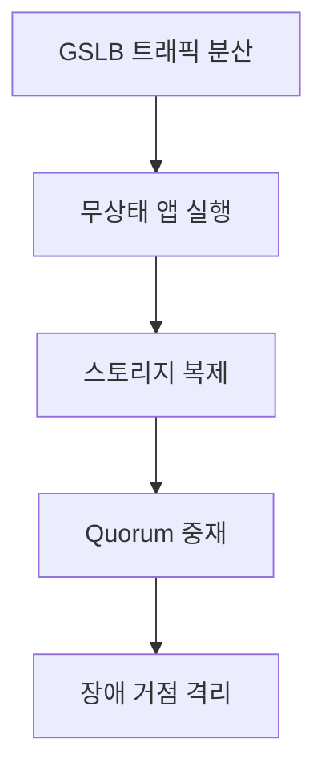
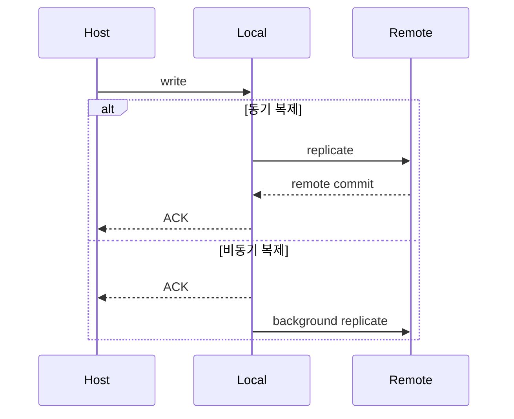
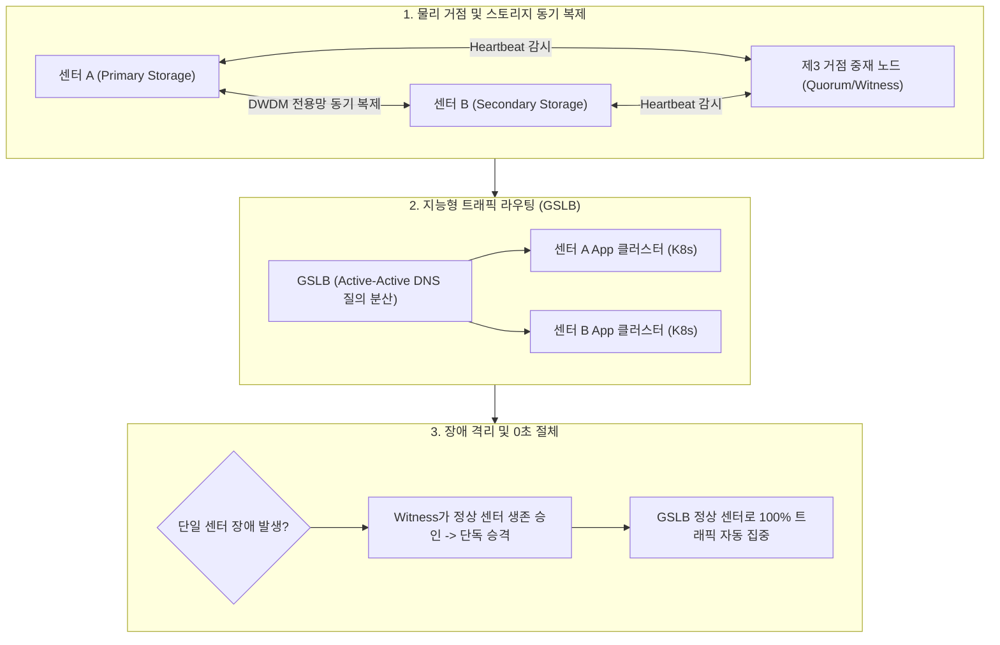

## 지식 로드맵 내 현재 위치

지식 위치: IT 전략·관리 → 재해복구·서비스 연속성 → **액티브-액티브 이중화와 스토리지 DR**

## 30초 인출

- 본질: 액티브-액티브 스토리지 DR은 여러 거점이 평소에도 서비스를 처리하다가 한 거점의 장애를 다른 거점이 이어받는 복구 구조다.
- 메커니즘: **GSLB** 트래픽 분산 → 무상태(Stateless) 컨테이너 앱 실행 → 광채널(ISL) 기반 스토리지 **동기 복제** → 제3 거점 **Quorum Witness** 헬스체크 및 I/O Fencing → 장애 센터 격리한다.
- 산출물: 다중 거점 **Active-Active** 네트워크 구성도 · 스토리지 **동기 복제** 정책서 · Quorum 중재 규칙서 및 N-1 용량 검증서이다.

핵심 용어

- **Active-Active** : 복수 데이터센터의 서버와 스토리지가 동시에 실시간 트래픽을 분산 처리하는 무중단 이중화 구성
- **스토리지 DR(Disaster Recovery)** : 재해 발생 시 데이터 유실을 방지하고 서비스를 복구하기 위해 원격지에 스토리지를 복제하는 재해복구 체계
- **GSLB(Global Server Load Balancing)** : DNS 기반으로 각 센터의 상태와 응답 지연을 실측하여 최적 거점으로 트래픽을 분산·절체하는 기술
- **동기 복제(Synchronous Replication)** : 로컬과 원격 스토리지 양쪽에 쓰기 완료를 확인한 후 호스트에 ACK를 반환하는 무손실(RPO=0) 복제 기법
- **비동기 복제(Asynchronous Replication)** : 로컬 쓰기 완료 즉시 호스트에 응답하고 원격지 복제는 지연 처리하여 장거리 전송 지연을 극복하는 복제 기법
- **Split-Brain** : 센터 간 통신망 단절 시 양 센터가 독립적으로 쓰기 작업을 허용하여 데이터 정합성이 영구 훼손되는 분열 현상
- **Quorum Witness** : 양 센터 간 스플릿 브레인 방지를 위해 제3 거점에서 가용성을 판정하고 단일 센터에만 I/O 권한을 부여하는 중재 시스템
- **N-1 용량 설계** : 1개 데이터센터가 전면 붕괴되는 비상 상황에서도 잔여 거점만으로 평시 최대 부하를 100% 수용할 수 있도록 사이징하는 설계 원칙

---

## 1교시 예상문제 (10점)

> 액티브-액티브 스토리지 DR의 복제 구조와 정합성 통제를 설명하시오. (예상·10점)

---

## 1교시 10점 답안

### 1. 정의·목적

- 정의: 복수 거점의 서비스 자원을 동시에 운영하고 장애 거점의 부하를 정상 거점으로 전환하는 고가용성·재해복구 구조
- 목적: 서비스 중단시간 단축 · 자원 활용 · 업무 연속성 확보

### 2. 구성체계 및 방법론

### 3. 핵심 통제

- **동기식 복제** : 원격 쓰기 완료를 확인한 뒤 응답하여 완료된 쓰기의 정합성을 확보
- **Quorum Witness** : 센터 간 통신 장애 시 **Split-Brain** 방지 및 단독 마스터 승격 판정
- **N-1 용량 설계** : 단일 거점 상실 후 잔여 거점의 수용능력과 부하차단 순위를 검증

---

## 2~4교시 예상문제 (25점)

> 다중 거점 Active-Active 및 스토리지 DR의 구성 메커니즘을 설명하고, 동기·비동기 복제의 특징과 Split-Brain 방지 대책을 논하시오.

---

## 2~4교시 25점 답안

## Ⅰ. 무중단 서비스 연속성을 위한 액티브-액티브 스토리지 DR의 개요

> 서비스 Active-Active와 데이터 동기 복제는 같은 뜻이 아니며, 업무의 RTO·RPO와 정합성 요구에 따라 조합해야 함.

- 정의: **Active-Active** 복수 거점이 서비스를 동시에 처리하고 **동기 복제** 와 **Quorum Witness** 로 장애 거점의 부하를 정상 거점으로 전환하는 DR 구조
- 목적: 업무별 **RTO·RPO** 요구에 맞춰 서비스 중단과 데이터 불일치를 줄이고 업무 연속성을 확보하는 것

## Ⅱ. 액티브-액티브 스토리지 DR 구성체계 및 복제 메커니즘

> 트래픽 제어부터 스토리지 블록 미러링과 쿼럼 중재까지 계층별 파이프라인으로 연결해야 무손실 자동 절체가 완성됨.

- **Traceability** : GSLB 상태 ↔ 복제 상태 ↔ 쿼럼 판정 ↔ 서비스 전환 결과 추적

## Ⅲ. 스토리지 복제 방식(동기식 vs 비동기식) 비교

> **동기식 복제(Synchronous)** 는 양쪽 쓰기 완료를 보장하여 데이터 정합성(RPO=0)을 최우선시하고, **비동기식 복제(Asynchronous)** 는 로컬 즉시 응답으로 원거리 전송 지연(Latency)을 최소화함.

| 비교 기준 | 동기식 복제 (Synchronous) | 비동기식 복제 (Asynchronous) |
|---|---|---|
| **동작 메커니즘** | 양쪽 스토리지에 모두 쓰기가 완료된 후 호스트에 응답 | 로컬 스토리지에 쓴 뒤 즉시 응답하고 원격지 백그라운드 전송 |
| **RPO** | 완료 응답된 쓰기의 원격 반영 ( **RPO = 0** ) | 복제 지연 구간의 데이터 유실 가능 ( **RPO > 0** ) |
| **거리 제약** | 회선 지연·대역폭에 민감 | 더 먼 거리 적용 가능하나 복제 지연 발생 |
| **호스트 성능** | 원격 왕복 지연이 쓰기 응답에 반영 | 로컬 응답 후 전송하여 쓰기 지연 영향 축소 |
| **선택 기준** | 금융 거래, 공공 핵심 행정 등 데이터 무손실 필수 | 대규모 비정형 데이터, 원거리 재난 대피 DR |

## Ⅳ. 액티브-액티브(Active-Active) vs 액티브-스탠바이(Active-Standby) 비교

> **Active-Active** 는 평시 자원 활용률을 극대화하고 복구시간(RTO)을 단축하지만 동시 쓰기 정합성 통제가 복잡하며, **Active-Standby** 는 구조가 단순하지만 대기 자원의 유휴 비용이 발생함.

| 비교 기준 | 액티브-액티브 (Active-Active) | 액티브-스탠바이 (Active-Standby) |
|---|---|---|
| **평시 운영 상태** | 양 센터 모두 실제 워크로드 동시 분산 처리 | 주 센터만 운영, 대기 센터는 유휴 상태 대기 |
| **RTO** | 사전 가동 자원으로 전환시간 단축 | 대기 자원 기동·승격·정합성 확인 필요 |
| **RPO** | 선택한 데이터 복제방식에 좌우 | 선택한 데이터 복제방식에 좌우 |
| **자원 활용** | 양 거점 평시 활용 | 대기 거점 유휴 가능 |
| **아키텍처 난이도** | 정합성·분산 세션·쓰기 충돌·스플릿브레인 통제 | 비교적 단순한 Failover 절차 및 복구 시나리오 |

## Ⅴ. 실무 아키텍처 실패 모드와 공학적 해결 방안

> 분산 환경에서 발생하는 네트워크 단절과 잔여 용량 초과는 연쇄 붕괴의 주원인이므로 공학적 통제 장치가 필수적임.

| 위험 | 대책 | 효과 |
|---|---|---|
| **스플릿 브레인(Split-Brain)** | 제3 거점 독립 **Quorum Witness** 배치 및 다수결 **I/O Fencing** | 양방향 동시 쓰기로 인한 데이터 오염 위험 억제 |
| **잔여 거점 용량 부족** | **N-1 용량 설계** 와 비핵심 업무 자동 부하차단(Shedding) | 단일 거점 상실 시 연쇄 과부하 다운 차단 |
| **복제 지연 누적** | 회선 대역폭 모니터링 · 중요도별 동기/비동기 분리 적용 | 트랜잭션 병목 해소 및 RPO 균형 확보 |
| **논리적 오염 전파** | 실시간 복제와 분리된 제3 거점 **불변(WORM) 백업** 운영 | 랜섬웨어 및 관리자 실수 발생 시 과거 시점 복원 |

## Ⅵ. 정합성 및 실전 절체 중심의 기술사적 제언

> 아무리 고가의 이중화 장비를 구축했더라도 불시 실전 모의 절체 훈련을 통해 실측 검증하지 않으면 DR은 문서상 계획에 불과함.

### 실전 답안용 기술사적 제언

- 문제: 원격지 간 스토리지 동기 복제 시 왕복 지연(RTT)으로 인한 메인 트랜잭션 성능 저하와 네트워크 단절 시 Split-Brain으로 인한 데이터 불일치 위험이 발생함.
- 해결 방안: 100km 이내 전용 광전송망(DWDM) 기반 동기 복제를 적용하고, 제3의 중재 사이트(Witness/Quorum)를 배치하여 Split-Brain을 방지하며, 상위 GSLB 및 무상태(Stateless) 컨테이너 클러스터와 연계해 RTO 0 / RPO 0 수준의 무중단 자동 절체를 구현함.

## 출제 이력과 검증 출처

- 공식 문제지 원문으로 확인한 직접 기출 없음
- [NIST SP 800-34 Rev.1: Contingency Planning Guide for Federal Information Systems](https://csrc.nist.gov/pubs/sp/800/34/r1/final)

## 연결 토픽

- 이전 토픽: [소프트웨어 사업 대가산정](./026_software_cost_estimation.md)
- 연관 토픽: [국가정보자원관리원 화재](./023_national_information_resources_service_fire.md), [RTO·RPO](./018_rpo.md), [DRS](./042_drs.md), [BCP](./030_bcp.md)
- 다음 토픽: [터크만 팀 발달 모델](./028_tuckman_team_development_model.md)
