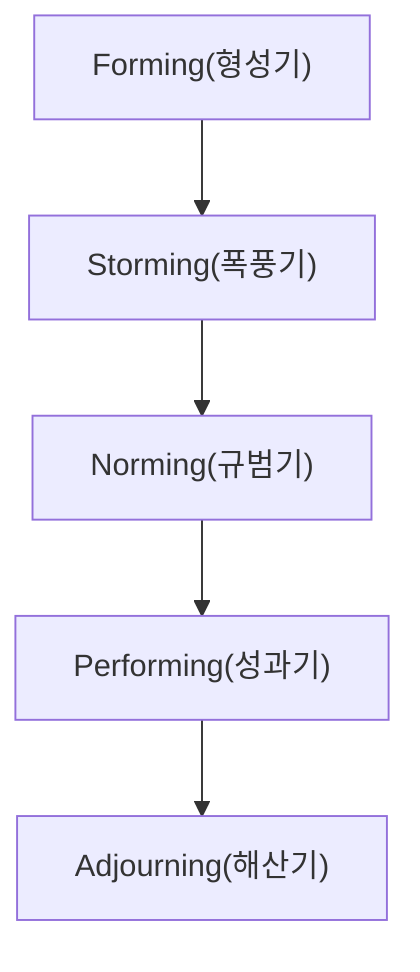
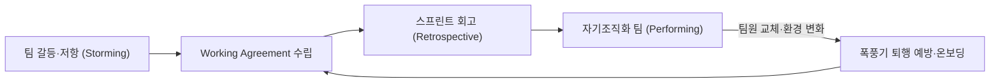

## 지식 로드맵 내 현재 위치

지식 위치: IT 전략·관리 → 프로젝트 관리·팀 역학 → **터크만 팀 발달 모델**

## 30초 인출

- 본질: **터크만 팀 발달 모델(Tuckman Team Development Model)**은 팀이 결성되어 고성과를 내고 해산하기까지 거치는 5단계 발달 사다리와 각 단계별 팀 심리·갈등 양상 및 PM의 리더십 전환을 설명한 조직 역학 프레임워크이다.
- 메커니즘: 팀은 Forming → Storming → Norming → Performing → Adjourning으로 전이하며, 리더십 방식도 지시형에서 위임형으로 조정한다.
- 산출물: 프로젝트 헌장(RACI) · 팀 작업 협약서(Working Agreement) · 충돌 해결 규칙서 · 회고 및 교훈 자산(Lessons Learned)이다.

핵심 용어

- **Forming(형성기)**: 팀원이 처음 모여 상호 탐색하며 프로젝트 목표와 규칙에 대해 PM에게 크게 의존하는 단계다.
- **Storming(폭풍기)**: 업무 방식, 권한 배분, 기술 스택 선정을 둘러싸고 팀원 간 의견 충돌과 저항이 표출되는 단계다.
- **Norming(규범기)**: 갈등을 극복하고 상호 신뢰를 구축하며 팀 작업 협약과 프로세스 표준을 수립·준수하는 단계다.
- **Performing(성과기)**: 팀원 간 고도의 상호보완적 협업을 통해 자율적으로 문제를 해결하고 최고의 생산성을 발휘하는 단계다.
- **Adjourning(해산기)**: 프로젝트 과업을 완료하고 성과를 평가한 후 팀을 공식적으로 해체하는 단계다.
- **RACI(Responsible-Accountable-Consulted-Informed)**: 업무별 책임자, 승인자, 자문자, 통보자를 명시하는 역할 분담 매트릭스이다.
- **Working Agreement**: 팀 내부의 작업 방식, 소통 원칙, 갈등 해결 기준을 팀원 전원이 자발적으로 합의한 규범서이다.
- **Lessons Learned**: 프로젝트 종료 단계에서 성공 및 실패 경험을 체계적으로 정리한 조직 지식 자산이다.

## 예상문제

> Tuckman 팀 발달 5단계와 단계별 행동 특성을 설명하고, PM의 개입 및 갈등관리 방안을 제시하시오.

## Ⅰ. 고성과 자기조직화 팀 구축을 위한 터크만 팀 발달 모델의 개요

> 폭풍기 갈등을 필연적 성장 통과의례로 수용하며, 성패는 단순 일정 관리가 아닌 **단계별 맞춤형 리더십 전환**과 **자기조직화**로 판정함.

- 정의: **Forming·Storming·Norming·Performing·Adjourning**의 5단계로 팀의 관계와 과업 수행 변화를 설명하는 **Tuckman 팀 발달 모델**
- 목적: **단계별 리더십**과 갈등관리로 팀 성숙을 촉진하고 자기조직화된 성과 단계에 도달하는 것

## Ⅱ. 터크만 5단계 팀 발달 구성체계 및 단계별 활동 산출물

> `형성 → 폭풍 → 규범 → 성과 → 해산`의 사다리 구조를 오르며 PM의 지시적 개입을 줄이고 팀 자율성을 확대함.

- **Traceability**: 팀 상태 ↔ 리더십 개입 ↔ 작업 협약 ↔ 성과·교훈의 연결

## Ⅲ. 터크만 팀 발달 5단계 사다리 및 PM 리더십 전환

> 팀 성숙도 사다리를 오름에 따라 팀원의 자율성은 점진적으로 증가하고, PM의 개입 방식은 지시형에서 코칭, 지원을 거쳐 전폭적 위임형으로 전환되어야 함. 단계 흐름은 Ⅱ의 도식을 재사용하고 아래 표에서 개입 차이를 구체화함.

| 발달 단계 | 팀원의 주요 심리 및 행동 양식 | 프로젝트 관리자(PM) 핵심 역할 | 주요 공식 산출물 |
|---|---|---|---|
| **1. 형성기 (Forming)** | 목표 탐색, 소극적 태도, PM에 대한 높은 의존성 | 비전 제시, 역할 및 책임 명확화 | 프로젝트 헌장, **RACI 매트릭스** |
| **2. 폭풍기 (Storming)** | 작업 방식·권한 충돌, 파벌 형성, 감정적 저항 | 적극적 경청, 원칙 중심 갈등 중재 | 갈등 해결 규칙, 의사결정 프레임워크 |
| **3. 규범기 (Norming)** | 갈등 해소, 상호 신뢰 형성, 자율적 규율 준수 | 팀 자율성 지지, 프로세스 표준화 | **Working Agreement**, 그라운드 룰 |
| **4. 성과기 (Performing)** | 상호보완적 협업, 뛰어난 문제해결력, 고생산성 | 장애물 제거, 전폭적 권한 위임 | 스프린트 성과, 배포 릴리스 |
| **5. 해산기 (Adjourning)** | 프로젝트 완수, 과업 종료감 및 해체 아쉬움 | 공식적 성과 보상, 교훈 자산화 | 최종 보고서, **Lessons Learned** |

## Ⅳ. 발달 단계별 PM 개입 방향

> 다음 개입 방향은 터크만 모델의 공식 단계가 아니라 팀 상태에 맞춘 실무 적용안임.

| 기준 | 형성기 | 폭풍기 | 규범기 | 성과기 |
|---|---|---|---|---|
| **개입 수준** | 목표·역할 명확화 | 갈등 표면화·중재 | 합의 촉진·권한 확대 | 장애 제거·위임 |
| **의사결정** | PM 주도 (지시형) | 원칙 기반 조정 (코칭형) | 팀 합의 확대 (지원형) | 팀 자율 중심 (위임형) |
| **경계 사항** | 역할 모호성 방치 | 갈등 회피·강압적 억압 | 동조 압력·집단사고 | 마이크로매니지먼트 |

## Ⅴ. 실무 프로젝트 환경별 리스크 및 공학적·관리적 해결 대책

> 기술 스택 선정 갈등과 핵심 인력 교체는 팀을 폭풍기로 급격히 퇴행시키는 주원인이므로 사전 거버넌스가 필수적임.

| 위험 | 대책 | 효과 |
|---|---|---|
| **폭풍기 장기화** | 객관적 **PoC(Proof of Concept)** 지표 도입 및 PM의 원칙 중심 중재 | 감정 소모 차단 및 기술적 최적안 도출 |
| **인력 교체 퇴행** | 버디(Buddy) 시스템, 페어 프로그래밍, 온보딩 문서화 | 신규 인력의 규범기 조기 안착 |
| **원격 협업 고립** | 데일리 스탠드업, 비동기 소통 툴, 지라 보드 투명화 | 팀 결속력 유지 및 협업 투명성 확보 |
| **규범기 집단사고** | '악마의 변호인(Devil's Advocate)' 지정 및 익명 회고 채널 운영 | 의사결정 편향 제거 및 아키텍처 완성도 제고 |

## Ⅵ. 자기조직화 팀 진화를 위한 기술사적 제언

> PM 1인의 마이크로매니지먼트에서 벗어나, 팀 스스로 갈등을 성장의 지렛대로 삼고 자율 진화하는 **애자일 회고 문화**와 **심리적 안전감(Psychological Safety)**이 팀 빌딩의 본질임.

### 실전 답안용 기술사적 제언

- 판정: 팀 성숙도에 따른 리더십 전환 체계를 구축하고 폭풍기 갈등을 제도적으로 흡수하였는가
- 대안: 팀원 주도 **Working Agreement** 제정 + 주기적 스프린트 회고(Retrospective) 내재화
- 검증: 역할·갈등규칙 합의 여부 · 회고 개선항목의 후속 이행 확인
- 효과: **자기조직화(Self-Organizing) 팀**의 의사결정 대기·갈등 재발 감소

## 1교시 10점 답안 발췌

### 1. 정의·목적

- 정의: 팀 결성부터 해산까지 관계와 과업 수행의 변화를 5단계로 설명한 팀 발달 모델
- 목적: 팀 성숙도 단계별 갈등 해소, 최고 성과기 조기 도달

### 2. 구성체계 및 방법론

### 3. 핵심 통제

- **단계별 PM 개입**: 형성기의 명확화에서 성과기의 장애 제거·위임으로 개입 수준 조정
- **Working Agreement**: 팀 자율 규범 제정을 통한 역할 모호성 및 감정 갈등 해소
- **비선형성 통제**: 인력 교체 시 폭풍기로의 퇴행을 인지하고 신속한 재온보딩 지원

## 출제 이력과 검증 출처

- 제134회 정보관리기술사 1교시 기출 (터크만 사다리 모델의 팀 발달 단계별 특징)
- 제136회 정보관리기술사 기출 (터크만의 팀 발달 5단계)
- [PMI: A Guide to the Project Management Body of Knowledge](https://www.pmi.org/pmbok-guide-standards/foundational/pmbok)
- Bruce W. Tuckman, ["Developmental Sequence in Small Groups", Psychological Bulletin](https://doi.org/10.1037/h0022100)

## 학습 체크

- [ ] Ⅰ. Tuckman 모델의 정의·목적을 설명할 수 있는가?
- [ ] Ⅱ~Ⅲ. 5단계의 행동·PM 개입·산출을 연결할 수 있는가?
- [ ] Ⅳ. 단계별 PM 개입 방향을 공식 단계와 구분하여 제시할 수 있는가?
- [ ] Ⅴ. 폭풍기 장기화·인력 교체·원격 고립·집단사고의 대책을 설명할 수 있는가?
- [ ] Ⅵ. 팀 변화 후 단계 재진단과 Working Agreement 재합의 방안을 제시할 수 있는가?

## 연결 토픽

- 이전 토픽: [액티브-액티브 이중화와 스토리지 DR](./027_active_active_storage_dr.md)
- 연관 토픽: [프로젝트 갈등관리](./035_conflict_management.md), [PMO](./004_pmo.md), [애자일 대응전략](./013_agile_response_strategy.md)
- 다음 토픽: [A/B 테스트](./029_ab_testing.md)
