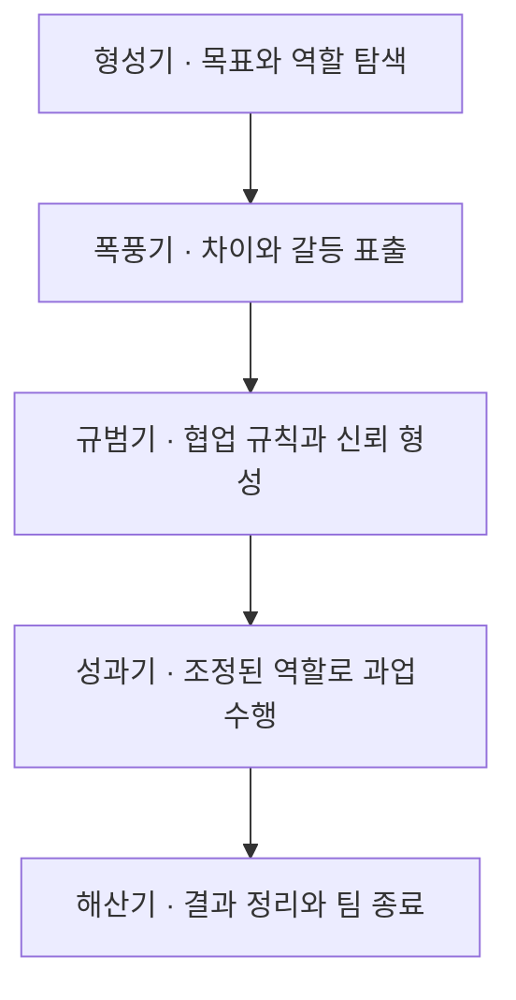

## 지식 로드맵 내 현재 위치

지식 위치: IT 전략·관리 → 프로젝트 관리·팀 역학 → **터크만 팀 발달 모델**

## 30초 인출

- 본질: **터크만 팀 발달 모델**은 팀의 관계와 과업 수행 변화를 단계로 설명하는 모델이다. 1977년 개정 논의에서 해산 단계가 더해져 흔히 다섯 단계로 소개된다.
- 메커니즘: **형성기(Forming)** → **폭풍기(Storming)** → **규범기(Norming)** → **성과기(Performing)** → **해산기(Adjourning)**. 이는 팀 발달을 이해하는 틀이며, 모든 팀이 같은 속도로 순차 진행한다는 규칙은 아니다.
- 핵심: 단계는 팀 상태를 살펴볼 관점으로 쓰고, PM은 역할·갈등·협업 상태에 맞춰 개입을 조정한다.

핵심 용어

- **터크만 팀 발달 모델**: 팀의 대인관계와 과업 수행 변화를 형성·폭풍·규범·성과 단계로 설명하고, 후속 연구 검토에서 해산 단계를 추가한 모델
- **형성기(Forming)**: 팀원이 서로를 탐색하고 목표·역할을 파악하는 초기 단계
- **폭풍기(Storming)**: 역할·업무 방식·의견 차이가 드러나 조정이 필요한 단계
- **규범기(Norming)**: 공통 규칙과 협업 방식을 정리하고 신뢰를 쌓는 단계
- **성과기(Performing)**: 역할이 조정되고 팀이 과업 수행에 집중하는 단계
- **해산기(Adjourning)**: 과업 종료에 따라 결과를 정리하고 팀 활동을 마무리하는 단계
- **팀 작업 협약(Working Agreement)**: 소통·의사결정·협업 규칙에 대해 팀이 합의한 약속

---

## 1교시 예상문제 (10점)

> 터크만 팀 발달 모델의 다섯 단계와 단계별 PM의 개입 방향을 설명하시오. (예상·10점)

---

## 1교시 10점 답안

### Ⅰ. 개요

| 구분 | 핵심 |
|---|---|
| 정의 | **터크만 팀 발달 모델**은 팀의 관계와 과업 수행 변화를 단계로 설명하는 모델이다. |
| 목적 | 팀 상태를 이해해 적절한 협업 지원과 PM 개입을 선택하도록 돕는다. |

### Ⅱ. 다섯 단계의 대표 순서

### Ⅲ. PM의 개입

- **형성기**에는 목표·역할을 분명히 하고, **폭풍기**에는 갈등을 드러내 공정한 기준으로 조정한다.
- **규범기**에는 합의한 **팀 작업 협약(Working Agreement)** 을 정착시키고, **성과기**에는 장애를 제거하며 권한을 맡긴다.
- **해산기**에는 결과와 교훈을 정리한다. 인력·목표가 바뀌면 이전 단계의 과제가 다시 나타날 수 있다.

제언: 단계를 고정된 등급으로 보지 말고 팀의 실제 상호작용을 확인해 개입한다.

---

## 2~4교시 예상문제 (25점)

> 터크만 팀 발달 모델의 다섯 단계와 팀 특성을 설명하고, PM의 단계별 개입 및 갈등관리 방안을 제시하시오. (예상·25점)

---

## 2~4교시 25점 답안

## Ⅰ. 터크만 팀 발달 모델의 개요

| 구분 | 핵심 |
|---|---|
| 정의 | **터크만 팀 발달 모델**은 팀의 관계와 과업 수행 변화를 단계로 설명하는 모델이다. |
| 목적 | 팀 상태를 이해해 적절한 협업 지원과 PM 개입을 선택하도록 돕는다. |

## Ⅱ. 팀 발달 단계

다섯 단계는 대표적인 설명 순서다. 1965년 논문은 형성·폭풍·규범·성과 네 단계를 제안했고, Tuckman과 Jensen의 1977년 검토에서 해산 단계가 추가됐다. 실제 팀이 항상 이 순서로 움직이거나 각 단계에 머무는 기간이 같다고 가정하지 않는다.

## Ⅲ. 단계별 특성과 PM의 개입

| 단계 | 팀의 주요 상태 | PM의 개입 방향 |
|---|---|---|
| **형성기(Forming)** | 목표·역할 탐색, 불확실성, PM에 대한 확인 요구 | 목표·역할·의사결정 경로를 명확히 한다. |
| **폭풍기(Storming)** | 업무 방식·역할·우선순위 차이가 표면화 | 의견을 듣고 합의한 기준으로 갈등을 조정한다. |
| **규범기(Norming)** | 공통 규칙·협업 방식 수립, 신뢰 향상 | 팀이 정한 규칙을 지지하고 권한을 점차 넓힌다. |
| **성과기(Performing)** | 역할 조정, 과업 중심의 협업 | 장애물을 제거하고 팀의 자율적 실행을 지원한다. |
| **해산기(Adjourning)** | 과업 종료, 결과 인계와 팀 해체 | 성과·교훈을 정리하고 종료를 지원한다. |

## Ⅳ. 갈등 관리와 팀 상태 점검

| 관찰 신호 | 관리 대응 | 확인할 점 |
|---|---|---|
| 목표·책임이 서로 다르게 이해됨 | 작업 범위와 책임자를 함께 확인 | 역할·의사결정 합의 |
| 의견 충돌이 개인 비난으로 번짐 | 쟁점을 과업·근거 중심으로 다시 정리 | 합의 기준과 후속 조치 |
| 구성원이 규칙을 따르지 않거나 참여하지 않음 | 규칙이 현실적인지 팀과 재검토 | 팀 작업 협약의 유효성 |
| 인력·목표 변화 뒤 협업이 흔들림 | 온보딩·역할 조정을 통해 필요한 팀 과제를 다시 지원 | 지식 인계·책임 변경 |

## Ⅴ. 기술사적 제언 — 단계는 진단 가설로 활용

| 문제 | 해결 방안 |
|---|---|
| 팀을 다섯 단계의 고정된 등급으로 분류하면 갈등을 무조건 통과해야 하는 단계로 오해하거나, 필요한 지원을 늦출 수 있다. | 정기 회고에서 관찰된 역할·갈등·협업 증거를 확인하고 단계 설명을 진단 가설로만 활용한다. 팀을 특정 단계에 억지로 맞추지 말고, 확인된 문제에 맞춰 PM 개입을 조정한다. |

## 출제 이력과 검증 출처

- 제134회 정보관리기술사 1교시 기출 (터크만 사다리 모델의 팀 발달 단계별 특징)
- 제136회 정보관리기술사 기출 (터크만의 팀 발달 5단계)
- [Tuckman, “Developmental Sequence in Small Groups,” 1965](https://doi.org/10.1037/h0022100)
- [Tuckman & Jensen, “Stages of Small-Group Development Revisited,” 1977](https://journals.sagepub.com/doi/10.1177/105960117700200404)
- [PMI: A Guide to the Project Management Body of Knowledge](https://www.pmi.org/pmbok-guide-standards/foundational/pmbok)

## 연결 토픽

- 이전 토픽: [액티브-액티브 이중화와 스토리지 DR](./027_active_active_storage_dr.md)
- 연관 토픽: [프로젝트 갈등관리](./035_conflict_management.md), [PMO](./004_pmo.md), [애자일 대응전략](./013_agile_response_strategy.md)
- 다음 토픽: [A/B 테스트](./029_ab_testing.md)
