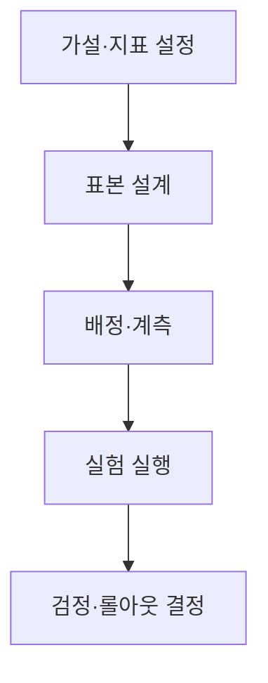
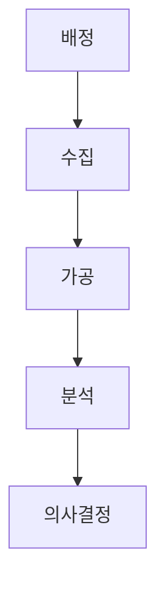
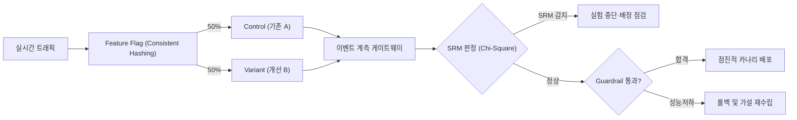

## 지식 로드맵 내 현재 위치

지식 위치: IT 전략·관리 → 데이터 기반 의사결정·제품 실험 → **A/B 테스트**

## 30초 인출

- 본질: **A/B 테스트(A/B Test)**는 사용자 집단을 대조군(Control)과 실험군(Variant)으로 무작위 배정(RCT)하여 단일 기능 변경이 핵심 지표에 미친 통계적 인과관계(Causality)를 검증하는 과학적 의사결정 프레임워크이다.
- 메커니즘: 가설 및 MDE 설정 → Feature Flag 무작위 배정 → 동일 기간 동시 노출 → SRM 검증 및 p-value 산정 → Guardrail 지표 확인 후 롤아웃한다.
- 산출물: A/B 실험 설계서(가설·표본수·지표) · SRM 카이제곱 검증표 · 통계적 유의성(p-value) 분석 보고서 및 기능 릴리즈 결정문이다.

핵심 용어

- **A/B 테스트(A/B Test)**: 기존 버전과 변경 버전을 무작위로 노출해 결과 차이가 우연인지 검증하는 통제 실험이다.
- **Causality(인과관계)**: 다른 조건을 통제했을 때 특정 기능 변경이 사용자 행동 변화를 일으켰다고 판단할 수 있는 관계다.
- **SRM(Sample Ratio Mismatch)**: 설계한 비율과 실제 유입된 A/B 표본 비율이 통계적으로 다르게 나타나는 현상이다.
- **Peeking(피킹)**: 실험이 끝나기 전에 p-value를 반복 확인하고 조기 종료해 1종 오류를 키우는 편향이다.
- **Feature Flag**: 코드 재배포 없이 특정 사용자 그룹에 기능을 동적으로 켜고 끄는 제어 플래그이다.
- **p-value**: 귀무가설이 참일 때 현재 관측된 차이 이상으로 극단적인 결과가 우연히 나타날 확률이다.
- **MDE(Minimum Detectable Effect)**: 실험을 통해 통계적으로 감지해내고자 하는 최소한의 개선 효과 크기다.
- **Guardrail Metrics(보호 지표)**: 주 성과지표 상승 시 희생될 수 있는 시스템 레이턴시, 오류율 등 핵심 안정성 지표다.

## 예상문제

> A/B 테스트의 개념과 실험 절차를 설명하고, SRM·Peeking 등 통계적 왜곡과 대응책을 제시하시오.

## Ⅰ. 직관이 아닌 데이터 기반 의사결정, A/B 테스트의 개요

> 주관적 직관(HiPPO)을 배제하고 인과관계를 입증하며, 성패는 단순 클릭률이 아닌 **SRM 편향 제거**와 **보호 지표(Guardrail) 검증**으로 판정함.

- 정의: 사용자를 무작위 배정하여 대조군(A)과 실험군(B) 간의 단일 변수 변경 효과를 통계적으로 검증하는 **무작위 통제 시험(RCT)**
- 목적: 변경효과 검증 · 의사결정 불확실성 축소 · 안전한 단계적 배포

## Ⅱ. A/B 테스트 5단계 실험 프로세스 및 계측 파이프라인

> 가설 수립에서 배포 판정까지 `가설수립 → 표본설계 → 계측검증 → 실험실행 → 가설검정` 파이프라인을 거쳐 객관적 의사결정을 완성함.

- **Traceability**: 사전 가설 ↔ 배정 규칙 ↔ 관측 데이터 ↔ 배포 결정 추적

## Ⅲ. A/B 테스트 5계층 아키텍처 및 계측 파이프라인

> 사용자 배정부터 통계 분석까지 5계층 파이프라인을 체계적으로 구축해야 데이터 결손과 통계적 왜곡을 조기에 발견하고 대응할 수 있음.

| 계층 | 주요 구성요소 | 핵심 역할 및 통제 기능 |
|---|---|---|
| **배정 계층** | Consistent Hashing, **Feature Flag** | 사용자 ID 기반 일관된 군 배정 및 세션 튕김 방지 |
| **수집 계층** | 클라이언트 로깅 SDK, 이벤트 게이트웨이 | 클릭, 체류시간, 구매 등 핵심 이벤트 실시간 수집 |
| **가공 계층** | 스트리밍 파이프라인(Kafka/Flink), 데이터 레이크 | 봇 트래픽 필터링, 결측치 보정, 분산감소(CUPED) 적용 |
| **분석 계층** | 통계 검정기(t-test, 카이제곱), Bayesian 엔진 | **p-value** 산출, 신뢰구간 계산, **SRM** 이상 감지 경보 |
| **시각화 계층**| 의사결정 대시보드 | 효과 크기, **Guardrail Metrics** 표시 및 롤아웃 트리거 |

## Ⅳ. A/B 테스트 vs 다변량 테스트(MVT) vs 멀티암드 밴딧(MAB) 비교

> 인과관계 규명에는 **A/B 테스트**가 가장 신뢰성이 높으며, 변수 간 상호작용 규명에는 **MVT**, 단기 기회비용 최소화에는 **MAB**가 유리함.

| 비교 기준 | A/B 테스트 (A/B Test) | 다변량 테스트 (MVT) | 멀티암드 밴딧 (MAB) |
|---|---|---|---|
| **실험 목적** | 단일 요인 변경의 명확한 인과효과 검증 | 복수 요인의 조합 및 상호작용 분석 | 탐색과 활용 균형을 통한 단기 수익 극대화 |
| **실험 변수** | 단일 독립변수 (A vs B) | 2개 이상의 독립변수 및 조합 | 복수 대안의 실시간 동적 할당 |
| **트래픽 배정** | 50:50 등 사전 고정 비율 유지 | 요인 조합별 균등 고정 배정 | 성과 우수 대안으로 점진적 트래픽 집중 |
| **통계적 강점** | 명확한 인과관계 해석 및 재현성 | 요인 간 상호작용 효과 규명 | 실험 중 기회비용(Regret) 최소화 |

## Ⅴ. 실무 통계적 함정과 공학적·통계적 통제 방안

> 피킹 편향(Peeking)과 표본비율 불일치(SRM)는 잘못된 의사결정을 유발하는 치명적 함정이므로 엄격한 통제가 요구됨.

| 위험 | 대책 | 효과 |
|---|---|---|
| **표본비율 불일치(SRM)** | 카이제곱 적합도 검정 상시 감시 및 발생 시 판정 보류 | 왜곡된 표본으로 인한 거짓 양성 오판 차단 |
| **피킹 문제(Peeking)** | 정해진 표본수 도달 전 분석 금지 또는 **순차 검정(Sequential Testing)** | 1종 오류(거짓 양성) 급증 위험 억제 |
| **다중 검정 오류** | 본페로니(Bonferroni) 교정 또는 **FDR(False Discovery Rate)** 통제 | 우연에 의한 가짜 개선 효과 배제 |
| **간섭 효과(Spillover)** | 사용자 단위 대신 클러스터(지역/시간) 단위 무작위 배정 | 네트워크 효과로 인한 데이터 오염 방지 |
| **신규성 효과(Novelty)** | 서비스 주기를 포함한 관측기간 확보 · 신규·기존 사용자 코호트 분리 | 일시적 호기심과 지속효과 구분 |

## Ⅵ. 실험 문화와 신뢰성 거버넌스 중심의 기술사적 제언

> 단순 A/B 테스트 도구 도입을 넘어, 실패한 실험 데이터를 조직 자산화하고 카나리 배포와 긴밀히 연동하는 **실험 거버넌스 체계** 정립이 핵심임.

### 실전 답안용 기술사적 제언

- 판정: 통계적 왜곡(SRM, Peeking)을 통제하고 보호 지표(Guardrail) 검증을 통과하였는가
- 대안: **SRM 자동 모니터링** + **Guardrail Metrics** 기반 카나리 점진 롤아웃 연동
- 검증: 사전 정의한 SRM 판정기준 · 효과크기·신뢰구간 · 오류율·지연시간 Guardrail 확인
- 효과: 거짓 양성에 의한 장애 배포 차단 · 데이터 기반의 확신 있는 제품 혁신 달성

## 1교시 10점 답안 발췌

### 1. 정의·목적

- 정의: 사용자를 대조군(A)과 실험군(B)에 무작위 배정하여 단일 변수의 변경이 성과지표에 미친 영향을 검증하는 **무작위 통제 실험(RCT)**
- 목적: 변경효과 검증 · 의사결정 불확실성 축소 · 안전한 단계적 배포

### 2. 구성체계 및 방법론

### 3. 핵심 통제

- **SRM(Sample Ratio Mismatch)**: 표본 배정 왜곡 감지 시 원인 규명 전 결과 판정 보류
- **Peeking 방지**: 정해진 표본수 도달 전 조기 종료 금지 및 순차 검정(Sequential Testing) 적용
- **Guardrail Metrics**: 전환율 상승 이면에 숨은 시스템 장애 및 응답 지연율 병행 감시

## 출제 이력과 검증 출처

- 제137회 정보관리기술사 1교시 기출 (A/B 테스트)
- Ron Kohavi et al., [Trustworthy Online Controlled Experiments: A Practical Guide to A/B Testing](https://experimentguide.com)
- NIST/SEMATECH, [e-Handbook of Statistical Methods, Comparing Two Proportions](https://www.itl.nist.gov)

## 학습 체크

- [ ] Ⅰ. A/B 테스트의 정의·목적과 무작위 배정의 역할을 설명할 수 있는가?
- [ ] Ⅱ. 가설 수립부터 배포 판정까지 활동·산출을 연결할 수 있는가?
- [ ] Ⅲ. 배정·수집·가공·분석·시각화 계층의 통제를 설명할 수 있는가?
- [ ] Ⅳ. A/B·MVT·MAB를 변수·배정·강점으로 비교할 수 있는가?
- [ ] Ⅴ~Ⅵ. SRM·Peeking·다중검정·간섭·신규성 효과의 대응책을 제시할 수 있는가?

## 연결 토픽

- 이전 토픽: [터크만 팀 발달 모델](./028_tuckman_team_development_model.md)
- 연관 토픽: [그로스 해킹](./046_growth_hacking.md), [디자인 씽킹](./047_design_thinking.md), [CRM](./031_crm.md)
- 다음 토픽: [BCP](./030_bcp.md)
