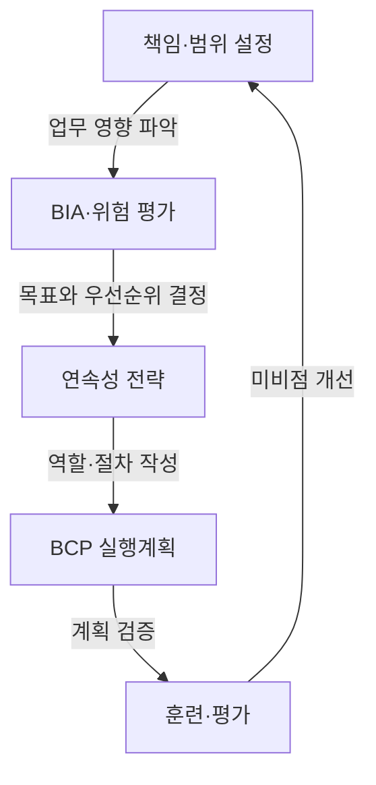

## 지식 로드맵 내 현재 위치

지식 위치: IT 전략·관리 → 거버넌스·위험관리 → **BCP**

## 30초 인출

- 본질: **BCP(Business Continuity Plan)**는 중단 상황에서 우선 업무를 유지하거나 합의한 수준으로 복구하기 위한 계획이다.
- 메커니즘: 책임·범위 설정 → **업무영향분석(BIA)** 및 위험 평가 → 연속성 전략·목표 수립 → 실행계획 작성 → 훈련·평가·개선.
- 핵심: **MTPD**, **RTO**, **RPO**, **MBCO**를 업무 영향과 복구 우선순위에 맞춰 정하고, 실제 훈련으로 실행 가능성을 확인한다.

핵심 용어

- **BCP(Business Continuity Plan)**: 중단 상황에서 우선 업무를 유지하거나 합의한 수준으로 복구하기 위한 계획
- **업무영향분석(BIA, Business Impact Analysis)**: 업무 중단의 영향을 분석해 복구 우선순위와 연속성 목표를 정하는 과정
- **최대허용중단기간(MTPD, Maximum Tolerable Period of Disruption)**: 업무 중단이 더 이상 허용될 수 없게 되는 최대 기간
- **목표복구시간(RTO, Recovery Time Objective)**: 업무를 목표 수준으로 재개하기까지 허용하는 시간 목표
- **복구시점목표(RPO, Recovery Point Objective)**: 장애 이후 복구할 데이터의 시점 목표로, 허용 가능한 데이터 손실량을 반영
- **최소업무연속성목표(MBCO, Minimum Business Continuity Objective)**: 중단 중 유지해야 하는 최소 제품·서비스 수준
- **업무연속성관리체계(BCMS, Business Continuity Management System)**: 업무 연속성을 관리하고 유지·개선하는 경영시스템
- **DRP(Disaster Recovery Plan)**: 정보시스템·데이터 복구를 다루는 재해복구 계획

---

## 1교시 예상문제 (10점)

> BCP 수립 흐름과 업무영향분석에서 정하는 복구 목표를 설명하시오. (예상·10점)

---

## 1교시 10점 답안

### Ⅰ. 개요

| 구분 | 핵심 |
|---|---|
| 정의 | **BCP(Business Continuity Plan)**는 중단 상황에서 우선 업무를 유지하거나 합의한 수준으로 복구하기 위한 계획이다. |
| 목적 | 인명과 우선 업무를 보호하고, 중단으로 인한 조직·이해관계자 영향을 줄인다. |

### Ⅱ. 수립·개선 흐름

### Ⅲ. 업무영향분석과 목표

- **업무영향분석(BIA)**는 중단 영향과 업무 간 의존성을 확인해 우선순위를 정한다.
- **최대허용중단기간(MTPD)** 안에 업무를 재개할 수 있도록 **목표복구시간(RTO)**을 설정한다.
- **복구시점목표(RPO)**는 허용 가능한 데이터 손실량을, **최소업무연속성목표(MBCO)**는 중단 중 제공할 최소 업무 수준을 정한다.

제언: 복구 목표를 업무 책임자와 합의하고 훈련에서 달성 여부를 확인한다.

---

## 2~4교시 예상문제 (25점)

> BCP 수립 흐름을 설명하고, 업무영향분석에서 정하는 MTPD·RTO·RPO·MBCO 및 BCP와 DRP의 역할을 논하시오. (예상·25점)

---

## 2~4교시 25점 답안

## Ⅰ. BCP의 개요

| 구분 | 핵심 |
|---|---|
| 정의 | **BCP(Business Continuity Plan)**는 중단 상황에서 우선 업무를 유지하거나 합의한 수준으로 복구하기 위한 계획이다. |
| 목적 | 인명과 우선 업무를 보호하고, 중단으로 인한 조직·이해관계자 영향을 줄인다. |

## Ⅱ. 업무연속성 계획 흐름

이 계획 흐름은 ISO 22301의 업무연속성관리 관점을 간단히 나타낸 것이다. 조직의 범위·위험에 따라 실제 절차와 계획 문서는 달라진다.

## Ⅲ. BIA에서 정하는 복구 목표

**MTPD**는 업무 중단이 허용될 수 있는 상한이다. **RTO**는 그 한계 안에서 목표 업무 수준을 복구하는 시간이고, **RPO**는 장애 이후 어느 시점의 데이터를 복구할지 정한다. **MBCO**는 중단 중 유지할 최소 제품·서비스 수준이다.

| 목표 | 의미와 관리 기준 |
|---|---|
| **MTPD** | 업무 중단이 더 이상 허용될 수 없게 되는 최대 기간 |
| **RTO** | 업무 재개까지의 목표시간. 업무 영향에 맞춰 **MTPD**보다 짧게 설정 |
| **RPO** | 장애 이후 복구할 데이터의 시점 목표와 허용 가능한 손실량 |
| **MBCO** | 중단 중 유지할 최소 제품·서비스 수준 |

## Ⅳ. BCP와 관련 계획의 역할

아래 구분은 조직에서 계획 범위를 나눌 때 쓰는 일반적인 관점이다. 표준이 모든 조직에 동일한 문서 체계를 요구한다는 뜻은 아니다.

| 계획 | 주된 범위 | 주요 활동 |
|---|---|---|
| 위기관리 계획(CMP) | 조직 차원의 위기 지휘 | 의사결정·대내외 소통 |
| 비상대응 계획(ERP) | 사고 현장·인명 안전 | 경보·대피·초동 대응 |
| **BCP** | 우선 업무 | 대체 인력·시설·수작업 등 업무 지속 |
| **DRP** | IT 서비스·데이터 | 시스템 복구·데이터 복원·서비스 재개 지원 |

## Ⅴ. 주요 취약점과 대응

| 취약점 | 대응 | 확인 자료 |
|---|---|---|
| 문서가 현행 업무·담당자를 반영하지 않음 | 책임자와 연락망을 갱신하고 업무 변경 때 계획 검토 | 계획 개정·승인 기록 |
| 업무는 식별했지만 인력·시설·공급자 의존성을 빠뜨림 | 업무 의존성을 분석하고 대체 자원·연락 절차를 정함 | 의존성 목록·대체 운영안 |
| 훈련이 실제 절체·업무 수행을 확인하지 못함 | 시나리오에 따라 복구·대체 절차를 연습하고 미비점을 기록 | 훈련 결과·개선 조치 |

## Ⅵ. 기술사적 제언 — 복구 목표와 훈련 증거 연결

| 문제 | 해결 방안 |
|---|---|
| **BIA**에서 합의한 복구 목표가 업무 의존성·실제 복구 절차와 분리되면 목표 달성 여부를 객관적으로 확인하기 어렵다. | 우선 업무별로 **MTPD·RTO·RPO·MBCO**, 책임자, 필수 의존성, 복구 절차, 훈련 결과를 한 연속성 관리대장에 연결하고, 업무·기술 변경이나 훈련 미달 때 갱신한다. |

## 출제 이력과 검증 출처

- 제133회 정보관리기술사 1교시 기출: BCP 수립 시 DRS 구축방식 관련 문항
- [ISO 22301:2019 및 Amendment 1:2024: Business continuity management systems](https://www.iso.org/standard/75106.html)
- [NIST SP 800-34 Rev. 1: Contingency Planning Guide for Federal Information Systems](https://csrc.nist.gov/pubs/sp/800/34/r1/final)

## 연결 토픽

- 이전 토픽: [A/B 테스트](./029_ab_testing.md)
- 연관 토픽: [RTO·RPO](./018_rpo.md), [DRS](./042_drs.md), [국가정보자원관리원 화재](./023_national_information_resources_service_fire.md), [액티브-액티브 스토리지 DR](./027_active_active_storage_dr.md)
- 다음 토픽: [CRM](./031_crm.md)
