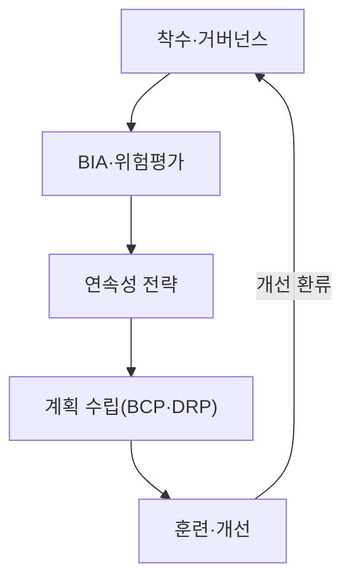
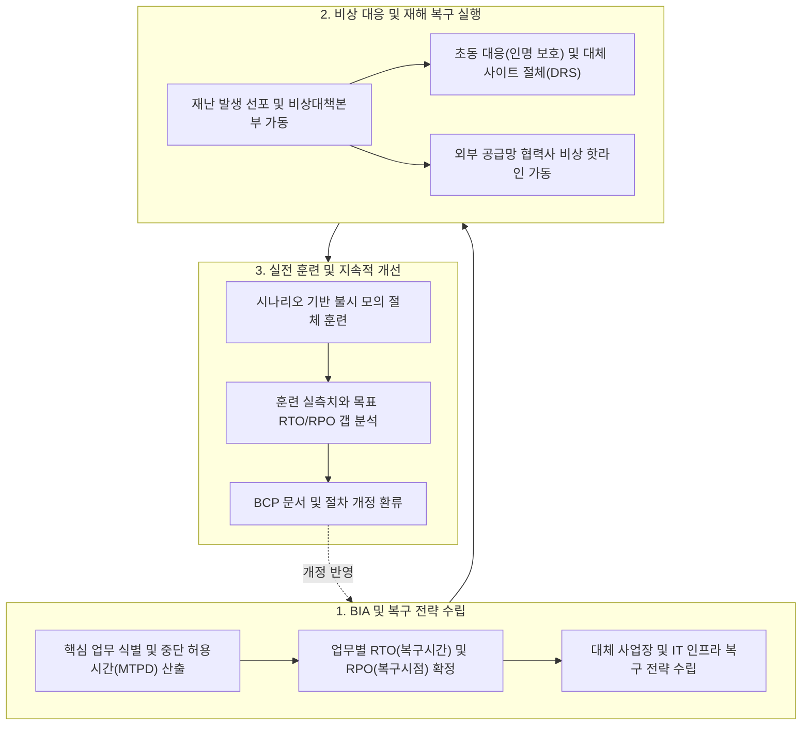

## 지식 로드맵 내 현재 위치

지식 위치: IT 전략·관리 → 거버넌스·위험관리 → **BCP**

## 30초 인출

- 본질: BCP는 재난이나 장애 중에도 핵심 업무를 이어 가거나 정해진 시간 안에 재개하기 위한 계획이다.
- 메커니즘: 거버넌스 수립 → **BIA** (업무영향분석) 및 위험평가 → 4대 지표 산출( **MTPD** , **RTO** , **RPO** , **MBCO** ) → 4대 실행계획 연계( **CMP** , **ERP** , **BCP** , **DRP** ) → 실전 훈련(도상·절체) 및 PDCA 개선한다.
- 산출물: **BIA** 보고서 · 연속성 전략 · **BCP** · **DRP** · 훈련결과·시정조치이다.

핵심 용어

- **BCP(Business Continuity Planning)** : 재해·재난 시 핵심 비즈니스 기능의 연속성을 유지하고 신속히 정상 복구하기 위한 전사적 관리 계획
- **BIA(Business Impact Analysis)** : 업무 중단에 따른 정량적·정성적 손실을 분석하여 복구 우선순위와 목표 수준을 산정하는 영향 분석 기법
- **MTPD(Maximum Tolerable Period of Disruption)** : 서비스 중단이 지속될 경우 조직의 존립이 위태로워지는 최대 허용 중단 한계 시간
- **RTO(Recovery Time Objective)** : 재해 발생 시점부터 업무 기능과 시스템을 목표 수준으로 복구해야 하는 목표 시간(RTO < MTPD)
- **RPO(Recovery Point Objective)** : 재해 발생 시 데이터 손실을 감내할 수 있는 최대 허용 시점 간격
- **MBCO(Minimum Business Continuity Objective)** : 비상 상황 동안 고객과 이해관계자에게 최소한으로 제공해야 하는 최저 연속성 서비스 수준
- **CMP(Crisis Management Plan)** : 전사 지휘통제 및 대외 커뮤니케이션을 총괄하는 최고경영진 위기관리 계획
- **ERP(Emergency Response Plan)** : 인명 대피와 현장 안전 확보 등 사고 발생 직후 초동 조치를 위한 비상대응 계획
- **DRP(Disaster Recovery Plan)** : IT 시스템·인프라·데이터의 복구를 전담하는 기술적 재해복구 세부 계획

---

## 1교시 예상문제 (10점)

> BCP의 수립 흐름과 BIA에서 정하는 복구 목표를 설명하시오. (예상·10점)

---

## 1교시 10점 답안

### 1. 정의·목적

- 정의: 중단사고 발생 시 우선업무를 사전에 정한 수준으로 지속하고 복구하기 위한 전사 계획
- 목적: 인명 보호 · 핵심업무 지속 · 조직 회복탄력성 확보

### 2. 구성체계 및 방법론

### 3. 핵심 통제

- **지표 정합성** : RTO는 MTPD 안에서 설정하고 RPO는 허용 가능한 데이터 손실 기준으로 별도 관리
- **수작업 전환** : 전산 전소 상황을 가정한 아날로그 수기 업무 매뉴얼 및 정기 훈련
- **ISO 22301 BCMS** : PDCA(Plan-Do-Check-Act) 기반 전사 연속성 지속 평가 및 개선

---

## 2~4교시 예상문제 (25점)

> BCP의 수립절차를 설명하고, BIA에서 도출하는 MTPD·RTO·RPO·MBCO 및 DRP와의 차이를 논하시오.

---

## 2~4교시 25점 답안

## Ⅰ. 조직 생존과 대고객 신뢰 유지를 위한 BCP의 개요

> 단순 IT 데이터 복구를 넘어 인력·사업장·공급망을 포괄하며, 성패는 두꺼운 서류가 아닌 **RTO < MTPD 정합성** 과 **정기 실전 훈련** 으로 판정함.

| 구분 | 핵심 |
|---|---|
| 정의 | **BIA(Business Impact Analysis)** 로 우선업무와 **MBCO** 를 정하고 **RTO·RPO** 에 맞춰 지속·복구하는 전사 **BCP(Business Continuity Plan)** |
| 목적 | 인명을 보호하고 핵심업무·공급망의 연속성을 유지해 조직 **회복탄력성** 을 확보하는 것 |

## Ⅱ. BCP 생명주기 5단계 수립 프로세스 및 구성체계

> 책임자를 정하고 업무영향분석과 위험평가를 거쳐 복구전략·실행계획을 세운다. 계획이 실제로 작동하는지는 훈련으로 확인하고 고친다.

- **Traceability** : BIA 결과 ↔ 복구목표 ↔ 연속성 전략 ↔ 훈련 결과 추적

## Ⅲ. BIA 4대 핵심 복구 지표 간의 상관관계

> MTPD 허용 한계에 도달하기 전, RTO 목표시간 내에 MBCO 등 사전에 정한 목표 수준으로 업무를 재개해야 함.

| 핵심 지표 | 개념 정의 및 엔지니어링 통제 기준 |
|---|---|
| **MTPD** (Maximum Tolerable Period of Disruption) | 중단영향이 허용할 수 없게 되는 최대 기간 |
| **RTO** (Recovery Time Objective) | 중단 후 업무·시스템을 사전에 정한 목표 수준으로 재개하는 목표시간이며 **MTPD 안에서 설정 (`RTO < MTPD`)** |
| **RPO** (Recovery Point Objective) | 백업 시점 기준으로 재난 시 감내할 수 있는 **최대 데이터 손실 허용 시점** |
| **MBCO** (Minimum Business Continuity Objective) | 중단 기간에 유지할 최소 제품·서비스 수준 (대체 사업장/수작업 목표치) |

## Ⅳ. 연속성 관련 실행계획 비교

> BCP가 '회사 업무를 어떻게 지속할 것인가'라면, DRP는 'IT 전산망을 어떻게 되살릴 것인가'에 집중함.

| 계획 | 범위 | 핵심 활동 |
|---|---|---|
| **CMP** | 전사 위기 | 지휘통제 · 대외소통 · 경영진 의사결정 |
| **ERP** | 현장 비상상황 | 인명보호 · 초동대응 · 1차 방재 및 대피 |
| **BCP** | 우선업무 | 대체인력·사업장·공급망 운영 · 수작업 전환 |
| **DRP** | IT 서비스·데이터 | 시스템 절체 · 데이터 복구 · 백업본 복원 |

## Ⅴ. 실무 BCP 구축의 실패 요인과 공학적·관리적 해결 대책

> 서류상 계획에 머무는 BCP(Shelfware)는 실전에서 작동하지 않으므로 지속적 훈련과 자원 격리가 필수적임.

| 위험 | 대책 | 효과 |
|---|---|---|
| **책장 속 문서화(Shelfware)** | 책임자·연락망 정기 갱신 · 시나리오별 모의훈련 | 계획 실행력·현업 숙련도 향상 |
| **비즈니스 자원 누락** | 대체인력 교대조·원격/대체사업장·수작업 양식 사전 배포 | IT 복구 전 업무 마비 방지 |
| **공급망(외주) 연속성 결여** | SLA 내 공급업체 BCP 의무 명시 및 다중 벤더 소싱 확보 | 외주 장애로 인한 2차 마비 차단 |
| **수작업 전환 미검증** | 전산망 단절을 가정한 수기 처리 훈련 | 시스템 중단 시 MBCO 달성 가능성 확인 |

## Ⅵ. 조직 회복탄력성(Resilience) 중심의 기술사적 제언

> IT 시스템 복구(DRP)에만 매몰되지 않고, 비상시 수작업 전환과 대체 사업장 배치를 포함하는 **전사적 복원력(Resilience)** 이 BCP의 본질임.

### 실전 답안용 기술사적 제언

- 문제: 재난 발생 시 수립된 BCP가 실제 비상대응 조직과 괴리되어 가동되지 못하고, 클라우드·협력업체 등 외부 의존성 단절에 대처하지 못해 핵심 서비스 복구가 지연됨.
- 해결 방안: ISO 22301 표준에 기반한 BIA(업무영향분석)를 연 1회 이상 정행화하고, 외부 CSP 및 협력업체를 포함하는 공급망 연속성 협약(SLA/BCP) 체결 및 실전 불시 모의훈련(Simulation Drill)을 정례화함.

## 출제 이력과 검증 출처

- 제133회 정보관리기술사 1교시 기출 (BCP 수립 시 주요 목표인 DRS 구축방식 4가지)
- [ISO 22301:2019: Security and resilience — Business continuity management systems — Requirements](https://www.iso.org/standard/75106.html)
- [NIST SP 800-34 Rev.1: Contingency Planning Guide for Federal Information Systems](https://csrc.nist.gov/pubs/sp/800/34/r1/final)

## 연결 토픽

- 이전 토픽: [A/B 테스트](./029_ab_testing.md)
- 연관 토픽: [RTO·RPO](./018_rpo.md), [DRS](./042_drs.md), [국가정보자원관리원 화재](./023_national_information_resources_service_fire.md), [액티브-액티브 스토리지 DR](./027_active_active_storage_dr.md)
- 다음 토픽: [CRM](./031_crm.md)
