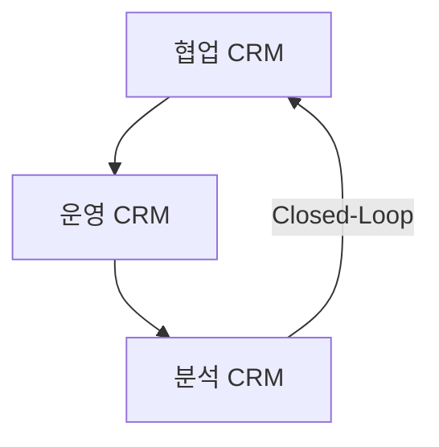
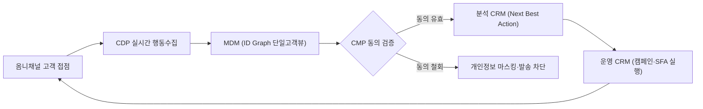

## 지식 로드맵 내 현재 위치

지식 위치: IT 전략·관리 → 고객·마케팅 전략 → **CRM**

## 30초 인출

- 본질: 고객 획득·유지·강화 생애주기 전반의 옴니채널 접점을 통합하여 **Single Customer View**를 확립하고 고객 생애가치(**LTV**)를 극대화하는 고객 중심 경영전략 및 정보시스템이다.
- 메커니즘: 협업 CRM이 고객 접점 데이터를 수집하고, 운영 CRM이 업무를 실행하며, 분석 CRM이 **NBA(Next Best Action)**를 도출해 접점으로 환류한다.
- 판정 기준: **MDM** 기반 단일고객뷰의 정확성 · 개인정보 동의·목적 준수 · 분석 결과의 접점 환류 · 고객가치 개선한다.

핵심 용어

- **CRM(Customer Relationship Management)**: 고객 생애주기 전반의 상호작용 접점을 통합 관리하여 고객 가치와 기업 수익성을 극대화하는 경영전략 및 정보시스템이다.
- **운영 CRM(Operational CRM)**: 영업(SFA)·마케팅(MA)·고객서비스 프로세스를 실행·자동화하는 CRM 영역이다.
- **분석 CRM(Analytical CRM)**: 수집 데이터를 분석하여 고객 세그먼트·이탈 예측·**NBA**를 도출하는 CRM 영역이다.
- **협업 CRM(Collaborative CRM)**: 영업·마케팅·서비스 접점 간 고객 상호작용 정보를 공유하는 CRM 영역이다.
- **NBA(Next Best Action)**: 고객 분석 결과에서 다음에 취할 최적 행동을 결정해 제안하는 기법이다.
- **LTV(Lifetime Value)**: 한 고객이 기업과의 거래 관계를 유지하는 전체 기간 동안 기여하는 순이익의 현재가치 합계다.
- **SFA(Sales Force Automation)**: 영업 활동, 파이프라인, 거래처 이력 관리 업무를 자동화하는 운영 CRM 모듈이다.
- **MA(Marketing Automation)**: 고객 세그먼트별 맞춤형 캠페인 트리거와 메시지 발송을 자동 실행하는 마케팅 도구이다.
- **CTI(Computer Telephony Integration)**: 컴퓨터 시스템과 전화 교환망을 연동하여 인입 호와 고객 정보를 실시간 동기화하는 기술이다.
- **CDP(Customer Data Platform)**: 1·2·3자 온·오프라인 행동 데이터를 실시간 통합하여 단일 고객 프로필을 구축하는 플랫폼이다.
- **MDM(Master Data Management)**: 전사 여러 시스템에 분산된 고객 기준 데이터를 정제·일원화하여 골든 레코드를 생성하는 관리 체계다.
- **PIPA(Personal Information Protection Act)**: 정보주체의 동의 및 처리 제한을 규율하는 대한민국 개인정보 보호법이다.
- **CMP(Consent Management Platform)**: 고객의 마케팅 수신 및 개인정보 처리 동의·철회 이력을 실시간 중앙 통제하는 플랫폼이다.

## 예상문제

> CRM의 개념과 운영·분석·협업 CRM의 상호작용을 설명하고, CDP와의 차이 및 개인정보보호 대책을 제시하시오.

## Ⅰ. 고객 중심 디지털 전환을 위한 CRM의 개요

> CRM은 전사 채널의 접점을 통합하여 **Single Customer View**를 확립하며, 성공 여부는 단순 시스템 도입이 아닌 분석 통찰이 운영 접점에 실시간 환류되는 **Closed-Loop** 체계로 판정함.

- 정의: 고객 획득·유지·강화 생애주기 전반의 상호작용을 통합 관리하고 **LTV(Lifetime Value)**를 극대화하는 **고객 중심 경영전략** 및 **정보시스템**
- 목적: 고객 유지 · 접점 일관성 · 마케팅·영업 의사결정 개선

## Ⅱ. CRM 구성체계 및 3대 핵심 영역 상호작용 메커니즘

> 운영계는 고객 접점 데이터를 수집하고, 분석계는 LTV와 이탈 징후를 예측하며, 협업계는 분석된 통찰을 옴니채널 접점에 실시간 배포함.

## Ⅲ. 전통적 CRM vs 고객 데이터 플랫폼(CDP) 비교

> CRM이 트랜잭션 중심의 업무 프로세스 실행 도구라면, **CDP(Customer Data Platform)**는 비정형 행동 로그를 포괄하여 단일 고객 프로필을 완성하는 데이터 인프라임.

| 비교 항목 | 전통적 CRM (Customer Relationship Management) | 최신 CDP (Customer Data Platform) |
|---|---|---|
| **핵심 목적** | 고객 영업·마케팅·서비스 **업무 프로세스 실행** | 전사 온·오프라인 고객 데이터 **통합 및 실시간 활성화** |
| **주요 데이터** | 정형 데이터 (거래 내역, 영업 파이프라인, 상담 이력) | 정형 + 비정형 데이터 (웹/앱 실시간 클릭스트림, IoT 로그) |
| **식별 체계** | 식별된 기존 고객 중심 (고객 번호, 이메일, 전화번호) | **익명(Cookie/Device ID)과 식별 데이터의 그래프 연결** |
| **시스템 연계** | 특정 채널 및 접점 화면 직접 제어 | 다양한 다운스트림(CRM, 광고 DSP, BI)으로 프로필 전달 |
| **실시간성** | 배치·트랜잭션 처리 중심 | 이벤트 스트리밍·세그먼트 활성화 |

## Ⅳ. CRM 실무 실패 요인 및 공학적 거버넌스 대책

> 데이터 사일로와 현업의 입력 거부를 해소하지 못하면 CRM은 무용지물이 되며, 마케팅 피로도 관리와 개인정보보호 규제 준수가 병행되어야 함.

| 실패 요인 | 공학적·관리적 해결 대책 | 기대 효과 |
|---|---|---|
| **데이터 사일로** | **MDM** 구축, 식별자 매칭(ID Graph), 데이터 품질 규칙 강제 | 고객 단일 뷰(Single Customer View) 일관성 확보 |
| **현업 입력 저항** | 옴니채널 자동 로깅, CTI 자동 기록, UI 최소 입력 설계 | 상담 및 영업 이력 누락 방지 |
| **마케팅 피로도** | 채널별 접촉 빈도 상한선(Contact Frequency Capping) 설정 | 스팸화 방지 및 고객 이탈률 감소 |
| **개인정보 침해 위험** | **CMP** 연동, 동의·목적·보유기간 실시간 검증 후 발송 | PIPA 컴플라이언스 준수 및 과징금 리스크 차단 |

## Ⅴ. 고객 데이터 거버넌스 중심의 기술사적 제언

> 패키지 도입에 매몰되지 않고 **MDM** 기반 단일 고객 식별과 **CMP** 연동 개인정보 거버넌스가 결합될 때 지속 가능한 CRM이 작동함.

### 실전 답안용 기술사적 제언

- **판정 기준**: 채널 간 고객 식별 정합성과 동의 철회가 모든 접점에 반영되는지 여부.
- **공학적 대안**: 레거시 CRM 단독 구조 탈피, 실시간 스트리밍 CDP + MDM ID Graph + CMP 일원화 아키텍처 구현.
- **검증 절차**: 중복·충돌 고객 레코드, 필수 이력 누락, 동의 철회 반영, 추천 정확도 점검.
- **기대 효과**: 접점 일관성·데이터 신뢰성 개선 · 개인정보 오처리 위험 축소.

## 1교시 10점 답안 발췌

### 1. 정의·목적

- 정의: **CRM(Customer Relationship Management)**은 고객 생애주기 전반의 상호작용 접점을 통합하여 **LTV(Lifetime Value)**를 극대화하는 **고객 중심 경영전략** 및 정보시스템
- 목적: 고객 유지 · 접점 일관성 · 마케팅·영업 의사결정 개선

### 2. 구성체계 및 방법론

### 3. 핵심 통제

- **Single Customer View**: **MDM(Master Data Management)** 기반 통합 ID Graph로 데이터 사일로 해소
- **컴플라이언스 통제**: 동의·처리목적·보유기간을 확인하고 철회 상태를 캠페인에 반영

## 출제 이력과 검증 출처

- 공식 문제지 원문으로 확인한 직접 기출 없음
- [개인정보보호위원회: 개인정보 보호법](https://www.pipc.go.kr/np/cop/bbs/selectBoardList.do?bbsId=BS217&mCode=D010020000)

## 학습 체크

- [ ] Ⅰ. CRM의 정의·목적과 Closed Loop의 의미를 설명할 수 있는가?
- [ ] Ⅱ. 협업·운영·분석 CRM의 입력·처리·산출·환류를 연결할 수 있는가?
- [ ] Ⅲ. CRM과 CDP를 목적·데이터·식별·연계로 비교할 수 있는가?
- [ ] Ⅳ. 데이터 사일로·입력 누락·과다 접촉·개인정보 위험의 대책을 제시할 수 있는가?
- [ ] Ⅴ. 고객 식별·동의·활용목적을 캠페인 전에 판정하는 통제 흐름을 설명할 수 있는가?

## 연결 토픽

- 이전 토픽: [BCP](./030_bcp.md)
- 연관 토픽: [SCM](./005_scm.md), [ERP](./068_erp.md), [그로스 해킹](./046_growth_hacking.md)
- 다음 토픽: [EVM](./032_evm.md)
