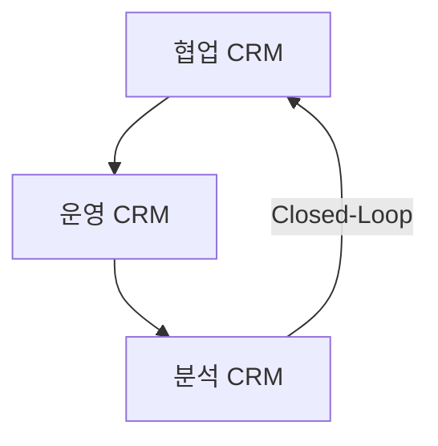
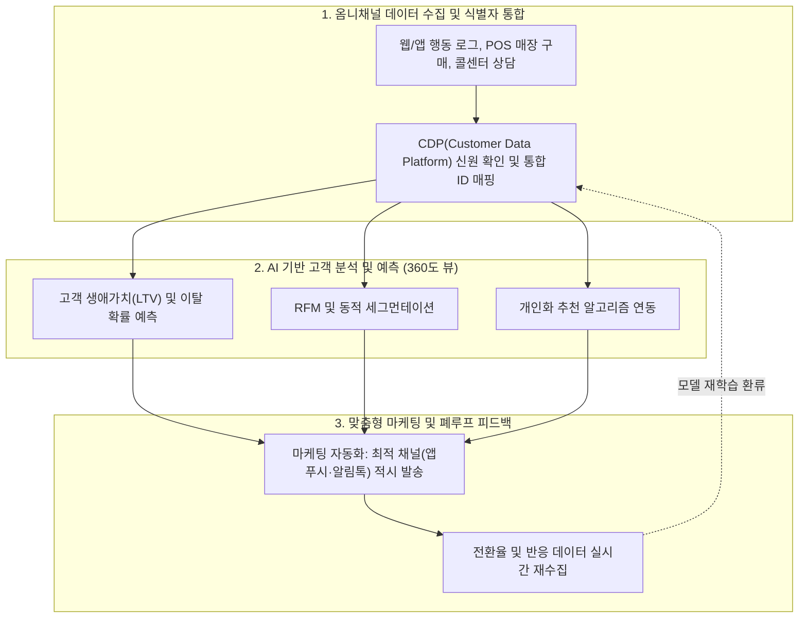

## 지식 로드맵 내 현재 위치

지식 위치: IT 전략·관리 → 고객·마케팅 전략 → **CRM**

## 30초 인출

- 본질: CRM은 고객 정보를 모아 영업·상담·마케팅에 활용하는 관리 방식과 시스템이다. 여러 접점에서 같은 고객을 일관되게 이해하도록 돕는다.
- 메커니즘: **협업 CRM** 이 고객 접점 데이터를 수집하고, **운영 CRM** 이 업무를 실행하며, **분석 CRM** 이 **NBA(Next Best Action)** 를 도출해 접점으로 환류한다.
- 판정 기준: **MDM** 기반 단일고객뷰의 정확성 · 개인정보 동의·목적 준수 · 분석 결과의 접점 환류 · 고객가치 개선한다.

핵심 용어

- **CRM(Customer Relationship Management)** : 고객 생애주기 전반의 상호작용 접점을 통합 관리하여 고객 가치와 기업 수익성을 극대화하는 고객관계관리 시스템
- **운영 CRM(Operational CRM)** : 영업 자동화(SFA)·마케팅 자동화(MA)·고객서비스 등 대고객 접점 업무 프로세스를 실행·자동화하는 시스템
- **분석 CRM(Analytical CRM)** : 데이터웨어하우스 및 마이닝 기술을 활용하여 고객 행동·세그먼트·이탈 예측 및 NBA를 도출하는 분석 체계
- **협업 CRM(Collaborative CRM)** : 영업·마케팅·고객센터 등 다채널 접점 간 고객 정보와 인터랙션을 실시간 공유하는 협업 지원 플랫폼
- **NBA(Next Best Action)** : 실시간 고객 분석 데이터를 기반으로 특정 고객에게 현시점 가장 최적화된 마케팅 조치를 추천하는 기법
- **LTV(Lifetime Value)** : 한 고객이 기업과 관계를 유지하는 생애주기 전체에 걸쳐 기여할 것으로 기대되는 순이익의 현재가치
- **SFA(Sales Force Automation)** : 영업 사원의 가망 고객 발굴·활동 일정·파이프라인 관리를 체계적으로 지원하는 영업 자동화 시스템
- **MA(Marketing Automation)** : 고객 여정 단계별 맞춤형 캠페인 기획, 타깃 세그먼트 추출, 메시지 발송을 자동화하는 마케팅 플랫폼
- **CTI(Computer Telephony Integration)** : 통신 전화 시스템과 컴퓨터 데이터베이스를 연동하여 인입 호와 고객 프로필을 실시간 매핑하는 기술
- **CDP(Customer Data Platform)** : 온·오프라인 1·2·3차 행동 데이터를 실시간 수집·통합하여 단일 고객 뷰(Golden Record)를 구축하는 플랫폼
- **MDM(Master Data Management)** : 전사 여러 시스템에 분산된 고객 마스터 데이터를 단일화·정제하여 단일 진실 공급원(SSOT)을 확보하는 관리 체계
- **PIPA(개인정보 보호법)** : 정보주체의 동의권 보장과 개인정보의 안전한 수집·이용·파기를 규율하는 법률
- **CMP(Consent Management Platform)** : 고객의 개인정보 처리 및 마케팅 활용 동의·철회 내역을 실시간으로 추적·관리하는 동의 관리 플랫폼

---

## 1교시 예상문제 (10점)

> CRM의 운영·분석·협업 영역과 고객 데이터 통제를 설명하시오. (예상·10점)

---

## 1교시 10점 답안

### 1. 정의·목적

- 정의: **CRM(Customer Relationship Management)** 은 고객 생애주기 전반의 상호작용 접점을 통합하여 **LTV(Lifetime Value)** 를 극대화하는 **고객 중심 경영전략** 및 정보시스템
- 목적: 고객 유지 · 접점 일관성 · 마케팅·영업 의사결정 개선

### 2. 구성체계 및 방법론

### 3. 핵심 통제

- **Single Customer View** : **MDM(Master Data Management)** 기반 통합 ID Graph로 데이터 사일로 해소
- **컴플라이언스 통제** : 동의·처리목적·보유기간을 확인하고 철회 상태를 캠페인에 반영

---

## 2~4교시 예상문제 (25점)

> CRM의 개념과 운영·분석·협업 CRM의 상호작용을 설명하고, CDP와의 차이 및 개인정보보호 대책을 제시하시오.

---

## 2~4교시 25점 답안

## Ⅰ. 고객 중심 디지털 전환을 위한 CRM의 개요

> CRM은 여러 채널의 고객 정보를 모아 고객을 일관되게 이해하도록 돕는다. 분석 결과가 상담·영업·마케팅 활동에 반영되는지 확인해야 한다.

- 정의: 고객 획득·유지·강화 생애주기 전반의 상호작용을 통합 관리하고 **LTV(Lifetime Value)** 를 극대화하는 **고객 중심 경영전략** 및 **정보시스템**
- 목적: 고객 유지 · 접점 일관성 · 마케팅·영업 의사결정 개선

## Ⅱ. CRM 구성체계 및 3대 핵심 영역 상호작용 메커니즘

> 운영계는 고객 접점 데이터를 수집하고, 분석계는 LTV와 이탈 징후를 예측하며, 협업계는 분석된 통찰을 옴니채널 접점에 실시간 배포함.

## Ⅲ. 전통적 CRM vs 고객 데이터 플랫폼(CDP) 비교

> CRM이 트랜잭션 중심의 업무 프로세스 실행 도구라면, **CDP(Customer Data Platform)** 는 비정형 행동 로그를 포괄하여 단일 고객 프로필을 완성하는 데이터 인프라임.

| 비교 항목 | 전통적 CRM (Customer Relationship Management) | 최신 CDP (Customer Data Platform) |
|---|---|---|
| **핵심 목적** | 고객 영업·마케팅·서비스 **업무 프로세스 실행** | 전사 온·오프라인 고객 데이터 **통합 및 실시간 활성화** |
| **주요 데이터** | 정형 데이터 (거래 내역, 영업 파이프라인, 상담 이력) | 정형 + 비정형 데이터 (웹/앱 실시간 클릭스트림, IoT 로그) |
| **식별 체계** | 식별된 기존 고객 중심 (고객 번호, 이메일, 전화번호) | **익명(Cookie/Device ID)과 식별 데이터의 그래프 연결** |
| **시스템 연계** | 특정 채널 및 접점 화면 직접 제어 | 다양한 다운스트림(CRM, 광고 DSP, BI)으로 프로필 전달 |
| **실시간성** | 배치·트랜잭션 처리 중심 | 이벤트 스트리밍·세그먼트 활성화 |

## Ⅳ. CRM 실무 실패 요인 및 공학적 거버넌스 대책

> 데이터 사일로와 현업의 입력 거부를 해소하지 못하면 CRM은 무용지물이 되며, 마케팅 피로도 관리와 개인정보보호 규제 준수가 병행되어야 함.

| 실패 요인 | 공학적·관리적 해결 대책 | 기대 효과 |
|---|---|---|
| **데이터 사일로** | **MDM** 구축, 식별자 매칭(ID Graph), 데이터 품질 규칙 강제 | 고객 단일 뷰(Single Customer View) 일관성 확보 |
| **현업 입력 저항** | 옴니채널 자동 로깅, CTI 자동 기록, UI 최소 입력 설계 | 상담 및 영업 이력 누락 방지 |
| **마케팅 피로도** | 채널별 접촉 빈도 상한선(Contact Frequency Capping) 설정 | 스팸화 방지 및 고객 이탈률 감소 |
| **개인정보 침해 위험** | **CMP** 연동, 동의·목적·보유기간 실시간 검증 후 발송 | PIPA 컴플라이언스 준수 및 과징금 리스크 차단 |

## Ⅴ. 고객 데이터 거버넌스 중심의 기술사적 제언

> 패키지 도입에 매몰되지 않고 **MDM** 기반 단일 고객 식별과 **CMP** 연동 개인정보 거버넌스가 결합될 때 지속 가능한 CRM이 작동함.

### 실전 답안용 기술사적 제언

- 문제: 온·오프라인 채널별 고객 데이터 파편화(Silo)로 360도 단일 고객 뷰 확보가 불가능하고, 획일적 마케팅 메시지 남발로 고객 피로도 및 이탈률이 증가함.
- 해결 방안: CDP(Customer Data Platform)를 통해 옴니채널 고객 식별자(Unified ID)를 통합하고, AI 기반 고객 생애가치(LTV) 및 이탈 위험 예측 모델을 결합하여 실시간 개인화 인터랙션과 자동화된 캠페인 피드백 루프를 가동함.

## 출제 이력과 검증 출처

- 공식 문제지 원문으로 확인한 직접 기출 없음
- [개인정보보호위원회: 개인정보 보호법](https://www.pipc.go.kr/np/cop/bbs/selectBoardList.do?bbsId=BS217&mCode=D010020000)

## 연결 토픽

- 이전 토픽: [BCP](./030_bcp.md)
- 연관 토픽: [SCM](./005_scm.md), [ERP](./068_erp.md), [그로스 해킹](./046_growth_hacking.md)
- 다음 토픽: [EVM](./032_evm.md)
