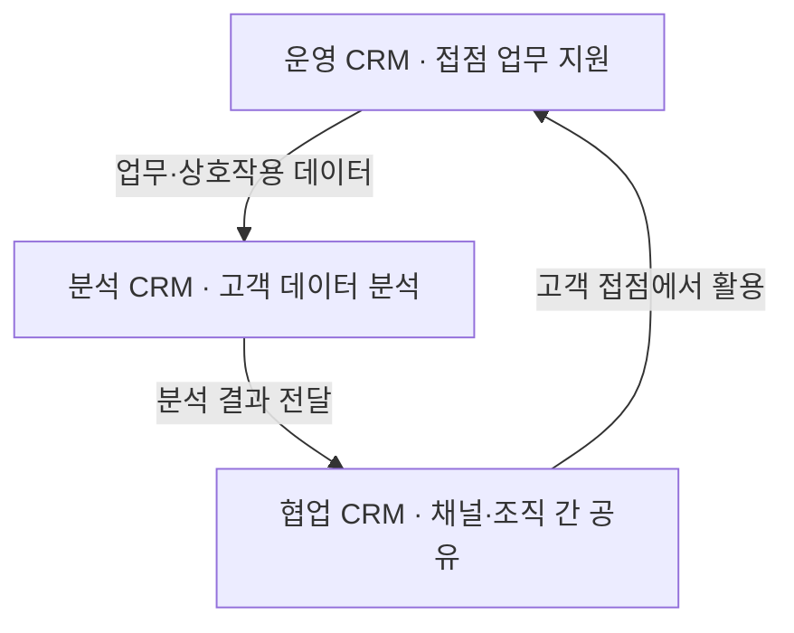

## 지식 로드맵 내 현재 위치

지식 위치: IT 전략·관리 → 고객·마케팅 전략 → **CRM**

## 30초 인출

- 본질: **CRM(Customer Relationship Management)**은 고객과의 관계를 관리하는 업무 방식과 이를 지원하는 정보시스템이다.
- 메커니즘: **운영 CRM**이 영업·상담 등 고객 접점을 지원하고, **분석 CRM**은 고객 데이터를 분석해 얻은 결과를 업무에 전달하며, **협업 CRM**은 여러 채널과 조직의 정보 공유를 돕는다.
- 핵심: 고객 데이터를 업무 목적에 맞게 관리하고 개인정보의 처리 근거·이용 범위·보유기간을 확인한다.

핵심 용어

- **CRM** (Customer Relationship Management): 고객 관계를 관리하는 업무 방식과 이를 지원하는 정보시스템
- **운영 CRM**: 영업·마케팅·고객서비스 등 고객 접점 업무를 지원하는 영역
- **분석 CRM**: 고객 데이터를 분석해 세분화·예측·성과 측정에 활용하는 영역
- **협업 CRM**: 여러 고객 접점과 조직 사이의 고객 정보·상호작용 공유를 지원하는 영역
- **CDP** (Customer Data Platform): 여러 원천의 고객 데이터를 통합해 프로필·세그먼트를 만들고 활용하도록 지원하는 플랫폼
- **MDM** (Master Data Management): 조직의 기준 데이터 정의·품질·변경을 관리하는 접근 방식
- **LTV** (Lifetime Value): 고객과의 관계 기간에 걸친 경제적 가치를 추정하는 지표
- **동의관리 플랫폼(CMP)**: 개인정보 처리 동의 상태와 변경 기록을 관리하는 도구
- **개인정보 보호법**: 개인정보 처리의 요건과 정보주체 권리·보호 의무를 정하는 법률

---

## 1교시 예상문제 (10점)

> CRM의 운영·분석·협업 영역과 고객 데이터의 책임 있는 활용을 설명하시오. (예상·10점)

---

## 1교시 10점 답안

### Ⅰ. 개요

| 구분 | 핵심 |
|---|---|
| 정의 | **CRM**은 고객과의 관계를 관리하는 업무 방식과 이를 지원하는 정보시스템이다. |
| 목적 | 고객 접점의 일관성을 높이고 고객·업무 데이터를 영업·서비스 의사결정에 활용한다. |

### Ⅱ. CRM의 주요 영역

### Ⅲ. 데이터 통제

- **MDM**으로 기준 고객 데이터와 품질 책임을 정한다.
- **개인정보 보호법**에 따라 수집·이용의 처리 요건과 목적 범위를 확인하고, 동의를 근거로 처리할 때는 동의 내역과 보유기간을 관리한다.
- 동의 철회·목적 달성 등 상태 변화가 해당 업무에 반영되도록 절차를 둔다.

제언: 핵심 고객 여정 한 곳에서 데이터 품질과 개인정보 처리 근거를 먼저 검증한다.

---

## 2~4교시 예상문제 (25점)

> CRM의 개념과 운영·분석·협업 영역의 관계를 설명하고, CDP와의 차이 및 개인정보 보호 방안을 제시하시오. (예상·25점)

---

## 2~4교시 25점 답안

## Ⅰ. CRM의 개요

| 구분 | 핵심 |
|---|---|
| 정의 | **CRM**은 고객과의 관계를 관리하는 업무 방식과 이를 지원하는 정보시스템이다. |
| 목적 | 고객 접점의 일관성을 높이고 고객·업무 데이터를 영업·서비스 의사결정에 활용한다. |

## Ⅱ. 운영·분석·협업 CRM의 관계

운영 CRM은 영업·서비스 같은 접점 업무를 지원하고, 분석 CRM은 고객 데이터를 분석한다. 협업 CRM은 채널·부서 사이에 필요한 정보를 공유해 분석 결과와 고객 반응을 업무에 활용하도록 돕는다. 제품별 기능 경계는 다를 수 있다.

## Ⅲ. CRM과 CDP의 비교

| 관점 | CRM | CDP |
|---|---|---|
| 중심 역할 | 고객 관계 업무와 접점을 관리 | 여러 원천의 고객 데이터를 통합해 활용 지원 |
| 주요 사용자 | 영업·마케팅·서비스 현업 | 데이터·마케팅·제품 운영 조직 |
| 데이터 활용 | 거래·상담·캠페인 등 업무 맥락 | 여러 채널 데이터의 고객 프로필·세그먼트 활용 |
| 유의점 | 고객 기준·업무 흐름에 맞게 데이터 품질 관리 | 식별·연결의 근거와 개인정보 처리 요건 검토 |

CRM과 **CDP**는 경쟁 제품 범주로 고정되지 않는다. 일부 제품은 양쪽 기능을 함께 제공하므로 업무 범위와 데이터 흐름으로 비교한다.

## Ⅳ. 개인정보·고객데이터 관리 통제

| 관리 지점 | 통제 | 확인 내용 |
|---|---|---|
| 수집 | 필요한 정보만 수집하고 적법한 처리 근거 확인 | 수집 목적·항목·처리 요건 |
| 활용 | 목적과 권한에 맞게 캠페인·분석에 사용 | 이용 목적·접근 권한 |
| 공유 | 조직·업체 간 제공·위탁 범위 관리 | 역할·계약·보호조치 |
| 보유·파기 | 목적·보유기간 기준으로 검토하고 불필요한 정보 파기 | 보유기간·삭제 기록 |
| 고객 기준정보 | **MDM** 관점에서 기준·품질 책임과 변경 절차 관리 | 중복·오류·변경 이력 |

「개인정보 보호법」은 개인정보 수집·이용의 처리 근거와 목적 범위를 정하고, 보유기간 경과 등 불필요해진 개인정보의 파기를 규정한다. 동의만을 유일한 처리 근거로 가정하지 말고 해당 업무의 법적 근거를 확인한다.

## Ⅴ. 기술사적 제언 — 핵심 고객 여정부터 통합

| 문제 | 해결 방안 |
|---|---|
| 여러 채널과 시스템을 한 번에 통합하면 데이터 품질·업무 효과·개인정보 처리 근거를 동시에 검증하기 어렵다. | 고객 영향이 큰 여정 하나를 선정하고, 목적에 필요한 데이터만 연결한다. 품질·처리 근거·접점 업무 효과를 확인한 뒤 검증된 범위부터 확장한다. |

## 출제 이력과 검증 출처

- 공식 문제지 원문으로 확인한 직접 기출 없음
- [국가법령정보센터: 개인정보 보호법 제15조 개인정보의 수집·이용](https://www.law.go.kr/LSW/lsLinkCommonInfo.do?lsJoLnkSeq=1029334809)
- [국가법령정보센터: 개인정보 보호법 제21조 개인정보의 파기](https://law.go.kr/lsLinkCommonInfo.do?chrClsCd=010202&lsJoLnkSeq=1029335625)

## 연결 토픽

- 이전 토픽: [BCP](./030_bcp.md)
- 연관 토픽: [SCM](./005_scm.md), [ERP](./068_erp.md), [그로스 해킹](./046_growth_hacking.md)
- 다음 토픽: [EVM](./032_evm.md)
