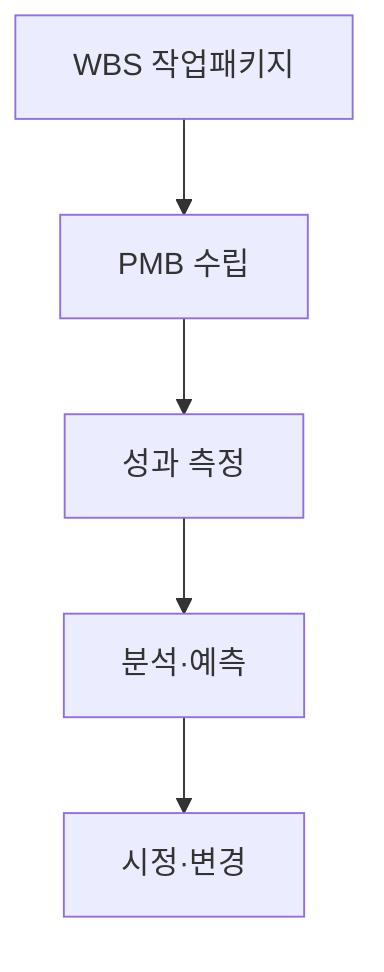
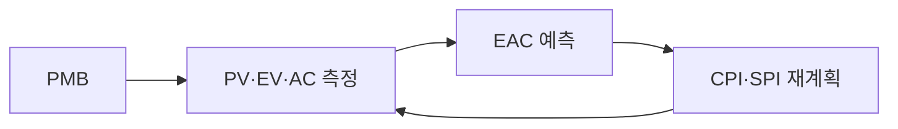

## 지식 로드맵 내 현재 위치

IT 전략·관리 → 프로젝트 통제·원가 관리 → **EVM**

## 30초 인출

- 본질: **EVM(Earned Value Management)**은 범위·일정·원가를 화폐가치로 통합해 현재 성과와 완료예상원가를 함께 판단하는 관리 기법이다.
- 메커니즘: PMB 수립 → PV·EV·AC 측정 → 편차·성과지수 분석 → EAC 예측 → 시정조치 순으로 통제한다.
- 산출물: 성과측정기준선 · 상태일 성과보고서 · 완료예상원가 · 변경기록이다.

핵심 용어

- **PMB(Performance Measurement Baseline)**: 승인된 범위·일정·원가를 묶어 성과를 측정하는 기준선이다.
- **PV(Planned Value)**: 상태일까지 완료하도록 계획한 작업에 배정된 예산가치다.
- **EV(Earned Value)**: 상태일까지 실제 완료한 작업에 배정된 예산가치다.
- **AC(Actual Cost)**: 상태일까지 실제로 지출한 원가다.
- **BAC(Budget at Completion)**: 전체 작업에 승인된 총예산이다.
- **EAC(Estimate at Completion)**: 현재 성과와 가정을 반영해 추정한 완료 시점 총원가다.
- **ES(Earned Schedule)**: EV를 시간축으로 변환해 후반 수렴이 발생하는 SPI를 보완하는 기법이다.

## 예상문제

> EVM의 개념과 PV·EV·AC·BAC를 설명하고, CV·SV·CPI·SPI 산식과 EAC 예측모델 및 한계 대응방안을 제시하시오.

## Ⅰ. 범위·일정·원가 통합 관리, EVM의 개요

> EVM은 지출액이 아니라 완료된 작업가치를 기준선과 비교하며, 예측력은 EV 승인근거와 AC 적시성에서 결정됨.

- 정의: **PV**·**EV**·**AC**를 비교하여 프로젝트 성과를 정량 측정하고 미래 원가를 예측하는 통합 관리 기법
- 목적: 일정 지연·예산 초과 조기 식별 · 선제적 공정 통제

## Ⅱ. EVM 성과 통제 프로세스

> 작업패키지별 기준선을 세우고 상태일마다 성과를 측정해야 편차와 예측이 같은 범위를 가리킴.

## Ⅲ. 핵심 산식과 EAC 선택

> 산식은 같아도 EAC는 미래 효율에 대한 가정이 다르므로 원인을 확인한 뒤 모델을 선택해야 함.

| 지표 | 산식 | 판정 |
|---|---|---|
| **CV** | `EV - AC` | 음수: 원가 초과 |
| **SV** | `EV - PV` | 음수: 일정 지연 |
| **CPI** | `EV / AC` | 1 미만: 원가 비효율 |
| **SPI** | `EV / PV` | 1 미만: 일정 지연 |

| 가정 | EAC | 적용 |
|---|---|---|
| 편차 일회성 | `AC + (BAC - EV)` | 원인이 제거됨 |
| CPI 지속 | `BAC / CPI` | 원가 효율이 지속됨 |
| CPI·SPI 지속 | `AC + (BAC - EV) / (CPI × SPI)` | 일정이 원가에도 영향 |
| 재추정 | `AC + Bottom-up ETC` | 기준선 가정이 무너짐 |

## Ⅳ. EVM의 문제점·대응책

> 주관적 진척·AC 지연·후반부 SPI 수렴을 통제하지 않으면 정밀한 산식도 잘못된 경보를 냄.

| 위험 | 대책 | 효과 |
|---|---|---|
| 주관적 진척 | **0/100 규칙**·검수 산출물 기준 EV 승인 | 진척 부풀림 억제 |
| AC 반영 지연 | 발생주의 원가 연계 | CPI 시차 축소 |
| SPI 후반 수렴 | **ES(Earned Schedule)**·주공정 병행 | 일정 지연 가시성 유지 |

## Ⅴ. 조기 경보 중심의 결론

> 임계값 자체보다 지표의 원인과 EAC 가정을 기록하고 그에 맞는 시정조치를 실행하는 것이 핵심임.

### 실전 답안용 기술사적 제언

- 판정: EV·AC 데이터와 EAC 가정이 현재 프로젝트 상태를 설명하는가
- 대안: 산출물 기반 EV · ES·주공정 병행 · 발생원가 적기 반영
- 검증: EV 승인근거 · AC 완전성 · EAC 가정 · 주공정 편차
- 효과: 조기경보 신뢰성·완료예측 가능성 향상

## 1교시 10점 답안 발췌

- 정의: **EVM(Earned Value Management)**은 PV·EV·AC로 범위·일정·원가 성과를 통합 측정하는 기법
- 목적: 일정 지연·예산 초과 조기 식별

| 지표 | 산식 | 판정 |
|---|---|---|
| **CV** | `EV - AC` | 음수: 원가 초과 |
| **SV** | `EV - PV` | 음수: 일정 지연 |
| **CPI** | `EV / AC` | 1 미만: 원가 비효율 |
| **SPI** | `EV / PV` | 1 미만: 일정 지연 |

## 출제 이력과 검증 출처

- 공식 문제지 원문으로 확인한 직접 기출 없음
- [PMI: The Standard for Earned Value Management](https://www.pmi.org/standards/earned-value-management)
- [U.S. Department of Energy: EVMS Gold Card](https://www.energy.gov/em/earned-value-management-system-evms)

## 학습 체크

- [ ] Ⅰ: PV·EV·AC·BAC의 의미를 설명할 수 있는가?
- [ ] Ⅱ: WBS부터 변경통제까지 활동·산출을 연결할 수 있는가?
- [ ] Ⅲ: 편차·지수 산식과 EAC 가정별 모델을 재현할 수 있는가?
- [ ] Ⅳ~Ⅴ: EV 주관성·AC 지연·SPI 수렴의 대책을 제시할 수 있는가?

## 연결 토픽

- 이전 토픽: [CRM](./031_crm.md)
- 연관 토픽: [PMO](./004_pmo.md), [WBS](./007_wbs.md), [프로젝트 위험관리](./009_project_risk_management_negative.md), [CCPM](./112_critical_chain_toc.md)
- 다음 토픽: [IT 아웃소싱](./033_it_outsourcing.md)
