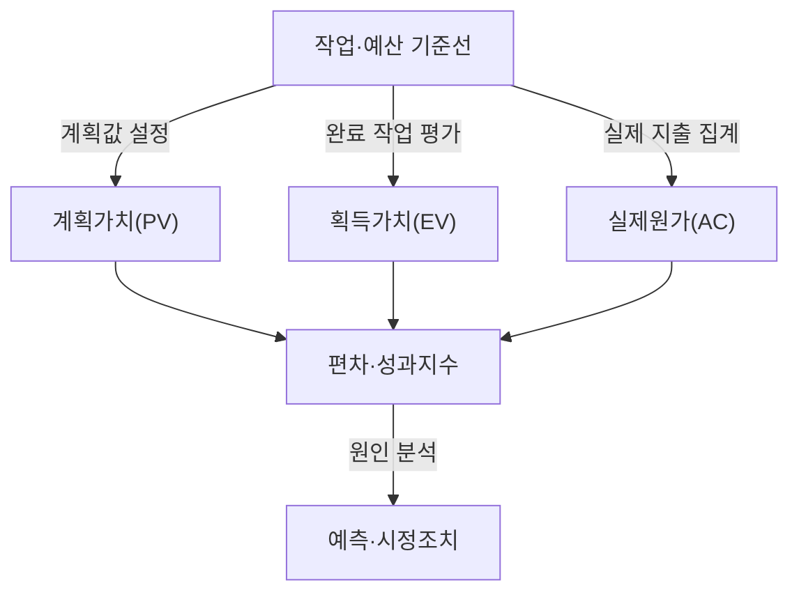

## 지식 로드맵 내 현재 위치

지식 위치: IT 전략·관리 → 프로젝트 통제·원가 관리 → **EVM**

## 30초 인출

- 본질: **EVM(Earned Value Management)** 은 완료 작업의 예산 가치와 계획·실제 원가를 비교해 프로젝트 성과를 측정하는 기법.
- 메커니즘: 성과측정기준선 설정 → 계획가치·획득가치·실제원가 측정 → 편차·성과지수 계산 → 완료예상치 분석 → 원인별 시정조치.
- 핵심: 산출물 기준의 획득가치 확인, 예측치에 적용 가정·기준일의 병기.

핵심 용어

- **EVM** (Earned Value Management): 작업가치·계획·실제원가를 통합 비교하는 프로젝트 성과관리 기법
- **성과측정기준선(PMB, Performance Measurement Baseline)**: 승인된 범위·일정·원가를 통합한 성과 측정 기준
- **계획가치(PV, Planned Value)**: 기준일까지 계획한 작업에 배정한 승인 예산
- **획득가치(EV, Earned Value)**: 기준일까지 실제 완료한 작업에 배정된 승인 예산
- **실제원가(AC, Actual Cost)**: 기준일까지 해당 작업에 실제 발생한 원가
- **완료예산(BAC, Budget at Completion)**: 승인된 전체 작업 예산
- **완료예상원가(EAC, Estimate at Completion)**: 현재 성과와 잔여 작업에 근거해 산정한 최종 원가 예측
- **원가편차(CV)**: 획득가치에서 실제원가를 뺀 값
- **일정편차(SV)**: 획득가치에서 계획가치를 뺀 값
- **원가성과지수(CPI)**: 획득가치를 실제원가로 나눈 지수
- **일정성과지수(SPI)**: 획득가치를 계획가치로 나눈 지수
- **획득일정(ES, Earned Schedule)**: 획득가치를 시간 단위로 변환해 일정 성과를 살펴보는 기법

---

## 1교시 예상문제 (10점)

> EVM의 핵심 지표와 일정·원가 성과 판정 방식을 설명하시오. (예상·10점)

---

## 1교시 10점 답안

### Ⅰ. 개요

| 구분 | 핵심 |
|---|---|
| 정의 | **EVM** 은 완료 작업의 예산 가치와 계획·실제 원가를 비교해 프로젝트 성과를 측정하는 기법 |
| 목적 | 편차·성과 추세의 조기 파악을 통한 일정·원가 통제 지원 |

### Ⅱ. 성과 측정 흐름

### Ⅲ. 핵심 산식

| 지표 | 산식 | 해석 |
|---|---|---|
| **원가편차(CV)** | EV − AC | 음수면 획득가치보다 비용이 큼 |
| **일정편차(SV)** | EV − PV | 음수면 계획보다 완료 작업가치가 적음 |
| **원가성과지수(CPI)** | EV ÷ AC | 1 미만이면 원가 효율이 기준보다 낮음 |
| **일정성과지수(SPI)** | EV ÷ PV | 1 미만이면 계획 대비 완료 작업가치가 낮음 |

제언: 수치와 함께 작업 진척의 승인 근거·기준일 기록.

---

## 2~4교시 예상문제 (25점)

> EVM의 개념과 PV·EV·AC·BAC를 설명하고, CV·SV·CPI·SPI 산식 및 EAC 예측모델과 한계 대응방안을 제시하시오. (예상·25점)

---

## 2~4교시 25점 답안

## Ⅰ. EVM의 개요

| 구분 | 핵심 |
|---|---|
| 정의 | **EVM** 은 완료 작업의 예산 가치와 계획·실제 원가를 비교해 프로젝트 성과를 측정하는 기법 |
| 목적 | 편차·성과 추세의 조기 파악을 통한 일정·원가 통제 지원 |

## Ⅱ. 성과 측정 흐름

각 값의 동일 작업 범위·기준일까지의 정합성을 전제로 한 비교. 실제 진척을 근거로 인정하는 **획득가치(EV)** 와 실제원가의 상태일 기준 분석.

## Ⅲ. 지표와 완료예상원가

| 지표 | 산식 | 해석 |
|---|---|---|
| **원가편차(CV)** | EV − AC | 음수면 획득가치보다 비용이 큼 |
| **일정편차(SV)** | EV − PV | 음수면 계획보다 완료 작업가치가 적음 |
| **원가성과지수(CPI)** | EV ÷ AC | 1 미만이면 원가 효율이 기준보다 낮음 |
| **일정성과지수(SPI)** | EV ÷ PV | 1 미만이면 계획 대비 완료 작업가치가 낮음 |

| EAC 가정 | 계산식 | 적용 조건 |
|---|---|---|
| 편차가 일회성 | `AC + (BAC − EV)` | 남은 작업이 완료예산대로 수행될 것으로 볼 때 |
| 현재 원가 효율 지속 | `BAC ÷ CPI` | 현재 CPI가 잔여 작업에도 적용된다고 볼 때 |
| 일정·원가 효율 모두 영향 | `AC + (BAC − EV) ÷ (CPI × SPI)` | 일정 성과가 잔여 원가에도 영향을 준다는 가정을 둘 때 |
| 잔여 작업 재산정 | `AC + 잔여 작업의 재추정치(ETC)` | 기존 기준선 가정이 유효하지 않을 때 |

가정에 따른 계산식 선택, 예측값과 함께 선택 이유·잔여 작업 재추정 근거의 기록.

## Ⅳ. 주요 한계와 대응

| 한계 | 대응 | 확인 자료 |
|---|---|---|
| 주관적 진척률에 따른 EV 과대 산정 | 작업 특성에 맞는 객관적 완료 기준·승인 증거 활용 | 산출물·검수 기록 |
| 실제원가 집계 지연·범위 불일치 | 상태일·작업분류를 맞춘 원가 자료의 정기 대사 | 원가 원장·상태일 |
| 완료 시점 SPI의 일정 지연 반영 한계 | 일정표·핵심경로의 병행 검토와 필요 시 **획득일정(ES)** 활용 | 일정 성과·실제 기간 |

## Ⅴ. 기술사적 제언 — EVM 예측의 검토 기준 표준화

| 문제 | 해결 방안 |
|---|---|
| 서로 다른 가정·기준일의 EAC를 단일 예측처럼 비교할 때 편차 원인 구분의 어려움 | 상태보고의 기준일·작업 범위·EV 승인 근거·CPI·SPI 추세·선택 EAC 가정·잔여 작업 추정·책임자 조치 기록과 변경관리 검토 |

## 출제 이력과 검증 출처

- 공식 문제지 원문으로 확인한 직접 기출 없음
- [PMI: The Standard for Earned Value Management](https://www.pmi.org/standards/earned-value-management)
- [U.S. Department of Energy: EVMS Gold Card](https://www.energy.gov/em/earned-value-management-system)

## 연결 토픽

- 이전 토픽: [CRM](./031_crm.md)
- 연관 토픽: [PMO](./004_pmo.md), [WBS](./007_wbs.md), [프로젝트 위험관리](./009_project_risk_management_negative.md), [CCPM](./112_critical_chain_toc.md)
- 다음 토픽: [IT 아웃소싱](./033_it_outsourcing.md)
