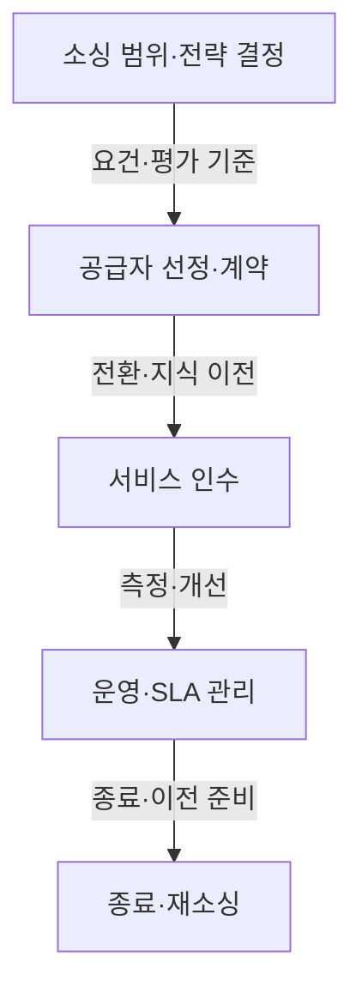

## 지식 로드맵 내 현재 위치

지식 위치: IT 전략·관리 → IT 운영전략·소싱 거버넌스 → **IT 아웃소싱**

## 30초 인출

- 본질: **IT 아웃소싱**은 조직이 IT 업무의 일부를 외부 공급자에게 맡겨 전문 서비스를 활용하는 소싱 방식이다.
- 메커니즘: 소싱 범위 결정 → 공급자·계약 선정 → 전환·지식 이전 → 서비스 수준 관리 → 종료·전환.
- 핵심: 업무·보안·서비스 책임을 계약과 운영에 명확히 두고, 필요할 때 서비스를 인수하거나 다른 공급자로 옮길 수 있게 준비한다.

핵심 용어

- **IT 아웃소싱**: IT 업무를 외부 공급자에게 맡기고 계약·성과·위험을 관리하는 소싱 방식
- **SLA(Service Level Agreement)**: 서비스 수준, 측정 기준, 역할과 보고·개선 절차를 정하는 합의
- **잔존조직(RO, Retained Organization)**: 아웃소싱을 관리하기 위해 발주 조직 안에 남기는 업무·기술·계약 관리 역량
- **서비스 통합·관리(SIAM, Service Integration and Management)**: 복수 공급자의 서비스를 조정·통합해 관리하는 운영 모델
- **경험 수준 협약(XLA, eXperience Level Agreement)**: 사용자·고객의 서비스 경험을 평가 기준에 반영하는 접근
- **Exit Plan**: 계약 종료·공급자 변경 때 서비스와 자산·정보·지식을 이전하기 위한 계획

---

## 1교시 예상문제 (10점)

> IT 아웃소싱의 의사결정 구조와 공급자 의존 위험 통제를 설명하시오. (예상·10점)

---

## 1교시 10점 답안

### Ⅰ. 개요

| 구분 | 핵심 |
|---|---|
| 정의 | **IT 아웃소싱**은 조직이 IT 업무의 일부를 외부 공급자에게 맡겨 전문 서비스를 활용하는 소싱 방식이다. |
| 목적 | 전문 역량을 활용하면서 비용·품질·위험을 조직의 목표에 맞게 관리한다. |

### Ⅱ. 아웃소싱 생명주기

### Ⅲ. 핵심 통제

- **SLA(Service Level Agreement)**에 측정 가능한 서비스 수준, 보고 주기, 문제 해결 절차와 책임을 정한다.
- **잔존조직(RO)**은 아키텍처·보안·데이터·계약 의사결정에 필요한 역량을 유지한다.
- **Exit Plan**에 자료 반환, 계정 회수, 지식 이전과 서비스 연속성 조건을 기록한다.

제언: 계약 전에 잔존조직과 공급자 변경에 필요한 인수 자료·책임자를 정한다.

---

## 2~4교시 예상문제 (25점)

> IT 아웃소싱의 Make or Buy 판단과 생명주기를 설명하고, 공급자 의존·역량 약화 위험에 대한 거버넌스 방안을 제시하시오. (예상·25점)

---

## 2~4교시 25점 답안

## Ⅰ. IT 아웃소싱의 개요

| 구분 | 핵심 |
|---|---|
| 정의 | **IT 아웃소싱**은 조직이 IT 업무의 일부를 외부 공급자에게 맡겨 전문 서비스를 활용하는 소싱 방식이다. |
| 목적 | 전문 역량을 활용하면서 비용·품질·위험을 조직의 목표에 맞게 관리한다. |

## Ⅱ. 아웃소싱 생명주기

ISO 37500은 아웃소싱을 여러 단계와 거버넌스 활동으로 다루며, 절차는 당사자의 전략·성숙도에 맞게 조정하도록 안내한다.

## Ⅲ. Make or Buy 판단 기준

| 판단 요소 | 내부 수행 검토 | 외부 위탁 검토 |
|---|---|---|
| 전략 중요도 | 차별화·핵심 통제와 직접 연결 | 표준화된 비핵심 서비스 |
| 내부 역량 | 보유 역량을 유지·강화할 필요 | 전문 역량을 단기간 활용할 필요 |
| 위험·통제 | 데이터·보안·규제 통제를 직접 수행 | 통제 요구를 계약·감사·운영으로 관리 가능 |
| 경제성 | 내부 역량 구축·유지 비용이 합리적 | 전체 생애주기 비용·품질이 합리적 |

## Ⅳ. 공급 구조와 관리 방식

| 방식 | 운영 구조 | 주요 고려사항 |
|---|---|---|
| 단일 공급자 | 한 공급자가 여러 서비스를 맡음 | 책임 창구가 단순하지만 의존 위험 점검 필요 |
| 다중 공급자 | 서비스 영역별로 공급자 구분 | 공급자 간 인터페이스·책임 통합 필요 |
| **SIAM** 적용 | 서비스 통합 기능으로 복수 공급자 조정 | 통합 책임·서비스 카탈로그·성과 지표 정의 |

## Ⅴ. 주요 위험과 대응

| 위험 | 대응 | 확인 기준 |
|---|---|---|
| 서비스 품질이 계약 목표와 다름 | **SLA**를 업무 결과와 측정·보고 기준에 연결 | 측정 데이터·서비스 검토 기록 |
| 내부 기술·계약 역량이 약화됨 | **잔존조직(RO)**에 아키텍처·보안·계약 관리 역할과 인력을 둠 | 승인 권한·핵심 역할 유지 |
| 공급자 성과를 가동률만으로 평가 | 업무 영향·사용자 경험을 보조 지표로 활용 | 장애 영향·사용자 피드백 |
| 보안·개인정보 통제가 불명확 | 접근·위탁·사고 통지·자료 반환 역할을 계약과 운영 절차에 명시 | 권한·감사·사고 대응 기록 |

## Ⅵ. 기술사적 제언 — 계약 인수 전 전환 가능성 검증

| 문제 | 해결 방안 |
|---|---|
| 계약이 끝날 때 담당자·기술 문서·계정·데이터의 이전 책임과 검증 기준이 분명하지 않으면, 서비스가 기존 공급자에 묶일 수 있다. | 서비스 인수 조건에 필수 문서·구성정보·데이터 반환 형식, 권한 회수, 지식 이전 책임자와 전환 시험 기준을 넣고, 계약 만료 전에 이전 절차를 점검한다. |

## 출제 이력과 검증 출처

- 공식 문제지 원문으로 확인한 직접 기출 없음
- [ISO 37500:2014: Guidance on outsourcing](https://committee.iso.org/standard/56269.html)
- [ISO/IEC 20000-1:2018 및 Amendment 1:2024: Service management system requirements](https://committee.iso.org/cms/live/live/en/sites/isoorg/contents/data/standard/07/06/70636.html?browse=tc)

## 연결 토픽

- 이전 토픽: [EVM](./032_evm.md)
- 연관 토픽: [SLA](./006_sla.md), [ITSM](./044_itsm.md), [RFP](./049_rfp.md)
- 다음 토픽: [SWOT 분석](./034_swot_analysis.md)
