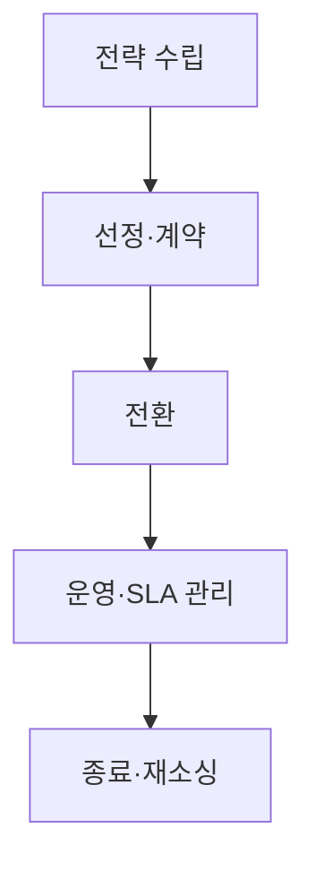
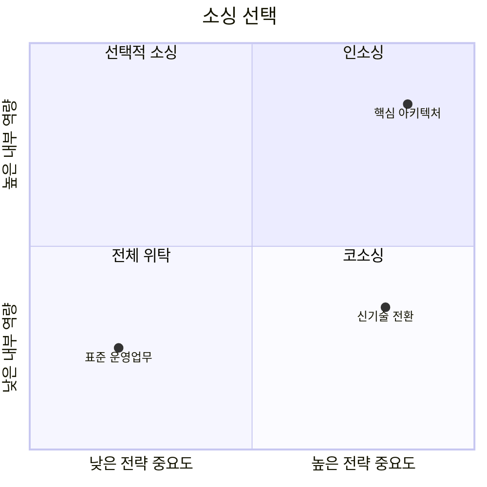
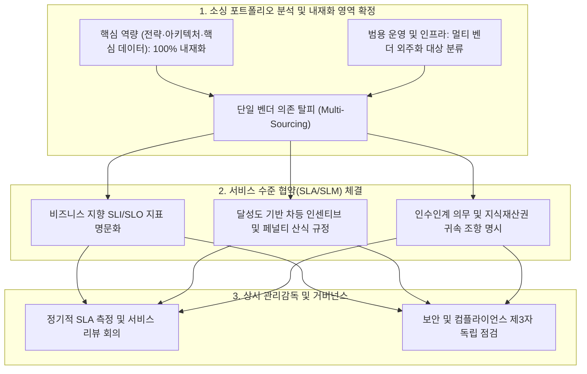

## 지식 로드맵 내 현재 위치

지식 위치: IT 전략·관리 → IT 운영전략·소싱 거버넌스 → **IT 아웃소싱**

## 30초 인출

- 본질: IT 실행업무를 외부 전문조직에 맡기되 아키텍처·데이터·보안·계약 통제권은 내부에 유지하는 소싱 체계이다.
- 메커니즘: Make or Buy 판단 → 공급자·계약 선정 → 전환·지식이전 → SLA 운영 → Exit·재소싱으로 생애주기를 관리한다.
- 산출물: 소싱전략 · RFP·SLA · 전환계획 · 성과보고 · Exit Plan이다.

핵심 용어

- **SLA(Service Level Agreement)**: 고객과 공급자가 서비스 수준, 측정방법, 책임범위를 합의한 기준이다.
- **RO(Retained Organization)**: 위탁 후에도 통제권과 핵심 역량을 유지하는 내부 조직이다.
- **SIAM(Service Integration and Management)**: 다중 공급자의 서비스를 하나의 서비스로 통합 관리하는 운영 모델이다.
- **XLA(eXperience Level Agreement)**: 사용자 경험 결과를 서비스 평가에 반영하는 협약이다.
- **Exit Plan**: 계약 종료 시 서비스·지식·자산을 다른 공급자나 내부로 이전하는 계획이다.

## 예상문제

> IT 아웃소싱의 Make or Buy 의사결정과 생명주기를 설명하고, Lock-in·역량 공동화 방지 거버넌스를 제시하시오.

## Ⅰ. IT 아웃소싱의 개요

> 실행을 위탁해도 최종 책임과 통제권은 발주자에게 남으며, 교체 가능한 구조가 소싱의 가역성을 결정함.

- 정의: IT 업무 일부 또는 전부를 **외부 전문조직**에 위탁하고 **계약·SLA(Service Level Agreement)**로 성과와 위험을 관리하는 **소싱** 체계
- 목적: 핵심 역량과 **아키텍처·데이터·보안 통제권**은 내부에 유지하면서 전문성·비용 효율을 확보하는 것

## Ⅱ. 아웃소싱 생명주기

> 전략부터 종료까지 지식·자산·권한의 소유자를 명시해야 계약 만료 때 서비스가 멈추지 않음.

## Ⅲ. Make or Buy 선택

> 전략적 중요도와 내부 역량이 높을수록 통제권을 내부에 두고, 역량이 부족한 핵심영역은 코소싱으로 내재화를 병행함.

## Ⅳ. 소싱 구조 비교

> 공급자 수가 늘면 전문성은 높아지지만 인터페이스·책임 통합 역량이 새 병목이 됨.

| 기준 | 단일 아웃소싱 | SIAM 멀티소싱 | 클라우드 MSP |
|---|---|---|---|
| 구조 | 단일 주사업자 | 영역별 공급자+통합자 | CSP+운영사업자 |
| 강점 | 책임 창구 단순 | 전문 공급자 조합 | 클라우드 자동화 활용 |
| 위험 | Lock-in·역량 공동화 | 책임 전가·통합 복잡성 | 책임공유 오해·비용 변동 |

## Ⅴ. 문제점·대응책

> 계약지표보다 내부 통제역량과 실제 이전 가능성을 함께 관리해야 공급자 교체권이 유지됨.

| 위험 | 대책 | 효과 |
|---|---|---|
| 역량 공동화 | RO가 아키텍처·데이터·보안 승인 | 내부 판단력 유지 |
| Lock-in | 개방형 인터페이스·산출물 형상관리 | 이전 가능성 확대 |
| Exit 부재 | 전환지원·자료반환·계정회수 명시 | 종료 시 연속성 확보 |
| SLA 착시 | SLA와 XLA 병행 | 기술지표·체감품질 연결 |

## Ⅵ. 잔존 조직 중심의 결론

> 아웃소싱의 성패는 공급자의 실행력뿐 아니라 발주자의 승인권·검증력·교체 가능성으로 판정함.

### 실전 답안용 기술사적 제언

- 문제: 단순 비용 절감 위주의 전면 외주화로 인해 기업의 핵심 IT 역량이 유실되고 벤더 록인(Lock-in)이 발생하며, SLA 불명확으로 서비스 품질 분쟁이 반복됨.
- 해결 방안: 핵심 IT 전략 및 아키텍처는 내재화하고 비핵심 운영은 전문화하는 스마트 소싱(Smart Sourcing) 전략을 수립하며, 다원화 벤더(Multi-sourcing) 체계 및 인센티브·페널티 연동형 SLM 거버넌스를 구축함.

## 1교시 10점 답안 발췌

### 1. 정의·목적

- 정의: IT 업무를 외부 전문조직에 위탁하고 **SLA(Service Level Agreement)**로 성과·위험을 관리하는 소싱 체계
- 목적: 핵심 역량 집중 · 전문성 활용 · 품질·비용 통제

### 2. 핵심 구조 및 매커니즘

- 정의: IT 업무를 외부 전문조직에 위탁하고 **SLA(Service Level Agreement)**로 성과·위험을 관리하는 소싱 체계
- 목적: 핵심 역량 집중 · 전문성 활용 · 품질·비용 통제

## 출제 이력과 검증 출처

- 공식 문제지 원문으로 확인한 직접 기출 없음
- [ISO 37500:2014: Guidance on outsourcing](https://www.iso.org/standard/56269.html)
- [ISO/IEC 20000-1:2018](https://www.iso.org/standard/70636.html)

## 학습 체크

- [ ] Ⅰ: 정의·목적과 RO의 필요성을 설명할 수 있는가?
- [ ] Ⅱ: 전략부터 Exit까지 활동·산출을 연결할 수 있는가?
- [ ] Ⅲ~Ⅳ: Make or Buy와 단일·멀티·MSP를 비교할 수 있는가?
- [ ] Ⅴ~Ⅵ: 공동화·Lock-in·Exit 부재의 대책을 제시할 수 있는가?

## 연결 토픽

- 이전 토픽: [EVM](./032_evm.md)
- 연관 토픽: [SLA](./006_sla.md), [ITSM](./044_itsm.md), [RFP](./049_rfp.md)
- 다음 토픽: [SWOT 분석](./034_swot_analysis.md)
