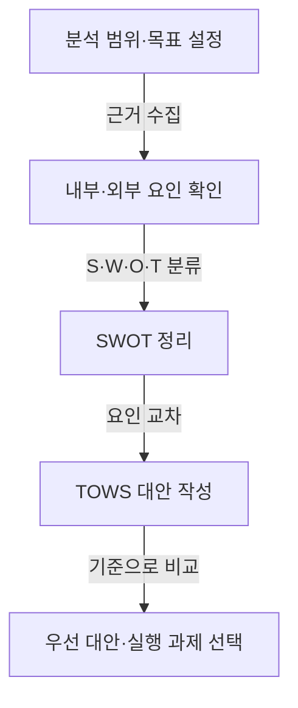

## 지식 로드맵 내 현재 위치

지식 위치: IT 전략·관리 → 환경·역량 분석 → **SWOT 분석**

## 30초 인출

- 본질: **SWOT 분석**은 조직 내부의 강점·약점과 외부의 기회·위협을 정리해 전략 선택에 활용하는 방법이다.
- 메커니즘: 근거 수집 → 내부·외부 요인 분류 → **TOWS**로 조합 → 실행 가능한 대안 비교.
- 핵심: 요인마다 출처와 시점을 남기고, 대안의 책임자·자원·판정 기준을 정한다.

핵심 용어

- **SWOT 분석**: 조직 내부의 강점·약점과 외부의 기회·위협을 정리해 전략 선택에 활용하는 방법
- **SWOT(Strengths, Weaknesses, Opportunities, Threats)**: 강점·약점·기회·위협의 네 범주
- **TOWS**: 강점·약점과 기회·위협을 교차해 전략 대안을 만드는 분석 방식
- **PEST**: 정치·경제·사회·기술 관점으로 거시환경 요인을 검토하는 틀
- **VRIO**: 자원의 가치·희소성·모방 곤란성·조직 활용 여부를 검토하는 틀

---

## 1교시 예상문제 (10점)

> SWOT 분석에서 내·외부 요인을 전략 대안으로 연결하는 절차와 유의점을 설명하시오. (예상·10점)

---

## 1교시 10점 답안

### Ⅰ. 개요

| 구분 | 핵심 |
|---|---|
| 정의 | **SWOT 분석**은 조직 내부의 강점·약점과 외부의 기회·위협을 정리해 전략 선택에 활용하는 방법이다. |
| 목적 | 내부 역량과 외부 여건의 적합성을 살펴 실행 가능한 대안을 마련한다. |

### Ⅱ. 수행 흐름

### Ⅲ. 분석 품질 통제

- 조직이 바꿀 수 있는 역량·자원은 내부 요인, 외부 환경의 변화는 외부 요인으로 구분한다.
- 각 요인의 근거·자료 출처·기준 시점을 적고 사실과 해석을 나눈다.
- **TOWS** 대안은 요인 조합에서 실제 실행할 수 있는 선택으로 구체화한다.

제언: 각 대안에 책임자와 평가 기준을 붙여 실행 여부를 추적한다.

---

## 2~4교시 예상문제 (25점)

> SWOT 분석의 개념과 수행 절차를 설명하고, TOWS 전략 대안 도출 및 단순 나열식 분석의 개선 방안을 제시하시오. (예상·25점)

---

## 2~4교시 25점 답안

## Ⅰ. SWOT 분석의 개요

| 구분 | 핵심 |
|---|---|
| 정의 | **SWOT 분석**은 조직 내부의 강점·약점과 외부의 기회·위협을 정리해 전략 선택에 활용하는 방법이다. |
| 목적 | 내부 역량과 외부 여건의 적합성을 살펴 실행 가능한 대안을 마련한다. |

## Ⅱ. SWOT 분석 수행 흐름

## Ⅲ. TOWS 전략 대안

| 조합 | 질문 | 대안 방향 |
|---|---|---|
| **SO** | 강점을 어떤 기회에 활용할 것인가? | 강점으로 기회를 활용 |
| **ST** | 강점을 활용해 어떤 위협을 줄일 것인가? | 강점으로 위협에 대응 |
| **WO** | 어떤 약점을 보완하면 기회를 활용할 수 있는가? | 역량을 보완해 기회를 활용 |
| **WT** | 약점과 위협의 노출을 어떻게 줄일 것인가? | 취약성을 낮추고 방어 |

## Ⅳ. 요인 검증과 대안 비교

| 검토 항목 | 확인 질문 |
|---|---|
| 근거 | 요인을 뒷받침하는 자료·출처·시점이 있는가? |
| 통제 범위 | 조직이 통제할 수 있는 역량인가, 외부 여건인가? |
| 전략 적합성 | 대안이 조직 목표와 자원에 맞는가? |
| 실행 가능성 | 책임자·예산·일정·선행조건을 정할 수 있는가? |

## Ⅴ. 단순 나열식 분석의 한계와 개선

| 한계 | 개선 방향 | 확인 자료 |
|---|---|---|
| 모호한 평가어만 나열 | 관찰 가능한 근거와 기준 시점 기록 | 자료 출처·측정 기준 |
| 내부·외부 요인 혼동 | 조직 통제 가능성과 발생 위치를 함께 검토 | 분류 근거 |
| 요인이 많고 중복됨 | 전략 판단에 영향을 주는 핵심 요인만 남기고 상호 관계 확인 | 요인 간 중복·의존성 |
| 분석 결과가 실행과 분리됨 | TOWS 대안을 책임·자원·기한이 있는 과제로 구체화 | 과제·책임·평가 기준 |

## Ⅵ. 기술사적 제언 — 분석 결과를 실행 가능한 결정으로 전환

| 문제 | 해결 방안 |
|---|---|
| SWOT을 작성해도 요인별 우선순위와 실행 책임이 정해지지 않으면 전략 선택으로 이어지지 않는다. | TOWS 대안을 목표 적합성·근거 강도·필요 자원·실행 가능성으로 비교하고, 선택한 과제마다 책임자·일정·평가 기준을 정해 정기 검토한다. |

## 출제 이력과 검증 출처

- 공식 문제지 원문으로 확인한 직접 기출 없음
- [Harvard Business School: The Five Competitive Forces That Shape Strategy](https://www.isc.hbs.edu/strategy/business-strategy/Pages/the-five-competitive-forces-that-shape-strategy.aspx)

## 연결 토픽

- 이전 토픽: [IT 아웃소싱](./033_it_outsourcing.md)
- 연관 토픽: [ISP](./003_isp.md), [BSC](./017_bsc.md), [AHP](./075_ahp.md)
- 다음 토픽: [갈등관리](./035_conflict_management.md)
