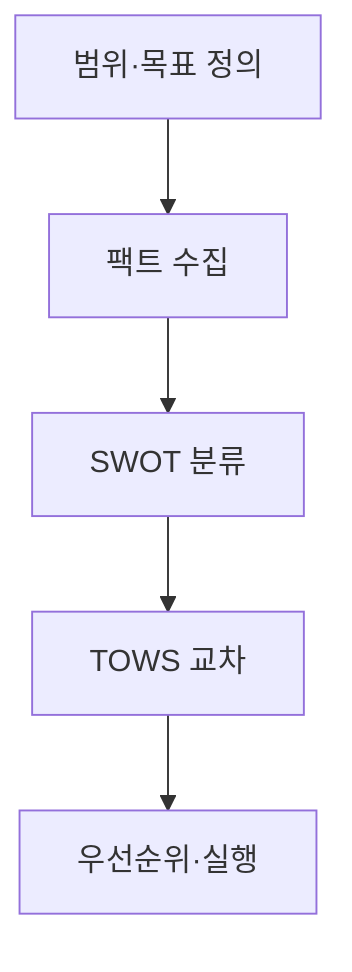
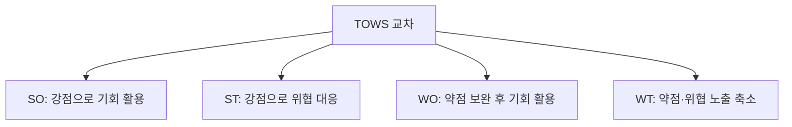

## 지식 로드맵 내 현재 위치

IT 전략·관리 → 환경·역량 분석 → **SWOT 분석**

## 30초 인출

- 본질: 내부 강점·약점과 외부 기회·위협을 근거로 분류하고 교차해 실행전략을 만드는 프레임워크
- 메커니즘: 외부·내부 사실 수집 → SWOT 분류 → TOWS 교차 → 우선순위 → 실행과제
- 산출물: SWOT·TOWS 매트릭스 · 전략대안 · 우선과제·로드맵

핵심 용어

- **SWOT(Strengths, Weaknesses, Opportunities, Threats)**: 내부 역량과 외부 환경을 네 범주로 구조화하는 분석
- **TOWS**: SWOT 요인을 교차해 SO·ST·WO·WT 전략을 만드는 매트릭스
- **PEST**: 정치·경제·사회·기술 거시환경 분석
- **VRIO(Value, Rarity, Inimitability, Organization)**: 자원의 경쟁우위 가능성 분석
- **AHP(Analytic Hierarchy Process)**: 기준과 대안을 쌍대비교해 우선순위를 구하는 기법

## 예상문제

> SWOT 분석의 개념과 수행절차를 설명하고, TOWS 전략 도출 및 단순 나열식 분석의 대응책을 제시하시오.

## Ⅰ. SWOT 분석의 개요

> 네 칸을 채우는 것이 아니라 근거 있는 요인을 실행 가능한 전략으로 교차하는 것이 핵심임.

- 정의: 내부 S·W와 외부 O·T를 사실 기반으로 분석해 **TOWS** 전략을 도출하는 프레임워크
- 목적: 전략적 적합성 확보 · 실행 가능한 과제 선정

## Ⅱ. SWOT 수행절차

> 내부·외부의 통제 가능성을 구분하고 요인부터 과제까지 근거를 추적해야 주관적 나열을 피할 수 있음.

## Ⅲ. TOWS 전략

> SO·ST·WO·WT는 요인 이름을 결합하는 표가 아니라 선택 가능한 실행 방향임.

## Ⅳ. 분석도구 비교

| 도구 | 범위 | 산출 |
|---|---|---|
| SWOT | 내부+외부 종합 | S·W·O·T·전략방향 |
| 3C | 고객·경쟁사·자사 | 가치제안·포지셔닝 |
| PEST | 거시 외부환경 | 기회·위협 근거 |
| 5-Force | 산업 경쟁환경 | 경쟁강도·매력도 |

## Ⅴ. 문제점·대응책

| 위험 | 대책 | 효과 |
|---|---|---|
| 주관적 나열 | 요인별 지표·출처·유효기간 | 검증 가능한 요인 유지 |
| 내·외부 혼동 | 조직 통제 가능성으로 S/W·O/T 판정 | 분류 일관성 확보 |
| 우선순위 부재 | AHP 등 다기준 평가 | 핵심 과제 선별 |
| 실행 단절 | 전략-과제-책임-KPI 추적 | 실행력 확보 |

## Ⅵ. 실행 추적 중심의 결론

> TOWS 결과가 책임·자원·성과지표를 가진 과제로 전환되어야 분석이 의사결정에 기여함.

### 실전 답안용 기술사적 제언

- 판정: 요인 근거부터 실행과제까지 추적되는가
- 대안: 출처·유효기간 · TOWS 교차 · 다기준 우선순위
- 검증: 통제 가능성 · 전략 연결 · 책임·자원·KPI
- 효과: 전략 정합성·실행력 향상

## 1교시 10점 답안 발췌

- 정의: **SWOT 분석(Strengths, Weaknesses, Opportunities, Threats)**은 내부 역량과 외부 환경을 분류하고 TOWS로 실행전략을 도출하는 프레임워크
- 목적: 전략적 적합성·실행과제 도출

## 출제 이력과 검증 출처

- 공식 문제지 원문으로 확인한 직접 기출 없음
- [Harvard Business School: The Five Competitive Forces That Shape Strategy](https://www.isc.hbs.edu/strategy/business-strategy/Pages/the-five-competitive-forces-that-shape-strategy.aspx)

## 학습 체크

- [ ] Ⅰ: SWOT의 정의·목적과 내부·외부 구분기준을 설명할 수 있는가?
- [ ] Ⅱ: 범위부터 실행과제까지 활동·산출을 연결할 수 있는가?
- [ ] Ⅲ: SO·ST·WO·WT의 조합을 재현할 수 있는가?
- [ ] Ⅳ~Ⅵ: 분석도구 차이와 나열식 SWOT의 대응책을 제시할 수 있는가?

## 연결 토픽

- 이전 토픽: [IT 아웃소싱](./033_it_outsourcing.md)
- 연관 토픽: [ISP](./003_isp.md), [BSC](./017_bsc.md), [AHP](./075_ahp.md)
- 다음 토픽: [갈등관리](./035_conflict_management.md)
