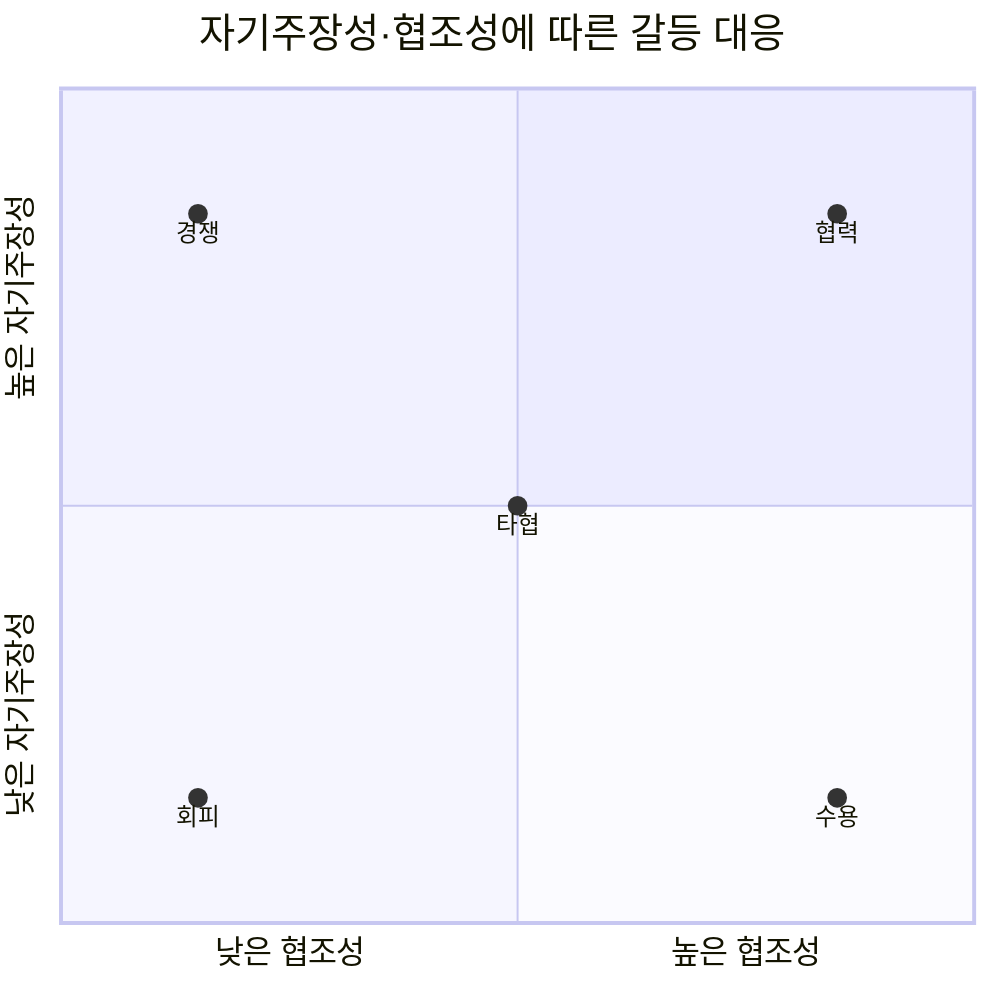
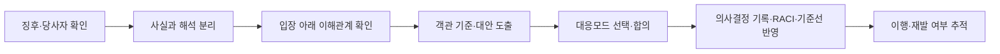
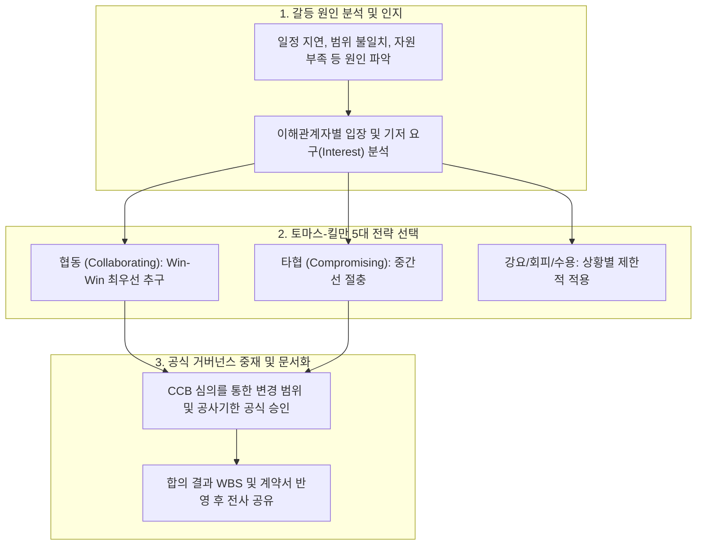

## 지식 로드맵 내 현재 위치

지식 위치: IT 전략·관리 → 프로젝트 관리·이해관계자 → **갈등관리**

## 30초 인출

- 본질: 갈등관리는 목표·이해관계·업무 방식의 불일치를 조기에 식별하고, 상황에 맞는 대응모드와 합의 절차로 프로젝트 성과를 보호하는 활동이다.
- 메커니즘: 갈등을 과업·관계·프로세스로 진단하고, **자기주장성** 과 **협조성** 에 따라 **TKI** 모드를 선택한 뒤 **원칙협상** 으로 조정한다.
- 결과: 합의 결과를 **의사결정 기록** , RACI, 일정·범위 기준선과 후속조치에 반영한다.

핵심 용어

- **TKI(Thomas–Kilmann Conflict Mode Instrument)** : 자기주장성과 협조성을 축으로 5가지 갈등 해결 유형(경쟁·협력·타협·회피·수용)을 정의한 진단 모델
- **자기주장성(Assertiveness)** : 갈등 상황에서 타인의 요구보다 자신의 목표와 입장을 관철하려는 성향 수준
- **협조성(Cooperativeness)** : 갈등 상황에서 자신의 입장보다 상대방의 요구와 관계 유지를 우선적으로 배려하는 성향 수준
- **원칙협상(Principled Negotiation)** : 사람과 문제를 분리하고 주관적 입장 대신 본질적 이해관계와 객관적 기준에 근거해 상호 이익을 도출하는 협상 기법
- **의사결정 기록(Decision Record)** : 갈등 중재 과정에서 도출된 최종 합의안, 선택 근거, 책임자 및 후속 조치를 명문화한 공식 문서

## 예상문제

> 프로젝트 갈등의 유형을 설명하고, Thomas–Kilmann 5대 대응모드와 상황별 적용 및 중재방안을 제시하시오.

## Ⅰ. 갈등관리의 개념과 목적의 개요

- 정의: **갈등관리** 는 제한된 자원·상충하는 목표·역할 모호성에서 생긴 쟁점을 과업·관계·프로세스 갈등으로 진단하고 대응모드와 합의 절차로 조정하는 활동이다.
- 목적: **TKI 대응모드** , **원칙협상** , **RACI** 를 활용해 갈등을 의사결정 가능한 상태로 전환하고 신뢰·일정·품질의 훼손을 줄인다.

## Ⅱ. 갈등의 유형

| 유형 | 핵심 쟁점 | 주요 징후 | 관리 초점 |
|---|---|---|---|
| 과업 갈등 | 무엇을 할 것인가 | 요구사항·기술 대안 논쟁 | 근거, 실험, 의사결정 기준 |
| 관계 갈등 | 누구와 어떻게 일할 것인가 | 비난, 방어, 신뢰 저하 | 경청, 감정 완화, 공동 목표 |
| 프로세스 갈등 | 누가 언제 어떻게 할 것인가 | 역할 중복, 승인 지연 | RACI, 절차, 기준선 |

## Ⅲ. Thomas–Kilmann 5대 대응모드

| 모드 | 적합 상황 | 유의점 |
|---|---|---|
| 경쟁 | 안전·법규 등 신속한 결정이 필요한 경우 | 권한 남용과 관계 훼손 방지 |
| 협력 | 장기적 관계와 통합 대안이 중요한 경우 | 충분한 시간과 정보 필요 |
| 타협 | 대등한 당사자가 제한된 시간에 합의해야 하는 경우 | 근본 원인이 남을 수 있음 |
| 회피 | 쟁점이 경미하거나 냉각 시간이 필요한 경우 | 중요 쟁점의 방치 금지 |
| 수용 | 상대 쟁점이 더 중요하거나 관계 회복이 우선인 경우 | 일방적 희생의 반복 방지 |

## Ⅳ. 갈등 중재 절차

중재자는 당사자를 비난하기보다 공통 목표와 객관 기준을 제시한다. 기술 쟁점은 소규모 검증이나 데이터로 불확실성을 줄이고, 권한 밖 쟁점은 후원자나 거버넌스 기구로 상향한다.

## Ⅴ. 문제점 및 대응책

| 문제점 | 영향 | 대응책 |
|---|---|---|
| 사람과 문제의 혼동 | 관계 갈등 확산 | 사실·행동·영향 중심으로 쟁점 기술 |
| 입장 고착 | 승패 협상 반복 | 이해관계와 객관 기준 기반 대안 설계 |
| 의사결정 권한 불명확 | 지연·재논쟁 | RACI와 상향 기준 명시 |
| 구두 합의 의존 | 책임 공방·기준선 흔들림 | 의사결정 기록, 회의 결정사항, 변경기록 유지 |
| 조기 징후 미탐지 | 일정·품질 손실 확대 | 회고·리스크 검토에서 갈등 징후 추적 |

## Ⅵ. 결론

효과적인 갈등관리는 특정 모드를 고집하는 것이 아니라 갈등 유형, 긴급성, 관계 지속성, 권한과 손실 규모에 맞춰 대응을 선택하는 역량이다. 사실과 이해관계를 분리하고 결정 근거를 기준선에 연결해야 합의가 실행으로 이어진다.

### 실전 답안용 기술사적 제언

- 문제: 프로젝트 수행 중 발주처-수행사 간 또는 개발-현업 간 범위·일정 갈등을 방치하거나 일방적으로 회피하여 납기 지연 및 품질 저하를 초래함.
- 해결 방안: 토마스-킬만의 갈등 해결 5대 모델 중 상호 Win-Win을 지향하는 협동(Collaborating/Problem Solving) 기법을 최우선 적용하고, 범위 변경에 따른 갈등은 공식 CCB(변경통제위원회) 절차를 통해 투명하게 중재함.

## 1교시 10점 답안 발췌

### 1. 정의·목적

- 정의: **갈등관리** 는 제한된 자원·상충하는 목표·역할 모호성에서 생긴 쟁점을 과업·관계·프로세스 갈등으로 진단하고 대응모드와 합의 절차로 조정하는 활동이다.
- 목적: **TKI 대응모드** , **원칙협상** , **RACI** 를 활용해 갈등을 의사결정 가능한 상태로 전환하고 신뢰·일정·품질의 훼손을 줄인다.

### 2. 핵심 구조 및 체계

- 정의: 제한된 자원과 상충하는 목표 속에서 과업·관계·프로세스 갈등을 조기 식별하고 TKI 모드와 원칙협상으로 조정하는 관리 활동
- 메커니즘: 갈등 유형 진단 → TKI 5대 모드 선택 → 원칙협상 및 합의 → 의사결정 기록 및 RACI 반영

## 출제 이력과 검증 출처

- 제136회 정보관리기술사 1교시 기출 (프로젝트 갈등관리)
- [The Myers-Briggs Company, Thomas–Kilmann Conflict Mode Instrument](https://www.themyersbriggs.com/en-US/Products-and-Services/TKI)
- [Harvard Program on Negotiation, Principled Negotiation](https://www.pon.harvard.edu/daily/negotiation-skills-daily/principled-negotiation-focus-interests-to-create-value/)

## 학습 체크

- [ ] 갈등을 과업·관계·프로세스 유형으로 구분할 수 있는가?
- [ ] TKI 5개 모드를 두 축과 함께 설명할 수 있는가?
- [ ] 중재 결과를 프로젝트 통제 산출물에 연결할 수 있는가?

## 연결 토픽

- 이전 토픽: [SWOT 분석](./034_swot_analysis.md)
- 연관 토픽: [PMO](./004_pmo.md), [프로젝트 리스크 관리](./009_project_risk_management_negative.md)
- 다음 토픽: [NIST AI RMF](./036_nist_ai_rmf.md)
