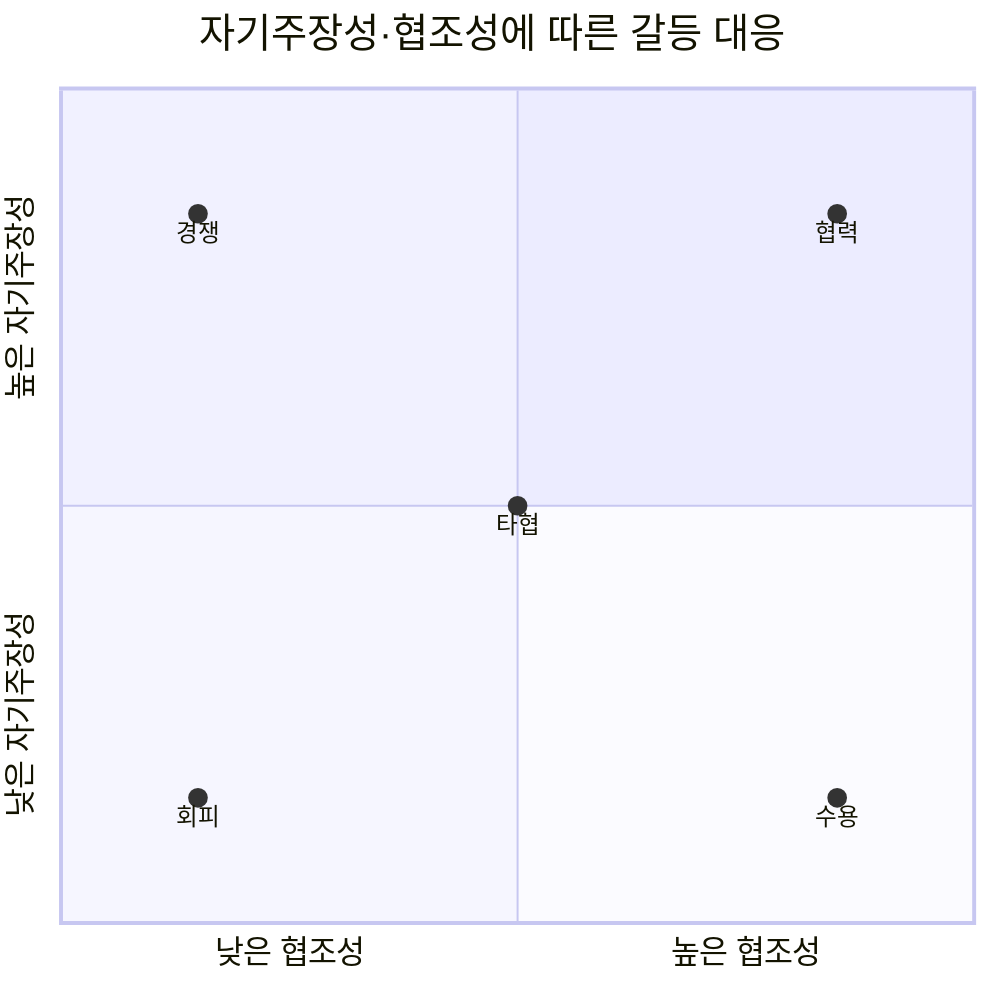
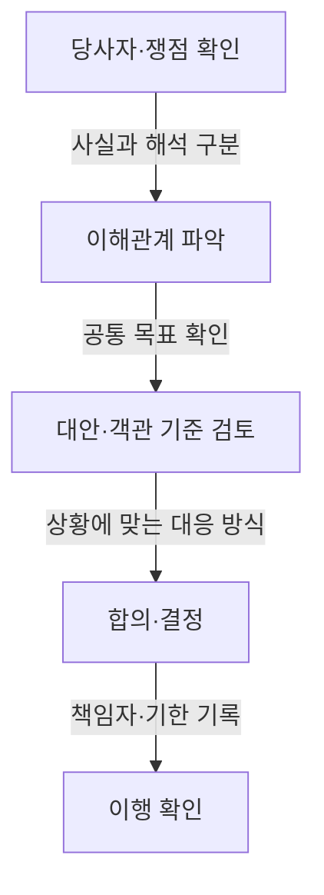

## 지식 로드맵 내 현재 위치

지식 위치: IT 전략·관리 → 프로젝트 관리·이해관계자 → **갈등관리**

## 30초 인출

- 본질: **갈등관리**는 이해관계자 사이의 목표·관점·업무 방식 차이를 파악하고 조정하는 활동이다.
- 메커니즘: 쟁점과 관계를 진단하고, 자기주장성과 협조성에 맞는 **TKI** 대응 방식을 고른 뒤 합의·후속 조치로 연결한다.
- 핵심: 대응 방식은 상황에 따라 선택하고, 결정 근거와 책임자를 기록한다.

핵심 용어

- **갈등관리**: 이해관계자 사이의 쟁점을 진단·조정해 합의와 후속 행동으로 잇는 활동
- **TKI** (Thomas–Kilmann Conflict Mode Instrument): 자기주장성과 협조성 차원으로 경쟁·협력·타협·회피·수용 방식을 설명하는 도구
- **자기주장성(Assertiveness)**: 자기 관심사를 충족하려는 정도
- **협조성(Cooperativeness)**: 상대방의 관심사를 충족하려는 정도
- **원칙협상**: 사람과 문제를 분리하고 입장보다 이해관계와 객관 기준에 초점을 두는 협상 접근
- **의사결정 기록**: 결정 내용·근거·책임자·후속 조치를 기록한 문서

---

## 1교시 예상문제 (10점)

> 프로젝트 갈등의 유형과 상황에 맞는 대응 방식을 설명하시오. (예상·10점)

---

## 1교시 10점 답안

### Ⅰ. 개요

| 구분 | 핵심 |
|---|---|
| 정의 | **갈등관리**는 이해관계자 사이의 목표·관점·업무 방식 차이를 파악하고 조정하는 활동이다. |
| 목적 | 갈등이 의사결정·협업·업무 수행에 주는 부정적 영향을 줄이고 해결 가능한 쟁점으로 다룬다. |

### Ⅱ. TKI 대응 방식

### Ⅲ. 적용 원칙

- **경쟁**은 긴급한 결정이 필요할 때, **협력**은 여러 이해관계를 함께 충족할 해법을 찾을 때 고려한다.
- **타협**은 제한된 시간 안에 상호 양보가 필요할 때, **회피**는 쟁점이 경미하거나 냉각 시간이 필요할 때 쓴다.
- **수용**은 상대의 요구가 더 중요하거나 관계 회복이 우선인 상황에서 검토한다.
- 쟁점보다 사람을 탓하지 않고, 합의·담당자·기한을 **의사결정 기록**에 남긴다.

제언: 대응 방식을 정하기 전에 당사자의 쟁점과 긴급성을 확인한다.

---

## 2~4교시 예상문제 (25점)

> 프로젝트 갈등의 유형을 설명하고, Thomas–Kilmann 5대 대응 방식의 상황별 적용과 중재 방안을 제시하시오. (예상·25점)

---

## 2~4교시 25점 답안

## Ⅰ. 갈등관리의 개요

| 구분 | 핵심 |
|---|---|
| 정의 | **갈등관리**는 이해관계자 사이의 목표·관점·업무 방식 차이를 파악하고 조정하는 활동이다. |
| 목적 | 갈등이 의사결정·협업·업무 수행에 주는 부정적 영향을 줄이고 해결 가능한 쟁점으로 다룬다. |

## Ⅱ. 갈등 유형 구분

| 유형 | 쟁점 | 관리 초점 |
|---|---|---|
| 과업 | 무엇을·어떻게 할지에 대한 의견 차이 | 근거·대안·결정 기준 |
| 관계 | 대인 신뢰·감정·상호작용의 긴장 | 경청·존중·관계 회복 |
| 프로세스 | 역할·책임·업무 순서의 불일치 | 책임자·절차·승인 기준 |

## Ⅲ. TKI의 다섯 대응 방식

| 방식 | 경향 | 고려 상황 |
|---|---|---|
| 경쟁 | 자기주장 높음·협조 낮음 | 긴급하거나 안전·규정상 신속한 결정을 해야 할 때 |
| 협력 | 자기주장 높음·협조 높음 | 중요한 이해관계를 함께 충족할 대안을 찾을 때 |
| 타협 | 두 차원 중간 | 시간이 제한되고 상호 양보가 가능한 경우 |
| 회피 | 두 차원 낮음 | 쟁점이 경미하거나 잠시 냉각할 시간이 필요한 경우 |
| 수용 | 자기주장 낮음·협조 높음 | 상대의 관심사가 더 중요하거나 관계 회복을 우선할 때 |

## Ⅳ. 원칙 기반 중재 절차

## Ⅴ. 중재 실패와 대응

| 문제 | 대응 | 확인 사항 |
|---|---|---|
| 사람과 문제를 동일시해 비난이 커짐 | 관찰된 사실·업무 영향·요구를 구분해 대화 | 쟁점이 사실에 근거하는가 |
| 입장만 고수해 대안 탐색이 멈춤 | 입장 아래의 이해관계와 객관 기준을 확인 | 대안이 각 당사자 관심사를 다루는가 |
| 결정 권한이 불분명해 합의가 미뤄짐 | 책임·승인·상향 경로를 명확히 함 | 결정권자와 기한 |
| 합의가 구두로만 남아 다시 논쟁함 | **의사결정 기록**에 결과·근거·책임자·후속 조치 기록 | 합의 이행 상태 |

## Ⅵ. 기술사적 제언 — 대응 방식 선택의 기준화

| 문제 | 해결 방안 |
|---|---|
| 프로젝트 관리자가 자신이 익숙한 한 가지 방식만 반복하면 긴급성·관계·쟁점 중요도에 맞지 않는 대응을 할 수 있다. | 중재 전에 쟁점의 중요도, 긴급성, 관계 지속 필요성, 결정 권한을 확인하고 대응 방식의 선택 근거를 기록한다. 해결 후에는 합의 이행과 재발 여부를 검토한다. |

## 출제 이력과 검증 출처

- 제136회 정보관리기술사 1교시 기출 (프로젝트 갈등관리)
- [The Myers-Briggs Company: Thomas–Kilmann Conflict Mode Instrument](https://www.themyersbriggs.com/en-US/Products-and-Services/TKI)
- [Harvard Program on Negotiation: Principled Negotiation](https://www.pon.harvard.edu/daily/negotiation-skills-daily/principled-negotiation-focus-interests-to-create-value/)

## 연결 토픽

- 이전 토픽: [SWOT 분석](./034_swot_analysis.md)
- 연관 토픽: [PMO](./004_pmo.md), [프로젝트 리스크 관리](./009_project_risk_management_negative.md)
- 다음 토픽: [NIST AI RMF](./036_nist_ai_rmf.md)
