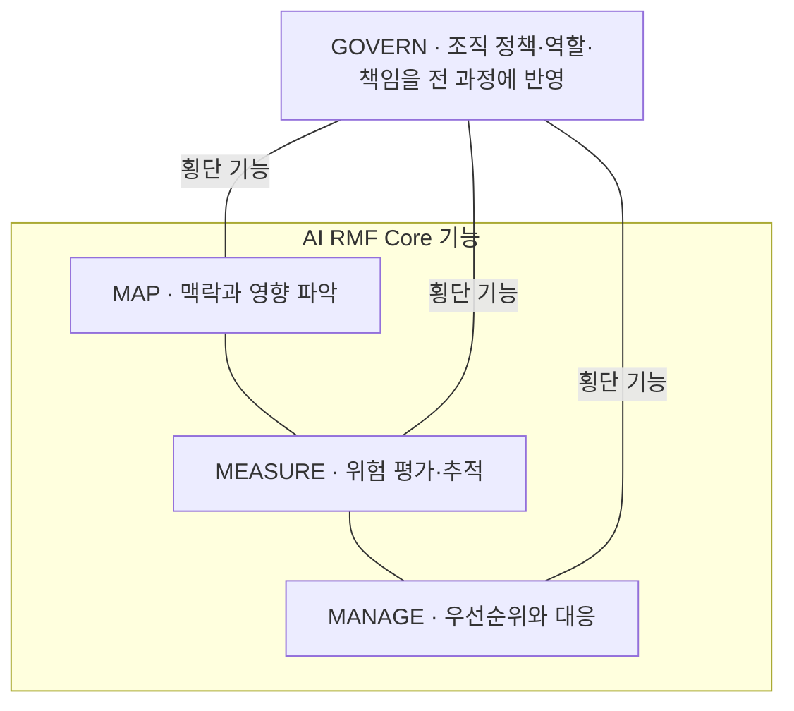

## 지식 로드맵 내 현재 위치

지식 위치: IT 전략·관리 → AI 거버넌스·신뢰성 → **NIST AI RMF**

## 30초 인출

- 본질: **NIST AI RMF** 는 AI 위험·신뢰성 고려사항을 조직의 개발·사용·평가에 반영하도록 돕는 자발적 프레임워크.
- 메커니즘: 전 과정의 **GOVERN**, 맥락 파악을 위한 **MAP**, 평가를 위한 **MEASURE**, 대응을 위한 **MANAGE**. 고정 단계가 아닌 기능 관계.
- 핵심: 맥락·측정·대응의 근거·책임 기록, 위험·시스템 변경 시 재검토.

핵심 용어

- **NIST AI RMF**: 미국 NIST가 제시한 자발적 AI 위험관리 프레임워크
- **GOVERN**: 조직의 정책·역할·책임·위험 문화를 다른 기능 전반에 반영
- **MAP**: AI 시스템의 맥락과 잠재적 위험·영향을 파악
- **MEASURE**: AI 위험과 신뢰성 특성을 평가·분석·추적
- **MANAGE**: 평가 결과에 따라 위험 우선순위를 정하고 대응
- **신뢰성 특성**: 유효성·신뢰성, 안전성, 보안·회복탄력성, 책임성·투명성, 설명가능성·해석가능성, 개인정보 강화, 유해한 편향을 관리하는 공정성
- **NIST AI 600-1**: 생성형 AI 위험을 다루는 AI RMF 프로파일

---

## 1교시 예상문제 (10점)

> NIST AI RMF의 네 기능과 AI 위험관리 적용 방식을 설명하시오. (예상·10점)

---

## 1교시 10점 답안

### Ⅰ. 개요

| 구분 | 핵심 |
|---|---|
| 정의 | **NIST AI RMF** 는 AI 위험·신뢰성 고려사항을 조직의 개발·사용·평가에 반영하도록 돕는 자발적 프레임워크 |
| 목적 | 맥락에 맞는 위험관리·근거 있는 의사결정 지원 |

### Ⅱ. 네 기능의 관계

### Ⅲ. 적용 원칙

- 조직의 정책·역할·책임을 세 기능에 반영하는 **GOVERN**.
- 사용 맥락·영향을 파악하는 **MAP**, 평가 근거·한계를 기록하는 **MEASURE**.
- 우선순위·대응을 정하는 **MANAGE**, 새 정보·변화에 따른 관련 활동 재검토.

제언: 적용 위험 시나리오·담당자·승인 주체의 선행 기록.

---

## 2~4교시 예상문제 (25점)

> NIST AI RMF 1.0의 네 기능과 신뢰성 특성을 설명하고, 조직의 AI 위험관리 적용 방안을 제시하시오. (예상·25점)

---

## 2~4교시 25점 답안

## Ⅰ. NIST AI RMF의 개요

| 구분 | 핵심 |
|---|---|
| 정의 | **NIST AI RMF** 는 AI 위험·신뢰성 고려사항을 조직의 개발·사용·평가에 반영하도록 돕는 자발적 프레임워크 |
| 목적 | 맥락에 맞는 위험관리·근거 있는 의사결정 지원 |

NIST AI RMF 1.0의 2023년 발표와 2026년 9월 기준 NIST의 개정 작업 진행. 이 답안의 설명 범위는 발간된 1.0판의 구조.

## Ⅱ. AI RMF Core의 기능 관계

네 기능의 비체크리스트·비순차적 성격. 다른 세 기능 전반에 작용하는 **GOVERN**, 맥락·위험에 맞춘 MAP·MEASURE·MANAGE 활동의 반복·조정.

## Ⅲ. 기능별 주요 활동과 증거

| 기능 | 주요 활동 | 확인 근거 예시 |
|---|---|---|
| **GOVERN** | 정책·역할·책임·감독과 위험 문화를 정립 | 정책, 책임분장, 위험 허용 기준 |
| **MAP** | 목적·사용 맥락·영향대상·위험 시나리오 파악 | 시스템 맥락, 이해관계자, 영향 분석 |
| **MEASURE** | 위험·성능·신뢰성 특성 평가 및 한계 기록 | 시험 방법, 지표, 결과·불확실성 |
| **MANAGE** | 우선순위화, 위험 대응, 운영 중 모니터링 | 처리계획, 승인, 사고·개선 기록 |

## Ⅳ. 신뢰할 수 있는 AI의 특성

신뢰성 특성은 사용 맥락과 예상 영향에 맞춰 평가하며, 모든 특성을 같은 지표로 측정하거나 무조건 최대화하는 항목이 아닌 맥락별 판단 대상

| 신뢰성 특성 | 적용 시 확인할 사항 |
|---|---|---|
| 유효성·신뢰성 | 의도된 기능과 사용 조건에서 성능·한계 확인 |
| 안전성 | 예상 가능한 위해와 안전장치·사고 대응 확인 |
| 보안성·회복탄력성 | 공격·장애 대응 및 복구 가능성 확인 |
| 책임성·투명성 | 역할·판단 근거·사용 범위의 기록과 공개 수준 확인 |
| 설명가능성·해석가능성 | 사용자·감독자에게 필요한 설명 제공 여부 확인 |
| 프라이버시 강화 | 개인정보 처리와 정보주체 권리 보호 확인 |
| 공정성·유해 편향 관리 | 영향받는 집단별 차이와 편향 완화 여부 확인 |

## Ⅴ. 적용 시 한계와 대응

| 한계 | 대응 | 확인 자료 |
|---|---|---|
| 프레임워크의 체크리스트식 적용 | 사용 맥락·이해관계자·영향에 따른 활동 선택 | MAP 기록·선택 근거 |
| 불완전·불가능한 위험 측정 | 측정 한계·불확실성 공개와 보완 통제 검토 | 평가방법·한계·잔여위험 |
| 제한된 외부 모델·공급자 정보 | 변경 통지·사용 제한·중단·대체 조건 확인 | 공급자 정보·계약·변경 기록 |
| 배포 후 모델·환경·사용 방식 변경 | 변화·사고별 재평가 기준·모니터링 설정 | 운영지표·사고·재평가 기록 |

## Ⅵ. 기술사적 제언 — 생성형 AI 사용사례별 위험 승인

| 문제 | 해결 방안 |
|---|---|
| 공통 위험 목록의 복사 사용에 따른 특정 사용사례의 위험·수용 여부·재검토 조건 불명확성 | 사용사례별 주요 위험·측정 방법·한계·완화책·잔여위험 승인자·재평가 조건의 기록, 배포 전·운영 중 검토에서의 동일 기록 활용 |

## 출제 이력과 검증 출처

- 제138회 정보관리기술사 기출 (NIST AI RMF)
- [NIST AI RMF 1.0 Core](https://airc.nist.gov/airmf-resources/airmf/5-sec-core/)
- [NIST AI 100-1: Artificial Intelligence Risk Management Framework 1.0](https://doi.org/10.6028/NIST.AI.100-1)
- [NIST: AI Risk Management Framework and revision status](https://www.nist.gov/itl/ai-risk-management-framework)

## 연결 토픽

- 이전 토픽: [갈등관리](./035_conflict_management.md)
- 연관 토픽: [국가 AI 전략](./024_korea_ai_action_plan.md)
- 다음 토픽: [POP](./038_pop.md)
