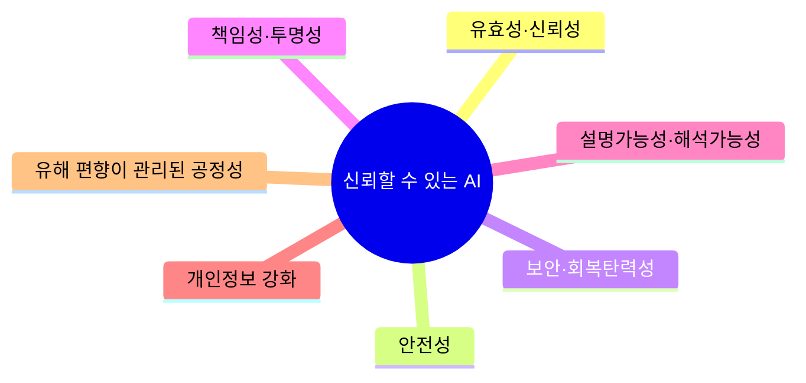
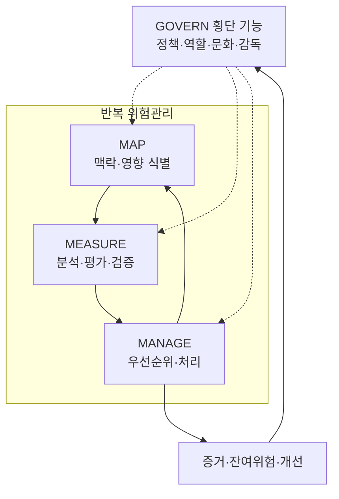

## 학습 로드맵

IT 전략·관리 → AI 거버넌스·신뢰성 → **NIST AI RMF**

## 30초 인출

- **본질**: NIST AI RMF 1.0은 AI 위험을 관리하고 신뢰성 고려사항을 AI 수명주기에 통합하기 위한 자발적·권리보호적·비산업특정 프레임워크다.
- **메커니즘**: 전 기능에 걸친 **GOVERN**을 기반으로 **MAP → MEASURE → MANAGE**를 반복하며 맥락·평가·처리 증거를 연결한다.
- **판정 기준**: 신뢰성 특성의 맥락별 측정근거, 위험 처리 효과, 승인된 잔여위험과 운영 중 재평가 가능성으로 판단한다.

## 핵심 용어

- **AI RMF**: AI 위험을 개인·조직·사회 관점에서 관리하고 신뢰성 고려사항을 수명주기에 통합하는 프레임워크
- **GOVERN**: 위험관리 문화, 정책, 역할, 책임, 문서화와 감독을 수립하는 횡단 기능
- **MAP**: 사용 맥락, 이해관계자, 편익·위험과 영향을 파악하는 기능
- **MEASURE**: 정성·정량 방법으로 위험과 신뢰성 특성을 분석·평가·추적하는 기능
- **MANAGE**: 위험을 우선순위화하고 처리·모니터링하는 기능
- **NIST AI 600-1**: AI RMF 1.0을 생성형 AI 위험에 적용하기 위한 교차산업 프로파일

## 예상 문제

> NIST AI RMF 1.0의 개념, 4대 기능과 신뢰성 특성을 설명하고 생성형 AI 위험관리 적용방안을 제시하시오.

## Ⅰ. NIST AI RMF의 개념과 원칙

AI RMF는 고정 체크리스트가 아니라 조직의 사용 맥락, 위험 허용수준, 자원에 맞게 프로파일을 구성하는 프레임워크다. 위험관리 활동을 설계·개발·배포·운영·평가 전반에 적용하고, 영향을 받는 개인과 공동체의 관점을 포함한다.

## Ⅱ. 신뢰할 수 있는 AI의 특성

NIST는 특성 간 상충 가능성을 인정하므로, 모든 특성을 일률적으로 최대화하기보다 맥락에 맞는 우선순위와 측정 근거를 정해야 한다.

| 특성 | 확인 관점 |
|---|---|
| 유효성·신뢰성 | 의도한 맥락에서 성능이 일관되고 검증되는가 |
| 안전성 | 사람·재산·환경에 대한 위해를 예방·완화하는가 |
| 보안·회복탄력성 | 공격·오류·환경 변화에 견디고 복구하는가 |
| 책임성·투명성 | 책임 주체와 판단·운영 정보가 추적 가능한가 |
| 설명가능성·해석가능성 | 결과와 작동 방식이 대상에 맞게 이해 가능한가 |
| 개인정보 강화 | 개인정보 위험을 수명주기에서 관리하는가 |
| 공정성 | 유해한 편향과 차별 영향을 식별·관리하는가 |

## Ⅲ. 4대 핵심 기능과 산출물

| 기능 | 핵심 활동 | 대표 산출물 |
|---|---|---|
| GOVERN | 정책·역할·책임, 위험 문화, 제3자 관리 | AI 정책, RACI, 위험 허용기준 |
| MAP | 목적·맥락·대상, 영향·편익·위험 식별 | 사용사례, 영향대상, 위험 시나리오 |
| MEASURE | 지표 선정, 시험·평가·검증, 불확실성 기록 | 평가결과, 한계, 증거와 추적지표 |
| MANAGE | 우선순위 결정, 대응 실행, 모니터링 | 처리계획, 승인된 잔여위험, 개선조치 |

## Ⅳ. 생성형 AI 프로파일 적용

NIST AI 600-1은 생성형 AI 고유·증폭 위험을 AI RMF 기능에 연결한다. 조직은 프로파일의 위험 목록을 그대로 복제하기보다 적용 맥락에 필요한 조치를 선정하고 효과를 측정해야 한다.

| 생성형 AI 위험 예시 | 적용 통제 | 확인 증거 |
|---|---|---|
| 허위·부정확 콘텐츠 | 근거 연결, 사람 검토, 한계 고지 | 사실성 평가, 인용 추적, 오류 사례 |
| 정보보안·오용 | 위협모델링, 입력·출력 방어, 권한통제 | 공격 시험, 탐지·대응 기록 |
| 개인정보 노출 | 데이터 최소화, 필터링, 개인정보 평가 | 데이터 계보, 유출 시험, 처리 기록 |
| 유해 편향 | 대상별 성능·영향 평가, 이의제기 절차 | 집단별 지표, 영향평가, 시정조치 |
| 제3자 모델 의존 | 공급자 실사, 변경·중단 대응 | 모델 카드, 계약·변경 이력, 대체계획 |

## Ⅴ. 문제점 및 대응책

| 문제점 | 영향 | 대응책 |
|---|---|---|
| 프레임워크의 체크리스트화 | 맥락과 실제 영향 누락 | MAP에서 목적·대상·오용 시나리오 명시 |
| 측정기준 부재 | 위험 수용의 자의성 | 지표·임계값·시험방법·한계를 사전 정의 |
| 공급망 불투명성 | 제3자 모델 변경 위험 | 공급자 증거, 변경통지, 대체·중단 계획 확보 |
| 배포 후 변화 미추적 | 성능·편향·위협 드리프트 | 운영 모니터링, 사고관리, 재평가 트리거 설정 |
| 책임 주체 불명확 | 승인·시정 지연 | GOVERN에서 역할·상향·잔여위험 승인권 정의 |

## Ⅵ. 결론

NIST AI RMF의 핵심은 문서 보유가 아니라 맥락·측정·처리의 증거를 반복적으로 연결하는 것이다. 생성형 AI 프로파일을 조직의 위험 프로파일과 시험체계에 결합하고, 잔여위험의 승인과 운영 중 재평가까지 폐쇄루프로 관리해야 한다.

## 10점 답안 압축본

### NIST AI RMF 4대 기능

NIST AI RMF는 AI 위험과 신뢰성 고려사항을 수명주기에 통합하는 자발적 프레임워크다. GOVERN은 선행 단계가 아니라 MAP·MEASURE·MANAGE 전반에 적용되는 횡단 기능이며, 나머지 세 기능은 맥락 식별·측정·처리를 반복한다.

## 참고문헌

- [NIST, AI Risk Management Framework](https://www.nist.gov/itl/ai-risk-management-framework)
- [NIST AI 100-1, Artificial Intelligence Risk Management Framework 1.0](https://doi.org/10.6028/NIST.AI.100-1)
- [NIST AI 600-1, Generative Artificial Intelligence Profile](https://doi.org/10.6028/NIST.AI.600-1)

## 학습 점검

- AI RMF의 자발적·맥락 기반 성격을 설명할 수 있는가?
- 7개 신뢰성 특성과 상충 가능성을 설명할 수 있는가?
- GOVERN·MAP·MEASURE·MANAGE의 활동과 산출물을 연결할 수 있는가?
- 생성형 AI 위험을 통제와 검증 증거에 연결할 수 있는가?

## 연결 노트

- 이전: [갈등관리](./035_conflict_management)
- 관련: [국가 AI 전략](./024_korea_ai_action_plan)
- 다음: [POP](./038_pop)
