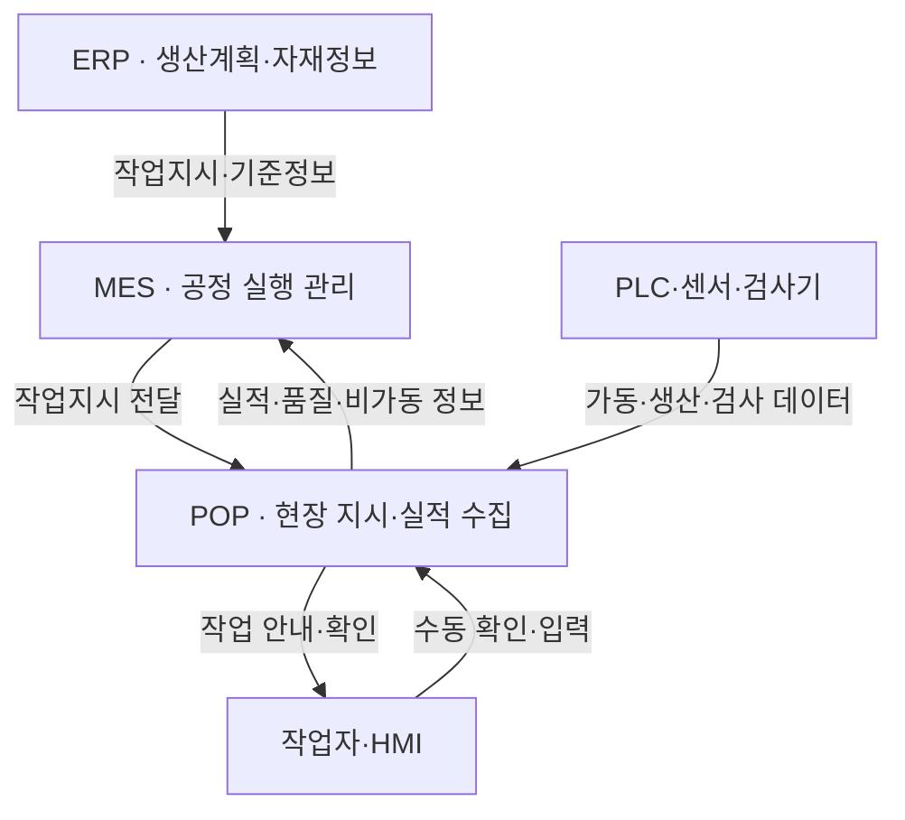

## 지식 로드맵 내 현재 위치

지식 위치: IT 전략·관리 → 제조 정보화·스마트팩토리 → **POP**

## 30초 인출

- 본질: **POP(Point of Production)**는 생산 현장에서 작업지시를 확인하고 작업·설비·품질 실적을 수집하는 생산정보 접점이다.
- 메커니즘: 상위 생산지시 → 현장 작업·설비·자재 정보 확인 → 실적·품질 데이터 수집·검증 → **MES**에 환류.
- 핵심: 현장 데이터에 작업·설비·자재·시점 식별자를 연결하고, 누락·중복·통신장애를 관리한다.

핵심 용어

- **POP** (Point of Production): 생산 현장의 작업지시 확인·실적 수집을 지원하는 생산정보 접점
- **MES** (Manufacturing Execution System): 제조 운영의 작업·공정·품질·추적 정보를 관리하는 시스템
- **ERP** (Enterprise Resource Planning): 기업의 생산계획·자재·원가 등 자원을 관리하는 시스템
- **PLC** (Programmable Logic Controller): 설비의 제어 로직을 실행하고 입출력 신호를 처리하는 제어기
- **HMI** (Human-Machine Interface): 작업자와 설비·제어시스템 사이의 표시·조작 인터페이스
- **OPC UA**: 산업 시스템 간 보안·상호운용 데이터 교환을 위한 플랫폼 독립형 통신 아키텍처·규격군
- **Store-and-Forward**: 통신이 끊긴 동안 현장 데이터를 저장하고 연결 복구 뒤 전달하는 방식
- **ISA-95**: 기업 시스템과 제조 운영·제어 시스템 사이의 통합 모델과 정보교환을 다루는 표준군

---

## 1교시 예상문제 (10점)

> POP의 역할과 현장 데이터의 수집·상위 시스템 전달 흐름을 설명하시오. (예상·10점)

---

## 1교시 10점 답안

### Ⅰ. 개요

| 구분 | 핵심 |
|---|---|
| 정의 | **POP**는 생산 현장에서 작업지시를 확인하고 작업·설비·품질 실적을 수집해 상위 생산 시스템에 제공하는 생산정보 접점이다. |
| 목적 | 생산 진행·품질·추적에 필요한 현장 정보를 정확하고 적시에 전달한다. |

### Ⅱ. 현장 데이터 흐름

### Ⅲ. 수집 통제

- 작업·설비·자재·로트·시점을 구분해 생산 이벤트의 출처를 추적한다.
- 입력 형식·필수값·중복을 확인하고, 통신 단절 때 현장 저장·재전송 절차를 둔다.
- **MES**와 교환하는 작업·실적 데이터의 의미와 책임 주체를 합의한다.

제언: 현장 실적과 품질 데이터에 작업·설비·시점 식별자를 함께 기록한다.

---

## 2~4교시 예상문제 (25점)

> POP의 개념과 구성요소·데이터 흐름을 설명하고, MES·ERP와의 역할 차이 및 구축 고려사항을 제시하시오. (예상·25점)

---

## 2~4교시 25점 답안

## Ⅰ. POP의 개요

| 구분 | 핵심 |
|---|---|
| 정의 | **POP**는 생산 현장에서 작업지시를 확인하고 작업·설비·품질 실적을 수집해 상위 생산 시스템에 제공하는 생산정보 접점이다. |
| 목적 | 생산 진행·품질·추적에 필요한 현장 정보를 정확하고 적시에 전달한다. |

POP라는 명칭의 기능 범위는 제품·조직에 따라 다를 수 있다. 실제 구축에서는 현장 단말, 설비 연계, 상위 제조실행시스템 사이의 데이터 책임과 인터페이스를 정의한다.

## Ⅱ. 현장 데이터 흐름

이는 대표적인 정보 흐름 예시다. 모든 공장에서 ERP·MES·POP가 분리된 제품이거나 같은 연결 구조를 쓰는 것은 아니다.

## Ⅲ. POP·MES·ERP 역할 비교

| 관점 | POP | MES | ERP |
|---|---|---|---|
| 중심 역할 | 현장 지시 확인과 데이터 취득 | 제조 운영·공정 실행 관리 | 기업 자원·생산계획 관리 |
| 주요 정보 | 설비 상태·수량·검사·작업 확인 | 작업 진행·공정 이력·품질·추적 | 계획·자재·구매·재고·원가 |
| 정보 흐름 | 현장 정보를 MES 등 상위 시스템에 전달 | 현장 실행정보와 계획정보를 연계 | 생산·자재 계획을 제조 운영에 제공 |
| 범위 차이 | 현장 단말·연계 기능을 가리키기도 함 | 공장 운영기능의 범위는 구현에 따라 다름 | 기업 경영자원 범위 |

## Ⅳ. 구성요소와 인터페이스

| 구성요소 | 역할 | 설계 확인사항 |
|---|---|---|
| 현장 입력·표시 | 작업자에게 지시를 표시하고 확인·실적 입력 지원 | 작업 동선·오입력 방지·예외처리 |
| 제어기·센서·검사기 | 설비 상태·생산량·검사 데이터를 제공 | 신호 정의·시간 동기화·측정 품질 |
| POP 응용·엣지 연계 | 데이터 수집·검증·현장 임시 저장 | 중복·누락·재전송·접근 권한 |
| 상위 연계 | MES·ERP 등과 기준정보·실적 교환 | 데이터 의미·단위·식별자·오류 처리 |
| 표준 인터페이스 | **OPC UA** 등 산업 데이터 교환 적용 검토 | 지원 정보모델·보안 설정·운영 책임 |

**ISA-95**는 기업 기능과 제조 운영·제어 기능 사이의 모델·용어·정보 교환을 설명하는 참고 표준이다. POP를 반드시 특정 ISA-95 계층에 대응시키기보다 실제 책임과 기능으로 경계를 정의한다.

## Ⅴ. 구축 위험과 대응

| 위험 | 대응 | 확인 근거 |
|---|---|---|
| 수기 입력 오류·누락 | 가능한 데이터는 자동 취득하고 입력값·필수 항목 검증 | 대조 결과·정정 기록 |
| 설비·공급사별 인터페이스 차이 | 표준 데이터 모델·어댑터와 설비별 매핑 정의 | 인터페이스 명세·시험 결과 |
| 통신 단절 중 실적 유실·중복 | **Store-and-Forward**와 재전송 식별키 적용 | 단절·복구·중복 시험 |
| 시간·품질 기준 불일치 | 시각 동기화, 측정 단위·품질상태 검증 | 시간 오차·교정 기록 |
| 현장 사용성 부족 | 실제 작업 흐름을 반영하고 작업자 검증을 포함 | 사용성 시험·현장 의견 |

## Ⅵ. 기술사적 제언 — 생산 이벤트 식별 기준 선행

| 문제 | 해결 방안 |
|---|---|
| 서로 다른 설비·작업자가 보내는 생산 실적에 공통 식별자가 없으면 작업·로트·검사 결과를 함께 추적하기 어렵다. | POP 연계 전에 작업지시·공정·설비·작업자·자재/로트·시각의 식별 규칙과 필수 데이터 항목을 정의하고, MES 반영 전 추적성 시험을 인수 기준으로 둔다. |

## 출제 이력과 검증 출처

- 정보관리기술사 제124회·제128회 기출 (POP)
- [ISA-95 Series: Enterprise-Control System Integration](https://www.isa.org/standards-and-publications/isa-standards/isa-95-standard)
- [OPC Foundation: OPC UA specifications](https://reference.opcfoundation.org/specs/OPC-10000-1/4)

## 연결 토픽

- 이전 토픽: [NIST AI RMF](./036_nist_ai_rmf.md)
- 연관 토픽: [IT 아웃소싱](./033_it_outsourcing.md)
- 다음 토픽: [공공 SW 사업 발주·계약](./039_public_sw_contract.md)
