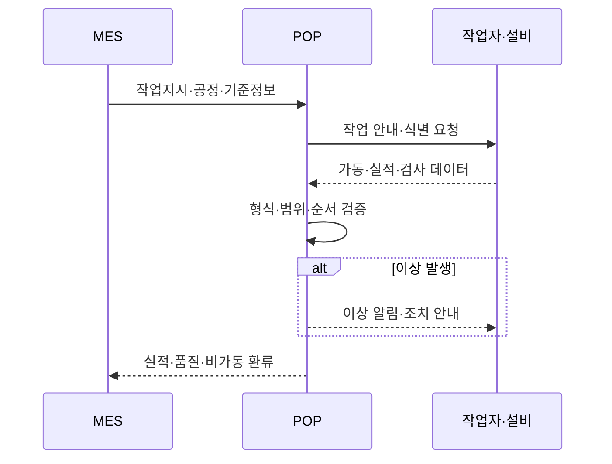
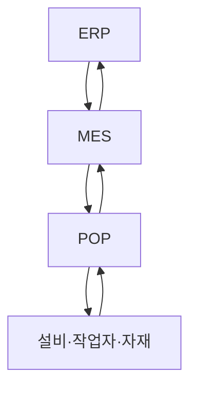
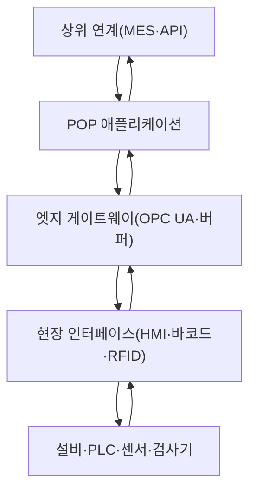
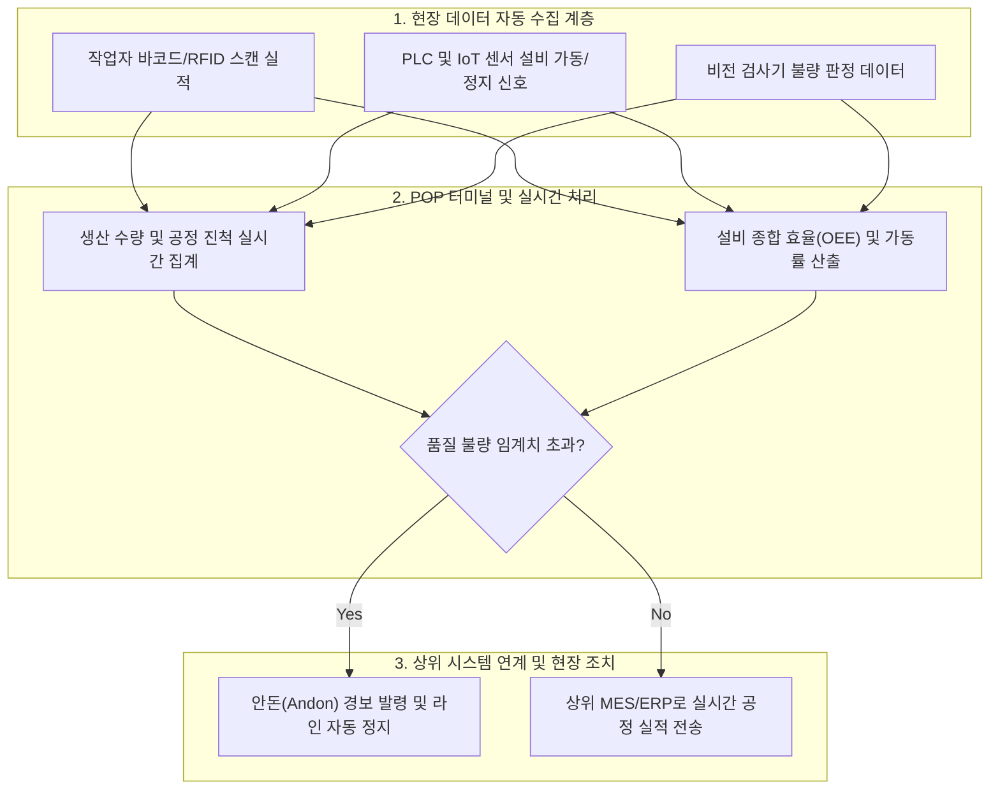

## 지식 로드맵 내 현재 위치

지식 위치: IT 전략·관리 → 제조 정보화·스마트팩토리 → **POP**

## 30초 인출

- 본질: **POP(** Point of Production **)** 는 생산 현장에서 작업지시를 제공하고 설비·작업·품질 실적을 수집하여 상위 생산관리 시스템에 환류하는 체계다.
- 메커니즘: 작업지시 수신 → 작업자·자재·설비 식별 → 실적·상태·검사 수집 → 이상 알림 → **MES** 환류로 이어진다.
- 결과: 자동수집·입력검증·표준연계·장애 버퍼링으로 현장 실적의 정확성, 추적성, 연속성을 확보한다.

핵심 용어

- **POP(Point of Production)** : 생산시점에서 지시를 전달하고 실적·상태·품질 데이터를 수집하는 현장 실행 체계이다.
- **MES(Manufacturing Execution System)** : 작업지시, 공정진행, 자원·품질·실적을 관리하는 생산실행 시스템이다.
- **PLC(Programmable Logic Controller)** : 설비 신호와 제어 로직을 처리하는 산업용 제어장치이다.
- **OPC UA** : 산업설비와 소프트웨어 간 상호운용성과 보안 통신을 지원하는 표준 아키텍처이다.
- **HMI(Human-Machine Interface)** : 작업자와 설비·시스템 간 정보를 주고받는 현장 표시·조작 장치이다.
- **RFID(Radio Frequency Identification)** : 전파로 태그 정보를 읽어 자재·자산을 식별하는 기술이다.
- **Store-and-Forward** : 통신 장애 시 데이터를 로컬에 보관하고 연결 복구 후 순서와 무결성을 확인해 전송하는 방식이다.

## 예상문제

> POP 시스템의 개념, 구성요소와 데이터 처리 절차를 설명하고 MES·ERP와의 차이 및 구축 시 고려사항을 제시하시오.

## Ⅰ. POP의 개념과 역할의 개요

- 정의: **POP(Point of Production)** 는 현장에 작업지시를 전달하고 작업·설비·품질 실적을 수집해 **MES** 에 제공하는 생산 실행 접점이다.
- 목적: **PLC·HMI·RFID** 등에서 수집한 실적을 검증·버퍼링해 생산 진척·품질·추적성 판단에 필요한 신뢰성 있는 데이터를 적시에 제공한다.

## Ⅱ. 데이터 수집·처리 절차

| 단계 | 주요 활동 | 산출 데이터 |
|---|---|---|
| 지시 수신 | 작업·공정·BOM·검사기준 동기화 | 작업지시, 기준정보 |
| 현장 식별 | 작업자·설비·자재·로트 확인 | 식별자, 시작시각 |
| 자동·수동 수집 | 생산량, 설비상태, 검사결과 취득 | 실적, 상태, 품질 |
| 검증·이상 처리 | 누락·중복·범위 검사, 알림 | 오류·정정·이상 기록 |
| 상위 환류 | MES에 완료·불량·비가동 전송 | 진척, 이력, 추적정보 |

## Ⅲ. POP·MES·ERP 비교

| 구분 | POP | MES | ERP |
|---|---|---|---|
| 관리 범위 | 설비·작업장 현장 | 공장 생산실행 | 기업 자원·경영관리 |
| 시간 관점 | 시점·이벤트 중심 | 작업·공정 진행 중심 | 계획·회계 기간 중심 |
| 핵심 기능 | 지시 표시, 실적·상태 수집 | 배정, 진척, 품질, 추적 | 수요·구매·재고·원가·회계 |
| 주 데이터 | 센서값, 수량, 정지, 검사 | 작업지시, WIP, 생산이력 | 생산계획, 자재, 원가 |
| 관계 | 현장 사실을 MES에 제공 | 현장과 경영계획 연결 | 계획·자원을 MES에 제공 |

## Ⅳ. POP 구성체계

## Ⅴ. 문제점 및 대응책

| 문제점 | 영향 | 대응책 |
|---|---|---|
| 수기 입력 누락·오류 | 실적·원가·추적성 왜곡 | 설비·스캐너 자동수집, 필수값·범위 검증 |
| 이기종·노후 설비 | 인터페이스 복잡도 증가 | 표준 데이터모델, OPC UA 게이트웨이, 어댑터 분리 |
| 통신 단절 | 실적 유실·중복 전송 | 로컬 버퍼, Store-and-Forward, 멱등키·재전송 검증 |
| 센서·시간 품질 불량 | 잘못된 상태·순서 판단 | 교정, 타임스탬프 동기화, 품질 플래그·원천 추적 |
| 현장 사용성 부족 | 우회 입력·도입 저항 | 작업 동선 기반 UI, 예외 절차, 작업자 교육·피드백 |

## Ⅵ. 결론

POP의 성패는 단말 배치가 아니라 생산 이벤트의 식별·검증·환류 품질에 달려 있다. 현장 자동수집과 표준 인터페이스를 우선하고, 장애 시 데이터 보존과 복구 후 중복 방지까지 설계해야 MES·ERP 의사결정이 신뢰할 수 있다.

### 실전 답안용 기술사적 제언

- 문제: 제조 현장의 수작업 일지 작성으로 인한 생산 실적 집계 지연 및 실시간 설비 이상/불량 발생 시 즉각적인 원인 추적과 조치가 불가능함.
- 해결 방안: 바코드, RFID, PLC 센서 기반 실시간 현장 데이터 자동 수집 POP 시스템을 구축하고, 상위 MES 및 ERP와 직결하여 실시간 가동률·재고 가시성을 확보하며 이상 시 안돈(Andon) 라인 정지 체계를 가동함.

## 1교시 10점 답안 발췌

### 1. 정의·목적

- 정의: **POP(Point of Production)** 는 현장에 작업지시를 전달하고 작업·설비·품질 실적을 수집해 **MES** 에 제공하는 생산 실행 접점이다.
- 목적: **PLC·HMI·RFID** 등에서 수집한 실적을 검증·버퍼링해 생산 진척·품질·추적성 판단에 필요한 신뢰성 있는 데이터를 적시에 제공한다.

### 2. 핵심 구조 및 체계

- 정의: 작업 현장의 PLC·센서·단말 등으로부터 생산·설비·품질 실적 데이터를 실시간 수집·검증하여 MES로 환류하는 생산 시점 정보화 체계
- 핵심 메커니즘: 상위 ERP/MES 작업지시 수신 → 현장 설비/자재 식별 및 자동 계측 → 실시간 무결성 검증 및 로컬 버퍼링(Store-and-Forward) → MES 실적 환류

## 출제 이력과 검증 출처

- 정보관리기술사 제124회, 제128회 기출 (POP)
- [ISA, ISA-95 Enterprise-Control System Integration](https://www.isa.org/standards-and-publications/isa-standards/isa-95-standard)
- [OPC Foundation, OPC UA](https://opcfoundation.org/about/opc-technologies/opc-ua/)

## 학습 체크

- [ ] POP의 정의와 MES로 환류하는 데이터를 설명할 수 있는가?
- [ ] 작업지시부터 실적 환류까지 활동과 산출물을 연결할 수 있는가?
- [ ] POP·MES·ERP를 관리범위와 데이터로 비교할 수 있는가?
- [ ] 입력 오류·이기종 설비·통신 단절의 통제를 제시할 수 있는가?

## 연결 토픽

- 이전 토픽: [NIST AI RMF](./036_nist_ai_rmf.md)
- 연관 토픽: [IT 아웃소싱](./033_it_outsourcing.md)
- 다음 토픽: [공공 SW 사업 발주·계약](./039_public_sw_contract.md)
