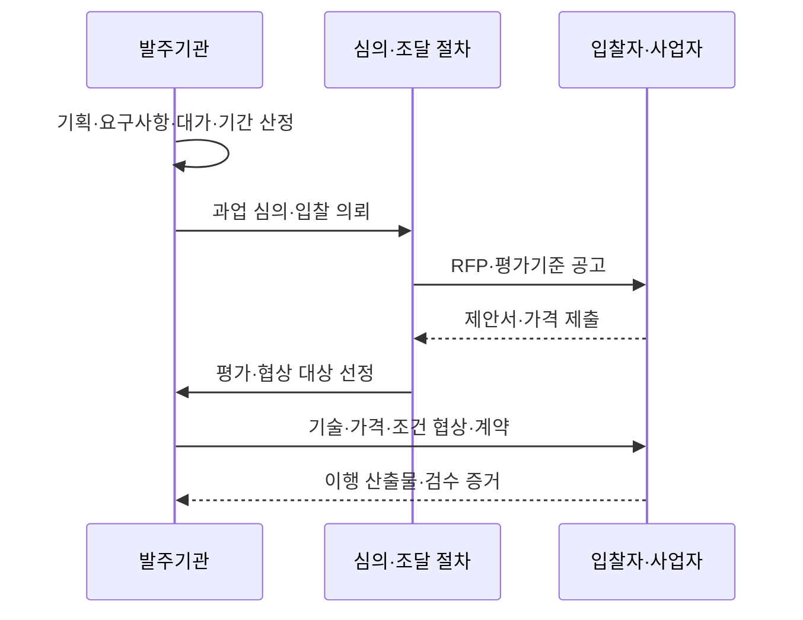
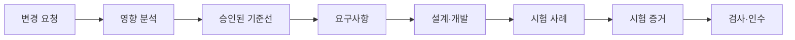
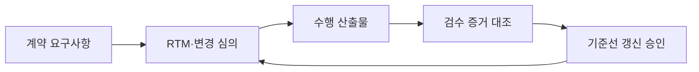

## 학습 로드맵

IT 전략·관리 → 공공 정보화·조달관리 → **공공 SW 사업 발주·계약**

## 30초 인출

- 본질: 공공 SW 사업 발주·계약은 목적·요구사항·대가·기간·책임·검수기준을 명확히 하고 적법한 절차로 사업자를 선정해 이행 기준선을 확정하는 활동이다.
- 메커니즘: 사업기획·규모산정 → 요구사항·RFP → 과업 심의·공고 → 제안평가·협상 → 계약 → 변경통제·검수로 이어진다.
- 결과: RFP와 평가기록, 협상결과, 계약 기준선, 과업변경 기록, RTM 기반 검수 증거를 남긴다.

## 핵심 용어

핵심 용어

- **RFP(Request for Proposal)**: 사업 목적, 범위, 요구사항, 제안·평가기준, 계약조건을 제시하는 제안요청서. 이는 해당 용어의 역할과 작동을 설명한다.
- **기능점수(Function Point)**: 사용자 관점의 기능 규모를 측정해 비용·기간 산정에 활용하는 방식. 이는 해당 용어의 역할과 작동을 설명한다.
- **과업내용**: 계약상 수행해야 할 기능·업무·산출물·조건의 범위. 이는 해당 용어의 역할과 작동을 설명한다.
- **협상에 의한 계약**: 제안서 평가 후 우선협상대상자와 기술·가격·계약조건을 협상하는 방식. 이는 해당 용어의 역할과 작동을 설명한다.
- **RTM(Requirements Traceability Matrix)**: 요구사항을 설계·구현·시험·인수 증거와 연결하는 추적표. 이는 해당 용어의 역할과 작동을 설명한다.
- **계약 기준선(Baseline)**: 범위·일정·비용·품질·인수조건의 승인된 기준. 이는 해당 용어의 역할과 작동을 설명한다.

## 예상 문제

> 공공 SW 사업의 발주·계약 절차와 핵심 통제 제도를 설명하고, 과업변경 및 검수의 문제점과 대응방안을 제시하시오.

## Ⅰ. 공공 SW 사업 발주·계약의 개념

- 정의: **공공 SW 발주·계약**은 사업 목적·요구사항·대가·기간·책임·검수기준을 **RFP**와 계약 기준선으로 확정하고 적법한 경쟁·평가 절차로 사업자를 선정하는 과정이다.
- 목적: **기능점수**, **협상에 의한 계약**, **RTM**을 활용해 예산과 과업의 추적성을 확보하고 변경·검수 분쟁을 줄인다.

## Ⅱ. 발주·계약 절차와 산출물

| 단계 | 핵심 활동 | 대표 산출물 |
|---|---|---|
| 사업기획 | 목적·범위·예산·기간·조달방식 결정 | 사업계획, 규모·대가 산정근거 |
| 발주준비 | 기능·비기능·보안·운영 요구 구체화 | RFP, 요구사항명세, 평가기준 |
| 심의·공고 | 과업 적정성 검토, 입찰조건 공개 | 심의결과, 입찰공고 |
| 평가·협상 | 제안 비교, 우선순위 선정, 조건 구체화 | 평가기록, 협상결과 |
| 계약 | 범위·일정·대가·책임·변경·검수 확정 | 계약서, 산출물 목록, 기준선 |
| 이행·검수 | 변경 영향 심의, 시험·인수 증거 확인 | 변경기록, RTM, 검수결과 |

## Ⅲ. 핵심 통제

| 통제 영역 | 통제 내용 | 목적 |
|---|---|---|
| 요구사항 명확화 | 기능·성능·보안·데이터·운영·인수조건 식별 | 누락·해석 차이 축소 |
| 적정 대가·기간 | 사업 특성과 규모에 맞는 산정근거 기록 | 실행가능성·공정성 확보 |
| 평가 공정성 | 사전 공개 기준, 이해충돌 관리, 평가근거 보존 | 사업자 선정의 객관성 확보 |
| 과업변경 | 요청·원인·영향·승인·대가·기간을 연계 | 무상·구두 변경 방지 |
| 검사·인수 | 요구사항별 시험방법·합격기준·증거 연결 | 결과물의 계약 충족 확인 |

## Ⅳ. 일괄발주와 단계별 발주

| 구분 | 일괄발주 | 단계별 발주 |
|---|---|---|
| 방식 | 분석·설계·구축 등을 하나의 계약 범위로 구성 | 기획·분석·설계와 구축 등을 구분해 발주 |
| 적합 상황 | 범위와 기술이 비교적 명확하고 통합책임이 중요한 경우 | 불확실성이 크고 선행 결과로 후속 범위를 구체화해야 하는 경우 |
| 장점 | 책임창구 단일화, 연계조정 단순화 | 단계별 검증, 후속 대가·범위의 구체화 |
| 위험 | 초기 요구 오류가 후반까지 전파 | 단계 간 인수·책임·연계 단절 |
| 통제 | 상세 요구·변경·인수 기준 강화 | 단계별 산출물 품질·인터페이스·지식이전 강화 |

## Ⅴ. 문제점 및 대응책

| 문제점 | 영향 | 대응책 |
|---|---|---|
| 모호한 RFP | 제안 비교 곤란·분쟁 | 요구사항 ID, 우선순위, 수용기준, 추적표 명시 |
| 과소 산정 | 일정·품질·인력 압박 | 규모·복잡도·비기능 요구를 포함한 산정근거 검토 |
| 가격 중심 선정 | 기술·운영 적합성 저하 | 사업 특성에 맞는 기술평가와 검증 가능한 근거 요구 |
| 구두·무상 과업변경 | 비용 전가·기준선 붕괴 | 공식 변경요청, 영향분석, 심의·승인 후 대가·기간 조정 |
| 형식적 검수 | 결함·운영부담 이관 | RTM 기반 시험, 데이터 이관·보안·운영준비 증거 확인 |

## Ⅵ. 결론

공공 SW 사업의 성공은 입찰 완료보다 계약 기준선의 품질에 좌우된다. 요구사항과 평가·협상·변경·검수 증거를 한 추적선으로 연결하고, 변경 시 범위뿐 아니라 대가·기간·품질 영향을 함께 조정해야 공정성과 실행가능성을 확보할 수 있다.

## 10점 답안 압축본

### 공공 SW 발주·계약 절차

공공 SW 발주·계약은 사업 목적과 요구사항, 대가·기간·책임·검수기준을 정하고 적법한 절차로 사업자를 선정해 이행 기준선을 확정하는 활동이다. 요구사항 추적성, 객관적 평가, 공식 과업변경, 증거 기반 검수가 핵심 통제다.

## 참고문헌

- [국가법령정보센터, 소프트웨어 진흥법](https://www.law.go.kr/법령/소프트웨어진흥법)
- [국가법령정보센터, 소프트웨어사업 계약 및 관리감독에 관한 지침](https://www.law.go.kr/행정규칙/소프트웨어사업계약및관리감독에관한지침)

### 실전 답안용 기술사적 제언

계약 기준선과 RTM을 연결해 과업변경 심의와 검수 증거가 동일 요구사항을 가리키도록 통제한다.

## 학습 점검

- 발주 준비부터 변경·검수까지 활동과 산출물을 연결할 수 있는가?
- 요구사항·대가·평가·과업변경·검수의 통제 목적을 설명할 수 있는가?
- 일괄발주와 단계별 발주의 선택기준을 비교할 수 있는가?
- 변경 요청을 영향·승인·계약 기준선에 연결할 수 있는가?

## 연결 노트

- 이전: [POP](./038_pop)
- 관련: [IT 아웃소싱](./033_it_outsourcing)
- 관련: [PMO](./004_pmo)
- 다음: [부정적 위험 대응 전략](./040_negative_risk_response_strategy)
