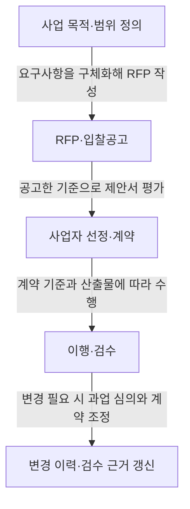
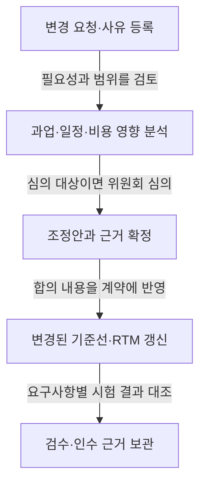

---
title: "공공 SW 사업 발주·계약"
author: "Codex"
date: "2026-09-24T12:00:00+09:00"
tags:
  - "notes-it-strategy"
sidebar:
  badge:
    text: "기초"
extra:
  keyword_grade: "기초"
  model: "GPT-6"
---

## 지식 로드맵과 현재 위치

지식 위치: IT 전략·관리 > 공공 정보화사업 > **공공 SW 사업 발주·계약**

## 30초 인출

- 본질: **공공 SW 사업 발주·계약**은 요구사항·계약 기준을 명확히 해 공정한 사업자 선정과 이행 관리를 수행하는 절차.
- 메커니즘: 요구사항 구체화 → 입찰·평가 → 계약 기준 확정 → 변경 심의와 검수 근거 관리

핵심 용어

- **공공 SW 사업 발주·계약**: 발주기관의 사업 범위·조건 설정, 사업자 선정, 계약에 따른 이행·변경·검수 관리 절차.
- **RFP(Request for Proposal)**: 사업 목적·요구사항·제안서 작성·평가 기준을 입찰자에게 알리는 제안요청서.
- **과업심의위원회**: 법령에 따른 과업 내용·과업 변경 관련 계약금액·기간 조정 등의 심의 기구.
- **RTM(Requirements Traceability Matrix)**: 요구사항과 설계·개발·시험 산출물의 연결·충족 여부를 추적하는 관리표.

---

## 1교시 예상문제 (10점)

> 공공 SW 사업 발주·계약의 목적과 발주부터 변경·검수까지의 핵심 절차를 설명하시오. (예상·10점)

---

## 1교시 10점 답안

### Ⅰ. 개요

| 구분 | 핵심 |
|---|---|
| 정의 | **공공 SW 사업 발주·계약**은 요구사항·계약 기준을 명확히 해 공정한 사업자 선정과 이행 관리를 수행하는 절차 |
| 목적 | 요구사항·평가·계약·변경 기준의 명확화를 통한 입찰 공정성·계약 이행 예측 가능성 제고 |

### Ⅱ. 발주와 계약의 흐름

### Ⅲ. 핵심 통제

| 통제 지점 | 확인 사항 |
|---|---|
| 요구사항 | 기능·성능·보안·인수 기준의 식별과 RFP 명시 |
| 선정·계약 | 공고 평가 기준에 따른 제안서 평가와 범위·기간·금액·산출물·변경 절차의 계약 반영 |
| 변경·검수 | 과업 변경 필요성·영향·계약 조정의 심의·기록, 요구사항별 시험·검수 근거 보존 |

**제언:** RFP 단계의 요구사항별 담당자·인수 기준 지정과 변경 시 영향·승인 결과의 동일 추적표 기록.

---

## 2~4교시 예상문제 (25점)

> 공공 SW 사업 발주·계약의 법적·관리 절차를 설명하고, 요구사항 정의·사업자 선정·과업 변경·검수의 주요 위험과 통제 방안을 제시하시오. (예상·25점)

---

## 2~4교시 25점 답안

## Ⅰ. 개요

| 구분 | 핵심 |
|---|---|
| 정의 | **공공 SW 사업 발주·계약**은 요구사항·계약 기준을 명확히 해 공정한 사업자 선정과 이행 관리를 수행하는 절차 |
| 목적 | 요구사항·평가·계약·변경 기준의 명확화를 통한 입찰 공정성·계약 이행 예측 가능성 제고 |

## Ⅱ. 발주와 계약의 기본 절차

소프트웨어진흥법 제44조에 따른 발주기관의 사업 범위·요구사항 명확화 및 입찰공고 시 세부 요구사항 공개. 제안요청서에 포함할 사업 목적·요구사항·평가 기준·절차·계약 조건. 협상에 의한 계약의 경우 국가계약법 시행령 제43조에 따른 제안서 평가·협상, 공공 SW 계약의 비일률적 계약 방식.

## Ⅲ. 요구사항·선정·계약 기준

| 단계 | 핵심 통제 | 남길 근거 |
|---|---|---|
| 요구 정의 | 기능·성능·보안·연계·인수 조건의 검증 가능한 표현화, 필요 시 분석·설계 별도 추진 | RFP, 요구사항 명세 |
| 사업자 선정 | 사전 평가 항목·배점·절차의 적용과 평가 결과 기록 | 평가 기준, 평가 기록, 협상 결과 |
| 계약 | 범위·산출물·기간·대가·검수 기준·변경 절차의 구체화, 사업 특성·적용 규정에 맞는 계약 방식·대가 기준 | 계약서, 산출물 목록, 기준선 |

## Ⅳ. 과업 변경과 검수 추적

소프트웨어진흥법 제50조에 따른 발주기관의 과업심의위원회 설치·과업 내용 및 변경 관련 계약금액·기간 조정 심의. 과업 변경에 따른 계약 내용 변경 요청권과 특별한 사정이 없을 때 심의 결과의 계약 반영. 변경관리에서 연결할 요청·사유·영향·심의·계약 조정·검수 결과, RTM을 통한 요구사항·산출물·시험 결과의 대응 추적.

## Ⅴ. 주요 위험과 통제

| 위험 | 영향 | 통제 |
|---|---|---|
| 모호하거나 누락된 요구사항 | 제안 비교 곤란·수행 중 해석 차이 | 요구사항 ID·우선순위·인수 기준 설정과 입찰 전 검토 |
| 불명확한 평가 기준 적용 | 선정 결과의 설명 가능성·공정성 저하 | 공고 기준·절차의 일관된 적용과 평가 근거 보존 |
| 변경 근거·영향 분석 누락 | 범위·기간·대가 이견과 검수 추적 단절 | 변경 사유·영향·심의·승인·계약 조정 내역 기록 |
| 산출물·인수 조건 불일치 | 미완료 기능·품질 결함의 누락 가능성 | 요구사항별 시험·검수 기준·결과의 RTM 연결 |

## Ⅵ. 기술적 제언

| 문제 | 해결 방안 |
|---|---|
| 발주 준비 완료 시 요구사항별 책임자·검수 기준의 완결성 일괄 판단 어려움 | 입찰공고 전 요구사항 추적표의 필수 항목(요구 ID·책임자·우선순위·인수 기준) 확인 관문과 미충족 항목의 공고 전 보완 |

## 출제 이력과 검증 출처

- 정보관리기술사 제121회·제122회 기출 주제: 공공 SW 사업 발주·계약
- [소프트웨어진흥법 제44조](https://www.law.go.kr/lsLinkCommonInfo.do?lsJoLnkSeq=1027884491), [제50조](https://www.law.go.kr/lsLinkCommonInfo.do?lsJoLnkSeq=1031614471)
- [국가계약법 시행령 제43조](https://www.law.go.kr/lsLinkCommonInfo.do?lsJoLnkSeq=1031494261)
- [SW사업 계약 및 관리감독에 관한 지침](https://www.law.go.kr/LSW/admRulLsInfoP.do?admRulId=33440&efYd=0)

## 연결 노트

- 이전 노트: [POP](./038_pop.md)
- 관련 노트: [IT 아웃소싱](./033_it_outsourcing.md), [PMO](./004_pmo.md)
- 다음 노트: [부정적 위험 대응 전략](./040_negative_risk_response_strategy.md)
