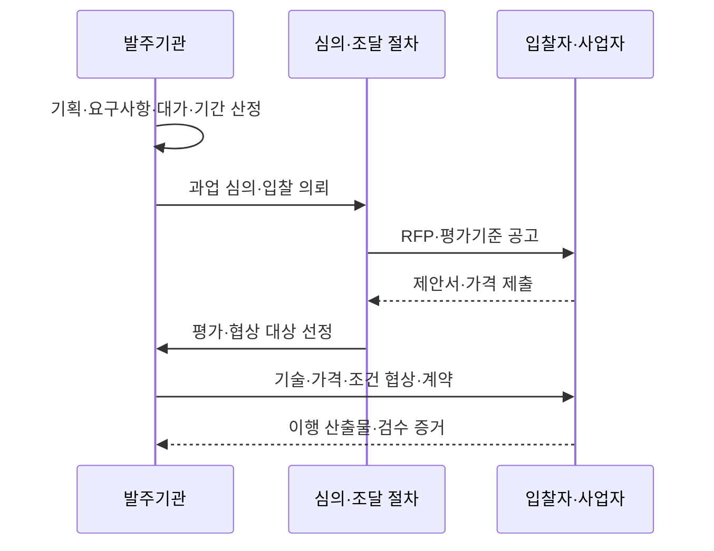
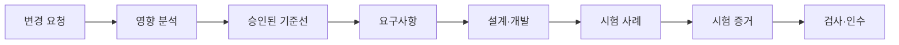
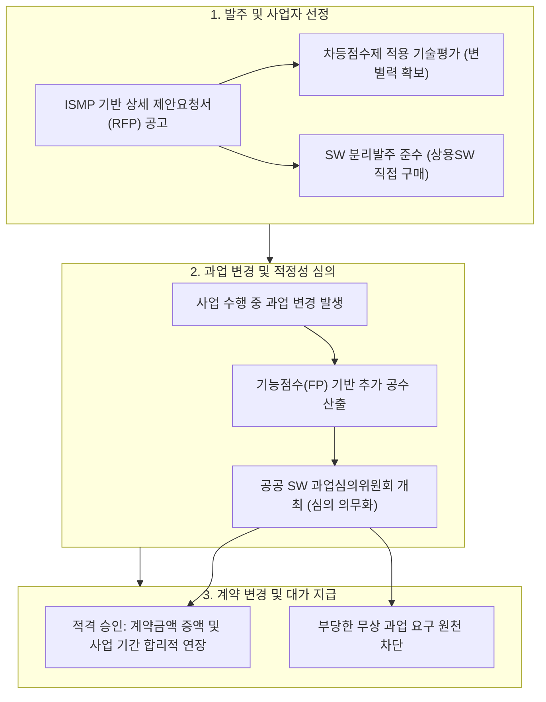

## 지식 로드맵 내 현재 위치

지식 위치: IT 전략·관리 → 공공 정보화·조달관리 → **공공 SW 사업 발주·계약**

## 30초 인출

- 본질: 공공 SW 사업 발주·계약은 목적·요구사항·대가·기간·책임·검수기준을 명확히 하고 적법한 절차로 사업자를 선정해 이행 기준선을 확정하는 활동이다.
- 메커니즘: 사업기획·규모산정 → 요구사항· **RFP** → 과업 심의·공고 → 제안평가·협상 → 계약 → 변경통제·검수로 이어진다.
- 결과: **RFP** 와 평가기록, 협상결과, **계약 기준선** , 과업변경 기록, **RTM** 기반 검수 증거를 남긴다.

핵심 용어

- **RFP(Request for Proposal)** : 사업 목적, 요구사항 명세, 제안 안내 및 평가 기준을 명시하여 입찰자에게 배포하는 제안요청서
- **기능점수(Function Point)** : 사용자 관점에서 소프트웨어 기능 규모를 정량 측정하여 사업 대가와 공기를 산정하는 표준 기법
- **과업내용** : 공공 발주 사업에서 계약 상대자가 이행해야 할 기능·비기능 요구사항과 인도물 및 납품 조건
- **협상에 의한 계약** : 다수 입찰자로부터 제안서를 제출받아 기술과 가격을 종합 평가한 후 우선협상대상자와 과업·가격을 협상하여 체결하는 계약 방식
- **RTM(Requirements Traceability Matrix)** : 제안요청서 요구사항과 설계·개발·테스트·검수 산출물 간의 정합성을 보증하는 요구사항 추적표
- **계약 기준선(Baseline)** : 계약 체결 시 확정 승인된 과업 범위·일정·계약 금액·검수 조건 등 공식 변경 관리 기준선

## 예상문제

> 공공 SW 사업의 발주·계약 절차와 핵심 통제 제도를 설명하고, 과업변경 및 검수의 문제점과 대응방안을 제시하시오.

## Ⅰ. 공공 SW 사업 발주·계약의 개념의 개요

- 정의: **공공 SW 발주·계약** 은 사업 목적·요구사항·대가·기간·책임·검수기준을 **RFP** 와 계약 기준선으로 확정하고 적법한 경쟁·평가 절차로 사업자를 선정하는 과정이다.
- 목적: **기능점수** , **협상에 의한 계약** , **RTM** 을 활용해 예산과 과업의 추적성을 확보하고 변경·검수 분쟁을 줄인다.

## Ⅱ. 발주·계약 절차와 산출물

| 단계 | 핵심 활동 | 대표 산출물 |
|---|---|---|
| 사업기획 | 목적·범위·예산·기간·조달방식 결정 | 사업계획, 규모·대가 산정근거 |
| 발주준비 | 기능·비기능·보안·운영 요구 구체화 | RFP, 요구사항명세, 평가기준 |
| 심의·공고 | 과업 적정성 검토, 입찰조건 공개 | 심의결과, 입찰공고 |
| 평가·협상 | 제안 비교, 우선순위 선정, 조건 구체화 | 평가기록, 협상결과 |
| 계약 | 범위·일정·대가·책임·변경·검수 확정 | 계약서, 산출물 목록, 기준선 |
| 이행·검수 | 변경 영향 심의, 시험·인수 증거 확인 | 변경기록, RTM, 검수결과 |

## Ⅲ. 핵심 통제

| 통제 영역 | 통제 내용 | 목적 |
|---|---|---|
| 요구사항 명확화 | 기능·성능·보안·데이터·운영·인수조건 식별 | 누락·해석 차이 축소 |
| 적정 대가·기간 | 사업 특성과 규모에 맞는 산정근거 기록 | 실행가능성·공정성 확보 |
| 평가 공정성 | 사전 공개 기준, 이해충돌 관리, 평가근거 보존 | 사업자 선정의 객관성 확보 |
| 과업변경 | 요청·원인·영향·승인·대가·기간을 연계 | 무상·구두 변경 방지 |
| 검사·인수 | 요구사항별 시험방법·합격기준·증거 연결 | 결과물의 계약 충족 확인 |

## Ⅳ. 일괄발주와 단계별 발주

| 구분 | 일괄발주 | 단계별 발주 |
|---|---|---|
| 방식 | 분석·설계·구축 등을 하나의 계약 범위로 구성 | 기획·분석·설계와 구축 등을 구분해 발주 |
| 적합 상황 | 범위와 기술이 비교적 명확하고 통합책임이 중요한 경우 | 불확실성이 크고 선행 결과로 후속 범위를 구체화해야 하는 경우 |
| 장점 | 책임창구 단일화, 연계조정 단순화 | 단계별 검증, 후속 대가·범위의 구체화 |
| 위험 | 초기 요구 오류가 후반까지 전파 | 단계 간 인수·책임·연계 단절 |
| 통제 | 상세 요구·변경·인수 기준 강화 | 단계별 산출물 품질·인터페이스·지식이전 강화 |

## Ⅴ. 문제점 및 대응책

| 문제점 | 영향 | 대응책 |
|---|---|---|
| 모호한 RFP | 제안 비교 곤란·분쟁 | 요구사항 ID, 우선순위, 수용기준, 추적표 명시 |
| 과소 산정 | 일정·품질·인력 압박 | 규모·복잡도·비기능 요구를 포함한 산정근거 검토 |
| 가격 중심 선정 | 기술·운영 적합성 저하 | 사업 특성에 맞는 기술평가와 검증 가능한 근거 요구 |
| 구두·무상 과업변경 | 비용 전가·기준선 붕괴 | 공식 변경요청, 영향분석, 심의·승인 후 대가·기간 조정 |
| 형식적 검수 | 결함·운영부담 이관 | RTM 기반 시험, 데이터 이관·보안·운영준비 증거 확인 |

## Ⅵ. 결론

공공 SW 사업의 성공은 입찰 완료보다 계약 기준선의 품질에 좌우된다. 요구사항과 평가·협상·변경·검수 증거를 한 추적선으로 연결하고, 변경 시 범위뿐 아니라 대가·기간·품질 영향을 함께 조정해야 공정성과 실행가능성을 확보할 수 있다.

### 실전 답안용 기술사적 제언

- 문제: 공공 SW 사업의 제안서 기술 평가 변별력 부족으로 인한 저가 수주와 구축 중 무상 과업 변경 강요로 사업 부실화 및 수주사 적자가 발생함.
- 해결 방안: 차등점수제 도입을 통해 기술 우수 기업을 우대하고, ISMP 기반 사전 요구사항 상세화 및 분할발주를 준수하며, 과업 변경 시 공공 SW 과업심의위원회를 통한 정당한 계약금액 및 기간 조정을 제도화함.

## 1교시 10점 답안 발췌

### 1. 정의·목적

- 정의: **공공 SW 발주·계약** 은 사업 목적·요구사항·대가·기간·책임·검수기준을 **RFP** 와 계약 기준선으로 확정하고 적법한 경쟁·평가 절차로 사업자를 선정하는 과정이다.
- 목적: **기능점수** , **협상에 의한 계약** , **RTM** 을 활용해 예산과 과업의 추적성을 확보하고 변경·검수 분쟁을 줄인다.

### 2. 핵심 구조 및 체계

- 정의: 공공 SW 사업의 목적·과업범위·적정대가·인수기준을 명확히 정의하고, 공정경쟁 절차를 거쳐 사업자를 선정·계약하여 이행 기준선을 확정하는 제도적 관리 체계
- 핵심 메커니즘: 과업심의 및 상세 요구사항 정의(RFP) → 기술·가격 종합평가 및 우선협상 → 계약 체결 및 기준선(Baseline) 확정 → 과업심의위 변경통제 및 RTM 기반 단계별 검수

## 출제 이력과 검증 출처

- 정보관리기술사 제121회, 제122회 기출 (공공 SW 사업 발주·계약)
- [국가법령정보센터, 소프트웨어 진흥법](https://www.law.go.kr/법령/소프트웨어진흥법)
- [국가법령정보센터, 소프트웨어사업 계약 및 관리감독에 관한 지침](https://www.law.go.kr/행정규칙/소프트웨어사업계약및관리감독에관한지침)

## 학습 체크

- [ ] 발주 준비부터 변경·검수까지 활동과 산출물을 연결할 수 있는가?
- [ ] 요구사항·대가·평가·과업변경·검수의 통제 목적을 설명할 수 있는가?
- [ ] 일괄발주와 단계별 발주의 선택기준을 비교할 수 있는가?
- [ ] 변경 요청을 영향·승인·계약 기준선에 연결할 수 있는가?

## 연결 토픽

- 이전 토픽: [POP](./038_pop.md)
- 연관 토픽: [IT 아웃소싱](./033_it_outsourcing.md), [PMO](./004_pmo.md)
- 다음 토픽: [부정적 위험 대응 전략](./040_negative_risk_response_strategy.md)
