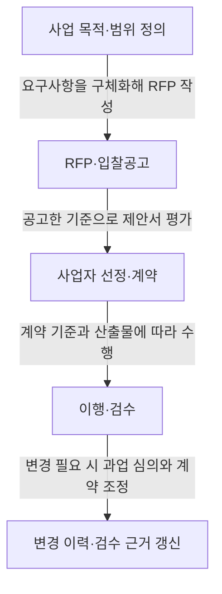
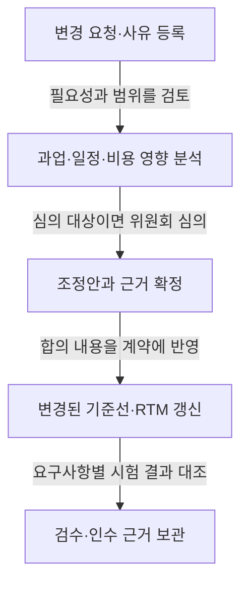

---
title: "공공 SW 사업 발주·계약"
author: "Codex"
date: "2026-09-24T12:00:00+09:00"
tags:
  - "notes-it-strategy"
sidebar:
  badge:
    text: "A"
extra:
  keyword_grade: "A"
  model: "GPT-6"
---

## 지식 로드맵과 현재 위치

지식 위치: IT 전략·관리 > 공공 정보화사업 > **공공 SW 사업 발주·계약**

## 30초 인출

- 본질: **공공 SW 사업 발주·계약**은 요구사항과 계약 기준을 명확히 정해 공정하게 사업자를 선정하고 이행을 관리하는 과정이다.
- 메커니즘: 요구사항 구체화 → 입찰·평가 → 계약 기준 확정 → 변경 심의와 검수 근거 관리

핵심 용어

- **공공 SW 사업 발주·계약**: 발주기관이 사업 범위와 조건을 정해 사업자를 선정하고, 계약에 따라 이행·변경·검수를 관리하는 절차다.
- **RFP(Request for Proposal)**: 사업 목적, 요구사항, 제안서 작성·평가 기준을 입찰자에게 알리는 제안요청서다.
- **과업심의위원회**: 법령에 따라 과업 내용과 과업 변경에 따른 계약금액·기간 조정 등을 심의하는 위원회다.
- **RTM(Requirements Traceability Matrix)**: 요구사항과 설계·개발·시험 산출물 사이의 연결과 충족 여부를 추적하는 관리표다.

---

## 1교시 예상문제 (10점)

> 공공 SW 사업 발주·계약의 목적과 발주부터 변경·검수까지의 핵심 절차를 설명하시오. (예상·10점)

---

## 1교시 10점 답안

### Ⅰ. 개요

| 구분 | 핵심 |
|---|---|
| 정의 | **공공 SW 사업 발주·계약**은 요구사항과 계약 기준을 명확히 정해 공정하게 사업자를 선정하고 이행을 관리하는 과정이다. |
| 목적 | 요구사항·평가·계약·변경 기준을 분명히 해 입찰의 공정성과 계약 이행의 예측 가능성을 높인다. |

### Ⅱ. 발주와 계약의 흐름

### Ⅲ. 핵심 통제

| 통제 지점 | 확인 사항 |
|---|---|
| 요구사항 | 기능·성능·보안·인수 기준을 식별하고 RFP에 명확히 제시한다. |
| 선정·계약 | 공고된 평가 기준으로 제안서를 평가하고 범위·기간·금액·산출물·변경 절차를 계약에 담는다. |
| 변경·검수 | 과업 변경의 필요성과 영향, 계약 조정 사항을 심의·기록하고 요구사항별 시험·검수 근거를 남긴다. |

**제언:** RFP 단계에서 요구사항마다 담당자와 인수 기준을 정하고, 변경 시 영향과 승인 결과를 같은 추적표에 기록한다.

---

## 2~4교시 예상문제 (25점)

> 공공 SW 사업 발주·계약의 법적·관리 절차를 설명하고, 요구사항 정의·사업자 선정·과업 변경·검수의 주요 위험과 통제 방안을 제시하시오. (예상·25점)

---

## 2~4교시 25점 답안

## Ⅰ. 개요

| 구분 | 핵심 |
|---|---|
| 정의 | **공공 SW 사업 발주·계약**은 요구사항과 계약 기준을 명확히 정해 공정하게 사업자를 선정하고 이행을 관리하는 과정이다. |
| 목적 | 요구사항·평가·계약·변경 기준을 분명히 해 입찰의 공정성과 계약 이행의 예측 가능성을 높인다. |

## Ⅱ. 발주와 계약의 기본 절차

소프트웨어진흥법 제44조는 발주기관이 사업 범위와 요구사항을 명확히 정하도록 하고, 입찰공고 때 세부 요구사항을 공개하도록 규정한다. 제안요청서에는 사업 목적, 요구사항, 평가 기준과 절차, 계약 조건을 담아 입찰자가 같은 기준으로 제안하도록 한다. 협상에 의한 계약을 택하는 경우 국가계약법 시행령 제43조에 따라 제안서 평가와 협상을 진행하며, 모든 공공 SW 계약이 이 방식인 것은 아니다.

## Ⅲ. 요구사항·선정·계약 기준

| 단계 | 핵심 통제 | 남길 근거 |
|---|---|---|
| 요구 정의 | 기능·성능·보안·연계·인수 조건을 검증 가능한 표현으로 작성하고, 필요 시 분석·설계를 별도 추진한다. | RFP, 요구사항 명세 |
| 사업자 선정 | 사전에 정한 평가 항목·배점·절차를 적용하고 평가 결과를 기록한다. | 평가 기준, 평가 기록, 협상 결과 |
| 계약 | 범위·산출물·기간·대가·검수 기준·변경 절차를 구체화한다. 계약 방식과 대가 산정 기준은 사업 특성 및 적용 규정에 맞춘다. | 계약서, 산출물 목록, 기준선 |

## Ⅳ. 과업 변경과 검수 추적

소프트웨어진흥법 제50조에 따라 발주기관은 과업 내용과 변경에 따른 계약금액·기간 조정 등을 심의하기 위해 과업심의위원회를 둔다. 계약상대자는 과업 변경에 따른 계약 내용 변경을 요청할 수 있고, 발주기관은 특별한 사정이 없으면 심의 결과를 계약에 반영한다. 변경관리에서는 요청·사유·영향·심의·계약 조정·검수 결과를 연결하고, RTM으로 요구사항과 산출물·시험 결과의 대응을 추적한다.

## Ⅴ. 주요 위험과 통제

| 위험 | 영향 | 통제 |
|---|---|---|
| 모호하거나 빠진 요구사항 | 제안 비교가 어려워지고 수행 중 해석 차이가 생긴다. | 요구사항 ID·우선순위·인수 기준을 정하고 입찰 전 검토한다. |
| 평가 기준의 불명확한 적용 | 선정 결과의 설명 가능성과 공정성이 약해진다. | 공고한 기준과 절차를 일관되게 적용하고 평가 근거를 남긴다. |
| 변경 근거·영향 분석 누락 | 범위·기간·대가에 이견이 생기고 검수 추적이 끊긴다. | 변경 사유와 영향, 심의·승인 및 계약 조정 내역을 기록한다. |
| 산출물과 인수 조건의 불일치 | 미완료 기능이나 품질 결함을 놓칠 수 있다. | 요구사항별 시험·검수 기준과 결과를 RTM에 연결한다. |

## Ⅵ. 기술적 제언

| 문제 | 해결 방안 |
|---|---|
| 발주 준비가 끝나도 요구사항별 책임자와 검수 기준의 완결성을 한눈에 판단하기 어렵다. | 입찰공고 전 요구사항 추적표의 필수 항목(요구 ID, 책임자, 우선순위, 인수 기준)을 확인하는 발주 준비 관문을 두고, 미충족 항목은 공고 전에 보완한다. |

## 출제 이력과 검증 출처

- 정보관리기술사 제121회·제122회 기출 주제: 공공 SW 사업 발주·계약
- [소프트웨어진흥법 제44조](https://www.law.go.kr/lsLinkCommonInfo.do?lsJoLnkSeq=1027884491), [제50조](https://www.law.go.kr/lsLinkCommonInfo.do?lsJoLnkSeq=1031614471)
- [국가계약법 시행령 제43조](https://www.law.go.kr/lsLinkCommonInfo.do?lsJoLnkSeq=1031494261)
- [SW사업 계약 및 관리감독에 관한 지침](https://www.law.go.kr/LSW/admRulLsInfoP.do?admRulId=33440&efYd=0)

## 연결 노트

- 이전 노트: [POP](./038_pop.md)
- 관련 노트: [IT 아웃소싱](./033_it_outsourcing.md), [PMO](./004_pmo.md)
- 다음 노트: [부정적 위험 대응 전략](./040_negative_risk_response_strategy.md)
