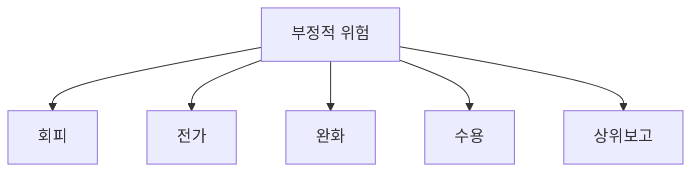
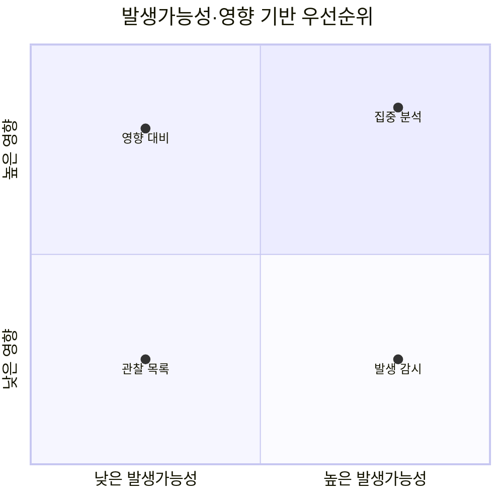
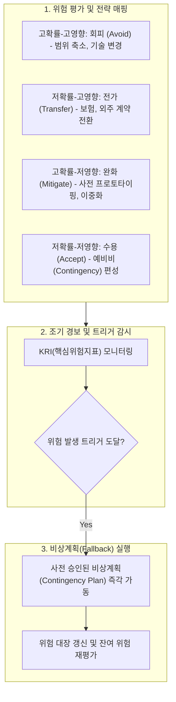

## 지식 로드맵 내 현재 위치

지식 위치: IT 전략·관리 → 프로젝트 위험관리 → **부정적 위험 대응 전략**

## 30초 인출

- 본질: 부정적 위험 대응은 프로젝트 목표에 위협이 되는 불확실성에 대해 발생가능성·영향과 조직 여건을 고려해 사전 행동을 정하는 활동이다.
- 메커니즘: 위협을 평가해 **회피·전가·완화·수용·상위보고**를 선택하고, 책임자·트리거·예비계획을 정해 실행 후 재평가한다.
- 결과: 대응 후 잔여위험과 2차위험을 재평가해 선택한 전략의 적합성을 판단한다.

핵심 용어

- **회피(Avoid)**: 범위·접근법·일정 등을 변경해 위협의 원인을 제거하거나 목표를 보호하는 전략이다.
- **전가(Transfer)**: 보험·보증·계약 등을 통해 위협의 재무적·수행 책임을 제3자에게 이전하는 전략이다.
- **완화(Mitigate)**: 위협의 발생가능성 또는 영향을 허용 가능한 수준으로 낮추는 전략이다.
- **수용(Accept)**: 적극 조치를 취하지 않거나 예비비·예비계획을 준비한 채 위험을 인정하는 전략이다.
- **상위보고(Escalate)**: 프로젝트 범위·권한 밖의 위협을 적절한 상위 조직에 이관하는 전략이다.
- **잔여위험·2차위험**: 대응 후 남은 위험과 대응 조치로 새로 발생한 위험이다.

## 예상문제

> 프로젝트의 부정적 위험 대응 전략을 설명하고, 전략 선택기준과 대응 계획 수립 및 잔여위험 관리방안을 제시하시오.

## Ⅰ. 부정적 위험 대응의 개념

- 정의: **부정적 위험 대응**은 프로젝트 목표를 위협하는 불확실성을 평가하고 **회피·전가·완화·수용·상위보고** 중 적합한 전략을 선택해 실행하는 활동이다.
- 목적: **P-I 우선순위**, 대응 비용효과, 긴급성, 권한을 함께 판단해 위협을 허용수준 안으로 낮추고 잔여위험·2차위험을 재평가한다.

## Ⅱ. 5대 대응 전략

| 전략 | 핵심 방법 | 적용 예시 | 유의점 |
|---|---|---|---|
| 회피 | 원인 제거, 계획·범위·접근법 변경 | 검증되지 않은 기술을 검증된 방식으로 대체 | 편익·범위 축소 영향 검토 |
| 전가 | 계약·보험·보증으로 책임 배분 | 전문영역을 성과·책임 조건과 함께 위탁 | 위험 자체가 사라지는 것은 아님 |
| 완화 | 가능성·영향 감소 | 시제품 검증, 이중화, 교육, 조기시험 | 대응 효과와 비용을 측정 |
| 수용 | 감시 또는 예비비·예비계획 준비 | 영향이 작거나 대응비용이 큰 위험 | 트리거와 승인 근거 필요 |
| 상위보고 | 상위 포트폴리오·조직에 이관 | 법·정책·전사 자원 결정이 필요한 위험 | 이관 후 소유권·추적을 명확화 |

## Ⅲ. P-I 매트릭스와 전략 선택

P-I 매트릭스는 위험의 우선순위와 분석 깊이를 정하는 도구다. 동일한 고위험이라도 통제 가능한 기술 위험은 완화하고, 목표를 바꿔 제거할 수 있으면 회피하며, 프로젝트 권한 밖이면 상위보고할 수 있다.

| 판단요소 | 질문 | 전략 선택에 주는 시사점 |
|---|---|---|
| 통제 가능성 | 원인이나 경로를 변경할 수 있는가 | 가능하면 회피·완화 검토 |
| 제3자 역량 | 책임과 보상조건을 명확히 배분할 수 있는가 | 전가 검토 |
| 비용효과 | 대응비용이 기대손실 감소에 비례하는가 | 완화 수준 또는 수용 결정 |
| 권한 범위 | 프로젝트 관리자가 결정할 수 있는가 | 범위 밖이면 상위보고 |
| 긴급성·근접성 | 대응 가능한 시간이 얼마나 남았는가 | 조기 행동·트리거 우선 설정 |

## Ⅳ. 대응 계획·실행·재평가

대응 계획에는 담당자, 기한, 예산, 트리거, 실행 조건, 기대 효과와 확인 지표를 포함한다. 대응이 범위·일정·비용 기준선을 바꾸면 통합변경통제를 거치고, 위험등록부에는 대응 상태와 잔여·2차위험을 갱신한다.

## Ⅴ. 위협과 기회 대응 비교

| 구분 | 위협 대응 | 기회 대응 |
|---|---|---|
| 제거·확정 | 회피 | 활용(Exploit) |
| 제3자 연계 | 전가 | 공유(Share) |
| 가능성·영향 조정 | 완화 | 증대(Enhance) |
| 의도적 인정 | 수용 | 수용 |
| 권한 밖 처리 | 상위보고 | 상위보고 |

## Ⅵ. 문제점 및 대응책

| 문제점 | 영향 | 대응책 |
|---|---|---|
| P-I 등급만으로 전략 고정 | 부적합·과잉 대응 | 통제 가능성·비용·권한·긴급성 함께 판단 |
| 책임자 없는 대응계획 | 실행 지연 | 위험책임자와 조치책임자·기한 명시 |
| 트리거 미정의 | 예비계획 발동 지연 | 관측 가능한 선행지표와 발동조건 설정 |
| 전가를 위험 제거로 오해 | 계약 후 공백·분쟁 | 공급자 이행·잔여위험·인터페이스 지속 감시 |
| 대응 후 재평가 누락 | 잔여·2차위험 방치 | 효과지표 측정, 등록부 갱신, 재평가 주기 운영 |

## Ⅶ. 결론

부정적 위험 대응은 전략 명칭을 암기하는 데서 끝나지 않는다. 위험 시나리오와 우선순위를 정한 뒤 조직의 통제력·권한·비용효과에 맞는 전략을 선택하고, 트리거와 책임자를 포함한 실행계획 및 잔여·2차위험 재평가로 폐쇄루프를 완성해야 한다.

### 실전 답안용 기술사적 제언

- 문제: 프로젝트 리스크 대장이 단순 문서화에 그쳐 위험 발생 시 실질적인 조치가 취해지지 않고, 단일 대응(완화)에만 의존하여 납기 지연 및 비용 폭증이 발생함.
- 해결 방안: 위협의 영향도와 발생 확률에 따라 회피(Avoid), 전가(Transfer), 완화(Mitigate), 수용(Accept)의 4대 전략을 매트릭스화하여 사전 배정하고, 트리거(Trigger) 지표 감시 및 컨틴전시 예산(비상계획)을 수립함.

## 1교시 10점 답안 발췌

### 1. 정의·목적

- 정의: **부정적 위험 대응**은 프로젝트 목표를 위협하는 불확실성을 평가하고 **회피·전가·완화·수용·상위보고** 중 적합한 전략을 선택해 실행하는 활동이다.
- 목적: **P-I 우선순위**, 대응 비용효과, 긴급성, 권한을 함께 판단해 위협을 허용수준 안으로 낮추고 잔여위험·2차위험을 재평가한다.

### 2. 핵심 구조 및 체계

- 정의: 프로젝트 목표(범위·일정·원가·품질)를 위협하는 부정적 불확실성을 식별하고, 발생확률 및 영향을 최소화하기 위한 5대 전략(회피·전가·완화·수용·상위보고) 기반 통제 체계
- 핵심 메커니즘: P-I 매트릭스 평가 → 전략 선정 및 조치책임자(Risk Owner) 지정 → 트리거 기반 사전 조치/예비계획 가동 → 잔여위험 및 2차위험 지속 재평가

## 출제 이력과 검증 출처

- 제134회, 제139회 정보관리기술사 기출 (위험 대응 전략)
- [PMI, PMBOK Guide](https://www.pmi.org/standards/pmbok)
- [PMI, Lexicon of Project Management Terms](https://www.pmi.org/-/media/pmi/documents/registered/pdf/pmbok-standards/pmi-lexicon-pm-terms.pdf)
- [ISO, ISO 31000 Risk management](https://www.iso.org/iso-31000-risk-management.html)

## 학습 체크

- [ ] 5대 위협 대응 전략을 사례와 함께 구분할 수 있는가?
- [ ] P-I 평가와 전략 선택의 차이를 설명할 수 있는가?
- [ ] 위험책임자·트리거·예비계획을 연결할 수 있는가?
- [ ] 잔여위험과 2차위험의 재평가 절차를 제시할 수 있는가?

## 연결 토픽

- 이전 토픽: [공공 SW 사업 발주·계약](./039_public_sw_contract.md)
- 연관 토픽: [프로젝트 리스크 관리](./009_project_risk_management_negative.md), [EVM](./032_evm.md)
- 다음 토픽: [재해복구시스템(DRS)](./042_drs.md)
