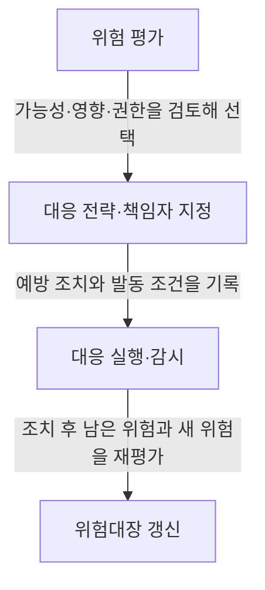
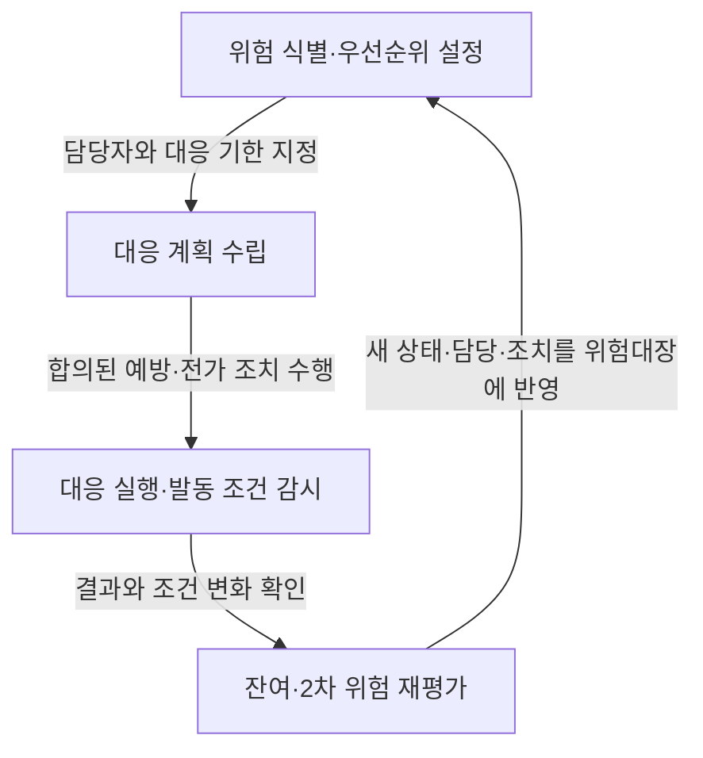

## 지식 로드맵과 현재 위치

지식 위치: IT 전략·관리 > 프로젝트 위험관리 > **부정적 위험 대응 전략**

## 30초 인출

- 본질: **부정적 위험 대응 전략**은 프로젝트 목표를 위협하는 불확실성에 대응해 위험의 발생 가능성이나 영향을 낮추거나, 책임을 이전하거나, 수용하는 선택이다.
- 메커니즘: 위험의 가능성·영향·통제 권한을 평가해 대응을 고르고, 책임자·조치·발동 조건을 정한 뒤 잔여 위험을 다시 본다.

핵심 용어

- **부정적 위험 대응 전략**: 프로젝트 목표에 대한 위협을 제거·전가·완화·수용하거나, 권한 밖의 위험을 상위에 올려 결정받는 선택이다.
- **회피(Avoid)**: 위협의 원인이나 프로젝트 계획을 바꿔 그 위험을 제거하는 대응이다.
- **전가(Transfer)**: 계약이나 보험 등을 이용해 위험 관리 또는 재정적 결과의 일부를 제3자에게 이전하는 대응이다. 책임 자체가 자동으로 사라지는 것은 아니다.
- **완화(Mitigate)**: 발생 가능성이나 부정적 영향을 낮추는 조치를 하는 대응이다.
- **수용(Accept)**: 별도 예방 조치보다 모니터링과 사전 합의된 우발 대응을 택하는 대응이다.
- **상향(Escalate)**: 프로젝트 책임자의 권한 범위를 넘는 위협을 상위 프로그램·포트폴리오·조직 의사결정자에게 이관하는 대응이다.
- **잔여 위험·2차 위험**: 대응 후 남은 위험과 대응 조치 때문에 새로 생긴 위험이다.

---

## 1교시 예상문제 (10점)

> 부정적 위험 대응 전략의 정의와 네 가지 기본 전략을 설명하고, 대응 실행 시 관리할 사항을 제시하시오. (예상·10점)

---

## 1교시 10점 답안

### Ⅰ. 개요

| 구분 | 핵심 |
|---|---|
| 정의 | **부정적 위험 대응 전략**은 프로젝트 목표를 위협하는 불확실성에 대응해 위험의 발생 가능성이나 영향을 낮추거나, 책임을 이전하거나, 수용하는 선택이다. |
| 목적 | 프로젝트 목표에 미칠 위협을 우선순위와 통제 권한에 맞게 다뤄 손실을 제한하고, 대응 후 남은 위험도 관리한다. |

### Ⅱ. 네 가지 기본 대응

| 전략 | 핵심 작동 | 선택 예 |
|---|---|---|
| 회피 | 원인 또는 계획을 바꿔 위협을 제거한다. | 검증되지 않은 기술을 검증된 대안으로 교체한다. |
| 전가 | 계약·보험 등으로 위험 관리나 재정 결과의 일부를 이전한다. | 보험 가입 또는 책임·구제 조건을 계약에 명시한다. |
| 완화 | 발생 가능성이나 영향을 낮춘다. | 시제품 검증, 이중화, 단계별 시험을 적용한다. |
| 수용 | 추가 조치 없이 감시하거나, 우발 대응을 미리 준비한다. | 발동 기준과 담당자, 우발 예산을 정한다. |

### Ⅲ. 실행·추적

**제언:** 각 대응에 책임자와 측정 가능한 발동 조건을 함께 기록해 조치가 실제로 작동하는지 확인한다.

---

## 2~4교시 예상문제 (25점)

> 부정적 위험 대응 전략을 정의하고, 위험 평가에 따른 전략 선택 기준과 실행·감시 절차, 잔여 위험 및 2차 위험 관리 방안을 설명하시오. (예상·25점)

---

## 2~4교시 25점 답안

## Ⅰ. 개요

| 구분 | 핵심 |
|---|---|
| 정의 | **부정적 위험 대응 전략**은 프로젝트 목표를 위협하는 불확실성에 대응해 위험의 발생 가능성이나 영향을 낮추거나, 책임을 이전하거나, 수용하는 선택이다. |
| 목적 | 프로젝트 목표에 미칠 위협을 우선순위와 통제 권한에 맞게 다뤄 손실을 제한하고, 대응 후 남은 위험도 관리한다. |

## Ⅱ. 전략의 종류와 효과

| 전략 | 위험에 작용하는 방식 | 유의점 |
|---|---|---|
| 회피 | 원인이나 계획을 바꿔 위협을 제거한다. | 범위·비용·일정에 미치는 영향도 함께 판단한다. |
| 전가 | 계약·보험 등으로 위험 관리 또는 재정 결과의 일부를 제3자와 나눈다. | 위험의 원인이나 발주 측 의무까지 자동 이전되는 것은 아니다. |
| 완화 | 발생 가능성이나 부정적 영향을 낮춘다. | 조치 비용과 기대 효과를 비교하고 잔여 위험을 다시 평가한다. |
| 수용 | 적극 조치를 하지 않고 감시하거나, 우발 대응을 준비한다. | 발동 조건·책임자·예비 자원을 분명히 한다. |
| 상향 | 프로젝트 권한 범위를 넘는 위협을 상위 조직에 올려 결정받는다. | 프로젝트 책임자에게 남는 조치와 정보 공유를 계속 관리한다. |

## Ⅲ. 대응 전략 선택

| 판단 요소 | 질문 | 시사점 |
|---|---|---|
| 가능성·영향 | 목표에 미치는 위협의 크기와 긴급성은 어느 정도인가? | 우선순위에 맞춰 조치 시점과 자원을 정한다. |
| 원인 통제력 | 원인이나 계획을 바꿔 위협을 없앨 수 있는가? | 가능하면 회피를 검토하고, 불가능하면 완화·전가·수용을 비교한다. |
| 책임·권한 | 계약이나 프로젝트 권한으로 다룰 수 있는가? | 계약상 이전 범위와 남는 책임을 확인하고 권한 밖 사안은 상향한다. |
| 비용·효과 | 조치 비용이 예상 손실 감소와 균형을 이루는가? | 과도한 조치와 무대응 사이에서 비용 효과를 비교한다. |

전략은 위험별로 선택한다. 가능성과 영향 점수만으로 전략을 자동 결정하지 않고, 원인 통제 가능성·책임 분담·비용·목표 제약을 함께 검토한다. 기회 대응인 활용·공유·증대는 부정적 위험 전략과 구분한다.

## Ⅳ. 실행과 위험 상태 갱신

위험대장에는 원인·사건·영향, 평가 근거, 대응 전략, 위험 책임자, 조치 책임자, 기한, 발동 조건을 기록한다. 실행 뒤에는 대응 효과를 확인하고 잔여 위험을 재평가한다. 조치 자체가 새로운 위험을 만들었는지 검토해 2차 위험으로 등록하고, 필요하면 추가 대응을 계획한다.

## Ⅴ. 실행상 문제와 통제

| 문제 | 영향 | 통제 |
|---|---|---|
| 점수만 보고 전략을 기계적으로 선택 | 원인 통제력이나 권한에 맞지 않는 대응을 택한다. | 정량 평가와 함께 원인·책임·비용·목표 제약을 검토한다. |
| 위험 책임자와 조치 담당자 혼동 | 감시와 실행이 모두 누락될 수 있다. | 위험 책임자와 조치 수행자를 따로 지정하고 역할을 기록한다. |
| 발동 기준 없는 수용 계획 | 위험이 커져도 우발 대응이 시작되지 않는다. | 지표·임계값·통보 대상·의사결정 시점을 정한다. |
| 대응 후 상태 미갱신 | 잔여·2차 위험이 관리 대상에서 빠진다. | 조치 완료 시 위험대장을 갱신하고 정기 검토한다. |

## Ⅵ. 기술적 제언

| 문제 | 해결 방안 |
|---|---|
| 위험대장에 전략을 적어도, 대응을 언제 재검토하거나 전환할지 일관되게 판단하기 어렵다. | 위험별로 조치 효과 지표와 재검토 시점을 정하고, 기준 미달 또는 발동 조건 충족 시 전략 재평가를 안건으로 올리는 관리 관문을 둔다. |

## 출제 이력과 검증 출처

- 정보관리기술사 제34회·제39회 기출 주제: 위험 대응 전략
- [PMI, PMBOK Guide](https://www.pmi.org/standards/pmbok)
- [PMI, Lexicon of Project Management Terms](https://www.pmi.org/-/media/pmi/documents/registered/pdf/pmbok-standards/pmi-lexicon-pm-terms.pdf)
- [ISO 31000 Risk management](https://www.iso.org/iso-31000-risk-management.html)

## 연결 노트

- 이전 노트: [공공 SW 사업 발주·계약](./039_public_sw_contract.md)
- 관련 노트: [프로젝트 위험 관리](./009_project_risk_management_negative.md), [EVM](./032_evm.md)
- 다음 노트: [재해복구시스템(DRS)](./042_drs.md)
