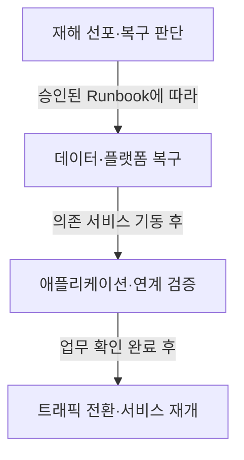

## 지식 로드맵 내 현재 위치

지식 위치: IT 전략·관리 → IT 서비스 지속성·재해복구 → **DRS**

## 30초 인출

- 본질: **DRS**: 주 전산센터 장애 때 대체환경에서 IT 서비스를 재개하기 위한 시스템.
- 메커니즘: **BIA** 기반 복구목표 설정 → 구축유형·데이터 복제 설계 → **GSLB** 절체(**Failover**) → 역복제·원복(**Failback**).
- 판정 기준: 재해 선포 후 업무별 **RTO**·**RPO** 충족 여부와 **Failback** 데이터 정합성.

핵심 용어

- **DRS(Disaster Recovery System)** : 재해 발생 시 대체 환경에서 서비스·데이터·운영절차를 복구하고 정상화하는 시스템·인프라 체계
- **BCP(Business Continuity Plan)** : 중단 상황의 업무 우선순위와 대응 책임을 정해 핵심 업무의 지속·복구를 관리하는 전사 계획
- **BIA(Business Impact Analysis)** : 업무별 중단 영향과 의존성을 분석하여 복구 우선순위·RTO·RPO를 결정하는 영향 평가 활동
- **RTO(Recovery Time Objective)** : 서비스 중단 후 정상 가동까지 허용되는 최대 목표 복구 시간
- **RPO(Recovery Point Objective)** : 장애 발생 시 데이터 손실을 감내할 수 있는 최대 목표 복구 시점
- **Failover** : 주 센터 장애 감지 시 대체 센터로 서비스 트래픽과 운영 권한을 전환하는 절차
- **Failback** : 주 센터 정상화 후 변경 데이터를 동기화하여 원래 환경으로 서비스를 환원하는 절차
- **GSLB(Global Server Load Balancing)** : 복수 센터의 상태와 정책을 기반으로 정상 센터로 트래픽을 분산·전환하는 기술

---

## 1교시 예상문제 (10점)

> DRS에 관하여 설명하시오. (예상·10점)

---

## 1교시 10점 답안

### Ⅰ. **DRS** 개요

| 구분 | 핵심 |
|---|---|
| 정의 | **DRS**: 업무중단 때 IT 서비스를 대체환경에서 복구·재개하기 위한 기술·절차 체계 |
| 목적 | 업무 중요도에 맞는 복구수준 설정과 서비스 중단 영향 최소화 |

### Ⅱ. 구축유형과 절체 흐름

복구수준 선택기준: 업무 영향분석(**BIA**)으로 정한 **RTO**·**RPO**. Mirror·Hot·Warm·Cold의 차이: 대기환경과 복구준비 수준. 실제 복구시간: 구성과 시험결과에 따른 차이.

| 유형 | 대기환경 | 복구 특성 |
|---|---|---|
| **Mirror** | 주 센터와 유사한 환경을 상시 가동 | 빠른 전환이 가능하나 비용과 운영 복잡도가 높음 |
| **Hot** | 구성된 대기환경과 최신 데이터를 유지 | 짧은 복구시간을 목표로 하나 데이터 복제·전환 설계 필요 |
| **Warm** | 일부 자원과 복구 절차를 사전 준비 | 자원 기동·데이터 복원 시간이 추가됨 |
| **Cold** | 공간·전력 등 기반환경 중심으로 확보 | 초기 비용은 낮지만 시스템·데이터 복구에 더 긴 시간 필요 |

제언: 업무별 **RTO**·**RPO**에 맞춘 복구·Failback 훈련과 실제 목표 달성 확인.

---

## 2~4교시 예상문제 (25점)

> DRS의 개념과 구축유형을 설명하고, 데이터 복제·서비스 절체·정상 복귀의 고려사항을 제시하시오. **(미출제 예상·25점)**

---

## 2~4교시 25점 답안

## Ⅰ. **DRS** 개요

> DRS 품질의 판단기준: 장비 보유 여부가 아니라 업무별 **복구목표의 절체훈련 달성 여부**.

| 구분 | 핵심 |
|---|---|
| 정의 | **DRS**: 업무중단 때 IT 서비스를 대체환경에서 복구·재개하기 위한 기술·절차 체계 |
| 목적 | 업무 중요도에 맞는 복구수준 설정과 서비스 중단 영향 최소화 |

## Ⅱ. DRS 구성체계와 복구 절차

> 복구 대상: 데이터·애플리케이션·네트워크·인증·운영절차.

| 영역 | 구성 요소 | 핵심 엔지니어링 통제 기준 |
|---|---|---|
| **데이터 계층** | 스토리지 볼륨 복제, DB CDC, 스냅샷 백업 | 정합성 그룹(Consistency Group) 단위의 복구 시점 관리와 복구 후 정합성 검증 |
| **시스템 계층** | 가상화 호스트, 컨테이너 클러스터, 백업 인스턴스 | 상시 대기 용량(Capacity) 확보 및 주 센터와의 형상 일치 |
| **네트워크 계층** | 전용 회선(DWDM), **GSLB** , DNS Anycast | 자동 헬스체크 기반 무중단 트래픽 전환(**Failover**) |
| **공통서비스** | IAM(인증), KMS(키관리), 형상관리, DNS | DR 환경의 의존성 확인과 주 센터 연결이 끊긴 상태의 기동 시험 |
| **운영 체계** | 재해 선포 기준, 비상 연락망, 표준 **Runbook** | 역할별 사전 승인 권한 부여 및 훈련 증적 관리 |

## Ⅲ. DRS 4대 구축유형 비교

> 복구유형 선정축: **RTO**와 투자비용의 균형, 업무 중요도.

| 구축 유형 | 인프라 준비 상태 | 데이터 동기화 방식 | 목표 RTO / **RPO** | 상대적 비용 |
|---|---|---|---|---|
| **Mirror Site** | 주 센터와 유사한 환경을 상시 가동 | 실시간 복제 구성이 가능 | 목표 RTO·RPO를 가장 짧게 설계할 수 있으나 무중단을 보장하지 않음 |
| **Hot Site** | 운영에 필요한 대기환경을 갖춤 | 동기·비동기 복제 또는 백업을 조합 | 비교적 짧은 복구목표에 적합하며 시험으로 확인 |
| **Warm Site** | 일부 인프라·복구절차를 준비 | 주기적 복제·백업 등 구성에 따라 다름 | 기동·복원 작업을 고려한 복구목표 설정 필요 |
| **Cold Site** | 공간·전력 등 기반환경을 중심으로 확보 | 별도 백업에서 데이터를 복원 | 복구시간이 길 수 있어 업무 허용중단시간과 비교 |

## Ⅳ. 복제 아키텍처 선택

> 동기·비동기 복제의 고려사항: RPO·거리·지연·대역폭·장애 상관성.

| 방식 | 메커니즘 | 장점 | 고려사항 |
|---|---|---|---|
| **동기 복제** | 원격 기록 확인 후 로컬 I/O 완료 | 복제 확인된 데이터의 손실 위험을 줄임 | 왕복 지연과 애플리케이션 성능 영향, 허용 거리·지연을 시험으로 결정 |
| **비동기 복제** | 로컬 기록 후 원격으로 전송 | 원거리 복제에 유리 | 전송 지연 중 장애가 나면 최근 변경분이 유실될 수 있음 |
| **백업 복원** | 주기적 풀/증분 백업 후 대체 환경에서 복원 | 인프라 비용 극소화 | 복원 소요 시간 과다(RTO 김), 복구 신뢰성 저하 |
| **3DC 구성** | 근거리 동기 복제 + 원거리 비동기 복제 결합 | 고성능 및 광역 대재난 동시 방어 | 스토리지 3벌 구성 비용 및 운영 복잡도 |

## Ⅴ. 한계·대응

> 복구 실패의 주요 원인: 데이터 외 공통서비스·운영절차의 단절.

| 위험 | 대책 | 효과 |
|---|---|---|
| **복제지연·불일치** | 복제 지연 모니터링, 정합성 그룹(Consistency Group) 구성, 복구 후 검증 | 복구 데이터의 무결성 확인 |
| **공통서비스 의존** | IAM, DNS, KMS의 DR 구성과 주 센터 통신 단절 시험 | 대체환경 단독 기동 가능 여부 확인 |
| **Runbook 노후화** | 시스템 배포 파이프라인과 절체 스크립트(IaC) 자동 동기화 | 절체 소요 시간 단축 |
| **Failback 미검증** | 역방향 증분 복제 메커니즘 구축 및 분기별 주 센터 복귀 리허설 | 2차 서비스 중단 차단 |

## Ⅵ. 업무중요도 기반 복구투자 제언

| 한계 | 해결 방안 |
|---|---|
| 장비등급이나 일률적 기준에 따른 복구유형 선정과 업무영향·복구비용 간 불일치 가능성 | 업무별 허용중단시간·데이터 손실 허용치·의존관계에 따른 복구목표 승인과 목표 충족 최소 복구구성 선정 |

복구유형·목표시간의 설정 근거: 업무 영향분석과 복구훈련 결과에 따른 사업별 제안이며, 제도상 고정값은 아님.

## 출제 이력과 검증 출처

- 공식 문제지 원문으로 확인한 직접 기출 없음
- [NIST SP 800-34 Rev.1: Contingency Planning Guide for Federal Information Systems](https://csrc.nist.gov/pubs/sp/800/34/r1/upd1/final)
- [ISO 22301:2019 Security and resilience — Business continuity management systems](https://www.iso.org/standard/75106.html)

## 연결 토픽

- 이전 토픽: [부정적 위험 대응 전략](./040_negative_risk_response_strategy.md)
- 연관 토픽: [BCP](./030_bcp.md), [RTO·RPO](./018_rpo.md), [액티브-액티브 이중화·스토리지 DR](./027_active_active_storage_dr.md)
- 다음 토픽: [ISO 21500](./043_iso_21500.md)
