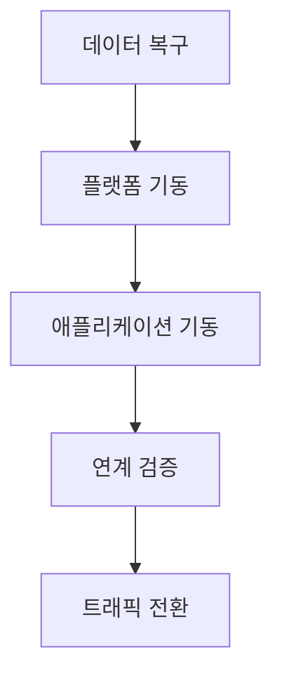
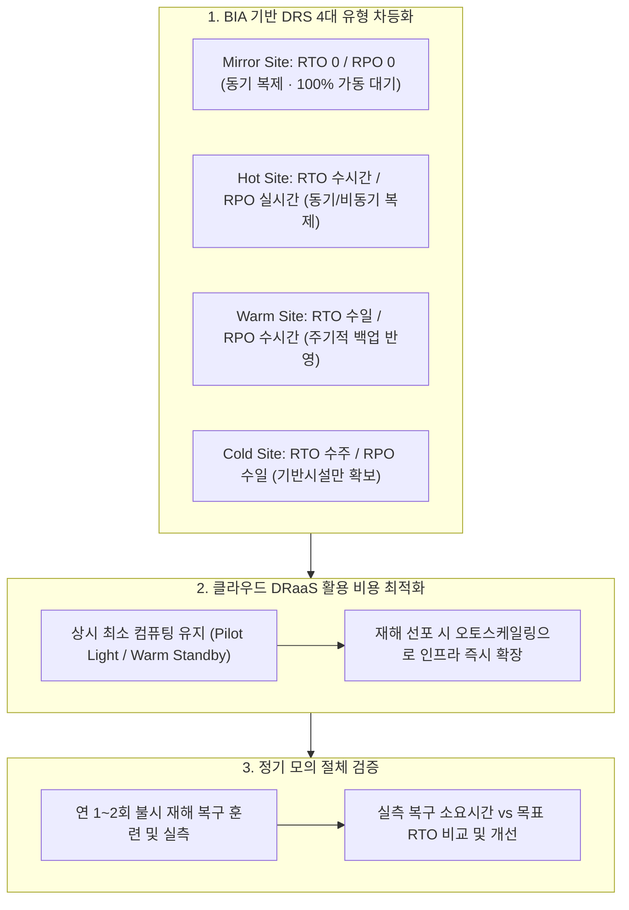

## 지식 로드맵 내 현재 위치

지식 위치: IT 전략·관리 → IT 서비스 지속성·재해복구 → **DRS**

## 30초 인출

- 본질: 주 전산센터 재해 마비 시 대체 센터에서 목표 시간( **RTO** ) 및 시점( **RPO** ) 내 IT 서비스를 재개하는 종합 재해복구시스템이다.
- 메커니즘: **BIA** 복구 목표 수립 → 4대 구축 유형( **Mirror, Hot, Warm, Cold** ) 및 데이터 복제 설계 → **GSLB** 절체( **Failover** ) → 역복제 후 원복( **Failback** )한다.
- 판정 기준: 재해 선포 후 업무별 **RTO** · **RPO** 달성 여부와 **Failback** 데이터 정합성 검증 결과이다.

핵심 용어

- **DRS(Disaster Recovery System)** : 재해 발생 시 대체 환경에서 서비스·데이터·운영절차를 복구하고 정상화하는 시스템·인프라 체계
- **BCP(Business Continuity Plan)** : 중단 상황의 업무 우선순위와 대응 책임을 정해 핵심 업무의 지속·복구를 관리하는 전사 계획
- **BIA(Business Impact Analysis)** : 업무별 중단 영향과 의존성을 분석하여 복구 우선순위·RTO·RPO를 결정하는 영향 평가 활동
- **RTO(Recovery Time Objective)** : 서비스 중단 후 정상 가동까지 허용되는 최대 목표 복구 시간
- **RPO(Recovery Point Objective)** : 장애 발생 시 데이터 손실을 감내할 수 있는 최대 목표 복구 시점
- **Failover** : 주 센터 장애 감지 시 대체 센터로 서비스 트래픽과 운영 권한을 전환하는 절차
- **Failback** : 주 센터 정상화 후 변경 데이터를 동기화하여 원래 환경으로 서비스를 환원하는 절차
- **GSLB(Global Server Load Balancing)** : 복수 센터의 상태와 정책을 기반으로 정상 센터로 트래픽을 분산·전환하는 기술

## 예상문제

> DRS의 개념과 구축유형을 설명하고, 데이터 복제·서비스 절체·정상 복귀의 고려사항을 제시하시오. **(미출제 예상·25점)**

## Ⅰ. DRS의 개요

> DRS의 품질은 장비 보유가 아니라 업무별 **복구목표를 실제 절체훈련에서 달성하는가** 로 판정함.

- 정의: **업무연속성** 을 위해 **BIA** 로 정한 **RTO·RPO** 를 기준으로 주 센터 장애 입력을 대체 환경의 서비스 복구와 검증으로 처리하는 재해복구 체계
- 목적: 핵심서비스 복구 우선순위와 데이터 복제·절체 통제를 마련하여 업무 중단 영향을 줄이는 것

## Ⅱ. DRS 구성체계와 복구 절차

> 데이터만 복제해서는 부족하며 애플리케이션·네트워크·인증·운영절차가 함께 복구되어야 함.

| 영역 | 구성 요소 | 핵심 엔지니어링 통제 기준 |
|---|---|---|
| **데이터 계층** | 스토리지 볼륨 복제, DB CDC, 스냅샷 백업 | 데이터 정합성(Consistency Group) 보장 및 복구 시점 관리 |
| **시스템 계층** | 가상화 호스트, 컨테이너 클러스터, 백업 인스턴스 | 상시 대기 용량(Capacity) 확보 및 주 센터와의 형상 일치 |
| **네트워크 계층** | 전용 회선(DWDM), **GSLB** , DNS Anycast | 자동 헬스체크 기반 무중단 트래픽 전환(Failover) |
| **공통서비스** | IAM(인증), KMS(키관리), 형상관리, DNS | 주 센터 종속 탈피, DR 센터 단독 독립 기동 보장 |
| **운영 체계** | 재해 선포 기준, 비상 연락망, 표준 **Runbook** | 역할별 사전 승인 권한 부여 및 훈련 증적 관리 |

## Ⅲ. DRS 4대 구축유형 비교

> 복구 목표 시간(RTO)과 투자 비용의 트레이드오프를 고려하여 비즈니스 중요도에 따라 선정함.

| 구축 유형 | 인프라 준비 상태 | 데이터 동기화 방식 | 목표 RTO / RPO | 상대적 비용 |
|---|---|---|---|---|
| **Mirror Site** | 주 센터와 동일 사양 상시 실가동 (Active-Active) | 실시간 동기 복제 (Synchronous) | RTO = 0 / RPO = 0 | 매우 높음 (100% 이상) |
| **Hot Site** | 동일 장비 상시 대기 상태 (Active-Standby) | 실시간 동기 또는 준실시간 비동기 | RTO < 수 시간 / RPO < 수 분 | 높음 (80~90%) |
| **Warm Site** | 중요 핵심 장비만 부분 구축, 일반 서버 미구축 | 주기적 스냅샷 백업본 원격 전송 | RTO < 수 일 / RPO < 1일 | 보통 (40~50%) |
| **Cold Site** | 상면(전산실 공간), 공조, 전력 설비만 확보 | 테이프 소산 백업본 물리 운송 | RTO < 수 주 / RPO < 수 일 | 낮음 (10~20%) |

## Ⅳ. 복제 아키텍처 선택

> 동기·비동기 복제는 RPO뿐 아니라 거리·지연·대역폭·장애상관성을 함께 고려함.

| 방식 | 메커니즘 | 장점 | 고려사항 |
|---|---|---|---|
| **동기 복제** | 원격 기록 확인 후 로컬 I/O 완료 | 데이터 유실 제로 (RPO=0) | 네트워크 지연(Latency), 거리 제약 (<30km 권장) |
| **비동기 복제** | 로컬 I/O 즉시 완료 후 원격 백그라운드 전송 | 거리 제약 없음, 메인 성능 보존 | 전송 지연에 따른 데이터 유실(RPO>0) 발생 |
| **백업 복원** | 주기적 풀/증분 백업 후 대체 환경에서 복원 | 인프라 비용 극소화 | 복원 소요 시간 과다(RTO 김), 복구 신뢰성 저하 |
| **3DC 구성** | 근거리 동기 복제 + 원거리 비동기 복제 결합 | 고성능 및 광역 대재난 동시 방어 | 스토리지 3벌 구성 비용 및 운영 복잡도 |

## Ⅴ. 문제점·대응책

> 실제 장애는 데이터 외 공통서비스와 운영절차의 단절에서 자주 발생함.

| 위험 | 대책 | 효과 |
|---|---|---|
| **복제지연·불일치** | 복제 지연 실시간 모니터링 및 정합성 그룹(Consistency Group) 구성 | 데이터 무결성 보장 |
| **공통서비스 의존** | IAM, DNS, KMS 독립 로컬 인스턴스 구축 및 주 센터 통신 단절 시험 | 단독 기동 완전성 확보 |
| **Runbook 노후화** | 시스템 배포 파이프라인과 절체 스크립트(IaC) 자동 동기화 | 절체 소요 시간 단축 |
| **Failback 미검증** | 역방향 증분 복제 메커니즘 구축 및 분기별 주 센터 복귀 리허설 | 2차 서비스 중단 차단 |

## Ⅵ. 실전 복구력 중심 기술사적 제언

> DRS는 단순한 백업 하드웨어 보유가 아니라, 재해 발생 시 주저 없이 절체 스위치를 누를 수 있는 검증된 복구 거버넌스임.

### 실전 답안용 기술사적 제언

- 문제: 모든 시스템을 동일한 최고 수준(Mirror/Hot)으로 구축하려다 감당하기 어려운 인프라 비용이 소요되거나, Cold Site의 장시간 복구 시간으로 비즈니스 연속성이 훼손됨.
- 해결 방안: BIA 결과에 따라 업무별 Tier(Tier 1은 Mirror/Hot, Tier 2는 Warm, Tier 3 이하는 Cold/클라우드 DR)를 엄격히 분격 차등 설계하고, 클라우드 DRaaS(Disaster Recovery as a Service)를 도입하여 상시 비용을 최적화함.

## 1교시 10점 답안 발췌

### 1. 정의·목적

- 정의: **업무연속성** 을 위해 **BIA** 로 정한 **RTO·RPO** 를 기준으로 주 센터 장애 입력을 대체 환경의 서비스 복구와 검증으로 처리하는 재해복구 체계
- 목적: 핵심서비스 복구 우선순위와 데이터 복제·절체 통제를 마련하여 업무 중단 영향을 줄이는 것

### 2. 핵심 구조 및 체계

- 정의: 재해로 주 센터가 중단될 때 사전에 설정한 RTO·RPO 목표에 따라 대체 환경에서 IT 인프라와 서비스를 신속히 재개하는 종합 재해복구 체계
- 핵심 메커니즘: BIA 분석을 통한 RTO/RPO 수립 → 4대 구축 유형(Mirror/Hot/Warm/Cold) 및 복제 설계 → GSLB 기반 서비스 절체(Failover) → 역동기화 후 원복(Failback)

## 출제 이력과 검증 출처

- 공식 문제지 원문으로 확인한 직접 기출 없음
- [NIST SP 800-34 Rev.1: Contingency Planning Guide for Federal Information Systems](https://csrc.nist.gov/pubs/sp/800/34/r1/upd1/final)
- [ISO 22301:2019 Security and resilience — Business continuity management systems](https://www.iso.org/standard/75106.html)

## 학습 체크

- [ ] Ⅰ. DRS의 정의·목적과 BCP와의 관계를 설명할 수 있는가?
- [ ] Ⅱ. 데이터·시스템·네트워크·공통서비스·운영 통제를 연결할 수 있는가?
- [ ] Ⅲ. Mirror·Hot·Warm·Cold Site를 준비수준·복구특성·비용으로 비교할 수 있는가?
- [ ] Ⅳ. 동기·비동기·백업·3DC의 선택 기준을 설명할 수 있는가?
- [ ] Ⅴ~Ⅵ. Failover·Failback과 E2E 훈련의 검증항목을 제시할 수 있는가?

## 연결 토픽

- 이전 토픽: [부정적 위험 대응 전략](./040_negative_risk_response_strategy.md)
- 연관 토픽: [BCP](./030_bcp.md), [RTO·RPO](./018_rpo.md), [액티브-액티브 이중화·스토리지 DR](./027_active_active_storage_dr.md)
- 다음 토픽: [ISO 21500](./043_iso_21500.md)
