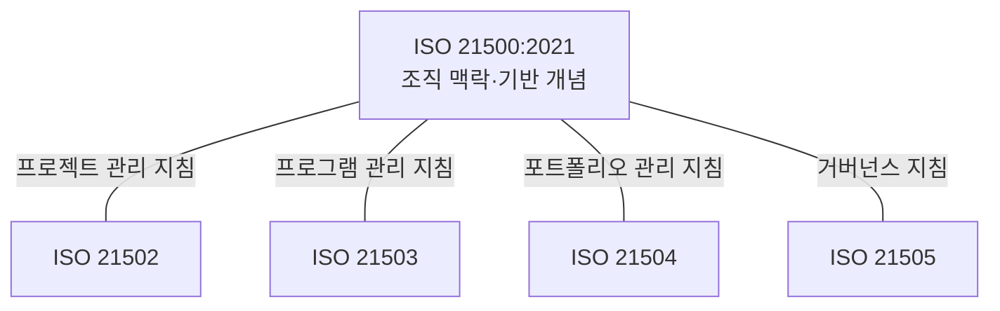
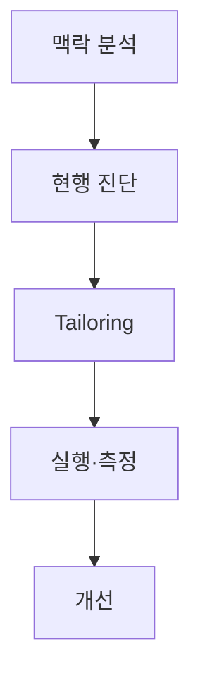

## 지식 로드맵 내 현재 위치

지식 위치: IT 전략·관리 → 프로젝트 거버넌스·표준 → **ISO 21500**

## 30초 인출

- 본질: ISO 21500은 프로젝트·프로그램·포트폴리오 관리의 공통 개념과 조직 맥락을 제시하는 국제표준이다.
- 메커니즘: ISO 21500의 조직 맥락을 중심으로 21505 거버넌스, 21504 포트폴리오, 21503 프로그램, 21502 프로젝트 관리 관계를 정렬한다.
- 산출물: 공통 용어 체계 · 프로젝트 관리 체계 지침 · 맞춤화( **Tailoring** ) 승인 기준이다.

핵심 용어

- **ISO 21500:2021** : 프로젝트·프로그램·포트폴리오 관리의 조직 맥락과 기반 원리를 규정하는 최상위 개념 국제표준
- **ISO 21502:2020** : 프로젝트 생애주기와 전달방식에 따른 실무 관리 활동 및 의사결정 지침 표준
- **ISO 21503** : 연관 프로젝트와 운영 활동 조정을 통해 전략적 편익을 실현하는 프로그램 관리 표준
- **ISO 21504** : 전략목표 달성을 위해 프로젝트·프로그램 투자 우선순위를 최적화하는 포트폴리오 관리 표준
- **ISO 21505** : 프로젝트·프로그램·포트폴리오의 의사결정 권한과 감독 체계를 규정하는 거버넌스 지침 표준
- **Tailoring** : 조직 규모·복잡도·전달방식에 맞추어 관리 프로세스와 산출물을 조정·최적화하는 활동

---

## 1교시 예상문제 (10점)

> ISO 21500 표준군의 구성과 프로젝트 관리 적용 범위를 설명하시오. (예상·10점)

---

## 1교시 10점 답안

### Ⅰ. **ISO 21500** 개요

| 구분 | 핵심 |
|---|---|
| 정의 | **ISO 21500:2021**은 프로젝트·프로그램·포트폴리오 관리의 조직 맥락과 기반 개념을 제시하는 국제표준이다. |
| 목적 | 관련 표준을 활용해 조직의 프로젝트·프로그램·포트폴리오 관리를 개선하도록 돕는다. |

### Ⅱ. 표준군의 주요 지침

ISO 21500:2021은 관련 표준을 대체하거나 관리조직을 지휘하는 규정이 아니다. 표준군은 대상별 지침을 제공하며, 조직은 필요에 맞게 적용한다.

| 표준 | 대상 | 핵심 역할 |
|---|---|---|
| **ISO 21500:2021** | 공통 | 조직 맥락과 기반 개념 |
| **ISO 21502:2020** | 프로젝트 | 프로젝트 관리 지침 |
| **ISO 21503:2022** | 프로그램 | 프로그램 관리 지침 |
| **ISO 21504:2022** | 포트폴리오 | 포트폴리오 관리 지침 |
| **ISO 21505:2017** | 거버넌스 | 프로젝트·프로그램·포트폴리오 거버넌스 지침 |

---

## 2~4교시 예상문제 (25점)

> ISO 21500:2021의 개념과 ISO 21500 표준군의 구성을 설명하고, 조직 적용 시 고려사항을 제시하시오. **(미출제 예상·25점)**

---

## 2~4교시 25점 답안

## Ⅰ. **ISO 21500** 개요

> ISO 21500은 세부 프로젝트 절차서가 아니라 프로젝트·프로그램·포트폴리오를 조직전략과 연결하는 **상위 개념 표준** 임.

| 구분 | 핵심 |
|---|---|
| 정의 | **ISO 21500:2021**은 프로젝트·프로그램·포트폴리오 관리의 조직 맥락과 기반 개념을 제시하는 국제표준이다. |
| 목적 | 관련 표준을 활용해 조직의 프로젝트·프로그램·포트폴리오 관리를 개선하도록 돕는다. |

## Ⅱ. ISO 21500 표준군 구성체계

> ISO 21500이 공통 기반을 제공하고 대상별 지침이 관리 실무를 구체화함.

| 표준 | 대상 | 핵심 역할 |
|---|---|---|
| **ISO 21500:2021** | 공통 | 조직 맥락·기반 개념 |
| **ISO 21502:2020** | 프로젝트 | 프로젝트 관리 실무 지침 (예측형·적응형 **Tailoring**) |
| **ISO 21503** | 프로그램 | 연관 프로젝트 조정 및 복합 비즈니스 편익(Benefits) 실현 |
| **ISO 21504** | 포트폴리오 | 조직 전략 정렬, 사업 우선순위화 및 자원 최적 배분 |
| **ISO 21505** | 거버넌스 | 프로젝트·프로그램·포트폴리오의 책임·권한·감독 체계 |

ISO/TC 258 표준군에는 용어(ISO 21506), WBS(ISO 21511), 획득가치관리(ISO 21508·21512) 등 관련 지침도 포함된다. 위 표는 프로젝트·프로그램·포트폴리오와 거버넌스의 대표 표준을 정리한 것이다.

## Ⅲ. 프로젝트·프로그램·포트폴리오 비교

> 관리 단위가 커질수록 산출물 인도에서 편익·전략가치로 초점이 이동함.

| 기준 | 프로젝트 (Project) | 프로그램 (Programme) | 포트폴리오 (Portfolio) |
|---|---|---|---|
| **목적** | 고유한 산출물(제품·서비스) 인도 | 상호 연계된 프로젝트 조정 통한 **편익 실현** | 조직의 **전략적 목표 달성** 및 가치 극대화 |
| **구성** | 활동 및 작업 패키지(WBS) | 연관 프로젝트, 하위 프로그램, 운영 활동 | 프로젝트, 프로그램, 운영 업무의 포괄적 집합 |
| **관리 초점** | 범위, 일정, 원가, 품질 기준 준수 | 구성요소 간 의존성, 변화 관리, 편익 추적 | 투자 대비 수익(ROI), 자원 배분, 리스크 균형 |
| **성공 판정** | 사전에 정의된 인도물 및 성과 달성 | 조직이 체감하는 실질적 비즈니스 편익 달성 | 전사 전략적 가치 창출 및 포트폴리오 균형 |

## Ⅳ. 조직 적용 절차

> 표준을 그대로 복제하지 않고 현행 관리체계와 격차를 확인한 뒤 테일러링함.

## Ⅴ. 문제점·대응책

> 표준의 목적보다 문서 형식을 우선하면 관리비용만 증가함.

| 위험 | 대책 | 효과 |
|---|---|---|
| **2012판 구조 혼용** | 2012년(단일 프로젝트)과 현행 21500(개념)·21502(지침) 역할 명확 구분 | 개념 오류 방지 |
| **전수 적용 (Overkill)** | 프로젝트 규모·위험·전달방식(애자일/폭포수)별 **Tailoring** 승인제 | 관리부담 완화 |
| **전략·실행 단절** | 포트폴리오–프로그램–프로젝트 간 양방향 추적성 지표 연계 | 가치 정렬 |
| **산출물 중심 종료** | 납품 후 편익소유자(Benefit Owner) 지정 및 사후 편익평가 강제 | 성과 지속성 확인 |

## Ⅵ. 의사결정 권한 정렬 제언

| 문제 | 해결 방안 |
|---|---|
| 프로젝트·프로그램·포트폴리오 사이에서 승인·변경·편익 의사결정의 담당이 모호하면 지연이나 책임 공백이 생길 수 있다. | 표준군의 역할 정의를 참고해 조직별 의사결정권자·상신 조건·기록 책임을 RACI로 정리하고, 실제 사업 한 건에 적용해 충돌 여부를 검증한다. |

이는 ISO가 요구하는 단일 조직모형이 아니라 조직 여건에 맞춰 적용할 기술사적 제안이다.

## 출제 이력과 검증 출처

- 공식 문제지 원문으로 확인한 직접 기출 없음
- [ISO 21500:2021 — Context and concepts](https://www.iso.org/standard/75704.html)
- [ISO 21502:2020 — Guidance on project management](https://www.iso.org/standard/74947.html)
- [ISO/TC 258 Published Standards](https://committee.iso.org/sites/tc258/home/projects/published/iso-3.html)

## 연결 토픽

- 이전 토픽: [DRS](./042_drs.md)
- 연관 토픽: [PMO](./004_pmo.md), [WBS](./007_wbs.md), [EVM](./032_evm.md), [프로젝트 관리](./065_project_management.md)
- 다음 토픽: [ITSM](./044_itsm.md)
