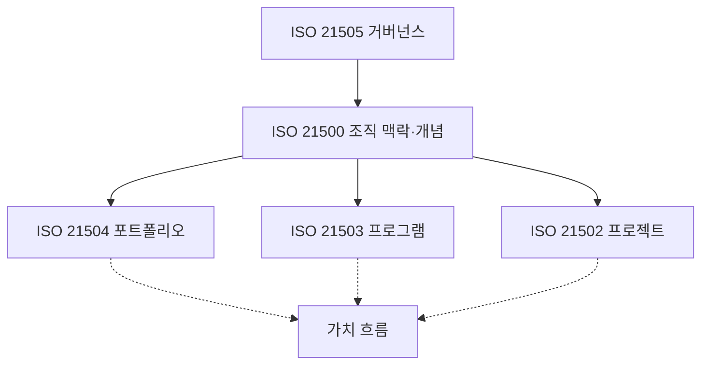
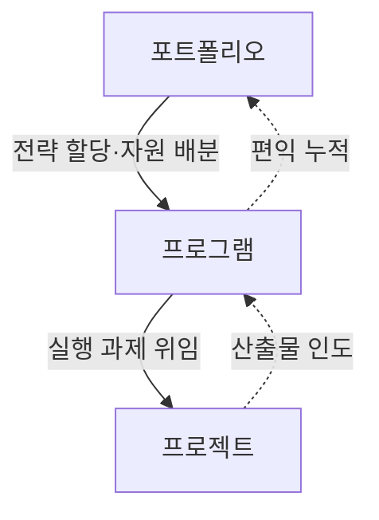
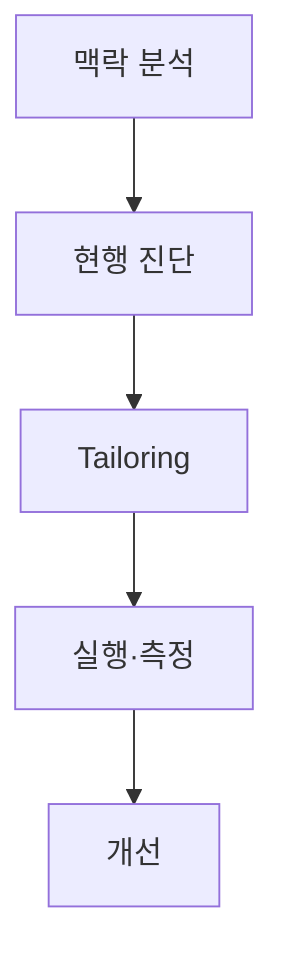
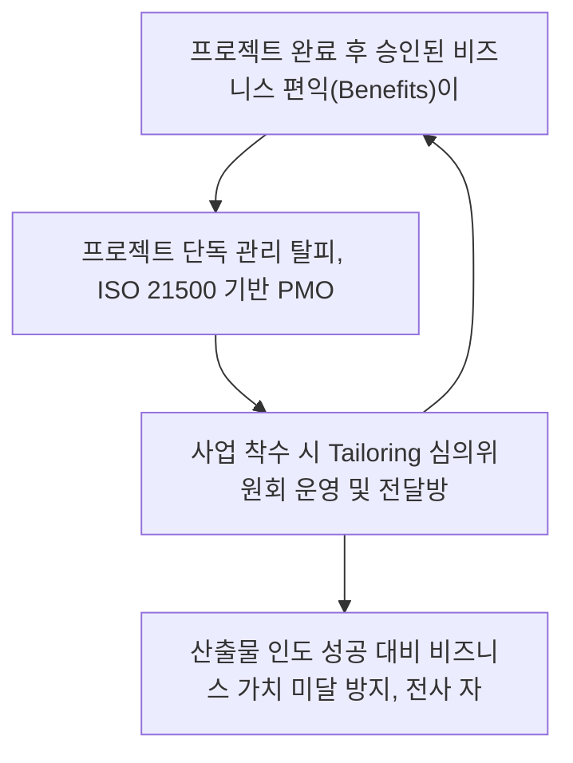

## 지식 로드맵 내 현재 위치
현재 위치: IT 전략·관리 → ISO 21500

## 30초 인출

- 본질: 프로젝트, 프로그램, 포트폴리오 관리의 조직 환경 맥락과 기본 원리를 규정하는 최상위 공통 개념 국제표준이다.
- 메커니즘: ISO 21500의 조직 맥락을 중심으로 21505 거버넌스, 21504 포트폴리오, 21503 프로그램, 21502 프로젝트 관리 관계를 정렬한다.
- 산출물: 공통 용어 체계 · 프로젝트 관리 체계 지침 · 맞춤화(Tailoring) 승인 기준이다.

핵심 용어

- **ISO 21500:2021**: 프로젝트·프로그램·포트폴리오 관리의 조직 맥락과 기반 개념을 입력받아 공통 관리 언어와 적용 원칙을 제공하는 국제표준이다.
- **ISO 21502:2020**: 프로젝트의 생애주기와 전달방식을 고려하여 관리 활동과 의사결정 지침을 제공하는 표준이다.
- **ISO 21503**: 상호 연관된 프로젝트와 활동을 조정하여 편익을 실현하도록 프로그램 관리 방법을 제시하는 표준이다.
- **ISO 21504**: 전략목표와 투자 정보를 바탕으로 프로젝트·프로그램을 선정하고 우선순위를 관리하는 포트폴리오 지침이다.
- **ISO 21505**: 프로젝트·프로그램·포트폴리오의 의사결정 권한과 감독 정보를 정해 거버넌스를 수행하는 지침이다.
- **Tailoring**: 조직 규모·복잡도·위험·전달방식 입력을 기준으로 관리 실무의 범위와 산출물을 조정하는 활동이다.

## 예상문제

> ISO 21500:2021의 개념과 ISO 21500 표준군의 구성을 설명하고, 조직 적용 시 고려사항을 제시하시오. **(미출제 예상·25점)**

## Ⅰ. ISO 21500:2021의 개요

> ISO 21500은 세부 프로젝트 절차서가 아니라 프로젝트·프로그램·포트폴리오를 조직전략과 연결하는 **상위 개념 표준**임.

- 정의: **프로젝트·프로그램·포트폴리오 관리**의 조직 맥락과 공통 개념을 제시하는 국제표준
- 목적: **공통 언어** · **전략 정렬** · **표준군 일관성** 확보

## Ⅱ. ISO 21500 표준군 구성체계

> ISO 21500이 공통 기반을 제공하고 대상별 지침이 관리 실무를 구체화함.

| 표준 | 대상 | 핵심 역할 |
|---|---|---|
| **ISO 21500:2021** | 공통 | 맥락·개념·표준군 관계 (최상위 우산 표준) |
| **ISO 21502:2020** | 프로젝트 | 프로젝트 관리 실무 지침 (예측형·적응형 Tailoring) |
| **ISO 21503** | 프로그램 | 연관 프로젝트 조정 및 복합 비즈니스 편익(Benefits) 실현 |
| **ISO 21504** | 포트폴리오 | 조직 전략 정렬, 사업 우선순위화 및 자원 최적 배분 |
| **ISO 21505** | 거버넌스 | 프로젝트·프로그램·포트폴리오의 책임·권한·감독 체계 |

## Ⅲ. 프로젝트·프로그램·포트폴리오 비교

> 관리 단위가 커질수록 산출물 인도에서 편익·전략가치로 초점이 이동함.

| 기준 | 프로젝트 (Project) | 프로그램 (Programme) | 포트폴리오 (Portfolio) |
|---|---|---|---|
| **목적** | 고유한 산출물(제품·서비스) 인도 | 상호 연계된 프로젝트 조정 통한 **편익 실현** | 조직의 **전략적 목표 달성** 및 가치 극대화 |
| **구성** | 활동 및 작업 패키지(WBS) | 연관 프로젝트, 하위 프로그램, 운영 활동 | 프로젝트, 프로그램, 운영 업무의 포괄적 집합 |
| **관리 초점** | 범위, 일정, 원가, 품질 기준 준수 | 구성요소 간 의존성, 변화 관리, 편익 추적 | 투자 대비 수익(ROI), 자원 배분, 리스크 균형 |
| **성공 판정** | 사전에 정의된 인도물 및 성과 달성 | 조직이 체감하는 실질적 비즈니스 편익 달성 | 전사 전략적 가치 창출 및 포트폴리오 균형 |

## Ⅳ. 조직 적용 절차

> 표준을 그대로 복제하지 않고 현행 관리체계와 격차를 확인한 뒤 테일러링함.

## Ⅴ. 문제점·대응책

> 표준의 목적보다 문서 형식을 우선하면 관리비용만 증가함.

| 위험 | 대책 | 효과 |
|---|---|---|
| **2012판 구조 혼용** | 2012년(단일 프로젝트)과 현행 21500(개념)·21502(지침) 역할 명확 구분 | 개념 오류 방지 |
| **전수 적용 (Overkill)** | 프로젝트 규모·위험·전달방식(애자일/폭포수)별 **Tailoring** 승인제 | 관리부담 완화 |
| **전략·실행 단절** | 포트폴리오–프로그램–프로젝트 간 양방향 추적성 지표 연계 | 가치 정렬 |
| **산출물 중심 종료** | 납품 후 편익소유자(Benefit Owner) 지정 및 사후 편익평가 강제 | 성과 지속성 확인 |

## Ⅵ. 가치 흐름 중심 기술사적 제언

> ISO 21500 표준군의 가치는 문서 통일이 아니라 전략이 포트폴리오 선택·프로그램 편익·프로젝트 산출물로 추적되는 공통 관리언어에 있음.

### 학습자 통찰 메모 — 답안 밖

- `[핵심 통찰]` ISO 21500 표준군의 가치는 문서 통일이 아니라 전략이 포트폴리오 선택·프로그램 편익·프로젝트 산출물로 추적되는 공통 관리언어에 있음.
- `나라면` 조직 공통 최소통제만 표준화하고, 프로젝트별 Tailoring 근거와 제외 사유를 승인·기록하여 형식주의와 통제누락을 함께 줄이겠음.

### 실전 답안용 기술사적 제언

- **판정 기준**: 프로젝트 완료 후 승인된 비즈니스 편익(Benefits)이 운영 단계에서 1년 내 실제 실현되는지 여부.
- **공학적 대안**: 프로젝트 단독 관리 탈피, **ISO 21500 기반 PMO 거버넌스(포트폴리오-프로그램-프로젝트 연계)** 구축.
- **검증 절차**: 사업 착수 시 Tailoring 심의위원회 운영 및 전달방식(예측형 vs 애자일)별 관리 통제선 적합성 검증.
- **기대 효과**: 산출물 인도 성공 대비 비즈니스 가치 미달 방지, 전사 자원 배분 최적화 및 전략적 정합성 완성.

## 1교시 10점 답안 발췌

### 1. 정의·목적

- 정의: 프로젝트·프로그램·포트폴리오 관리의 **조직 맥락과 공통 개념**을 제시하는 국제표준
- 목적: **공통 언어 · 전략 정렬 · 표준군 일관성** 확보

### 2. 표준군 아키텍처

### 3. 핵심 통제

- **정렬**: 전략 → 포트폴리오 → 프로그램 → 프로젝트
- **Tailoring**: 규모·복잡도·위험·전달방식에 맞게 관리실무 조정

## 출제 이력과 검증 출처

- 공식 문제지 원문으로 확인한 직접 기출 없음
- [ISO 21500:2021 — Context and concepts](https://www.iso.org/standard/75704.html)
- [ISO 21502:2020 — Guidance on project management](https://www.iso.org/standard/74947.html)
- [ISO/TC 258 Published Standards](https://committee.iso.org/sites/tc258/home/projects/published/iso-3.html)

## 학습 체크

- [ ] Ⅰ. ISO 21500:2021의 정의·목적을 설명할 수 있는가?
- [ ] Ⅱ. ISO 21500·21502·21503·21504·21505의 역할을 구분할 수 있는가?
- [ ] Ⅲ. 프로젝트·프로그램·포트폴리오를 목적·구성·초점·성공판정으로 비교할 수 있는가?
- [ ] Ⅳ. 맥락분석부터 Tailoring·개선까지 적용 절차를 설명할 수 있는가?
- [ ] Ⅴ~Ⅵ. 2012판 혼용·전수 적용·전략 단절의 대응책을 제시할 수 있는가?

## 연결 토픽

- 이전 토픽: [DRS](./042_drs.md)
- 연관 토픽: [PMO](./004_pmo.md), [WBS](./007_wbs.md), [EVM](./032_evm.md), [프로젝트·프로그램·포트폴리오 관리](./065_project_program_portfolio_management.md)
- 다음 토픽: [ITSM](./044_itsm.md)
