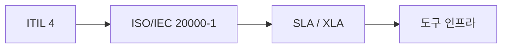
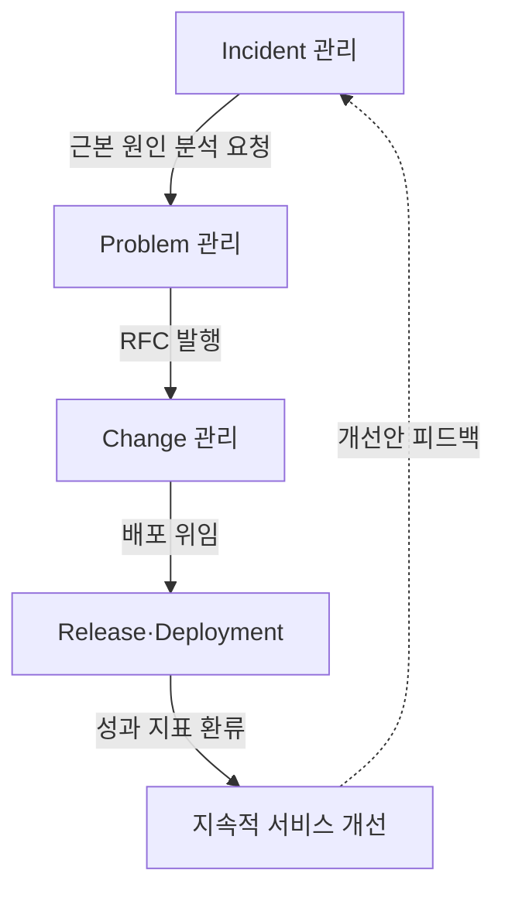
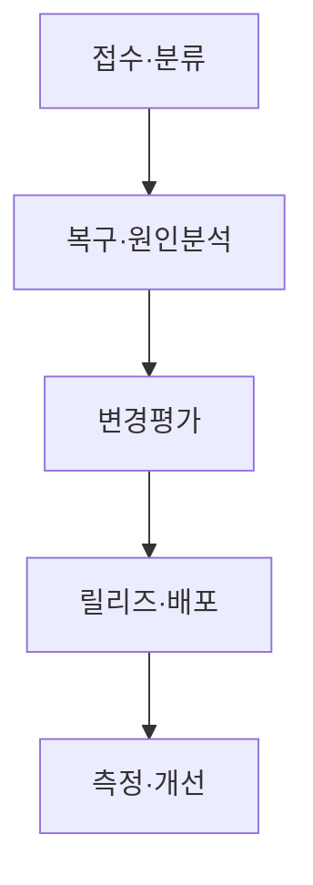

## 지식 로드맵 내 현재 위치

  IT 전략·관리
  서비스 운영·관리
  <strong>ITSM</strong>

## 30초 인출

- 본질: 개별 인프라 장비가 아닌 고객 중심의 End-to-End IT 서비스 생명주기를 관리하여 비즈니스 가치를 공동 창출(Co-creation)하는 서비스 관리 체계
- 메커니즘: 서비스 데스크 단일 창구 인입 → 인시던트(신속 복구) → 문제(근본 원인 규명 및 KEDB) → 변경(위험 평가 및 CAB 승인) → 릴리즈/배포 및 CMDB 형상 갱신 → 지속적 서비스 개선(CSI)
- 판정 기준: 변경 작업으로 인한 2차 장애율 < 1% 및 목표 MTTR 달성률 >= 99% 유지

핵심 용어

- **ITSM(IT Service Management)**: 서비스의 기획·설계·전환·제공·개선을 통해 고객과 가치를 공동창출하는 관리 활동
- **ITIL(Information Technology Infrastructure Library)**: 서비스 가치체계와 실천방법을 제공하는 ITSM 모범사례
- **SMS(Service Management System)**: 서비스 관리 방침·목표·프로세스·자원을 수립·운영·개선하는 경영시스템
- **SLA(Service Level Agreement)**: 서비스 제공자와 고객이 합의한 서비스 수준과 측정·보고 기준
- **KEDB(Known Error Database)**: Known Error와 Workaround를 관리하는 지식 저장소
- **CAB(Change Advisory Board)**: 변경의 평가·우선순위·승인을 지원하는 자문기구
- **RFC(Request for Change)**: 변경 제안을 공식적으로 요청하는 기록·절차
- **XLA(eXperience Level Agreement)**: 사용자 경험 관점에서 서비스 수준을 약속하는 협약
- **CMDB(Configuration Management Database)**: 서비스와 CI(Configuration Item)의 관계·속성·상태를 관리하는 데이터베이스
- **SVS(Service Value System)**: ITIL 4에서 수요와 기회를 가치로 전환하는 구성요소 체계

## 예상문제

> ITSM의 개념과 ITIL 4·ISO/IEC 20000의 관계를 설명하고, Incident·Problem·Change·Release 관리의 연계 및 개선방안을 제시하시오. **(미출제 예상·25점)**

## Ⅰ. ITSM의 개요

> ITSM의 관리대상은 개별 장비가 아니라 고객이 사용하는 **End-to-End 서비스와 가치흐름**임.

- 정의: 서비스 요구사항을 충족하고 가치를 제공하도록 서비스의 기획·설계·전환·운영·개선을 관리하는 체계
- 목적: **서비스 가치 · 품질 일관성 · 운영효율 · 지속개선**

## Ⅱ. ITSM 구성체계

> ITIL 4는 실천방법, ISO/IEC 20000-1은 SMS 요구사항, SLA는 고객과의 서비스 수준 약속을 담당함.

| 체계 | 역할 | 적용 초점 |
|---|---|---|
| **ITIL 4** | SVS·4 Dimensions·Practices | 가치흐름·실천방법 |
| **ISO/IEC 20000-1** | SMS 수립·운영·유지·개선 요구사항 | 적합성·관리체계 |
| **SLA** | 서비스 수준·측정·보고·조치 합의 | 고객 약속 |
| **도구체계** | Service Desk·KEDB·CMDB·자동화 | 실행·데이터·증적 |

## Ⅲ. 핵심 Practice 연계

> Incident 복구와 Problem 원인제거를 구분하고, Change·Release로 개선을 안전하게 반영함.

| Practice | 목표 | 핵심 활동 | 산출 |
|---|---|---|---|
| **Incident Management** | 서비스 신속복구 | 기록·분류·우선순위·복구 | Incident Record |
| **Problem Management** | 재발 가능성·영향 감소 | 원인분석·Known Error·Workaround | Problem Record · KEDB |
| **Change Enablement** | 변경 성공률 제고 | 위험평가·승인·일정조정 | Change Record |
| **Release Management** | 변경 기능 사용 가능화 | 릴리즈 계획·검증·승인 | Release Package |
| **Deployment Management** | 구성요소 운영환경 이동 | 배포·검증·복구 | 배포결과 · CMDB 갱신 |

## Ⅳ. 운영·개선 절차

> 서비스 흐름의 입력·판정·산출이 구분되어야 티켓이 프로세스 사이에서 유실되지 않음.

## Ⅴ. 문제점·대응책

> 프로세스 통제와 자동화의 균형이 서비스 안정성과 변경속도를 좌우함.

| 위험 | 대책 | 효과 |
|---|---|---|
| **Incident·Problem 혼재** | 복구목표와 원인제거 책임 분리 | 신속복구·재발감소 |
| **변경승인 병목** | 위험 기반 Standard·Normal·Emergency 분류 | 통제·속도 균형 |
| **CMDB 불일치** | Discovery·IaC·배포 파이프라인 연계 | 영향분석 신뢰성 향상 |
| **SLA 수박효과** | 사용자 여정·경험·성과지표 병행 | 체감품질 반영 |

## Ⅵ. 가치흐름 중심 기술사적 제언

> ITSM의 성과는 티켓 종료량이 아니라 서비스 중단을 빠르게 복구하고 원인을 제거한 뒤 안전한 변경으로 학습을 반영하는 속도에 있음.

### 학습자 통찰 메모 — 답안 밖

- `[핵심 통찰]` ITSM의 성과는 티켓 종료량이 아니라 서비스 중단을 빠르게 복구하고 원인을 제거한 뒤 안전한 변경으로 학습을 반영하는 속도에 있음.
- `나라면` 서비스별 가치흐름을 기준으로 티켓·KEDB·Change·Release·CMDB를 연결하고, 저위험 표준변경만 자동화하되 SLO 위반과 변경실패를 함께 보겠음.

### 실전 답안용 기술사적 제언

- **판정 기준**: 변경 작업으로 인한 2차 장애 발생률 1% 미만 및 장애 발생 시 MTTR(평균 복구 시간) 목표치 달성률 99% 이상.
- **공학적 대안**: 정적 문서 중심 탈피, CI/CD 자동화 파이프라인과 **CMDB 자동 디스커버리**, 그리고 **AIOps 기반 이상징후 조기 탐지** 결합.
- **검증 절차**: 분기별 KEDB 미해결 에러(Known Error) 재발 건수 분석 및 CAB 변경 승인 리드타임 측정.
- **기대 효과**: 배포 속도와 시스템 안정성의 양립, 서비스 연속성 보장 및 최종 사용자 경험(XLA) 극대화.

## 1교시 10점 답안 발췌

### 1. 정의·목적

- 정의: 서비스 요구사항을 충족하고 가치를 제공하도록 서비스의 전 수명주기를 관리하는 체계
- 목적: **서비스 가치 · 품질 일관성 · 운영효율 · 지속개선**

### 2. 핵심 연계

### 3. 핵심 통제

- **지식·형상**: KEDB · CMDB로 복구와 영향분석 지원
- **측정·개선**: SLA·사용자경험·변경성과를 개선 Backlog로 환류

## 출제 이력과 검증 출처

- 공식 문제지 원문으로 확인한 직접 기출 없음
- [ISO/IEC 20000-1:2018 — Service management system requirements](https://www.iso.org/standard/70636.html)
- [PeopleCert: ITIL 4 Foundation](https://www.peoplecert.org/browse-certifications/it-governance-and-service-management/ITIL-1/itil-4-foundation-2565)

## 학습 체크

- [ ] Ⅰ. ITSM의 정의·목적을 서비스 가치 관점에서 설명할 수 있는가?
- [ ] Ⅱ. ITIL 4·ISO/IEC 20000-1·SLA의 역할을 구분할 수 있는가?
- [ ] Ⅲ. Incident·Problem·Change·Release·Deployment의 목표와 산출을 연결할 수 있는가?
- [ ] Ⅳ. 접수부터 개선 Backlog까지 운영 절차를 설명할 수 있는가?
- [ ] Ⅴ~Ⅵ. 승인병목·CMDB 불일치·수박효과의 대응책을 제시할 수 있는가?

## 연결 토픽

- 이전 토픽: [ISO 21500](./043_iso_21500.md)
- 연관 토픽: [SLA](./006_sla.md), [ISO/IEC 38500](./002_iso_iec_38500.md), [IT 아웃소싱](./033_it_outsourcing.md)
- 다음 토픽: [MECE](./045_mece.md)
