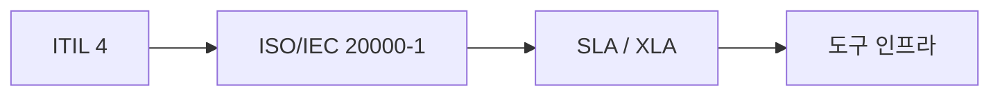
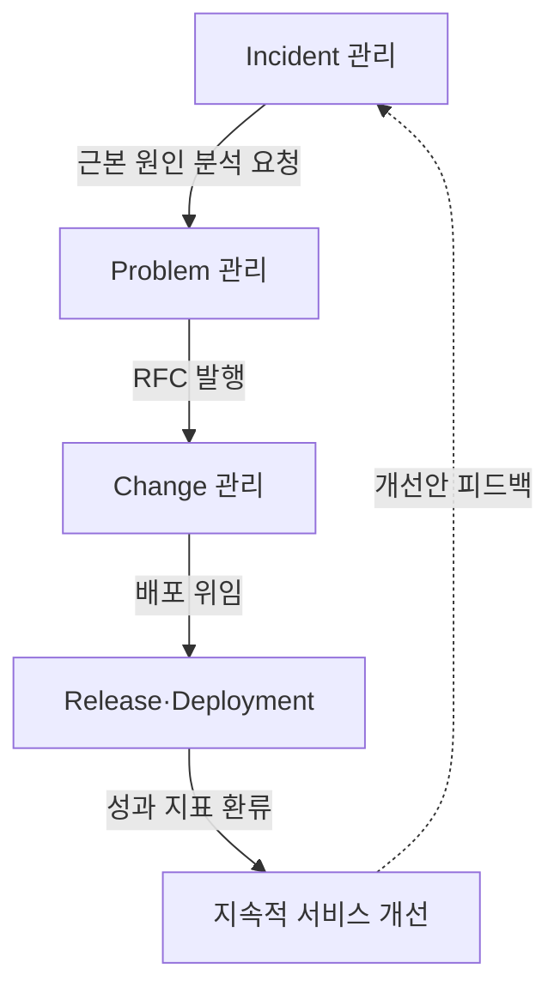
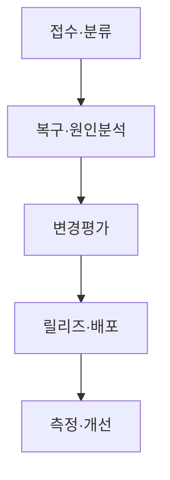
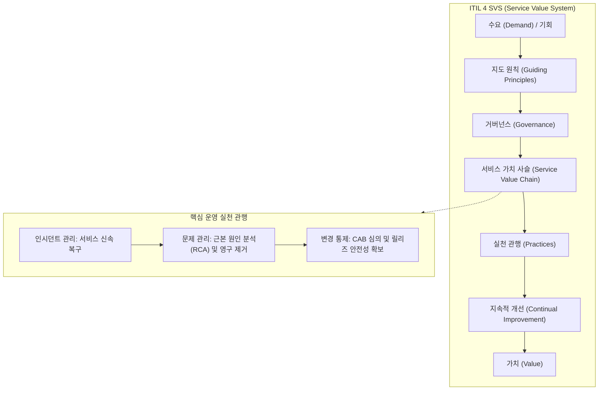

## 지식 로드맵 내 현재 위치

지식 위치: IT 전략·관리 → IT 서비스 관리·운영 거버넌스 → **ITSM**

## 30초 인출

- 본질: 개별 인프라 장비가 아닌 고객 중심의 End-to-End IT 서비스 생명주기를 관리하여 비즈니스 가치를 공동 창출(Co-creation)하는 서비스 관리 체계이다.
- 메커니즘: 서비스 데스크를 중심으로 인시던트 복구, 문제 원인·KEDB, 변경·CAB, 릴리즈·CMDB 정보를 연결해 지속적으로 서비스를 개선한다.
- 판정 기준: 변경 후 장애와 복구시간을 기준선과 비교하고 서비스 수준 목표의 충족 여부를 검증한다.

핵심 용어

- **ITSM(IT Service Management)**: 서비스의 기획·설계·전환·제공·개선을 통해 고객과 가치를 공동창출하는 관리 체계이다.
- **ITIL(Information Technology Infrastructure Library)**: 서비스 가치체계와 실천방법을 제공하는 ITSM 모범사례이다.
- **SMS(Service Management System)**: 서비스 관리 방침·목표·프로세스·자원을 수립·운영·개선하는 경영시스템이다.
- **SLA(Service Level Agreement)**: 서비스 제공자와 고객이 합의한 서비스 수준과 측정·보고 기준이다.
- **KEDB(Known Error Database)**: Known Error와 Workaround를 관리하는 지식 저장소이다.
- **CAB(Change Advisory Board)**: 변경의 평가·우선순위·승인을 지원하는 자문기구이다.
- **RFC(Request for Change)**: 변경 제안을 공식적으로 요청하는 기록·절차이다.
- **XLA(eXperience Level Agreement)**: 사용자 경험 관점에서 서비스 수준을 약속하는 협약이다.
- **CMDB(Configuration Management Database)**: 서비스와 CI(Configuration Item)의 관계·속성·상태를 관리하는 데이터베이스이다.
- **SVS(Service Value System)**: ITIL 4에서 수요와 기회를 가치로 전환하는 구성요소 체계이다.

## 예상문제

> ITSM의 개념과 ITIL 4·ISO/IEC 20000의 관계를 설명하고, Incident·Problem·Change·Release 관리의 연계 및 개선방안을 제시하시오. **(미출제 예상·25점)**

## Ⅰ. ITSM의 개요

> ITSM의 관리대상은 개별 장비가 아니라 고객이 사용하는 **End-to-End 서비스와 가치흐름**임.

- 정의: **서비스 가치체계**를 기반으로 서비스의 기획·설계·전환·운영·개선을 통합 관리하는 체계
- 목적: **서비스 가치** · **품질 일관성** · **운영효율** · **지속개선** 확보

## Ⅱ. ITSM 구성체계

> ITIL 4는 실천방법, ISO/IEC 20000-1은 SMS 요구사항, SLA는 고객과의 서비스 수준 약속을 담당함.

| 체계 | 역할 | 적용 초점 |
|---|---|---|
| **ITIL 4** | SVS·4 Dimensions·Practices | 가치흐름·실천방법 |
| **ISO/IEC 20000-1** | SMS 수립·운영·유지·개선 요구사항 | 적합성·관리체계 |
| **SLA** | 서비스 수준·측정·보고·조치 합의 | 고객 약속 |
| **도구체계** | Service Desk·KEDB·CMDB·자동화 | 실행·데이터·증적 |

## Ⅲ. 핵심 Practice 연계

> Incident 복구와 Problem 원인제거를 구분하고, Change·Release로 개선을 안전하게 반영함.

| Practice | 목표 | 핵심 활동 | 산출 |
|---|---|---|---|
| **Incident Management** | 서비스 신속복구 | 기록·분류·우선순위·복구 | Incident Record |
| **Problem Management** | 재발 가능성·영향 감소 | 원인분석·Known Error·Workaround | Problem Record · KEDB |
| **Change Enablement** | 변경 성공률 제고 | 위험평가·승인·일정조정 | Change Record |
| **Release Management** | 변경 기능 사용 가능화 | 릴리즈 계획·검증·승인 | Release Package |
| **Deployment Management** | 구성요소 운영환경 이동 | 배포·검증·복구 | 배포결과 · CMDB 갱신 |

## Ⅳ. 운영·개선 절차

> 서비스 흐름의 입력·판정·산출이 구분되어야 티켓이 프로세스 사이에서 유실되지 않음.

## Ⅴ. 문제점·대응책

> 프로세스 통제와 자동화의 균형이 서비스 안정성과 변경속도를 좌우함.

| 위험 | 대책 | 효과 |
|---|---|---|
| **Incident·Problem 혼재** | 복구목표와 원인제거 책임 분리 | 신속복구·재발감소 |
| **변경승인 병목** | 위험 기반 Standard·Normal·Emergency 분류 | 통제·속도 균형 |
| **CMDB 불일치** | Discovery·IaC·배포 파이프라인 연계 | 영향분석 신뢰성 향상 |
| **SLA 수박효과** | 사용자 여정·경험·성과지표 병행 | 체감품질 반영 |

## Ⅵ. 가치흐름 중심 기술사적 제언

> ITSM의 성과는 티켓 종료량이 아니라 서비스 중단을 빠르게 복구하고 원인을 제거한 뒤 안전한 변경으로 학습을 반영하는 속도에 있음.

### 실전 답안용 기술사적 제언

- 문제: IT 운영 조직이 시스템 가동률 등 내부 기술 지표에만 매몰되어 실제 비즈니스 사용자의 체감 가치 및 신속한 변경 요구에 부응하지 못함.
- 해결 방안: ITIL 4 기반 SVS(서비스 가치 시스템)를 도입하여 4차원 모델(조직, 정보, 파트너, 가치흐름)을 통합 관리하고, 인시던트-문제-변경 관리의 자동화 워크플로우와 서비스 데스크 중심의 SLA 모니터링을 확립함.

## 1교시 10점 답안 발췌

### 1. 정의·목적

- 정의: **서비스 가치체계**를 기반으로 서비스의 기획·설계·전환·운영·개선을 통합 관리하는 체계
- 목적: **서비스 가치** · **품질 일관성** · **운영효율** · **지속개선** 확보

### 2. 핵심 구조 및 체계

- 정의: 고객 중심의 IT 서비스 수명주기를 관리하고 가치를 공동 창출(Co-creation)하기 위한 프로세스·조직·도구의 통합 프레임워크
- 핵심 메커니즘: 인시던트 관리(신속 복구) → 문제 관리(근본 원인 분석 및 KEDB 축적) → 변경·릴리즈 관리(CAB 평가 및 CMDB 갱신) → 지속적 서비스 개선(SLA/XLA)

## 출제 이력과 검증 출처

- 공식 문제지 원문으로 확인한 직접 기출 없음
- [ISO/IEC 20000-1:2018 — Service management system requirements](https://www.iso.org/standard/70636.html)
- [PeopleCert: ITIL 4 Foundation](https://www.peoplecert.org/browse-certifications/it-governance-and-service-management/ITIL-1/itil-4-foundation-2565)

## 학습 체크

- [ ] Ⅰ. ITSM의 정의·목적을 서비스 가치 관점에서 설명할 수 있는가?
- [ ] Ⅱ. ITIL 4·ISO/IEC 20000-1·SLA의 역할을 구분할 수 있는가?
- [ ] Ⅲ. Incident·Problem·Change·Release·Deployment의 목표와 산출을 연결할 수 있는가?
- [ ] Ⅳ. 접수부터 개선 Backlog까지 운영 절차를 설명할 수 있는가?
- [ ] Ⅴ~Ⅵ. 승인병목·CMDB 불일치·수박효과의 대응책을 제시할 수 있는가?

## 연결 토픽

- 이전 토픽: [ISO 21500](./043_iso_21500.md)
- 연관 토픽: [SLA](./006_sla.md), [ISO/IEC 38500](./002_iso_iec_38500.md), [IT 아웃소싱](./033_it_outsourcing.md)
- 다음 토픽: [MECE](./045_mece.md)
