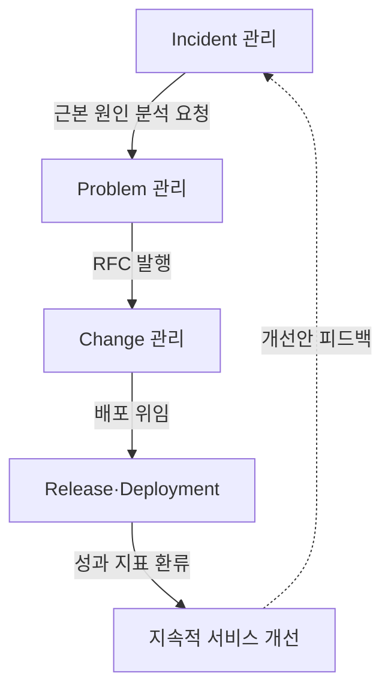
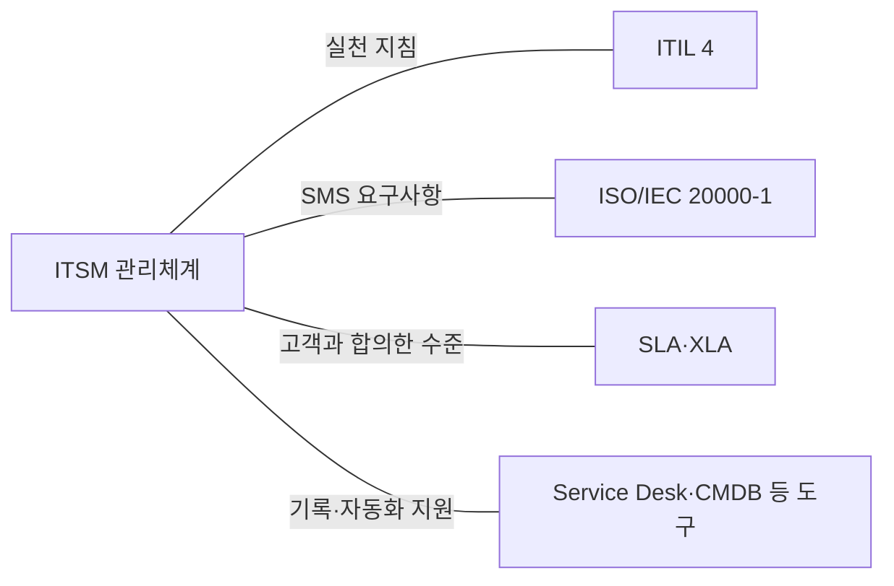
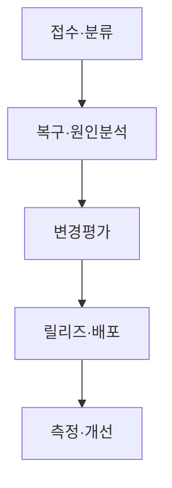

## 지식 로드맵 내 현재 위치

지식 위치: IT 전략·관리 → IT 서비스 관리·운영 거버넌스 → **ITSM**

## 30초 인출

- 본질: **ITSM**: 고객에게 제공하는 IT 서비스의 설계·전환·운영·개선을 관리하는 방식.
- 메커니즘: 서비스 데스크를 중심으로 한 인시던트 복구, 문제원인·**KEDB**, 변경·**CAB**, 릴리즈·**CMDB** 정보의 연계와 지속 개선.
- 판정 기준: 변경 후 장애·복구시간의 기준선 비교와 서비스수준 목표 충족 여부.

핵심 용어

- **ITSM(IT Service Management)** : 서비스 기획·설계·전환·운영·개선을 통해 비즈니스 가치를 공동 창출하는 IT 관리 체계
- **ITIL(Information Technology Infrastructure Library)** : 서비스 가치 사슬과 실천 프랙티스를 제공하는 ITSM 모범 실무 프레임워크
- **SMS(Service Management System)** : 서비스 관리 방침·목표·프로세스를 통합 통제하는 경영 시스템(ISO/IEC 20000 기반)
- **SLA(Service Level Agreement)** : 서비스 제공자와 고객 간 합의한 정량적 서비스 수준과 측정·평가 기준
- **KEDB(Known Error Database)** : 기인지된 오류의 근본원인과 임시 우회책(Workaround)을 관리하는 지식 저장소
- **CAB(Change Advisory Board)** : 변경의 비즈니스 영향도와 위험을 평가하고 우선순위·승인을 심의하는 자문 기구
- **RFC(Request for Change)** : 서비스 및 인프라의 구성 변경을 공식적으로 제안·신청하는 표준 절차 및 문서
- **XLA(eXperience Level Agreement)** : 최종 사용자 체감 품질과 만족도 관점에서 서비스 수준을 정의한 경험 협약
- **CMDB(Configuration Management Database)** : 서비스와 구성항목(CI)의 속성 및 상호 연관관계를 관리하는 통합 데이터베이스
- **SVS(Service Value System)** : ITIL 4에서 비즈니스 수요와 기회를 실질적 가치로 전환하는 구성요소 프레임워크

---

## 1교시 예상문제 (10점)

> ITSM의 핵심 프로세스와 서비스 운영 연계를 설명하시오. (예상·10점)

---

## 1교시 10점 답안

### Ⅰ. **ITSM** 개요

| 구분 | 핵심 |
|---|---|
| 정의 | **ITSM**: IT 서비스의 설계·전환·제공·개선을 관리하는 체계 |
| 목적 | 서비스 요구 충족과 고객·조직 가치 제공 |

### Ⅱ. 핵심 구조 및 체계

- 핵심 메커니즘: 인시던트 관리(신속 복구) → 문제 관리(근본 원인 분석 및 **KEDB** 축적) → 변경·릴리즈 관리(**CAB** 평가 및 **CMDB** 갱신) → 지속적 서비스 개선(**SLA**/**XLA**)

---

## 2~4교시 예상문제 (25점)

> ITSM의 개념과 ITIL 4·ISO/IEC 20000의 관계를 설명하고, Incident·Problem·Change·Release 관리의 연계 및 개선방안을 제시하시오. **(미출제 예상·25점)**

---

## 2~4교시 25점 답안

## Ⅰ. **ITSM** 개요

> ITSM의 관리대상은 개별 장비가 아니라 고객이 사용하는 **End-to-End 서비스와 가치흐름** 임.

| 구분 | 핵심 |
|---|---|
| 정의 | **ITSM**: IT 서비스의 설계·전환·제공·개선을 관리하는 체계 |
| 목적 | 서비스 요구 충족과 고객·조직 가치 제공 |

## Ⅱ. ITSM 구성체계

> **ITIL** 4는 실천방법, ISO/IEC 20000-1은 **SMS** 요구사항, **SLA**는 고객과의 서비스 수준 약속을 담당함.

| 체계 | 역할 | 적용 초점 |
|---|---|---|
| **ITIL 4** | **SVS**·4 Dimensions·Practices | 가치흐름·실천방법 |
| **ISO/IEC 20000-1** | SMS 수립·운영·유지·개선 요구사항 | 적합성·관리체계 |
| **SLA** | 서비스 수준·측정·보고·조치 합의 | 고객 약속 |
| **도구체계** | Service Desk·**KEDB**·**CMDB**·자동화 | 실행·데이터·증적 |

## Ⅲ. 핵심 Practice 연계

> Incident 복구와 Problem 원인제거를 구분하고, Change·Release로 개선을 안전하게 반영함.

| Practice | 목표 | 핵심 활동 | 산출 |
|---|---|---|---|
| **Incident Management** | 서비스 신속복구 | 기록·분류·우선순위·복구 | Incident Record |
| **Problem Management** | 재발 가능성·영향 감소 | 원인분석·Known Error·Workaround | Problem Record · KEDB |
| **Change Enablement** | 변경 성공률 제고 | 위험평가·승인·일정조정 | Change Record |
| **Release Management** | 변경 기능 사용 가능화 | 릴리즈 계획·검증·승인 | Release Package |
| **Deployment Management** | 구성요소 운영환경 이동 | 배포·검증·복구 | 배포결과 · CMDB 갱신 |

## Ⅳ. 운영·개선 절차

> 서비스 흐름의 입력·판정·산출이 구분되어야 티켓이 프로세스 사이에서 유실되지 않음.

## Ⅴ. 문제점·대응책

> 프로세스 통제와 자동화의 균형이 서비스 안정성과 변경속도를 좌우함.

| 위험 | 대책 | 효과 |
|---|---|---|
| **Incident·Problem 혼재** | 복구목표와 원인제거 책임 분리 | 신속복구·재발감소 |
| **변경승인 병목** | 위험 기반 Standard·Normal·Emergency 분류 | 통제·속도 균형 |
| **CMDB 불일치** | Discovery·IaC·배포 파이프라인 연계 | 영향분석 신뢰성 향상 |
| **SLA 수박효과** | 사용자 여정·경험·성과지표 병행 | 체감품질 반영 |

## Ⅵ. 서비스 성과 책임 제언

| 문제 | 해결 방안 |
|---|---|
| 티켓 처리량·개별 시스템 가동률만으로는 드러나지 않는 이용자 중단 영향과 반복 장애 비용 | 서비스별 책임자 지정, 장애·변경·사용자 영향자료를 함께 검토하는 개선 우선순위·투자결정의 주기적 갱신 |

제안의 범위: ITSM 운영요구와 조직 성과관리의 연계. 특정 지표·조직구조의 표준 의무는 아님.

## 출제 이력과 검증 출처

- 공식 문제지 원문으로 확인한 직접 기출 없음
- [ISO/IEC 20000-1:2018 — Service management system requirements](https://www.iso.org/standard/70636.html)
- [PeopleCert: ITIL 4 Foundation](https://www.peoplecert.org/browse-certifications/it-governance-and-service-management/ITIL-1/itil-4-foundation-2565)

## 연결 토픽

- 이전 토픽: [ISO 21500](./043_iso_21500.md)
- 연관 토픽: [SLA](./006_sla.md), [ISO/IEC 38500](./002_iso_iec_38500.md), [IT 아웃소싱](./033_it_outsourcing.md)
- 다음 토픽: [MECE](./045_mece.md)
