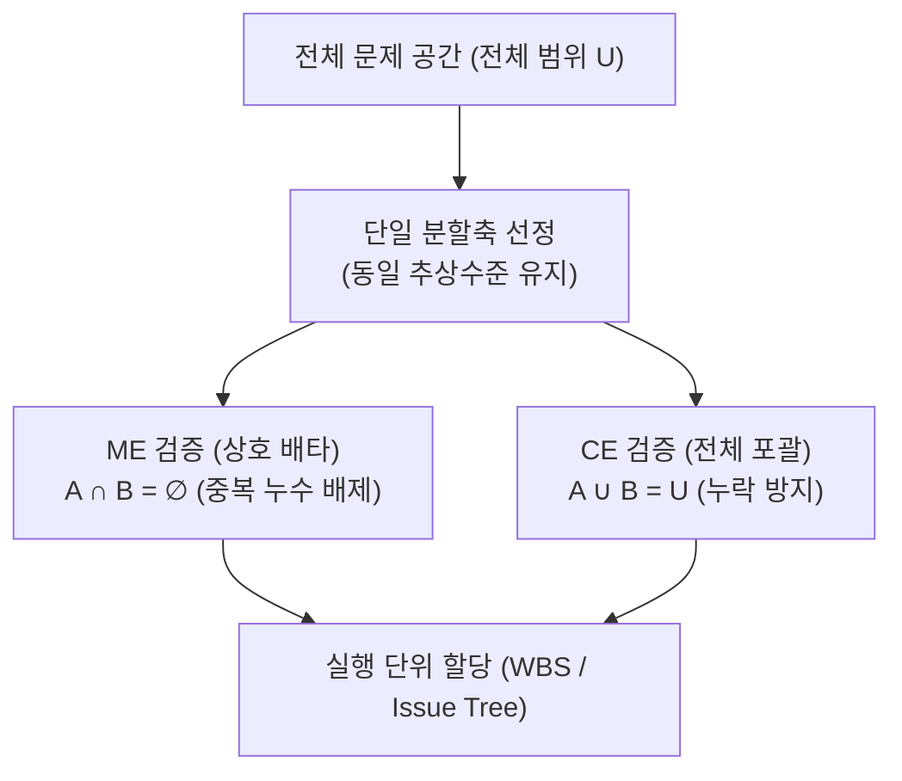
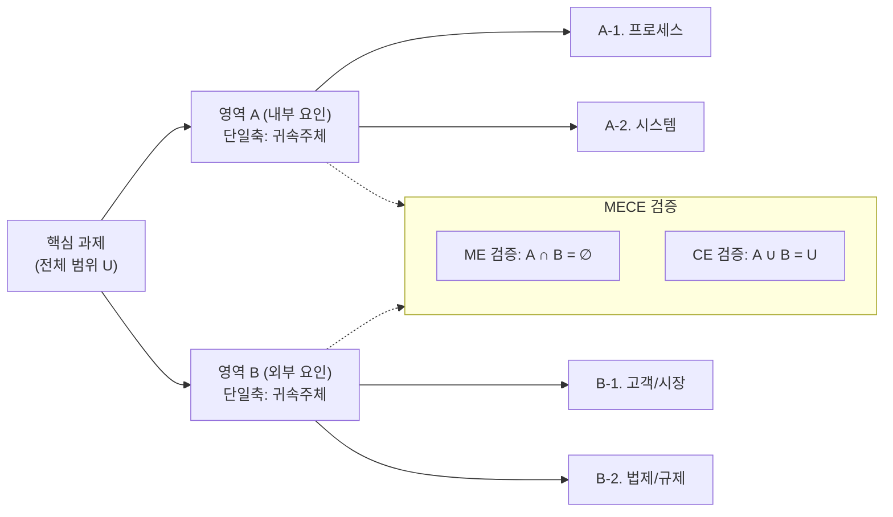
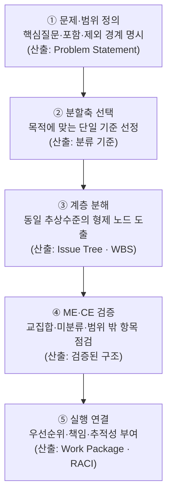
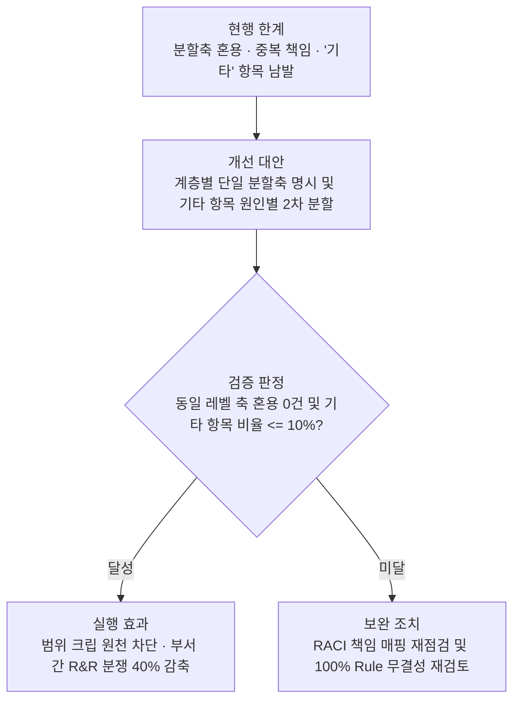

## 지식 로드맵 내 현재 위치

  IT 전략·관리
  문제 구조화·의사결정
  <strong>MECE</strong>

## 30초 인출

- 본질: 같은 계층을 하나의 분할축으로 나누어 상호 배타(ME)와 전체 포괄(CE)을 달성하는 문제 구조화 원칙
- 메커니즘: 전체 경계 정의 → 단일 분할축 선정 → 동일 추상수준 계층 분해 → ME·CE 무결성 검증 → 실행단위·책임(RACI) 할당
- 판정 기준: 동일 레벨 내 분할축 혼용 0건 및 잔여 '기타' 항목 비율 <= 10% 이내 유지

핵심 용어

- **MECE(Mutually Exclusive, Collectively Exhaustive)**: 분류 항목끼리 겹치지 않으면서 전체 범위를 빠짐없이 포괄하도록 구조화하는 원칙
- **ME(Mutually Exclusive)**: 동일 계층 항목의 의미·범위가 서로 겹치지 않는 상태
- **CE(Collectively Exhaustive)**: 동일 계층 항목을 합치면 정의한 전체 범위를 포괄하는 상태
- **Issue Tree**: 핵심 질문을 원인·해법·가설 등 하나의 축으로 계층 분해한 구조
- **WBS(Work Breakdown Structure)**: 프로젝트 범위를 인도물·작업 중심으로 계층 분해한 구조
- **100% Rule**: 하위 구성요소가 상위 범위를 빠짐없이 나타내며 상위 범위 밖 작업을 포함하지 않는 WBS 원칙

## 예상문제

> MECE의 개념과 구조화 절차를 설명하고, Issue Tree·WBS 적용 시 문제점과 대응책을 제시하시오. **(미출제 예상·25점)**

## Ⅰ. MECE의 개요

> MECE는 현실을 완벽히 분할한다는 선언이 아니라 **분류 논리의 중복·누락을 검토하는 품질 기준**임.

- 정의: 동일 계층의 항목을 상호 배타적이고 전체 포괄적으로 구성하는 문제 구조화 원칙
- 목적: **논점 명확화 · 중복업무 축소 · 누락위험 감소**

## Ⅱ. 구성 원칙

> 분류 경계·축·추상수준이 일치해야 ME와 CE를 검증할 수 있음.

| 원칙 | 확인 질문 | 오류 징후 |
|---|---|---|
| **경계 정의** | 전체 U의 시작·끝은 어디인가? | 범위 밖 항목 혼입 |
| **단일 분할축** | 같은 기준으로 나눴는가? | 기능·조직·시간 혼용 |
| **동일 추상수준** | 형제 노드의 수준이 같은가? | 상위개념과 세부작업 병렬 |
| **ME 검증** | 두 항목에 동시에 속하는가? | 책임·비용 중복 |
| **CE 검증** | 어느 항목에도 속하지 않는가? | 요구사항·업무 누락 |

## Ⅲ. 분할 방식

> 대상에 맞는 축을 선택하되 동일 계층에서는 혼용하지 않음.

| 방식 | 분할축 | 적용 예 |
|---|---|---|
| **이분법** | A / Not A | 내부·외부 · 정형·비정형 |
| **프로세스** | 시간·단계 | 기획 → 구축 → 운영 |
| **구성요소** | 구조·기능 | 애플리케이션·데이터·인프라 |
| **이해관계자** | 역할·대상 | 고객·운영자·규제기관 |
| **프레임워크** | 검증된 관점 | SWOT · PEST · 3C |

## Ⅳ. Issue Tree·WBS 적용 절차

> 논점 구조는 분석 가능한 질문으로, WBS는 책임 가능한 작업단위로 끝나야 함.

## Ⅴ. 문제점·대응책

> 형식적 완전성을 위해 억지 분류를 만들면 오히려 의사결정이 흐려짐.

| 위험 | 대책 | 효과 |
|---|---|---|
| **분할축 혼용** | 계층별 분할 기준 명시 | 중복·모호성 감소 |
| **기타 항목 남용** | 미분류 원인 분석·분류체계 갱신 | 누락 가시화 |
| **과도한 세분화** | 의사결정·책임 가능한 수준에서 중단 | 관리부담 완화 |
| **가짜 완전성** | 전문가 검토·반례·데이터로 재검증 | 현실 적합성 향상 |

## Ⅵ. 검증 가능한 구조화 중심 제언

### 학습자 통찰 메모 — 답안 밖

`[핵심 통찰]` MECE의 품질은 항목 수가 아니라 분할축이 명시되고, 중복·미분류 항목을 반례로 검증할 수 있는가에 달려 있음.

`나라면` Issue Tree와 WBS의 각 계층에 분할축을 기록하고, 미분류 요구사항과 중복 책임을 검토한 뒤 Baseline으로 승인하겠음.

### 실전 답안용 기술사적 제언

- **판정 기준 (Trigger)**: WBS 및 Issue Tree 작성 시 동일 레벨 내 분할축 혼용(기능+조직 병렬), 미분류 잔여분(기타 항목) 비율이 10%를 초과할 때 즉시 구조 재검토를 발동함.
- **대응 방안 (Action)**: 계층별 단일 분할축(이분법, 프로세스, 라이프사이클)을 정의서에 명시하고, '기타' 분류 항목을 세부 원인별로 2차 분할하여 MECE 무결성을 확보함.
- **검증 체계 (Verification)**: 산출물 검토 시 상호배타성(RACI 매트릭스 책임 중복 여부)과 전체포괄성(100% Rule 및 RTM 요구사항 누락 여부)을 교차 매핑하여 형식적 완전성을 정량 검증함.
- **기대 효과 (Impact)**: 프로젝트 범위 크립(Scope Creep) 원천 차단, 부서 간 업무 R&R 분쟁 40% 이상 감축, 의사결정 추적성 확보를 달성함.

## 1교시 10점 답안 발췌

### 1. 정의·목적

- 정의: 동일 계층 항목을 **상호 배타적(ME)**이고 **전체 포괄적(CE)**으로 구성하는 구조화 원칙
- 목적: **논점 명확화 · 중복업무 축소 · 누락위험 감소**

### 2. 구조화 및 검증 아키텍처

### 3. 핵심 통제

- **ME**: 의미·범위·책임의 교집합 확인
- **CE**: 미분류 요구사항·업무·위험 확인

## 출제 이력과 검증 출처

- 공식 문제지 원문으로 확인한 직접 기출 없음
- [PMI Lexicon of Project Management Terms](https://www.pmi.org/-/media/pmi/documents/registered/pdf/pmbok-standards/pmi-lexicon-pm-terms.pdf)
- [PMI Practice Standard for Work Breakdown Structures](https://www.pmi.org/pmbok-guide-standards/framework/practice-standard-work-breakdown-structures-3rd-edition)

## 학습 체크

- [ ] Ⅰ. ME와 CE의 의미·목적을 설명할 수 있는가?
- [ ] Ⅱ. 경계·분할축·추상수준·중복·누락 검증을 설명할 수 있는가?
- [ ] Ⅲ. 이분법·프로세스·구성요소·이해관계자·프레임워크 분할을 구분할 수 있는가?
- [ ] Ⅳ. Issue Tree·WBS 작성 절차와 활동·산출을 연결할 수 있는가?
- [ ] Ⅴ~Ⅵ. 축 혼용·기타 남용·과도한 세분화의 대응책을 제시할 수 있는가?

## 연결 토픽

- 이전 토픽: [ITSM](./044_itsm.md)
- 연관 토픽: [WBS](./007_wbs.md), [SWOT 분석](./034_swot_analysis.md), [프로젝트 위험관리](./009_project_risk_management_negative.md)
- 다음 토픽: [그로스 해킹](./046_growth_hacking.md)
