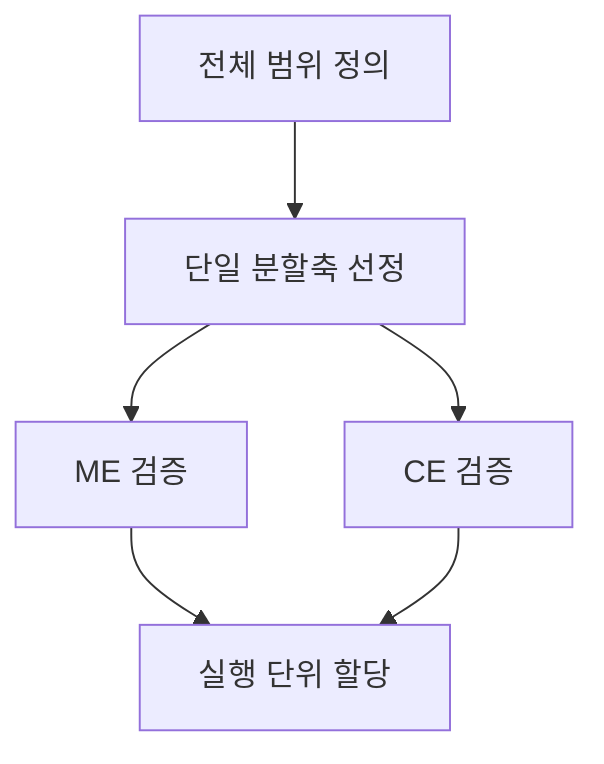
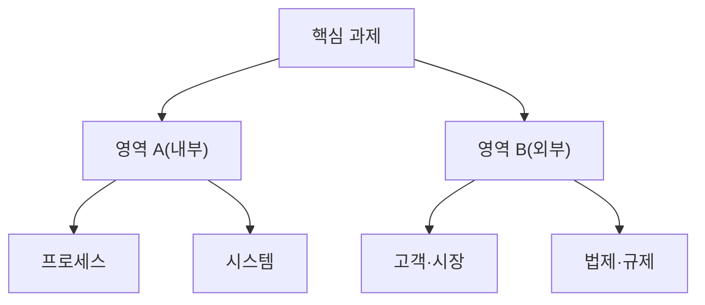
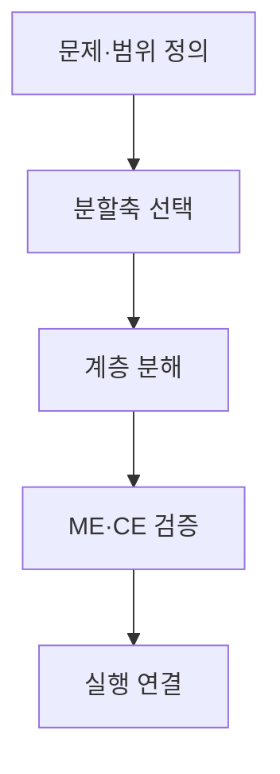
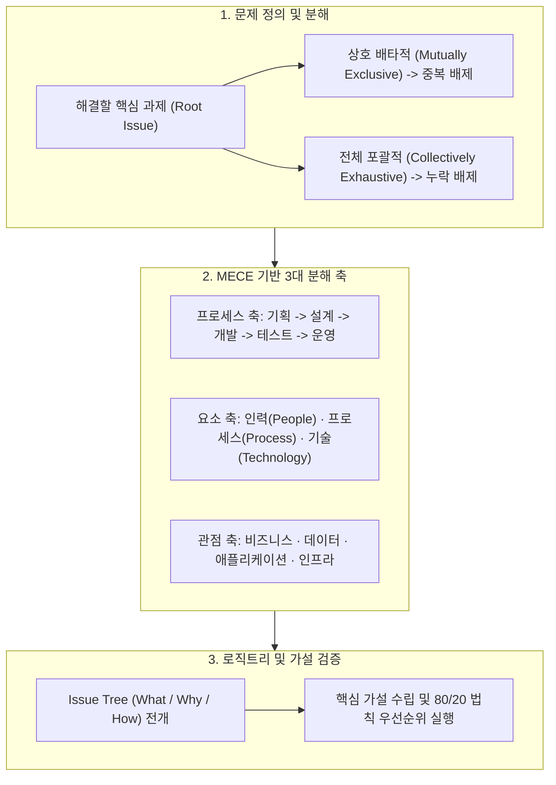

## 지식 로드맵 내 현재 위치

지식 위치: IT 전략·관리 → 전략적 사고·문제 구조화 → **MECE**

## 30초 인출

- 본질: 같은 계층을 하나의 분할축으로 나누어 상호 배타(ME)와 전체 포괄(CE)을 달성하는 문제 구조화 원칙이다.
- 메커니즘: 전체 경계 정의 → 단일 분할축 선정 → 동일 추상수준 계층 분해 → ME·CE 무결성 검증 → 실행단위·책임(RACI) 할당한다.
- 판정 기준: 동일 레벨의 분할축이 일관되고 항목의 중복·누락이 검토로 해소되는지 확인한다.

핵심 용어

- **MECE(Mutually Exclusive, Collectively Exhaustive)**: 분류 항목이 서로 겹치지 않으면서 정의한 전체 범위를 빠짐없이 포괄하도록 구조화하는 원칙이다.
- **ME(Mutually Exclusive)**: 동일 계층 항목의 의미와 범위가 서로 겹치지 않는 상태이다.
- **CE(Collectively Exhaustive)**: 동일 계층 항목을 합친 범위가 정의한 전체 대상을 빠짐없이 포함하는 상태이다.
- **Issue Tree**: 핵심 질문을 하나의 분할축에 따라 원인·해법·가설의 계층으로 분해한 구조이다.
- **WBS(Work Breakdown Structure)**: 프로젝트 범위를 인도물과 작업 중심의 계층으로 분해한 구조이다.
- **100% Rule**: WBS 하위 구성요소가 상위 범위를 빠짐없이 나타내고 범위 밖 작업을 포함하지 않도록 하는 원칙이다.

## 예상문제

> MECE의 개념과 구조화 절차를 설명하고, Issue Tree·WBS 적용 시 문제점과 대응책을 제시하시오. **(미출제 예상·25점)**

## Ⅰ. MECE의 개요

> MECE는 현실을 완벽히 분할한다는 선언이 아니라 **분류 논리의 중복·누락을 검토하는 품질 기준**임.

- 정의: **MECE** 원칙에 따라 **동일 계층**을 하나의 분할축으로 나누어 **중복과 누락**을 검증하는 문제 구조화 방법
- 목적: **Issue Tree**와 **WBS**의 범위를 명확히 하여 논점·책임·작업의 누락과 중복을 줄이는 것

## Ⅱ. 구성 원칙

> 분류 경계·축·추상수준이 일치해야 ME와 CE를 검증할 수 있음.

| 원칙 | 확인 질문 | 오류 징후 |
|---|---|---|
| **경계 정의** | 전체 U의 시작·끝은 어디인가? | 범위 밖 항목 혼입 |
| **단일 분할축** | 같은 기준으로 나눴는가? | 기능·조직·시간 혼용 |
| **동일 추상수준** | 형제 노드의 수준이 같은가? | 상위개념과 세부작업 병렬 |
| **ME 검증** | 두 항목에 동시에 속하는가? | 책임·비용 중복 |
| **CE 검증** | 어느 항목에도 속하지 않는가? | 요구사항·업무 누락 |

## Ⅲ. 분할 방식

> 대상에 맞는 축을 선택하되 동일 계층에서는 혼용하지 않음.

| 방식 | 분할축 | 적용 예 |
|---|---|---|
| **이분법** | A / Not A | 내부·외부 · 정형·비정형 |
| **프로세스** | 시간·단계 | 기획 → 구축 → 운영 |
| **구성요소** | 구조·기능 | 애플리케이션·데이터·인프라 |
| **이해관계자** | 역할·대상 | 고객·운영자·규제기관 |
| **프레임워크** | 검증된 관점 | SWOT · PEST · 3C |

## Ⅳ. Issue Tree·WBS 적용 절차

> 논점 구조는 분석 가능한 질문으로, WBS는 책임 가능한 작업단위로 끝나야 함.

## Ⅴ. 문제점·대응책

> 형식적 완전성을 위해 억지 분류를 만들면 오히려 의사결정이 흐려짐.

| 위험 | 대책 | 효과 |
|---|---|---|
| **분할축 혼용** | 계층별 분할 기준 명시 | 중복·모호성 감소 |
| **기타 항목 남용** | 미분류 원인 분석·분류체계 갱신 | 누락 가시화 |
| **과도한 세분화** | 의사결정·책임 가능한 수준에서 중단 | 관리부담 완화 |
| **가짜 완전성** | 전문가 검토·반례·데이터로 재검증 | 현실 적합성 향상 |

## Ⅵ. 검증 가능한 구조화 중심 제언

### 실전 답안용 기술사적 제언

- 문제: IT 전략 기획 및 문제 해결 시 분석 항목의 중복(Overlap)과 누락(Gap)으로 인해 잘못된 진단과 자원 낭비가 초래됨.
- 해결 방안: 상호 배타적이고 전체를 포괄하는 MECE 원칙에 따라 로직트리(Logic Tree)와 표준 프레임워크(3C, 4P, SWOT, 프로세스 단계)를 적용하여 문제 공간을 빈틈없이 구조화하고 우선순위화함.

## 1교시 10점 답안 발췌

### 1. 정의·목적

- 정의: **MECE** 원칙에 따라 **동일 계층**을 하나의 분할축으로 나누어 **중복과 누락**을 검증하는 문제 구조화 방법
- 목적: **Issue Tree**와 **WBS**의 범위를 명확히 하여 논점·책임·작업의 누락과 중복을 줄이는 것

### 2. 핵심 구조 및 체계

- 정의: 어떤 대상이나 문제를 분석할 때 상위 개념을 중복 없이(Mutually Exclusive) 완벽히 포괄(Collectively Exhaustive)하도록 분해하는 구조화 원칙
- 핵심 메커니즘: 전체 경계 정의 → 단일 분할축(프로세스/구성요소/이분법) 선정 → 동일 추상화 수준 분해 → ME·CE 무결성 및 100% Rule 검증

## 출제 이력과 검증 출처

- 공식 문제지 원문으로 확인한 직접 기출 없음
- [PMI Lexicon of Project Management Terms](https://www.pmi.org/-/media/pmi/documents/registered/pdf/pmbok-standards/pmi-lexicon-pm-terms.pdf)
- [PMI Practice Standard for Work Breakdown Structures](https://www.pmi.org/pmbok-guide-standards/framework/practice-standard-work-breakdown-structures-3rd-edition)

## 학습 체크

- [ ] Ⅰ. ME와 CE의 의미·목적을 설명할 수 있는가?
- [ ] Ⅱ. 경계·분할축·추상수준·중복·누락 검증을 설명할 수 있는가?
- [ ] Ⅲ. 이분법·프로세스·구성요소·이해관계자·프레임워크 분할을 구분할 수 있는가?
- [ ] Ⅳ. Issue Tree·WBS 작성 절차와 활동·산출을 연결할 수 있는가?
- [ ] Ⅴ~Ⅵ. 축 혼용·기타 남용·과도한 세분화의 대응책을 제시할 수 있는가?

## 연결 토픽

- 이전 토픽: [ITSM](./044_itsm.md)
- 연관 토픽: [WBS](./007_wbs.md), [SWOT 분석](./034_swot_analysis.md), [프로젝트 위험관리](./009_project_risk_management_negative.md)
- 다음 토픽: [그로스 해킹](./046_growth_hacking.md)
