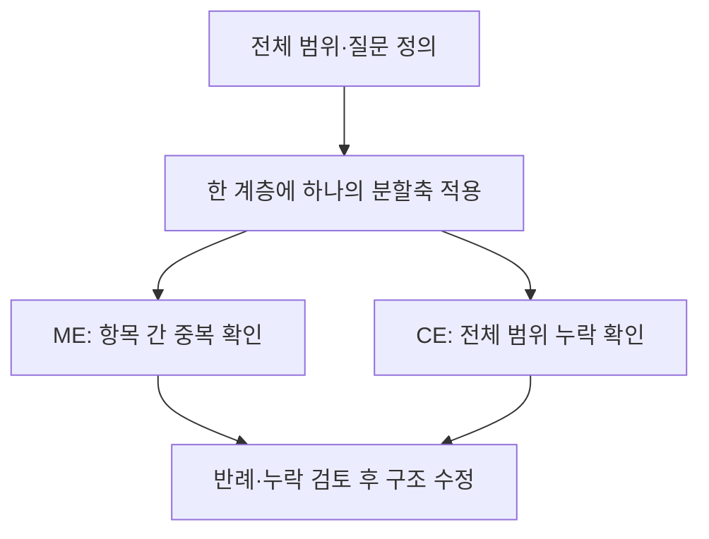
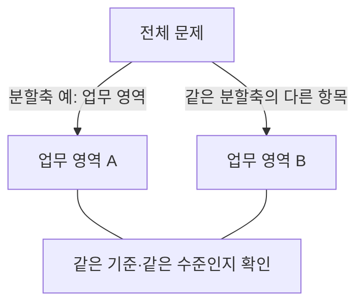
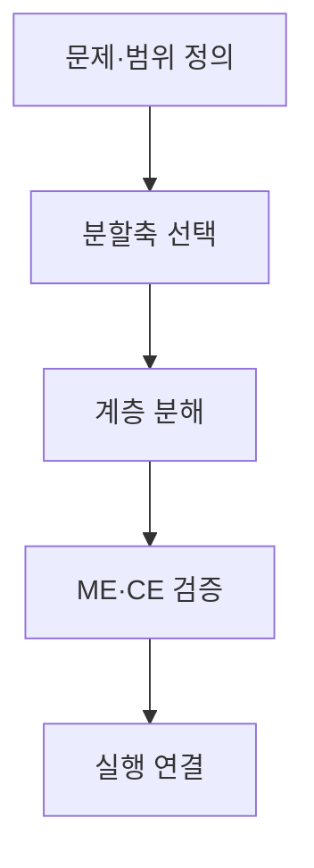

## 지식 로드맵 내 현재 위치

지식 위치: IT 전략·관리 → 전략적 사고·문제 구조화 → **MECE**

## 30초 인출

- 본질: **MECE**: 항목을 겹치지 않으면서 빠짐없이 나누는 문제 구조화 원칙.
- 메커니즘: 전체 경계·단일 분할축 정의 → 같은 추상수준으로 분해 → **ME**·**CE** 검증 → 실행단위·책임(RACI) 배정.
- 판정 기준: 같은 수준의 분할축 일관성, 항목 간 중복·누락 여부.

핵심 용어

- **MECE(Mutually Exclusive, Collectively Exhaustive)**: 항목을 서로 겹치지 않게 나누고 전체 범위를 빠짐없이 포괄하는 구조화 원칙
- **ME(Mutually Exclusive)** : 동일 계층 내 항목 간 의미와 범위가 서로 겹치지 않는 상호 배타 상태
- **CE(Collectively Exhaustive)** : 동일 계층 항목의 합이 전체 대상을 빠짐없이 포괄하는 완전 포괄 상태
- **Issue Tree** : 핵심 과제를 단일 분할축에 따라 하위 원인·가설·해법으로 분해한 계층 트리 구조
- **WBS(Work Breakdown Structure)** : 프로젝트 범위를 최종 인도물 중심의 작업 단위로 계층 분해한 체계
- **100% Rule** : 하위 요소의 작업 범위 합이 상위 요소의 전체 범위를 100% 충족해야 한다는 원칙

- **RACI(Responsible, Accountable, Consulted, Informed)**: 역할·책임을 구분하는 매트릭스. MECE의 분할축이나 검증 기준과는 구별되는 적용 수단.\n\n- **RACI(Responsible, Accountable, Consulted, Informed)**: 역할과 책임을 구분하는 매트릭스. MECE의 분할축·검증 기준과 구별되는 적용 수단.

---

## 1교시 예상문제 (10점)

> MECE에 관하여 설명하시오. (예상·10점)

---

## 1교시 10점 답안

### Ⅰ. **MECE** 개요

| 구분 | 핵심 |
|---|---|
| 정의 | **MECE**: 하나의 분할 기준에 따라 대상을 중복 없이 빠짐없이 구조화하는 원칙 |
| 목적 | 복잡한 문제의 분석 가능성 향상과 항목 간 중복·누락 확인 |

### Ⅱ. 핵심 구조 및 체계

- 핵심 메커니즘: 전체 경계 정의 → 단일 분할축(프로세스/구성요소/이분법) 선정 → 동일 추상화 수준 분해 → **ME**·**CE** 무결성 및 **100% Rule** 검증

제언: 같은 분할축·추상수준 확인과 실제 항목의 중복·누락 반례 재검토.

---

## 2~4교시 예상문제 (25점)

> MECE의 개념과 구조화 절차를 설명하고, Issue Tree·WBS 적용 시 문제점과 대응책을 제시하시오. **(미출제 예상·25점)**

---

## 2~4교시 25점 답안

## Ⅰ. **MECE** 개요

> MECE는 현실을 완벽히 분할한다는 선언이 아니라 **분류 논리의 중복·누락을 검토하는 품질 기준** 임.

| 구분 | 핵심 |
|---|---|
| 정의 | **MECE**: 하나의 분할 기준에 따라 대상을 중복 없이 빠짐없이 구조화하는 원칙 |
| 목적 | 복잡한 문제의 분석 가능성 향상과 항목 간 중복·누락 확인 |

## Ⅱ. 구성 원칙

> 분류 경계·축·추상수준이 일치해야 **ME**와 **CE**를 검증할 수 있음.

| 원칙 | 확인 질문 | 오류 징후 |
|---|---|---|
| **경계 정의** | 전체 U의 시작·끝은 어디인가? | 범위 밖 항목 혼입 |
| **단일 분할축** | 같은 기준으로 나눴는가? | 기능·조직·시간 혼용 |
| **동일 추상수준** | 형제 노드의 수준이 같은가? | 상위개념과 세부작업 병렬 |
| **ME 검증** | 두 항목에 동시에 속하는가? | 책임·비용 중복 |
| **CE 검증** | 어느 항목에도 속하지 않는가? | 요구사항·업무 누락 |

## Ⅲ. 분할 방식

> 대상에 맞는 축을 선택하되 동일 계층에서는 혼용하지 않음.

| 방식 | 분할축 | 적용 예 |
|---|---|---|
| **이분법** | A / Not A | 내부·외부 · 정형·비정형 |
| **프로세스** | 시간·단계 | 기획 → 구축 → 운영 |
| **구성요소** | 구조·기능 | 애플리케이션·데이터·인프라 |
| **이해관계자** | 역할·대상 | 고객·운영자·규제기관 |
| **프레임워크** | 검증된 관점 | SWOT · PEST · 3C |

## Ⅳ. **Issue Tree**·**WBS** 적용 절차

> 결과물의 구분: 논점 구조는 분석 가능한 질문, WBS는 책임질 수 있는 작업단위.

## Ⅴ. 한계·대응

> 형식적 완전성을 위해 억지 분류를 만들면 오히려 의사결정이 흐려짐.

| 위험 | 대책 | 효과 |
|---|---|---|
| **분할축 혼용** | 계층별 분할 기준 명시 | 중복·모호성 감소 |
| **기타 항목 남용** | 미분류 원인 분석·분류체계 갱신 | 누락 가시화 |
| **과도한 세분화** | 의사결정·책임 가능한 수준에서 중단 | 관리부담 완화 |
| **가짜 완전성** | 전문가 검토·반례·데이터로 재검증 | 현실 적합성 향상 |

## Ⅵ. 분할축 검토 책임 제언

| 한계 | 해결 방안 |
|---|---|
| 작성자가 임의의 분할축을 택할 때 남는 항목 중복·업무 누락 가능성 | 분석 전 범위·분할축·항목 포함기준을 기록하고 업무 담당자·독립 검토자의 반례·미분류 사례 확인 |

제안의 범위: MECE를 실제 의사결정에 적용하기 위한 검토 절차. 모든 문제에 공통으로 맞는 단일 분할축의 존재를 전제하지 않음.

## 출제 이력과 검증 출처

- 공식 문제지 원문으로 확인한 직접 기출 없음
- [PMI Lexicon of Project Management Terms](https://www.pmi.org/-/media/pmi/documents/registered/pdf/pmbok-standards/pmi-lexicon-pm-terms.pdf)
- [PMI Practice Standard for Work Breakdown Structures](https://www.pmi.org/pmbok-guide-standards/framework/practice-standard-work-breakdown-structures-3rd-edition)

## 연결 토픽

- 이전 토픽: [ITSM](./044_itsm.md)
- 연관 토픽: [WBS](./007_wbs.md), [SWOT 분석](./034_swot_analysis.md), [프로젝트 위험관리](./009_project_risk_management_negative.md)
- 다음 토픽: [그로스 해킹](./046_growth_hacking.md)
