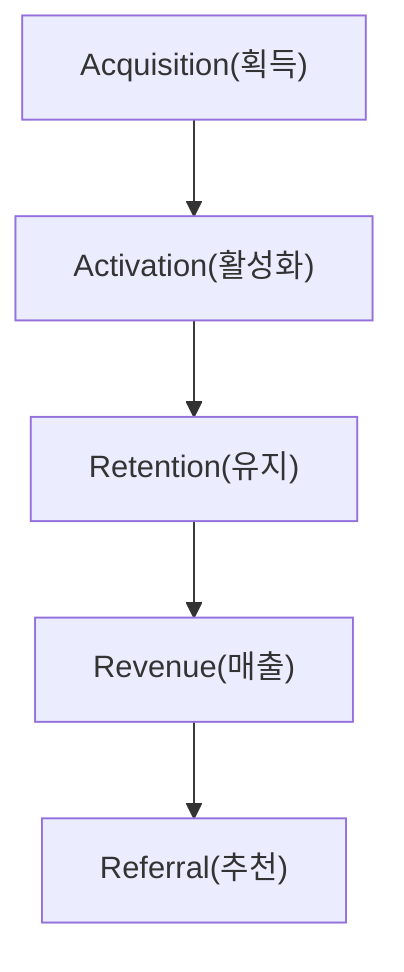
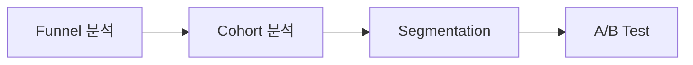
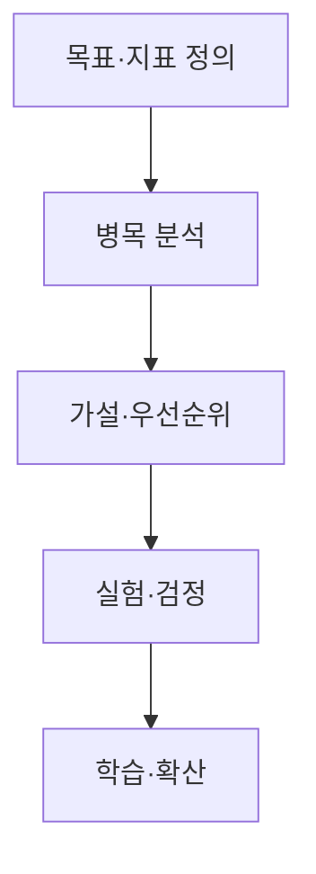
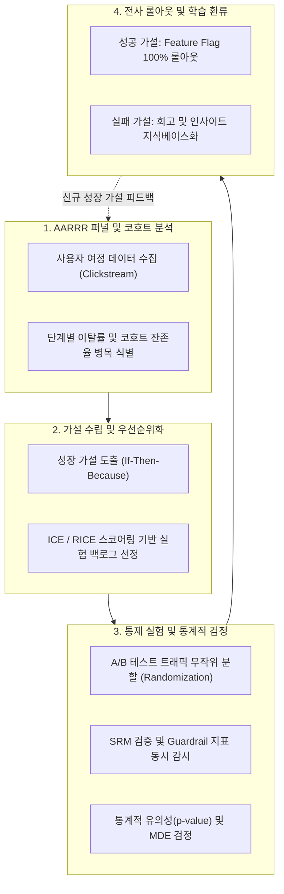

## 지식 로드맵 내 현재 위치

지식 위치: IT 전략·관리 → 데이터 기반 마케팅·성장전략 → **그로스 해킹**

## 30초 인출

- 본질: 제품·마케팅·데이터를 결합하여 지속 가능한 성장 메커니즘을 통제 실험으로 탐색하는 데이터 기반 제품 관리 접근법이다.
- 메커니즘: North Star Metric 정의 → AARRR 퍼널 및 코호트 병목 탐색 → 가설 수립(ICE 우선순위) → A/B 테스트 및 Guardrail 검정 → 학습 및 제품 환류한다.
- 판정 기준: 실험 결과가 사전 정한 분석 기준을 충족하고 Guardrail 지표 악화 없이 목표 지표가 개선되는지 확인한다.

핵심 용어

- **Growth Hacking**: 제품·마케팅·데이터 역량을 결합해 성장 가설을 빠르게 실험·학습하는 접근법이다.
- **AARRR**: Acquisition·Activation·Retention·Revenue·Referral로 사용자 여정을 관찰하는 퍼널 프레임워크이다.
- **PMF(Product-Market Fit)**: 제품이 목표 고객의 중요한 문제를 해결하여 반복 사용·지불·추천이 나타나는 적합 상태이다.
- **NSM(North Star Metric)**: 고객이 받은 핵심가치와 장기 성장을 함께 반영하는 중심 지표이다.
- **Guardrail Metric**: 목표지표 개선 과정에서 품질·신뢰·수익 등 부작용을 감시하는 보호 지표이다.
- **Cohort Analysis**: 공통 특성을 가진 사용자 집단의 시간별 행동·잔존 변화를 비교하는 분석이다.
- **CAC(Customer Acquisition Cost)**: 신규 고객 한 명을 확보하기 위해 판매·마케팅에 투입한 평균 비용이다.
- **LTV(Customer Lifetime Value)**: 고객이 관계를 유지하는 동안 기업에 가져올 것으로 예상되는 누적 가치이다.

## 예상문제

> 그로스 해킹의 개념과 AARRR 프레임워크를 설명하고, 데이터 기반 실험 절차와 적용 시 고려사항을 제시하시오. **(미출제 예상·25점)**

## Ⅰ. 그로스 해킹의 개요

> 그로스 해킹은 단기 트래픽 확대가 아니라 **고객가치를 반복 전달하는 성장 루프**를 찾는 학습체계임.

- 정의: 제품·마케팅·데이터 분석을 결합하여 **성장 가설**을 실험하고 제품·채널을 반복 개선하는 접근법
- 목적: **고객가치 검증** · **성장병목 해소** · **학습속도 향상**

## Ⅱ. AARRR 프레임워크

> 단계 순서는 서비스 특성에 따라 달라질 수 있으며, 각 단계의 의미 있는 행동을 먼저 정의함.

| 단계 | 핵심 질문 | 지표 예 |
|---|---|---|
| **Acquisition** | 사용자는 어떤 채널로 유입되는가? | 채널별 유입 · CAC |
| **Activation** | 최초 핵심가치를 경험했는가? | 핵심행동 도달 · 온보딩 완료 |
| **Retention** | 가치 때문에 다시 사용하는가? | Cohort Retention · 재사용 |
| **Revenue** | 지속 가능한 수익이 발생하는가? | 전환 · ARPU · LTV |
| **Referral** | 타인에게 추천·확산하는가? | 추천전환 · 초대수락 |

## Ⅲ. 분석기법의 역할

> 관찰분석으로 병목을 찾고 통제실험으로 변경의 인과효과를 검증함.

| 기법 | 질문 | 산출 |
|---|---|---|
| **Funnel Analysis** | 어느 단계에서 이탈하는가? | 단계별 전환·이탈 |
| **Cohort Analysis** | 집단별 유지행동이 어떻게 다른가? | Cohort Retention |
| **Segmentation** | 어떤 사용자·채널에서 차이가 나는가? | 세그먼트별 행동 |
| **A/B Test** | 변경이 결과의 원인인가? | 효과크기 · 신뢰구간 · Guardrail |

## Ⅳ. 성장 실험 절차

> 결과를 확인한 뒤 가설을 사후 구성하지 않도록 실험계획과 판정기준을 먼저 정해야 함.

## Ⅴ. 문제점·대응책

> 단기 전환율만 최적화하면 고객신뢰와 장기 유지가 악화될 수 있음.

| 위험 | 대책 | 효과 |
|---|---|---|
| **Vanity Metric** | NSM을 고객가치·장기성과와 연결 | 지표왜곡 감소 |
| **국소 최적화** | AARRR 전 단계·Cohort 영향 확인 | 성장루프 균형 |
| **통계 오류** | 사전 가설·표본·기간·중단기준 정의 | 결과 신뢰성 향상 |
| **Dark Pattern** | Guardrail·윤리·개인정보 검토 | 신뢰·규제위험 통제 |

## Ⅵ. 신뢰 가능한 성장 실험 제언

### 실전 답안용 기술사적 제언

- **판정 기준 (Trigger)**: 단기 전환율(CVR) 지표는 상승하나 이탈률(Churn Rate) 급증 또는 불만 CS 접수가 20% 이상 증가할 시 다크 패턴 및 국소 최적화 위험으로 판정함.
- **대응 방안 (Action)**: 북극성 지표(NSM)에 직교하는 보호 지표(Guardrail Metric: 페이지 응답시간, 구독 해지율, 프라이버시 동의 철회율)를 필수 지정하고, 하향 돌파 시 실험 자동 중단(Kill Switch)을 연동함.
- **검증 체계 (Verification)**: A/B 테스트 사전 승인제(Pre-registration) 및 최소 표본수(MDE 계산) 확정 후 통계적 유의수준(p < 0.05)과 코호트별 30일 잔존율 추적을 동시 검증함.
- **기대 효과 (Impact)**: 허상 지표(Vanity Metric) 배제, 고객 LTV(생애가치) 30% 이상 증대, 규제 컴플라이언스(다크패턴 방지법) 위반 리스크 원천 해소를 달성함.

## 1교시 10점 답안 발췌

- 정의: 제품·마케팅·데이터 분석을 융합하여 가설 수립과 통제 실험(A/B Test)을 통해 지속 가능한 성장을 반복 달성하는 데이터 기반 제품 관리 접근법
- 핵심 메커니즘: 북극성 지표(NSM) 정의 → AARRR 퍼널 병목 분석 → ICE 우선순위 가설 수립 → A/B 테스트 및 가드레일 검증 → 기능 배포 및 환류

## 출제 이력과 검증 출처

- 공식 문제지 원문으로 확인한 직접 기출 없음
- [GrowthHackers: Growth Hacking Resources](https://growthhackers.com/)
- [500 Global: Startup Metrics for Pirates](https://500.co/content/startup-metrics-for-pirates)

## 학습 체크

- [ ] Ⅰ. 그로스 해킹의 정의·목적을 성장 루프 관점에서 설명할 수 있는가?
- [ ] Ⅱ. AARRR 단계별 핵심 질문과 지표를 연결할 수 있는가?
- [ ] Ⅲ. Funnel·Cohort·Segmentation·A/B Test의 역할을 구분할 수 있는가?
- [ ] Ⅳ. 목표·분석·가설·실험·학습의 활동·산출을 설명할 수 있는가?
- [ ] Ⅴ~Ⅵ. Vanity Metric·통계 오류·Dark Pattern의 대응책을 제시할 수 있는가?

## 연결 토픽

- 이전 토픽: [MECE](./045_mece.md)
- 연관 토픽: [A/B 테스트](./029_ab_testing.md), [CRM](./031_crm.md), [디지털 트랜스포메이션](./020_digital_transformation.md)
- 다음 토픽: [디자인 씽킹](./047_design_thinking.md)
