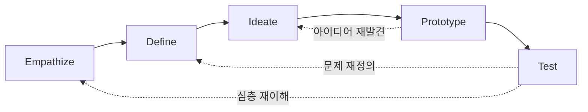
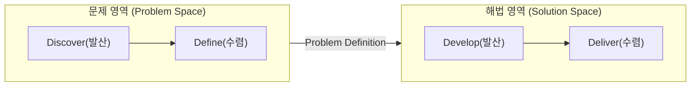
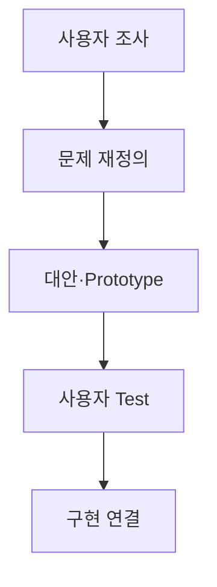
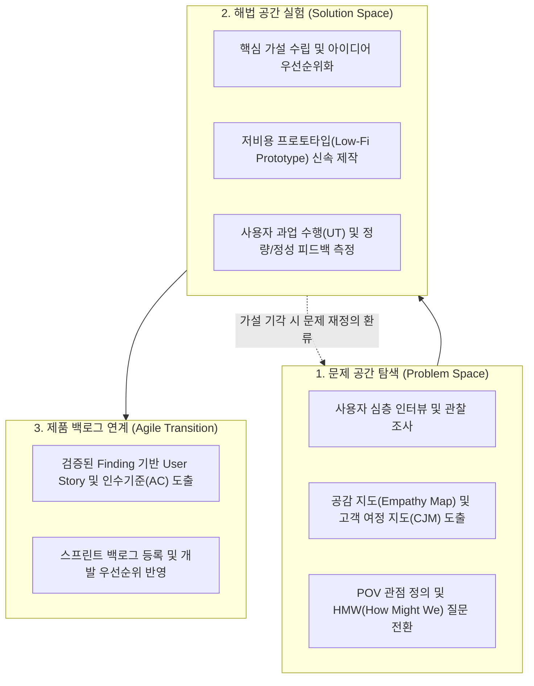

## 지식 로드맵 내 현재 위치

지식 위치: IT 전략·관리 → 인간중심 혁신·문제해결 → **디자인 씽킹**

## 30초 인출

- 본질: 사용자 맥락을 관찰하여 올바른 문제를 재정의하고 시제품을 통해 해법을 빠르게 실험·학습하는 인간 중심 문제해결 방법론이다.
- 메커니즘: Discover에서 관찰하고 Define에서 문제를 재정의한 뒤 Develop·Deliver에서 시제품을 시험하며 피드백을 환류한다.
- 판정 기준: 실제 사용자 관찰과 테스트 결과가 문제 정의와 가설의 수정·채택 근거로 남는지 확인한다.

핵심 용어

- **Design Thinking**: 사용자 맥락을 이해하고 문제 재정의·아이디어·시제품·시험을 반복하는 인간 중심 문제해결 접근법이다.
- **Empathize**: 관찰·인터뷰를 통해 사용자의 맥락과 드러나지 않은 필요를 파악하는 단계이다.
- **Define**: 조사 결과를 종합해 해결할 문제를 POV 형식으로 재정의하는 단계이다.
- **Ideate**: HMW 질문을 바탕으로 여러 대안을 발산하고 검증할 가설을 고르는 단계이다.
- **POV(Point of View)**: 사용자·필요·인사이트를 결합한 문제 관점 진술이다.
- **HMW(How Might We)**: 문제를 다양한 해법 탐색이 가능한 질문으로 전환하는 기법이다.
- **Persona**: 조사자료를 바탕으로 목표·행동·맥락을 표현한 대표 사용자 모델이다.
- **CJM(Customer Journey Map)**: 사용자 여정의 단계·접점·행동·감정·문제를 시각화한 도구이다.
- **Prototype**: 특정 가정·상호작용을 학습하기 위해 만든 시험 가능한 표현물이다.
- **UT(Usability Test)**: 사용자가 과업을 수행하는 행동을 관찰하여 사용성 문제를 확인하는 평가이다.

## 예상문제

> 디자인 씽킹의 개념과 5개 Mode·Double Diamond를 설명하고, 디지털 서비스 개발 적용절차와 고려사항을 제시하시오. **(미출제 예상·25점)**

## Ⅰ. 디자인 씽킹의 개요

> 디자인 씽킹의 핵심은 아이디어 수가 아니라 사용자 증거로 문제와 해법의 가정을 빠르게 수정하는 데 있음.

- 정의: **사용자 맥락**을 이해하고 **문제 재정의**·대안 발산·**시제품 시험**을 반복하는 인간 중심 문제해결 접근법
- 목적: **문제 오정의 감소** · **조기학습** · **사용자 가치 향상**

## Ⅱ. 5개 Mode의 활동·산출

> 5개 Mode는 필요에 따라 앞뒤로 이동하며 병렬·반복 수행할 수 있음.

| Mode | 주요 활동 | 산출 |
|---|---|---|
| **Empathize** | 관찰·인터뷰·맥락 탐색 | 관찰기록 · Empathy Map |
| **Define** | 패턴·인사이트·필요 종합 | Persona · CJM · POV |
| **Ideate** | HMW·발산·대안 선정 | 아이디어 · 가설 |
| **Prototype** | 핵심 가정의 저비용 표현 | Storyboard · Mock-up |
| **Test** | 사용자 과업 관찰·피드백 | 관찰결과 · 수정 가설 |

## Ⅲ. Double Diamond와 5 Modes 관계

> Double Diamond는 발산·수렴의 큰 구조, 5 Modes는 각 구간에서 활용하는 사고·실행 방식임.

| Double Diamond | 사고 | 연계 Mode | 판정 |
|---|---|---|---|
| **Discover** | 문제영역 발산 | Empathize | 충분한 사용자·맥락을 탐색했는가? |
| **Define** | 문제영역 수렴 | Define | 근거 있는 문제정의인가? |
| **Develop** | 해법영역 발산 | Ideate·Prototype | 복수 대안을 시험했는가? |
| **Deliver** | 해법영역 수렴 | Prototype·Test | 가치·사용성·실현성을 검증했는가? |

## Ⅳ. 디지털 서비스 적용 절차

> 조사자료가 POV·Prototype·Backlog까지 추적되어야 워크숍 결과가 구현으로 이어짐.

## Ⅴ. 문제점·대응책

> 워크숍의 산출물이 사용자 증거와 개발 의사결정으로 이어지지 않으면 형식 활동에 머묾.

| 위험 | 대책 | 효과 |
|---|---|---|
| **내부자 추측** | 실제 사용자·극단 사용자 조사 | 편향 완화 |
| **해법 조기 고정** | Problem Space와 Solution Space 분리 | 문제 재정의 확보 |
| **고충실도 집착** | 검증가정별 최소 Prototype | 학습비용 절감 |
| **개발 단절** | Finding–POV–Backlog 추적 | 구현 정합성 향상 |

## Ⅵ. 사용자 증거 기반 기술사적 제언

### 실전 답안용 기술사적 제언

- **진단**: 문제정의가 관찰·인터뷰 증거와 연결되고, 프로토타입이 검증할 사용자 가설을 명시하는지 확인한다.
- **설계**: Problem Space와 Solution Space를 구분하고, 핵심 가설마다 학습에 필요한 최소 프로토타입과 사용자 과업을 대응시킨다.
- **검증**: 과업 성공률·오류 빈도·SUS와 사용자 발화를 함께 분석해 가설의 유지·수정·폐기를 결정한다.
- **효과**: 개발 착수 전 잘못된 문제 정의로 인한 재작업 위험을 원천 차단하고 실제 시장 적합성(Product-Market Fit)을 조기 확보한다.

## 1교시 10점 답안 발췌

- 정의: 사용자의 잠재적 니즈를 공감·관찰하여 문제를 올바르게 재정의하고, 프로토타입을 통해 조기 검증을 반복하는 인간 중심 문제해결 방법론
- 핵심 메커니즘: 공감(Empathize) → 문제정의(Define) → 아이디어(Ideate) → 시제품(Prototype) → 테스트(Test)의 5단계 반복 및 더블 다이아몬드(발산/수렴) 구조

## 출제 이력과 검증 출처

- 공식 문제지 원문으로 확인한 직접 기출 없음
- [Stanford d.school: Design Thinking Bootleg](https://dschool.stanford.edu/tools/design-thinking-bootleg)
- [Design Council: Double Diamond](https://www.designcouncil.org.uk/resources/the-double-diamond/)

## 학습 체크

- [ ] Ⅰ. 디자인 씽킹의 정의·목적을 문제 재정의 관점에서 설명할 수 있는가?
- [ ] Ⅱ. 5개 Mode의 활동·산출을 연결할 수 있는가?
- [ ] Ⅲ. Double Diamond와 5 Modes의 역할 차이를 설명할 수 있는가?
- [ ] Ⅳ. 사용자 조사부터 Product Backlog까지의 추적관계를 설명할 수 있는가?
- [ ] Ⅴ~Ⅵ. 내부자 추측·해법 조기고정·고충실도 집착의 대응책을 제시할 수 있는가?

## 연결 토픽

- 이전 토픽: [그로스 해킹](./046_growth_hacking.md)
- 연관 토픽: [애자일 대응 전략](./013_agile_response_strategy.md), [A/B 테스트](./029_ab_testing.md), [MECE](./045_mece.md)
- 다음 토픽: [제안요청서(RFP)](./049_rfp.md)
