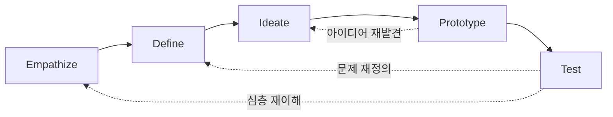
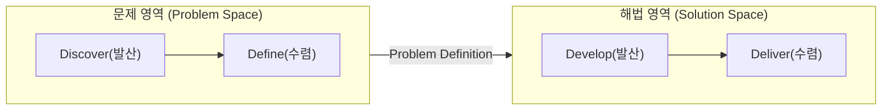
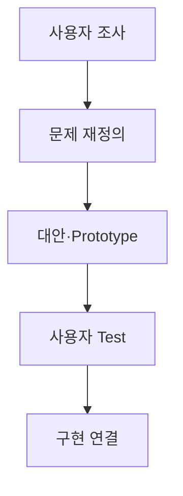

## 지식 로드맵 내 현재 위치

  IT 전략·관리
  사용자 중심 서비스기획
  <strong>디자인 씽킹</strong>

## 30초 인출

- 본질: 사용자 맥락을 관찰하여 올바른 문제를 재정의하고 시제품을 통해 해법을 빠르게 실험·학습하는 인간 중심 문제해결 방법론
- 메커니즘: Discover(공감) → Define(POV 문제 재정의) → Develop(HMW 아이디어 발산 및 프로토타입) → Deliver(사용자 테스트 및 피드백 환류)
- 판정 기준: 실사용자 검증 인터뷰 >= 5건 확보 및 테스트 기반 기각/수정 가설이 1건 이상 존재하는지 여부

핵심 용어

- **Design Thinking**: 사용자 맥락을 이해하고 문제 재정의·아이디어·시제품·시험을 반복하는 인간 중심 문제해결 접근법
- **Empathize**: 관찰·인터뷰로 사용자 맥락과 숨은 필요를 파악하는 Mode
- **Define**: 조사 결과를 종합해 POV로 올바른 문제를 재정의하는 Mode
- **Ideate**: HMW 질문으로 대안을 발산하고 가설을 선별하는 Mode
- **POV(Point of View)**: 사용자·필요·인사이트를 결합한 문제 관점 진술
- **HMW(How Might We)**: 문제를 다양한 해법 탐색이 가능한 질문으로 전환하는 기법
- **Persona**: 조사자료를 바탕으로 목표·행동·맥락을 표현한 대표 사용자 모델
- **CJM(Customer Journey Map)**: 사용자 여정의 단계·접점·행동·감정·문제를 시각화한 도구
- **Prototype**: 특정 가정·상호작용을 학습하기 위해 만든 시험 가능한 표현물
- **UT(Usability Test)**: 사용자가 과업을 수행하는 행동을 관찰하여 사용성 문제를 확인하는 평가

## 예상문제

> 디자인 씽킹의 개념과 5개 Mode·Double Diamond를 설명하고, 디지털 서비스 개발 적용절차와 고려사항을 제시하시오. **(미출제 예상·25점)**

## Ⅰ. 디자인 씽킹의 개요

> 디자인 씽킹의 핵심은 아이디어 수가 아니라 사용자 증거로 문제와 해법의 가정을 빠르게 수정하는 데 있음.

- 정의: 사용자 맥락을 이해하고 문제 재정의·대안 발산·시제품 시험을 반복하는 인간 중심 문제해결 접근법
- 목적: **문제 오정의 감소 · 조기학습 · 사용자 가치 향상**

## Ⅱ. 5개 Mode의 활동·산출

> 5개 Mode는 필요에 따라 앞뒤로 이동하며 병렬·반복 수행할 수 있음.

| Mode | 주요 활동 | 산출 |
|---|---|---|
| **Empathize** | 관찰·인터뷰·맥락 탐색 | 관찰기록 · Empathy Map |
| **Define** | 패턴·인사이트·필요 종합 | Persona · CJM · POV |
| **Ideate** | HMW·발산·대안 선정 | 아이디어 · 가설 |
| **Prototype** | 핵심 가정의 저비용 표현 | Storyboard · Mock-up |
| **Test** | 사용자 과업 관찰·피드백 | 관찰결과 · 수정 가설 |

## Ⅲ. Double Diamond와 5 Modes 관계

> Double Diamond는 발산·수렴의 큰 구조, 5 Modes는 각 구간에서 활용하는 사고·실행 방식임.

| Double Diamond | 사고 | 연계 Mode | 판정 |
|---|---|---|---|
| **Discover** | 문제영역 발산 | Empathize | 충분한 사용자·맥락을 탐색했는가? |
| **Define** | 문제영역 수렴 | Define | 근거 있는 문제정의인가? |
| **Develop** | 해법영역 발산 | Ideate·Prototype | 복수 대안을 시험했는가? |
| **Deliver** | 해법영역 수렴 | Prototype·Test | 가치·사용성·실현성을 검증했는가? |

## Ⅳ. 디지털 서비스 적용 절차

> 조사자료가 POV·Prototype·Backlog까지 추적되어야 워크숍 결과가 구현으로 이어짐.

## Ⅴ. 문제점·대응책

> 워크숍의 산출물이 사용자 증거와 개발 의사결정으로 이어지지 않으면 형식 활동에 머묾.

| 위험 | 대책 | 효과 |
|---|---|---|
| **내부자 추측** | 실제 사용자·극단 사용자 조사 | 편향 완화 |
| **해법 조기 고정** | Problem Space와 Solution Space 분리 | 문제 재정의 확보 |
| **고충실도 집착** | 검증가정별 최소 Prototype | 학습비용 절감 |
| **개발 단절** | Finding–POV–Backlog 추적 | 구현 정합성 향상 |

## Ⅵ. 사용자 증거 기반 기술사적 제언

### 학습자 통찰 메모 — 답안 밖

`[핵심 통찰]` 디자인 씽킹의 실패는 아이디어 부족보다 해법을 먼저 정하고 사용자 조사를 정당화 자료로 사용하는 데서 발생함.

`나라면` 각 Prototype에 검증할 가정과 폐기 기준을 하나씩 붙이고, 사용자 관찰 Finding이 연결된 Backlog만 구현 후보로 올리겠음.

### 실전 답안용 기술사적 제언

- **판정 기준 (Trigger)**: 기획 단계에서 사용자 실증 인터뷰 5건 미만, 또는 프로토타입 단계에서 '기각/폐기된 가설'이 0건일 때 확증 편향 및 형식적 워크숍으로 판정함.
- **대응 방안 (Action)**: Problem Space(문제 정의)와 Solution Space(해법 구현)를 엄격히 게이트 분리하고, 1가설 1프로토타입 원칙으로 페이퍼 목업 기반 빠른 실패를 의무화함.
- **검증 체계 (Verification)**: 사용자 과업 성공률(Task Success Rate), 오류 빈도, SUS(시스템 사용성 척도) 등 정량 UT 지표와 고객 여정 맵(CJM)의 감정 저점을 실시간 매핑하여 검증함.
- **기대 효과 (Impact)**: 엉뚱한 기능 개발로 인한 SW 재개발 비용 50% 절감, 사용자 채택률(Adoption Rate) 조기 극대화, 애자일 백로그와의 완벽한 정렬을 달성함.

## 1교시 10점 답안 발췌

### 1. 정의·목적

- 정의: 사용자 맥락을 이해하고 문제 재정의·대안 발산·시제품 시험을 반복하는 인간 중심 문제해결 접근법
- 목적: **문제 오정의 감소 · 조기학습 · 사용자 가치 향상**

### 2. 5개 Mode

### 3. 핵심 통제

- **Double Diamond**: Discover·Define·Develop·Deliver의 2회 발산·수렴
- **추적성**: 사용자 Evidence → POV → Prototype → Finding → Backlog

## 출제 이력과 검증 출처

- 공식 문제지 원문으로 확인한 직접 기출 없음
- [Stanford d.school: Design Thinking Bootleg](https://dschool.stanford.edu/tools/design-thinking-bootleg)
- [Design Council: Double Diamond](https://www.designcouncil.org.uk/resources/the-double-diamond/)

## 학습 체크

- [ ] Ⅰ. 디자인 씽킹의 정의·목적을 문제 재정의 관점에서 설명할 수 있는가?
- [ ] Ⅱ. 5개 Mode의 활동·산출을 연결할 수 있는가?
- [ ] Ⅲ. Double Diamond와 5 Modes의 역할 차이를 설명할 수 있는가?
- [ ] Ⅳ. 사용자 조사부터 Product Backlog까지의 추적관계를 설명할 수 있는가?
- [ ] Ⅴ~Ⅵ. 내부자 추측·해법 조기고정·고충실도 집착의 대응책을 제시할 수 있는가?

## 연결 토픽

- 이전 토픽: [그로스 해킹](./046_growth_hacking.md)
- 연관 토픽: [애자일 대응 전략](./013_agile_response_strategy.md), [A/B 테스트](./029_ab_testing.md), [MECE](./045_mece.md)
- 다음 토픽: [제안요청서(RFP)](./049_rfp.md)
