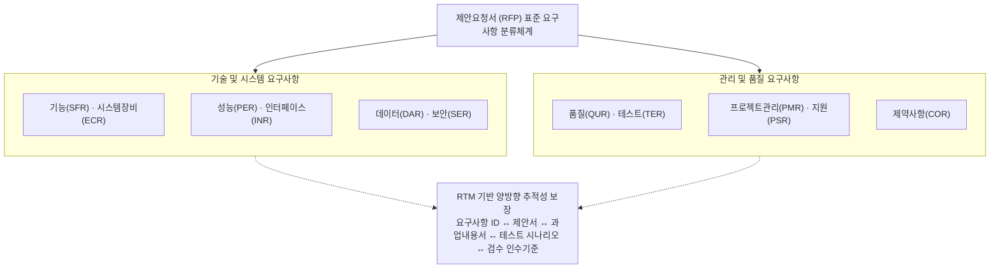
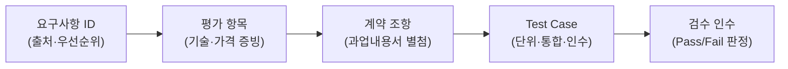
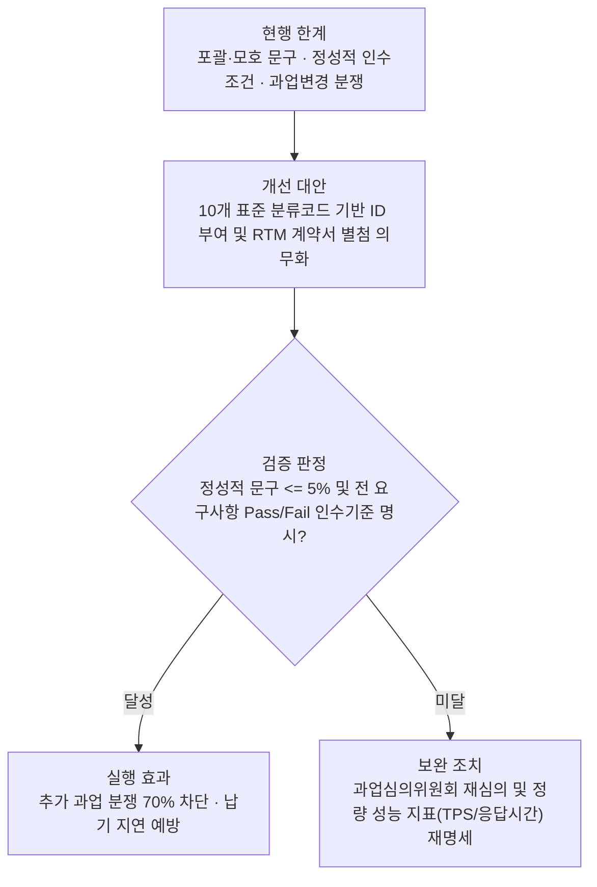

## 지식 로드맵 내 현재 위치

  IT 전략·관리공공 SW 발주<strong>RFP</strong>

## 30초 인출

- 본질: 사업목적·범위·요구사항·평가·계약조건을 명시하여 공급자의 비교 가능한 제안을 유도하고 계약·검수의 기준이 되는 공식 발주문서
- 메커니즘: 요구사항 상세화(10대 분류) → RFP 작성 및 과업심의위원회 확정 → 공고 및 제안평가 → 기술협상 및 과업내용서 확정 → RTM 기반 이행 및 검수
- 판정 기준: 모호한 정성적 문구 비율 <= 5% 이내 및 전 요구사항 항목별 정량 인수기준(Pass/Fail) 100% 명시

핵심 용어

- **RFP(Request for Proposal)**: 사업목적·범위·요구사항·평가기준·계약조건을 제시하여 제안을 요청하는 문서
- **RFI(Request for Information)**: 사업기획을 위해 시장·기술·공급자 정보를 요청하는 문서
- **RFQ(Request for Quotation)**: 규격이 정해진 품목·서비스의 가격과 조건을 요청하는 문서
- **RTM(Requirements Traceability Matrix)**: 요구사항과 설계·구현·시험·인수의 대응관계를 추적하는 표
- **Acceptance Criteria**: 요구사항 충족 여부를 판정하는 관찰·측정 가능한 인수기준
- **과업심의위원회**: 공공 SW 사업의 과업내용 확정·변경과 계약금액·기간 조정을 심의하는 기구

## 예상문제

> RFP의 개념과 구성·작성절차를 설명하고, 요구사항 모호성과 과업변경 분쟁을 예방하기 위한 품질통제 방안을 제시하시오. **(미출제 예상·25점)**

## Ⅰ. RFP의 개요

> RFP 품질은 문서 분량이 아니라 공급자가 같은 범위로 견적하고 발주자가 같은 기준으로 평가·검수할 수 있는가로 판정함.

- 정의: 발주자가 사업내용과 제안조건을 명시하여 공급자의 기술·가격·수행방안을 요청하는 공식 문서
- 목적: **요구 명확화 · 공정한 비교평가 · 계약·검수 기준 제공**

## Ⅱ. RFP 구성체계

| 영역 | 주요 내용 | 품질 기준 |
|---|---|---|
| 사업개요 | 배경·목적·범위·기간·예산 | 경계·제외범위 명확성 |
| 요구사항 | 장비·기능·성능·인터페이스·데이터·시험·보안·품질·제약·관리·지원 | ID·근거·우선순위·인수기준 |
| 제안안내 | 자격·일정·제안서 형식·질의 | 공급자 동일 조건 |
| 평가 | 평가항목·배점·증빙·절차 | 요구사항·평가항목 정렬 |
| 계약·관리 | 산출물·검수·변경·지식재산·보안·하자 | 책임·승인·우선순위 명시 |

## Ⅲ. 요구사항 명세 품질

> 요구사항은 해결방법을 과도하게 고정하지 않으면서도 시험 가능한 수준으로 작성함.

| 기준 | 확인 내용 | 오류 예 |
|---|---|---|
| **명확성** | 한 문장·한 요구·용어 정의 | 적정하게 · 신속하게 |
| **완전성** | 조건·입력·처리·출력·예외 | 정상 흐름만 기술 |
| **검증성** | 측정방법·환경·판정기준 | 성능이 우수해야 함 |
| **추적성** | ID·출처·평가·시험 연결 | 문서별 번호 불일치 |
| **중립성** | 기능·성과 중심, 동등성 허용 | 불필요한 특정제품 지정 |

## Ⅳ. RFI·RFP·RFQ 비교

| 기준 | RFI | RFP | RFQ |
|---|---|---|---|
| 목적 | 정보 탐색 | 해결방안·사업자 선정 | 가격·조건 비교 |
| 전제 | 문제·시장 탐색 중 | 요구·평가기준 정의 | 규격·수량 명확 |
| 응답 | 기술·시장·역량 정보 | 기술·가격·수행 제안 | 견적·납기·조건 |
| 활용 | 사업기획·RFP 보완 | 평가·협상·계약 | 표준품 구매·가격비교 |

## Ⅴ. 문제점·대응책

| 위험 | 대책 | 효과 |
|---|---|---|
| **포괄·모호 문구** | 요구사항 ID·범위·인수기준 명시 | 해석차이 감소 |
| **평가·요구 불일치** | 요구사항별 평가항목·증빙 매핑 | 비교평가 신뢰성 향상 |
| **특정 규격 편향** | 기능·성과 기준과 동등성 검토 | 경쟁성 확보 |
| **계약·검수 단절** | RFP·제안서·협상·계약 우선순위와 RTM 명시 | 변경·검수 분쟁 완화 |

## Ⅵ. 인수기준 연결 중심 기술사적 제언

### 학습자 통찰 메모 — 답안 밖

`[핵심 통찰]` 모호한 요구사항은 입찰 단계에서는 낮은 견적으로, 수행 단계에서는 변경요청으로, 종료 단계에서는 검수분쟁으로 이동할 뿐 사라지지 않음.

`나라면` 요구사항마다 출처·우선순위·평가증빙·Acceptance Criteria를 붙이고 협상결과가 계약조항과 Test Case에 반영됐는지 RTM으로 확인하겠음.

### 실전 답안용 기술사적 제언

- **판정 기준 (Trigger)**: RFP 요구사항 중 '적정 수준', '협의 후 결정' 등 정성적 문구 비율이 5%를 초과하거나 인수 판정 기준(Pass/Fail) 미정의 시 과업 부실 판정.
- **대응 방안 (Action)**: 법정 표준 10개 분류코드(SFR, PER 등) 기반 ID를 체계화하고, 기능별 정상·예외 흐름 및 정량 성능 지표(TPS, 응답시간 2초 이내 등)를 명문화함.
- **검증 체계 (Verification)**: 공공 SW 과업심의위원회를 통한 적정 사업기간·대가 산정 검증 및 RTM(요구사항 추적표)을 계약서 별첨으로 체결하여 변경 영향도를 추적함.
- **기대 효과 (Impact)**: 수주 후 추가 과업 분쟁 70% 차단, 하도급 불공정 전가 방지, 객관적 검수 체계 확립으로 납기 지연을 예방함.

## 1교시 10점 답안 발췌

### 1. 정의·목적

- 정의: 사업목적·범위·요구사항·평가기준·계약조건을 제시하여 공급자의 제안을 요청하는 문서
- 목적: **요구 명확화 · 공정한 비교평가 · 계약·검수 기준 제공**

### 2. 표준 요구사항 구성

### 3. 핵심 통제

- **명세 품질**: 명확성·완전성·검증성·추적성·중립성
- **RTM**: 요구사항 ↔ 평가 ↔ 계약 ↔ Test Case ↔ 인수

## 출제 이력과 검증 출처

- 공식 문제지 원문으로 확인한 직접 기출 없음
- [국가법령정보센터: 소프트웨어사업 계약 및 관리감독에 관한 지침](https://www.law.go.kr/행정규칙/소프트웨어사업계약및관리감독에관한지침)
- [소프트웨어사업 상세 요구사항 분석·적용기준](https://law.go.kr/flDownload.do?bylClsCd=200201&flNm=%5B%EB%B3%84%ED%91%9C+2%5D+%EC%86%8C%ED%94%84%ED%8A%B8%EC%9B%A8%EC%96%B4%EC%82%AC%EC%97%85+%EC%83%81%EC%84%B8+%EC%9A%94%EA%B5%AC%EC%82%AC%ED%95%AD+%EB%B6%84%EC%84%9D%C2%B7%EC%A0%81%EC%9A%A9%EA%B8%B0%EC%A4%80%28%EC%A0%9C11%EC%A1%B0+%EA%B4%80%EB%A0%A8%29&flSeq=128124887)

## 학습 체크

- [ ] Ⅰ. RFP의 정의·목적을 설명할 수 있는가?
- [ ] Ⅱ. 사업개요·요구사항·제안평가·계약관리 영역을 구성할 수 있는가?
- [ ] Ⅲ. 요구사항의 명확성·완전성·검증성·추적성·중립성을 판정할 수 있는가?
- [ ] Ⅳ. RFI·RFP·RFQ를 목적·전제·응답·활용으로 비교할 수 있는가?
- [ ] Ⅴ~Ⅵ. 모호성·편향·계약단절의 대응책과 RTM을 제시할 수 있는가?

## 연결 토픽

- 이전 토픽: [디자인 씽킹](./047_design_thinking.md)
- 연관 토픽: [ISMP](./001_ismp.md), [SW 대가산정](./026_software_cost_estimation.md), [공공 SW 사업 발주·계약](./039_public_sw_contract.md)
- 다음 토픽: [AI 거버넌스 플랫폼](./050_ai_governance_platform.md)
