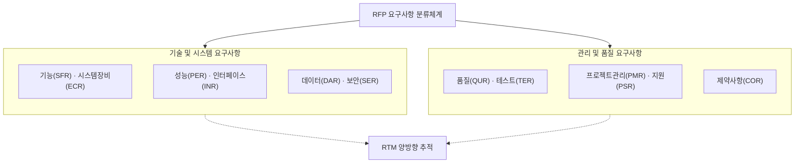
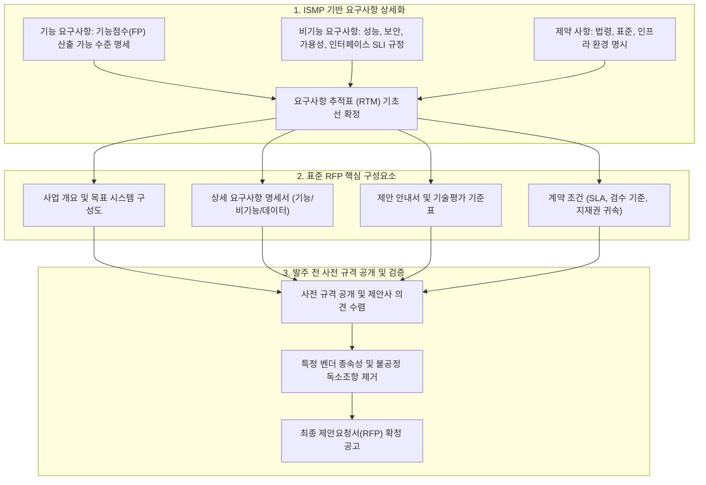

## 지식 로드맵 내 현재 위치

지식 위치: IT 전략·관리 → 공공 정보화·조달관리 → **제안요청서(RFP)**

## 30초 인출

- 본질: 사업목적·범위·요구사항·평가·계약조건을 명시하여 공급자의 비교 가능한 제안을 유도하고 계약·검수의 기준이 되는 공식 발주문서이다.
- 메커니즘: 요구사항 상세화 → **RFP** ·과업 확정 → 공고·제안평가 → 기술협상·계약 → **RTM** 기반 이행·검수 순으로 기준선을 구체화한다.
- 판정 기준: 요구사항마다 평가 가능한 인수기준이 연결되고 제안·계약·검수 단계에서 추적되는지 확인한다.

핵심 용어

- **RFP(Request for Proposal)** : 사업목적·범위·상세요구사항·평가기준을 명시하여 공급자의 제안을 유도하는 공식 발주 문서
- **RFI(Request for Information)** : 사업 기획 및 발주 준비 단계에서 시장 동향과 기술 대안 정보를 수집하는 사전 요청 문서
- **RFQ(Request for Quotation)** : 규격이 확정된 품목이나 서비스에 대해 단가와 납기 견적을 요청하는 견적 요청서
- **RTM(Requirements Traceability Matrix)** : 요구사항과 설계·구현·테스트·인수 간 대응 관계를 상호 추적하는 관리 매트릭스
- **Acceptance Criteria** : 인도물의 요구사항 충족 여부를 판정하는 객관적이고 측정 가능한 인수 기준
- **과업심의위원회** : 공공 SW 사업의 과업 확정·변경과 계약금액·기간 조정을 심의·의결하는 법정 위원회

## 예상문제

> RFP의 개념과 구성·작성절차를 설명하고, 요구사항 모호성과 과업변경 분쟁을 예방하기 위한 품질통제 방안을 제시하시오. **(미출제 예상·25점)**

## Ⅰ. RFP의 개요

> RFP 품질은 문서 분량이 아니라 공급자가 같은 범위로 견적하고 발주자가 같은 기준으로 평가·검수할 수 있는가로 판정함.

- 정의: 발주자가 **사업 범위** 와 **제안조건** 을 명시하여 공급자의 기술·가격·수행방안을 요청하는 공식 문서
- 목적: **요구 명확화** · **공정한 비교평가** · **계약·검수 기준** 제공

## Ⅱ. RFP 구성체계

| 영역 | 주요 내용 | 품질 기준 |
|---|---|---|
| 사업개요 | 배경·목적·범위·기간·예산 | 경계·제외범위 명확성 |
| 요구사항 | 장비·기능·성능·인터페이스·데이터·시험·보안·품질·제약·관리·지원 | ID·근거·우선순위·인수기준 |
| 제안안내 | 자격·일정·제안서 형식·질의 | 공급자 동일 조건 |
| 평가 | 평가항목·배점·증빙·절차 | 요구사항·평가항목 정렬 |
| 계약·관리 | 산출물·검수·변경·지식재산·보안·하자 | 책임·승인·우선순위 명시 |

## Ⅲ. 요구사항 명세 품질

> 요구사항은 해결방법을 과도하게 고정하지 않으면서도 시험 가능한 수준으로 작성함.

| 기준 | 확인 내용 | 오류 예 |
|---|---|---|
| **명확성** | 한 문장·한 요구·용어 정의 | 적정하게 · 신속하게 |
| **완전성** | 조건·입력·처리·출력·예외 | 정상 흐름만 기술 |
| **검증성** | 측정방법·환경·판정기준 | 성능이 우수해야 함 |
| **추적성** | ID·출처·평가·시험 연결 | 문서별 번호 불일치 |
| **중립성** | 기능·성과 중심, 동등성 허용 | 불필요한 특정제품 지정 |

## Ⅳ. RFI·RFP·RFQ 비교

| 기준 | RFI | RFP | RFQ |
|---|---|---|---|
| 목적 | 정보 탐색 | 해결방안·사업자 선정 | 가격·조건 비교 |
| 전제 | 문제·시장 탐색 중 | 요구·평가기준 정의 | 규격·수량 명확 |
| 응답 | 기술·시장·역량 정보 | 기술·가격·수행 제안 | 견적·납기·조건 |
| 활용 | 사업기획·RFP 보완 | 평가·협상·계약 | 표준품 구매·가격비교 |

## Ⅴ. 문제점·대응책

| 위험 | 대책 | 효과 |
|---|---|---|
| **포괄·모호 문구** | 요구사항 ID·범위·인수기준 명시 | 해석차이 감소 |
| **평가·요구 불일치** | 요구사항별 평가항목·증빙 매핑 | 비교평가 신뢰성 향상 |
| **특정 규격 편향** | 기능·성과 기준과 동등성 검토 | 경쟁성 확보 |
| **계약·검수 단절** | RFP·제안서·협상·계약 우선순위와 RTM 명시 | 변경·검수 분쟁 완화 |

## Ⅵ. 인수기준 연결 중심 기술사적 제언

### 실전 답안용 기술사적 제언

- 문제: 제안요청서(RFP)의 요구사항이 모호하게 작성되어 제안사 간 혼선, 부정확한 견적, 구축 단계에서의 잦은 과업 변경 및 법적 분쟁이 발생함.
- 해결 방안: 사전 ISMP를 통해 기능·비기능 요구사항을 FP 산출 수준으로 상세 명세화하고, 요구사항 추적표(RTM), 명확한 검수 기준, 지식재산권 귀속 및 SLA 조건을 표준 RFP에 의무 수록함.

## 1교시 10점 답안 발췌

### 1. 정의·목적

- 정의: 발주자가 **사업 범위** 와 **제안조건** 을 명시하여 공급자의 기술·가격·수행방안을 요청하는 공식 문서
- 목적: **요구 명확화** · **공정한 비교평가** · **계약·검수 기준** 제공

### 2. 핵심 구조 및 체계

- 정의: 사업 목적, 과업 범위, 기능/비기능 요구사항, 평가 및 계약 조건을 상세히 명시하여 공급자의 제안을 요청하는 공식 발주 문서
- 핵심 메커니즘: 법정 10대 분류체계 기반 상세화 → 과업심의위원회 사전 심의 → 제안평가 및 기술협상 → RTM 기반 계약 및 검수 연계

## 출제 이력과 검증 출처

- 공식 문제지 원문으로 확인한 직접 기출 없음
- [국가법령정보센터: 소프트웨어사업 계약 및 관리감독에 관한 지침](https://www.law.go.kr/행정규칙/소프트웨어사업계약및관리감독에관한지침)
- [소프트웨어사업 상세 요구사항 분석·적용기준](https://law.go.kr/flDownload.do?bylClsCd=200201&flNm=%5B%EB%B3%84%ED%91%9C+2%5D+%EC%86%8C%ED%94%84%ED%8A%B8%EC%9B%A8%EC%96%B4%EC%82%AC%EC%97%85+%EC%83%81%EC%84%B8+%EC%9A%94%EA%B5%AC%EC%82%AC%ED%95%AD+%EB%B6%84%EC%84%9D%C2%B7%EC%A0%81%EC%9A%A9%EA%B8%B0%EC%A4%80%28%EC%A0%9C11%EC%A1%B0+%EA%B4%80%EB%A0%A8%29&flSeq=128124887)

## 학습 체크

- [ ] Ⅰ. RFP의 정의·목적을 설명할 수 있는가?
- [ ] Ⅱ. 사업개요·요구사항·제안평가·계약관리 영역을 구성할 수 있는가?
- [ ] Ⅲ. 요구사항의 명확성·완전성·검증성·추적성·중립성을 판정할 수 있는가?
- [ ] Ⅳ. RFI·RFP·RFQ를 목적·전제·응답·활용으로 비교할 수 있는가?
- [ ] Ⅴ~Ⅵ. 모호성·편향·계약단절의 대응책과 RTM을 제시할 수 있는가?

## 연결 토픽

- 이전 토픽: [디자인 씽킹](./047_design_thinking.md)
- 연관 토픽: [ISMP](./001_ismp.md), [SW 대가산정](./026_software_cost_estimation.md), [공공 SW 사업 발주·계약](./039_public_sw_contract.md)
- 다음 토픽: [AI 거버넌스 플랫폼](./050_ai_governance_platform.md)
