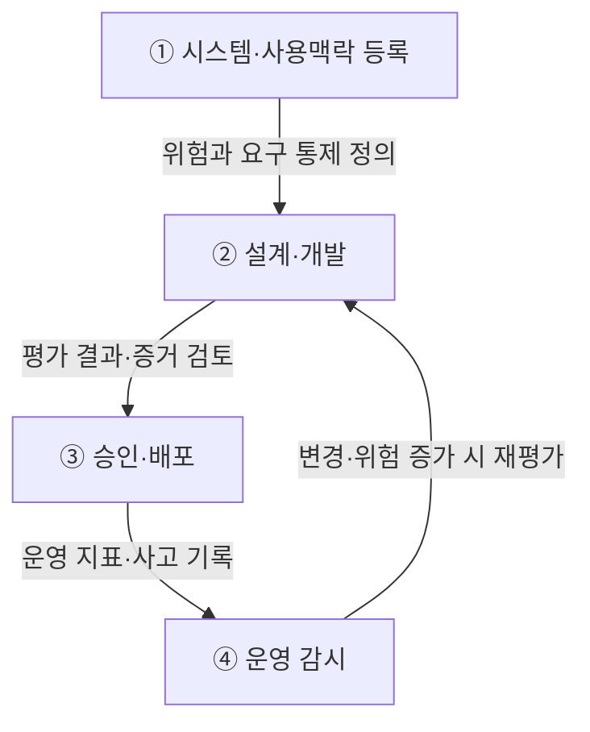

## 지식 로드맵 내 현재 위치

지식 위치: IT 전략·관리 → AI 거버넌스·신뢰성 → **AI 거버넌스 플랫폼**

## 30초 인출

- 본질: AI 거버넌스 플랫폼은 AI 자산의 위험과 책임·승인·감사 기록을 개발부터 운영까지 관리하는 시스템이다.
- 메커니즘: AI 자산 등록 → 위험평가 → 데이터 계보·편향 검증 → 배포 게이트 → 런타임 감시· **Human Oversight** 로 수명주기 통제를 연결한다.
- 판정 기준: 고위험 AI의 데이터·모델 계보가 추적되고 드리프트 경보에 대한 사람의 개입 증적이 남는지 확인한다.

핵심 용어

- **AI 거버넌스 플랫폼** : 조직의 AI 정책과 위험통제를 자산·개발·배포·운영 절차에 연결하는 관리 도구
- **AIMS(Artificial Intelligence Management System)** : 책임 있는 AI 개발·제공·활용을 위한 조직적 방침·목표·프로세스 경영시스템(ISO/IEC 42001)
- **AI Inventory** : 조직 내 개발·도입·운영 중인 AI 시스템의 목적·책임자·위험등급을 관리하는 자산 목록
- **System Card** : AI 시스템의 목적·성능·한계·위험 완화 조치를 표준 양식으로 기록한 공학적 설명서
- **Policy-as-Code** : 거버넌스 및 보안 정책을 코드로 정의하여 배포 파이프라인에서 자동 검증하는 통제 메커니즘
- **Human Oversight** : 위험 수준에 따라 인간이 AI 시스템을 감독·개입·중단할 수 있도록 보장하는 통제 체계
- **Lineage** : 데이터셋·모델 가중치·프롬프트·배포 버전 간의 생성 및 변경 이력을 추적하는 계보 정보
- **MLOps(Machine Learning Operations)** : 머신러닝 모델의 개발·테스트·배포·모니터링을 자동화하는 협업 운영 체계
- **LLMOps(Large Language Model Operations)** : LLM 기반 서비스의 프롬프트·평가·가드레일·배포를 전문 관리하는 운영 프레임워크

---

## 1교시 예상문제 (10점)

> AI 거버넌스 플랫폼의 구성체계와 수명주기 통제를 설명하시오. (예상·10점)

---

## 1교시 10점 답안

### Ⅰ. AI 거버넌스 플랫폼 개요

| 구분 | 핵심 |
|---|---|
| 정의 | **AI 거버넌스 플랫폼**은 조직의 AI 정책과 위험통제를 AI 자산·개발·배포·운영 과정에 연결하는 관리 도구다. |
| 목적 | AI 사용을 파악하고 책임·위험·준수 증거를 추적하도록 돕는다. |

### Ⅱ. 핵심 아키텍처 및 메커니즘

- 핵심 메커니즘: AI 자산 등록(Inventory) → 위험도 분류 → 데이터/모델 리니지 검증 → 배포 게이트(Policy-as-Code) → 런타임 모니터링 및 Human Oversight

---

## 2~4교시 예상문제 (25점)

> AI 거버넌스 플랫폼의 개념과 구성체계를 설명하고, AI 수명주기 통제 프로세스 및 운영상 문제점·대응책을 제시하시오. **(미출제 예상·25점)**

---

## 2~4교시 25점 답안

## Ⅰ. AI 거버넌스 플랫폼 개요

> AI 거버넌스 플랫폼은 선언적 원칙을 **승인 Gate·운영 통제·감사 증적** 으로 전환하여 AI 위험을 수명주기 전반에서 관리함.

| 구분 | 핵심 |
|---|---|
| 정의 | **AI 거버넌스 플랫폼**은 조직의 AI 정책과 위험통제를 AI 자산·개발·배포·운영 과정에 연결하는 관리 도구다. |
| 목적 | AI 사용을 파악하고 책임·위험·준수 증거를 추적하도록 돕는다. |

ISO/IEC 42001:2023의 AIMS와 NIST AI RMF의 Govern·Map·Measure·Manage를 조직 환경에 맞게 적용한다.

## Ⅱ. AI 거버넌스 플랫폼 구성체계

> 관리체계·통제평면·개발도구를 분리하고, 공통 식별자와 증적으로 연결해야 정책과 실행의 단절을 방지할 수 있음.

| 계층 | 핵심 기능 | 주요 증적 |
|---|---|---|
| 관리체계 | 정책·역할·책임·위험기준·예외 | 정책·RACI·위험수용 기록 |
| 통제평면 | AI 자산·위험평가·승인·변경관리 | AI Inventory·승인 이력 |
| 수명주기 연계 | 데이터·모델·프롬프트·배포 Gate | Lineage·평가결과·System Card |
| 운영통제 | 성능·편향·보안 감시·Human Oversight | 운영로그·경보·개입 기록 |
| 증적관리 | 의무-통제-증적 매핑·감사·개선 | 통제목록·감사추적·개선조치 |

## Ⅲ. AI 수명주기 통제 프로세스

> 각 단계는 활동과 산출물을 함께 관리하고, 위험 변화가 발생하면 이전 단계로 환류함.

## Ⅳ. Data Governance·MLOps·AI Governance 비교

> 세 영역은 대체관계가 아니라 데이터 품질, 생산운영, 책임통제를 분담하는 결합관계임.

| 기준 | Data Governance | MLOps·LLMOps | AI Governance Platform |
|---|---|---|---|
| 초점 | 데이터 품질·보호 | 개발·배포·운영 | 책임·위험·준수 |
| 대상 | 데이터·메타데이터 | 모델·프롬프트·파이프라인 | AI 시스템·사용맥락 |
| 통제 | 표준·품질·권한 | 버전·시험·배포·감시 | 위험평가·승인·감독·증적 |
| 연계 | Lineage 제공 | Lifecycle Gate 실행 | 정책·판정기준 제공 |

## Ⅴ. 문제점·대응책

> 도구 도입보다 AI 자산 식별, 책임 배정, 통제 증적의 연결이 먼저임.

| 위험 | 대책 | 효과 |
|---|---|---|
| **Shadow AI** | AI Inventory·접근경로 등록 | 미승인 사용 식별 |
| **형식적 승인** | 위험기반 Gate·예외 만료·재승인 | 책임 있는 출시 판단 |
| **개발·규제 증적 단절** | 의무-통제-증적 매핑 | 감사 추적성 확보 |
| **운영 중 성능·위험 변화** | 지속 감시·Human Oversight·사고대응 | 영향 확산 억제 |

## Ⅵ. 배포 증거와 운영버전 연계 제언

| 문제 | 해결 방안 |
|---|---|
| 개발·평가 기록이 실제 배포된 모델·데이터·설정 버전과 분리되면 사고 시 적용 근거와 변경 영향을 확인하기 어렵다. | 배포 때 모델·데이터·프롬프트·정책 버전을 승인기록과 묶고, 변경 시 영향평가와 재승인 여부를 확인할 수 있도록 자산 식별자를 통일한다. |

이는 감사 가능성을 높이기 위한 제안이며 ISO/IEC 42001이나 EU AI Act가 특정 플랫폼·도구를 요구한다는 뜻은 아니다.

## 출제 이력과 검증 출처

- 공식 문제지 원문으로 확인한 직접 기출 없음
- [ISO, ISO/IEC 42001:2023 AI management systems](https://www.iso.org/standard/42001)
- [NIST, AI Risk Management Framework](https://www.nist.gov/itl/ai-risk-management-framework)
- [European Commission, AI Act](https://digital-strategy.ec.europa.eu/en/policies/regulatory-framework-ai)

## 연결 토픽

- 이전 토픽: [제안요청서(RFP)](./049_rfp.md)
- 연관 토픽: [NIST AI RMF](./036_nist_ai_rmf.md), [AI 프라이버시 위험관리 모델](./054_ai_privacy_risk_management_model.md)
- 다음 토픽: [AI 고속도로](./051_ai_highway.md)
