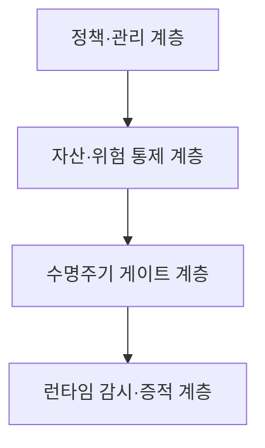
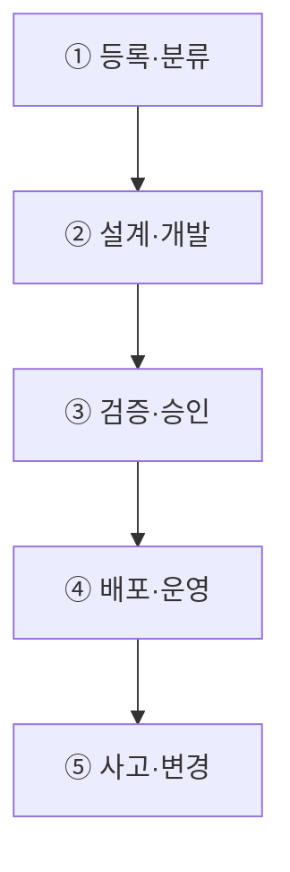
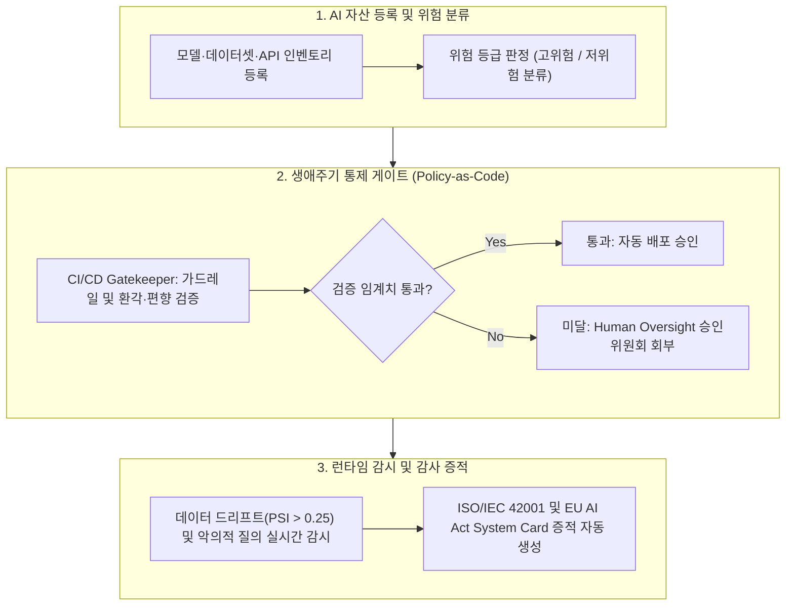

## 지식 로드맵 내 현재 위치

지식 위치: IT 전략·관리 → AI 거버넌스·신뢰성 → **AI 거버넌스 플랫폼**

## 30초 인출

- 본질: 거버넌스 정책·책임·위험기준을 AI 수명주기 전반의 통제점과 감사 증적으로 구현하는 통합 통제 플랫폼이다.
- 메커니즘: AI 자산 등록 → 위험평가 → 데이터 계보·편향 검증 → 배포 게이트 → 런타임 감시·Human Oversight로 수명주기 통제를 연결한다.
- 판정 기준: 고위험 AI의 데이터·모델 계보가 추적되고 드리프트 경보에 대한 사람의 개입 증적이 남는지 확인한다.

핵심 용어

- **AIMS(Artificial Intelligence Management System)**: AI의 책임 있는 개발·제공·사용을 위한 방침·목표·프로세스의 관리체계이다.
- **AI Inventory**: 조직이 개발·구매·운영하는 AI 시스템의 목적·소유자·위험등급·상태 목록이다.
- **System Card**: AI 시스템의 목적·범위·성능·한계·위험·평가결과를 기록한 증적이다.
- **Policy-as-Code**: 정책의 판정 규칙을 코드화하여 개발·배포 과정에서 반복 검증하는 방식이다.
- **Human Oversight**: 위험도와 영향에 따라 사람이 검토·승인·중단할 수 있도록 한 통제이다.
- **Lineage**: 데이터·모델·프롬프트·배포 버전의 생성과 변경 관계를 추적하는 정보이다.
- **MLOps(Machine Learning Operations)**: ML 모델의 개발·배포·운영을 연결하는 실무체계이다.
- **LLMOps(Large Language Model Operations)**: LLM 서비스의 프롬프트·평가·배포·운영을 관리하는 실무체계이다.

## 예상문제

> AI 거버넌스 플랫폼의 개념과 구성체계를 설명하고, AI 수명주기 통제 프로세스 및 운영상 문제점·대응책을 제시하시오. **(미출제 예상·25점)**

## Ⅰ. AI 거버넌스 정책을 실행 통제로 전환하는 플랫폼

> AI 거버넌스 플랫폼은 선언적 원칙을 **승인 Gate·운영 통제·감사 증적**으로 전환하여 AI 위험을 수명주기 전반에서 관리함.

- 정의: 조직의 **AI 정책**·**책임체계**·위험기준을 AI 자산·개발·배포·운영 통제와 증적관리로 구현하는 통합 플랫폼
- 목적: **책임성**·**추적성**·**규제 대응**·**운영위험 통제**
ISO/IEC 42001:2023의 AIMS와 NIST AI RMF의 Govern·Map·Measure·Manage를 조직 환경에 맞게 적용한다.

## Ⅱ. AI 거버넌스 플랫폼 구성체계

> 관리체계·통제평면·개발도구를 분리하고, 공통 식별자와 증적으로 연결해야 정책과 실행의 단절을 방지할 수 있음.

| 계층 | 핵심 기능 | 주요 증적 |
|---|---|---|
| 관리체계 | 정책·역할·책임·위험기준·예외 | 정책·RACI·위험수용 기록 |
| 통제평면 | AI 자산·위험평가·승인·변경관리 | AI Inventory·승인 이력 |
| 수명주기 연계 | 데이터·모델·프롬프트·배포 Gate | Lineage·평가결과·System Card |
| 운영통제 | 성능·편향·보안 감시·Human Oversight | 운영로그·경보·개입 기록 |
| 증적관리 | 의무-통제-증적 매핑·감사·개선 | 통제목록·감사추적·개선조치 |

## Ⅲ. AI 수명주기 통제 프로세스

> 각 단계는 활동과 산출물을 함께 관리하고, 위험 변화가 발생하면 이전 단계로 환류함.

## Ⅳ. Data Governance·MLOps·AI Governance 비교

> 세 영역은 대체관계가 아니라 데이터 품질, 생산운영, 책임통제를 분담하는 결합관계임.

| 기준 | Data Governance | MLOps·LLMOps | AI Governance Platform |
|---|---|---|---|
| 초점 | 데이터 품질·보호 | 개발·배포·운영 | 책임·위험·준수 |
| 대상 | 데이터·메타데이터 | 모델·프롬프트·파이프라인 | AI 시스템·사용맥락 |
| 통제 | 표준·품질·권한 | 버전·시험·배포·감시 | 위험평가·승인·감독·증적 |
| 연계 | Lineage 제공 | Lifecycle Gate 실행 | 정책·판정기준 제공 |

## Ⅴ. 문제점·대응책

> 도구 도입보다 AI 자산 식별, 책임 배정, 통제 증적의 연결이 먼저임.

| 위험 | 대책 | 효과 |
|---|---|---|
| **Shadow AI** | AI Inventory·접근경로 등록 | 미승인 사용 식별 |
| **형식적 승인** | 위험기반 Gate·예외 만료·재승인 | 책임 있는 출시 판단 |
| **개발·규제 증적 단절** | 의무-통제-증적 매핑 | 감사 추적성 확보 |
| **운영 중 성능·위험 변화** | 지속 감시·Human Oversight·사고대응 | 영향 확산 억제 |

## Ⅵ. 증적 기반 Quality Gate 제언

### 실전 답안용 기술사적 제언

- 문제: 조직 내 무분별한 섀도우 AI 도입과 환각·편향·보안 취약점 모델이 전사 통제 없이 배포되어 법적 제재 및 신뢰 실추 위험이 발생함.
- 해결 방안: AI 자산 등록부터 모델 리니지 추적, Policy-as-Code 기반 자동 배포 게이트(Hard Gate), 런타임 데이터 드리프트 모니터링을 통합하는 AI 거버넌스 플랫폼을 구축하고 Human-in-the-loop 심의를 강제함.

## 1교시 10점 답안 발췌

### 1. 정의·목적

- 정의: 조직의 AI 윤리·정책·위험기준을 모델 개발·배포·운영 전 생애주기 통제점(Quality Gate)과 감사 증적으로 자동 구현하는 통합 관리 플랫폼
- 목적: Shadow AI 차단 · 규제 위반 과징금 리스크 최소화 · AI 시스템의 전사적 신뢰성 및 추적성 100% 확보

### 2. 핵심 아키텍처 및 메커니즘

- 정의: 조직의 AI 윤리·정책·위험기준을 모델 개발·배포·운영 전 생애주기 통제점(Quality Gate)과 감사 증적으로 자동 구현하는 통합 관리 플랫폼
- 핵심 메커니즘: AI 자산 등록(Inventory) → 위험도 분류 → 데이터/모델 리니지 검증 → 배포 게이트(Policy-as-Code) → 런타임 모니터링 및 Human Oversight

## 출제 이력과 검증 출처

- 공식 문제지 원문으로 확인한 직접 기출 없음
- [ISO, ISO/IEC 42001:2023 AI management systems](https://www.iso.org/standard/42001)
- [NIST, AI Risk Management Framework](https://www.nist.gov/itl/ai-risk-management-framework)
- [European Commission, AI Act](https://digital-strategy.ec.europa.eu/en/policies/regulatory-framework-ai)

## 학습 체크

- [ ] Ⅰ: 정의·목적을 설명할 수 있는가?
- [ ] Ⅱ: 관리체계·통제평면·수명주기·운영·증적 계층을 구분할 수 있는가?
- [ ] Ⅲ: 등록부터 사고·변경까지 활동과 산출물을 연결할 수 있는가?
- [ ] Ⅳ: Data Governance·MLOps·AI Governance의 역할을 비교할 수 있는가?
- [ ] Ⅴ: 위험-대책-효과 세 쌍을 제시할 수 있는가?
- [ ] Ⅵ: 증적 기반 Quality Gate를 제언할 수 있는가?

## 연결 토픽

- 이전 토픽: [제안요청서(RFP)](./049_rfp.md)
- 연관 토픽: [NIST AI RMF](./036_nist_ai_rmf.md), [AI 프라이버시 위험관리 모델](./054_ai_privacy_risk_management_model.md)
- 다음 토픽: [AI 고속도로](./051_ai_highway.md)
