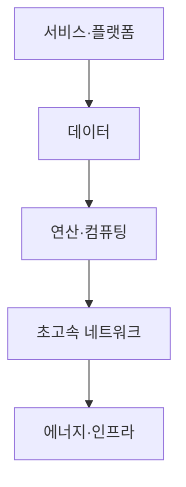
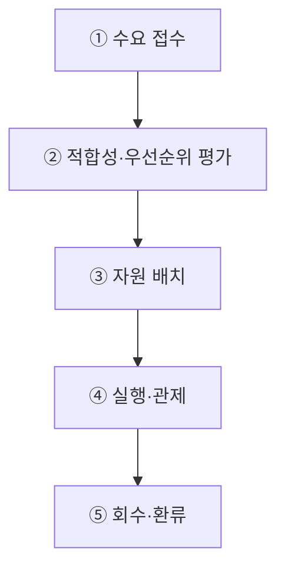
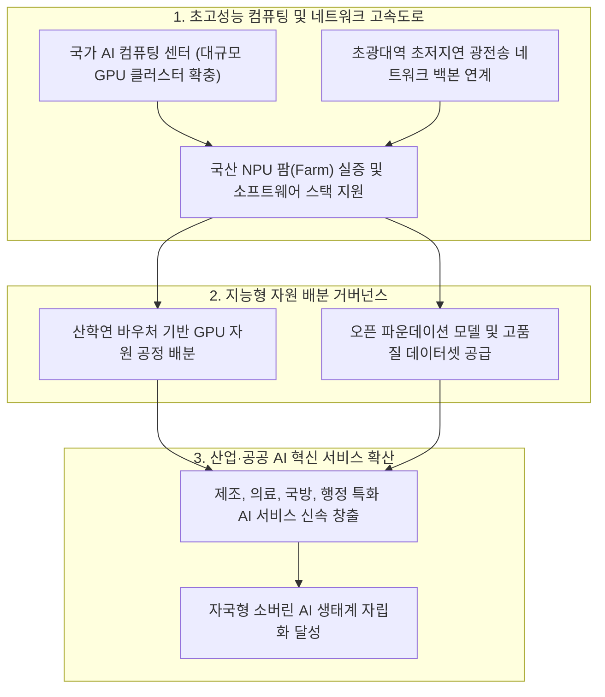

## 지식 로드맵 내 현재 위치

지식 위치: IT 전략·관리 → 국가 AI 전략·컴퓨팅 인프라 → **AI 고속도로**

## 30초 인출

- 본질: 국가 차원의 AI 개발·활용을 위해 대규모 연산( **GPU** / **NPU** )·데이터·초고속 네트워크·전력망을 공통기반으로 구축·공급하는 국가 디지털 인프라이다.
- 메커니즘: Workload 수요 접수 → 적합성 심사 및 Quota 배분 → 국가 AI 컴퓨팅 센터 자원 배치 → 실행 및 FinOps 관제 → 유휴 자원 회수 및 환류한다.
- 판정 기준: 수요에 맞는 **GPU** 자원 배분과 전력효율을 운영 기록으로 확인하고 유휴 자원을 조정하는지 검증한다.

핵심 용어

- **GPU(Graphics Processing Unit)** : 많은 연산을 동시에 처리해 AI·과학계산을 가속하는 프로세서이다.
- **NPU(Neural Processing Unit)** : 신경망의 행렬·텐서 연산을 효율적으로 처리하도록 설계한 AI 가속기이다.
- **HPC(High Performance Computing)** : 여러 프로세서와 고속 네트워크로 대규모 계산을 병렬 처리하는 컴퓨팅 환경이다.
- **MLOps(Machine Learning Operations)** : ML 모델의 개발·배포·운영을 연결하는 실무체계이다.
- **AX(AI Transformation)** : AI를 업무와 서비스의 의사결정·실행 과정에 적용해 운영방식을 바꾸는 전환이다.
- **TCO(Total Cost of Ownership)** : 도입부터 운영·전력·폐기까지 포함한 총소유비용이다.
- **PUE(Power Usage Effectiveness)** : 데이터센터 총 전력 대비 IT 장비 전력의 비율이다.

## 예상문제

> AI 고속도로의 개념과 구성체계를 설명하고, 국가 AI컴퓨팅센터의 구축·운영상 문제점과 대응책을 제시하시오. **(미출제 예상·25점)**

## Ⅰ. AI 자원을 공통기반으로 공급하는 국가 인프라의 개요

> AI 고속도로는 통신망만을 뜻하지 않고, AI의 개발·실증·서비스에 필요한 희소 자원을 연결·공급하는 정책적 인프라 개념임.

- 정의: **AI 컴퓨팅** · **데이터** · **네트워크** ·전력·개발환경을 연계하여 산·학·연의 AI 개발과 활용을 지원하는 국가 공통기반
- 목적: **컴퓨팅 접근성** · **AI 생태계** · **기술자립** · **산업 AX** 강화

## Ⅱ. AI 고속도로 구성체계

> 자원 보유량보다 수요자가 필요한 환경을 적시에 사용할 수 있는 서비스 전달체계가 중요함.

| 영역 | 구성 | 역할 |
|---|---|---|
| Compute | GPU·NPU·HPC·Storage | 학습·추론 자원 공급 |
| Data | 공공·산업 데이터·안전 활용환경 | 학습·평가 데이터 제공 |
| Network | 광대역·저지연·센터 간 연결 | 분산 처리·데이터 이동 |
| Platform | Cloud·MLOps·개발도구 | 개발·배포 환경 제공 |
| Power·Facility | 전력·냉각·입지·DR | 지속가능·회복탄력 운영 |

## Ⅲ. 국가 AI컴퓨팅 서비스 제공 절차

> 수요-배분-실행-회수 전 과정을 계량하여 한정된 가속기의 유휴와 독점을 함께 줄여야 함.

## Ⅳ. 초고속정보통신망과 AI 고속도로 비교

> 전자는 정보를 전달하는 연결망, 후자는 AI 생산에 필요한 연산·데이터·운영환경의 공급망임.

| 기준 | 초고속정보통신망 | AI 고속도로 |
|---|---|---|
| 핵심자원 | 회선·교환·접속 | 가속기·데이터·전력·플랫폼 |
| 제공가치 | 정보 전달 | AI 학습·추론·서비스 |
| 병목 | 대역폭·접속 | 가속기·전력·데이터·SW Stack |
| 운영통제 | 품질·장애·보안 | 배분·이용률·비용·안전·공급망 |

## Ⅴ. 문제점·대응책

> 대규모 설비투자보다 지속 이용률, 공급망, 전력, 데이터 활용의 동시 최적화가 핵심임.

| 위험 | 대책 | 효과 |
|---|---|---|
| 가속기 공급 종속 | 이기종 가속기·개방형 SW Stack 검증 | Lock-in 완화 |
| 수요·배분 불일치 | Workload Profile·Quota·회수 기준 | 유휴·독점 억제 |
| 전력·냉각 제약 | 입지·전력·냉각 공동 용량계획 | 증설 가능성 확보 |
| 데이터 활용 제약 | 권리 확인·안전구역·접근통제 | 합법적 데이터 활용 |
| 지역·기관별 중복투자 | 공동조달·연계운영·서비스 카탈로그 | 투자 효율 향상 |

## Ⅵ. 수요기반 AI Infrastructure FinOps 제언

### 실전 답안용 기술사적 제언

- 문제: 국내 AI 산학연의 고성능 GPU 인프라 부족으로 파운데이션 모델 개발이 중단되고 해외 빅테크 클라우드에 대한 기술 종속이 심화됨.
- 해결 방안: 국가 AI 컴퓨팅 센터 중심의 초고속 GPU 인프라 클러스터와 광전송망(첨단 패브릭)을 구축하고, 국산 NPU 실증 및 공공 바우처 배분 거버넌스를 통해 국가 AI 고속도로 생태계를 조성함.

## 1교시 10점 답안 발췌

### 1. 정의·목적

- 정의: 국가 차원에서 대규모 초고성능 AI 컴퓨팅 자원(GPU), 초광대역 네트워크 백본, 고품질 데이터를 원스톱으로 연결하여 산학연에 공급하는 AI 인프라 플랫폼
- 목적: 국가 AI 경쟁력 3대 강국 도약 · 산학연 GPU 컴퓨팅 갈증 해소 · 해외 빅테크 종속 탈피 및 소버린 AI 생태계 구축

### 2. 핵심 아키텍처 및 메커니즘

- 정의: 국가 차원의 AI 주권 확보와 산업 AX 혁신을 위해 고성능 연산(GPU/NPU)·데이터·초고속망·에너지를 공통기반으로 공급하는 디지털 국가 인프라
- 핵심 메커니즘: 산학연 수요 접수 → 지능형 자원 배치(학습용 GPU / 추론용 국산 NPU) → 초저지연 패브릭 및 데이터 연계 → FinOps 기반 쿼터 관리 및 유휴 자원 회수

## 출제 이력과 검증 출처

- 공식 문제지 원문으로 확인한 직접 기출 없음
- [대한민국 정책브리핑, 국가 AI컴퓨팅센터 구축 착공](https://www.korea.kr/news/policyNewsView.do?newsId=148969296)
- [과학기술정보통신부, 2026년 고성능 컴퓨팅 지원사업](https://msit.go.kr/bbs/view.do?bbsSeqNo=100&mId=311&mPid=121&nttSeqNo=3186760&sCode=user)

## 학습 체크

- [ ] Ⅰ: AI 고속도로의 정의·목적을 설명할 수 있는가?
- [ ] Ⅱ: Compute·Data·Network·Platform·Power 계층을 구분할 수 있는가?
- [ ] Ⅲ: 수요 접수부터 회수·환류까지 활동과 산출물을 연결할 수 있는가?
- [ ] Ⅳ: 초고속정보통신망과 AI 고속도로를 비교할 수 있는가?
- [ ] Ⅴ: 공급망·배분·전력·데이터 위험의 대응책을 제시할 수 있는가?
- [ ] Ⅵ: 수요기반 AI Infrastructure FinOps를 제언할 수 있는가?

## 연결 토픽

- 이전 토픽: [AI 거버넌스 플랫폼](./050_ai_governance_platform.md)
- 연관 토픽: [AI 에너지 인프라](./060_ai_energy_infrastructure.md), [기술 주권](./058_technology_sovereignty.md)
- 다음 토픽: [AI 민주정부 거버넌스](./052_ai_democratic_government_on_ai.md)
