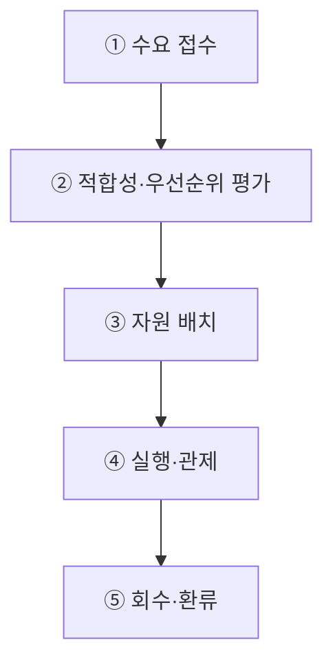

## 지식 로드맵 내 현재 위치

지식 위치: IT 전략·관리 → 국가 AI 전략·컴퓨팅 인프라 → **AI 고속도로**

## 30초 인출

- 본질: **AI 고속도로**: AI 개발·활용에 필요한 연산자원·데이터·네트워크를 국가 차원에서 제공하는 기반.
- 메커니즘: Workload 수요 접수 → 적합성 심사·Quota 배분 → AI 컴퓨팅센터 자원 배정 → 실행·FinOps 관제 → 유휴자원 회수.
- 판정 기준: 수요와 **GPU** 배정의 적합성, 전력효율, 유휴자원 조정기록.

핵심 용어

- **AI 고속도로** : AI 개발·활용에 필요한 연산·데이터·네트워크 자원을 연결해 제공하는 국가 기반
- **GPU(Graphics Processing Unit)** : 대규모 병렬 연산 구조로 AI 모델 학습 및 추론을 가속하는 그래픽 처리 프로세서
- **NPU(Neural Processing Unit)** : 딥러닝 신경망 연산에 특화되어 전력 대비 연산 효율을 극대화한 AI 전용 반도체
- **HPC(High Performance Computing)** : 고성능 분산 노드와 초저지연 네트워크로 대규모 연산을 병렬 처리하는 컴퓨팅 체계
- **MLOps(Machine Learning Operations)** : ML/DL 모델의 데이터 수집부터 학습·배포·모니터링을 자동화하는 운영 관리 프레임워크
- **AX(AI Transformation)** : AI 기술을 비즈니스 프로세스와 의사결정에 융합하여 업무 방식을 혁신하는 인공지능 전환
- **TCO(Total Cost of Ownership)** : 인프라 도입부터 상면·전력·운영·유지보수·폐기까지 생애주기 전반의 총소유비용
- **PUE(Power Usage Effectiveness)** : 데이터센터 총 투입 전력을 IT 장비 소비 전력으로 나눈 에너지 효율성 평가지표

---

## 1교시 예상문제 (10점)

> AI 고속도로의 구성 요소와 AI 컴퓨팅 자원 운영 통제를 설명하시오. (예상·10점)

---

## 1교시 10점 답안

### Ⅰ. **AI 고속도로** 개요

| 구분 | 핵심 |
|---|---|
| 정의 | **AI 고속도로**: 연산·데이터·네트워크·개발환경을 연결해 AI 개발·활용에 필요한 자원을 제공하는 국가 기반 |
| 목적 | 산·학·연의 AI 자원·도구 접근 지원 |

### Ⅱ. 구성요소와 자원운영

AI 서비스의 기반 요소: 연산·데이터·네트워크·개발환경. 전력·시설은 해당 자원의 지속 운영을 뒷받침하는 기반.

| 영역 | 예시 자원 | 제공 역할 |
|---|---|---|
| 연산 | **GPU**·**NPU**·**HPC** | 모델 학습·추론 실행 |
| 데이터 | 공공·산업 데이터와 안전 활용환경 | 학습·평가 데이터 접근 |
| 네트워크 | 센터 내·센터 간 연결 | 컴퓨팅·저장 자원 간 데이터 이동 |
| 플랫폼 | 클라우드·**MLOps**·개발도구 | 개발·배포 환경 제공 |
| 전력·시설 | 전력·냉각·입지 | 서비스의 지속 운영 |

---

## 2~4교시 예상문제 (25점)

> AI 고속도로의 개념과 구성체계를 설명하고, 국가 AI컴퓨팅센터의 구축·운영상 문제점과 대응책을 제시하시오. **(미출제 예상·25점)**

---

## 2~4교시 25점 답안

## Ⅰ. **AI 고속도로** 개요

> AI 고속도로는 통신망만을 뜻하지 않고, AI의 개발·실증·서비스에 필요한 희소 자원을 연결·공급하는 정책적 인프라 개념임.

| 구분 | 핵심 |
|---|---|
| 정의 | **AI 고속도로**: 연산·데이터·네트워크·개발환경을 연결해 AI 개발·활용에 필요한 자원을 제공하는 국가 기반 |
| 목적 | 산·학·연의 AI 자원·도구 접근 지원 |

## Ⅱ. AI 고속도로 구성체계

> 자원운영의 핵심: 자원 보유량이 아닌 수요자의 적시 이용을 뒷받침하는 서비스 전달체계.

| 영역 | 구성 | 역할 |
|---|---|---|
| Compute | **GPU**·**NPU**·**HPC**·Storage | 학습·추론 자원 공급 |
| Data | 공공·산업 데이터·안전 활용환경 | 학습·평가 데이터 제공 |
| Network | 광대역·저지연·센터 간 연결 | 분산 처리·데이터 이동 |
| Platform | Cloud·**MLOps**·개발도구 | 개발·배포 환경 제공 |
| Power·Facility | 전력·냉각·입지·DR | 지속가능·회복탄력 운영 |

## Ⅲ. 국가 AI컴퓨팅 서비스 제공 절차

> 자원배분 관리의 핵심: 수요·배분·실행·회수의 계량과 가속기 유휴·독점의 동시 완화.

## Ⅳ. 초고속정보통신망과 AI 고속도로 비교

> 전자는 정보를 전달하는 연결망, 후자는 AI 생산에 필요한 연산·데이터·운영환경의 공급망임.

| 기준 | 초고속정보통신망 | AI 고속도로 |
|---|---|---|
| 핵심자원 | 회선·교환·접속 | 가속기·데이터·전력·플랫폼 |
| 제공가치 | 정보 전달 | AI 학습·추론·서비스 |
| 병목 | 대역폭·접속 | 가속기·전력·데이터·SW Stack |
| 운영통제 | 품질·장애·보안 | 배분·이용률·비용·안전·공급망 |

## Ⅴ. 문제점·대응책

> 대규모 설비투자보다 지속 이용률, 공급망, 전력, 데이터 활용의 동시 최적화가 핵심임.

| 위험 | 대책 | 효과 |
|---|---|---|
| 가속기 공급 종속 | 이기종 가속기·개방형 SW Stack 검증 | Lock-in 완화 |
| 수요·배분 불일치 | Workload Profile·Quota·회수 기준 | 유휴·독점 억제 |
| 전력·냉각 제약 | 입지·전력·냉각 공동 용량계획 | 증설 가능성 확보 |
| 데이터 활용 제약 | 권리 확인·안전구역·접근통제 | 합법적 데이터 활용 |
| 지역·기관별 중복투자 | 공동조달·연계운영·서비스 카탈로그 | 투자 효율 향상 |

## Ⅵ. 공용자원 배분의 투명성 제언

| 문제 | 해결 방안 |
|---|---|
| 공용 AI 자원 수요 초과에 따른 배분 공정성·이용률·성과 설명의 어려움 | 신청·우선순위 기준 공개와 배정량·사용률·대기기간·성과의 정기 검토에 따른 기준 조정 |

제안의 범위: 공용 자원 운영방안. 특정 센터의 현행 운영절차를 사실로 단정하지 않음.

## 출제 이력과 검증 출처

- 공식 문제지 원문으로 확인한 직접 기출 없음
- [대한민국 정책브리핑, 국가 AI컴퓨팅센터 구축 착공](https://www.korea.kr/news/policyNewsView.do?newsId=148969296)
- [과학기술정보통신부, 2026년 고성능 컴퓨팅 지원사업](https://msit.go.kr/bbs/view.do?bbsSeqNo=100&mId=311&mPid=121&nttSeqNo=3186760&sCode=user)

## 연결 토픽

- 이전 토픽: [AI 거버넌스 플랫폼](./050_ai_governance_platform.md)
- 연관 토픽: [AI 에너지 인프라](./060_ai_energy_infrastructure.md), [기술 주권](./058_technology_sovereignty.md)
- 다음 토픽: [AI 민주정부 거버넌스](./052_ai_democratic_government_on_ai.md)
