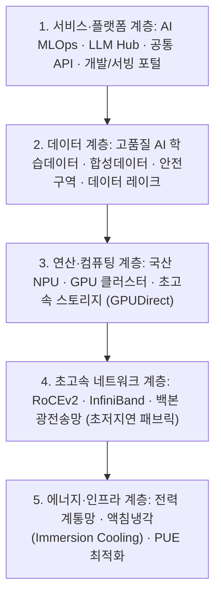
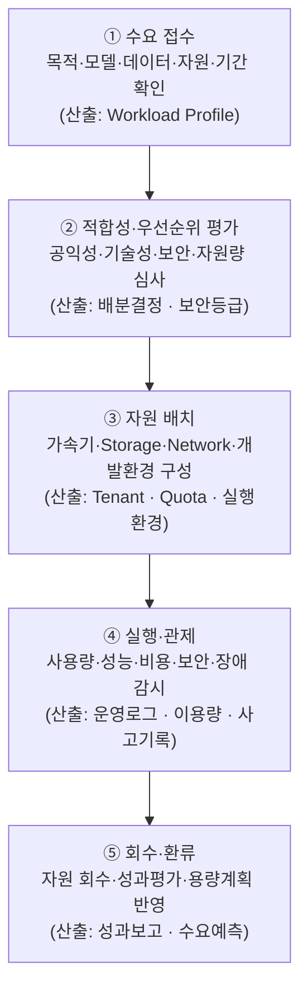
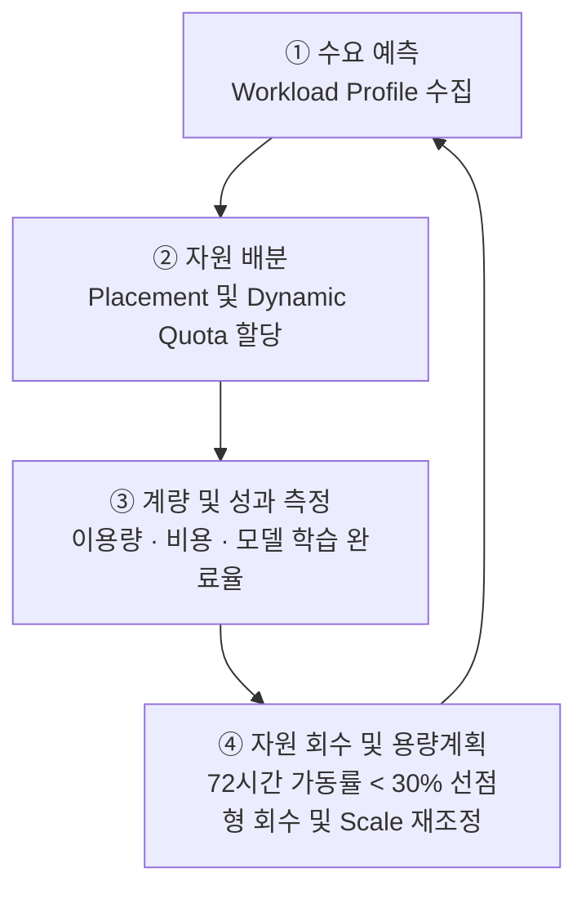

## 지식 로드맵 내 현재 위치

  IT 전략·관리국가 AI 전략·인프라<strong>AI 고속도로</strong>

## 30초 인출

- 본질: 국가 차원의 AI 개발·활용을 위해 대규모 연산(GPU/NPU)·데이터·초고속 네트워크·전력망을 공통기반으로 구축·공급하는 국가 디지털 인프라
- 메커니즘: Workload 수요 접수 → 적합성 심사 및 Quota 배분 → 국가 AI 컴퓨팅 센터 자원 배치 → 실행 및 FinOps 관제 → 유휴 자원 회수 및 환류
- 판정 기준: 할당 GPU 자원의 72시간 연속 가동률 >= 30% 유지 및 PUE(전력효율지수) < 1.2 이하 달성 여부

핵심 용어

- **GPU(Graphics Processing Unit)**: 대규모 병렬연산을 수행하는 범용 가속기
- **NPU(Neural Processing Unit)**: 신경망 연산에 최적화한 AI 전용 가속기
- **HPC(High Performance Computing)**: 대규모 계산을 병렬로 처리하는 고성능 컴퓨팅
- **MLOps(Machine Learning Operations)**: ML 모델의 개발·배포·운영을 연결하는 실무체계
- **AX(AI Transformation)**: 업무·서비스·산업 구조에 AI를 적용하는 전환
- **TCO(Total Cost of Ownership)**: 도입부터 운영·전력·폐기까지 포함한 총소유비용
- **PUE(Power Usage Effectiveness)**: 데이터센터 총 전력 대비 IT 장비 전력의 비율

## 예상문제

> AI 고속도로의 개념과 구성체계를 설명하고, 국가 AI컴퓨팅센터의 구축·운영상 문제점과 대응책을 제시하시오. **(미출제 예상·25점)**

## Ⅰ. AI 자원을 공통기반으로 공급하는 국가 인프라

> AI 고속도로는 통신망만을 뜻하지 않고, AI의 개발·실증·서비스에 필요한 희소 자원을 연결·공급하는 정책적 인프라 개념임.

- 정의: AI 컴퓨팅·데이터·네트워크·전력·개발환경을 연계하여 산·학·연의 AI 개발과 활용을 지원하는 국가 공통기반
- 목적: **컴퓨팅 접근성·AI 생태계·기술자립·산업 AX** 강화

## Ⅱ. AI 고속도로 구성체계

> 자원 보유량보다 수요자가 필요한 환경을 적시에 사용할 수 있는 서비스 전달체계가 중요함.

| 영역 | 구성 | 역할 |
|---|---|---|
| Compute | GPU·NPU·HPC·Storage | 학습·추론 자원 공급 |
| Data | 공공·산업 데이터·안전 활용환경 | 학습·평가 데이터 제공 |
| Network | 광대역·저지연·센터 간 연결 | 분산 처리·데이터 이동 |
| Platform | Cloud·MLOps·개발도구 | 개발·배포 환경 제공 |
| Power·Facility | 전력·냉각·입지·DR | 지속가능·회복탄력 운영 |

## Ⅲ. 국가 AI컴퓨팅 서비스 제공 절차

> 수요-배분-실행-회수 전 과정을 계량하여 한정된 가속기의 유휴와 독점을 함께 줄여야 함.

## Ⅳ. 초고속정보통신망과 AI 고속도로 비교

> 전자는 정보를 전달하는 연결망, 후자는 AI 생산에 필요한 연산·데이터·운영환경의 공급망임.

| 기준 | 초고속정보통신망 | AI 고속도로 |
|---|---|---|
| 핵심자원 | 회선·교환·접속 | 가속기·데이터·전력·플랫폼 |
| 제공가치 | 정보 전달 | AI 학습·추론·서비스 |
| 병목 | 대역폭·접속 | 가속기·전력·데이터·SW Stack |
| 운영통제 | 품질·장애·보안 | 배분·이용률·비용·안전·공급망 |

## Ⅴ. 문제점·대응책

> 대규모 설비투자보다 지속 이용률, 공급망, 전력, 데이터 활용의 동시 최적화가 핵심임.

| 위험 | 대책 | 효과 |
|---|---|---|
| 가속기 공급 종속 | 이기종 가속기·개방형 SW Stack 검증 | Lock-in 완화 |
| 수요·배분 불일치 | Workload Profile·Quota·회수 기준 | 유휴·독점 억제 |
| 전력·냉각 제약 | 입지·전력·냉각 공동 용량계획 | 증설 가능성 확보 |
| 데이터 활용 제약 | 권리 확인·안전구역·접근통제 | 합법적 데이터 활용 |
| 지역·기관별 중복투자 | 공동조달·연계운영·서비스 카탈로그 | 투자 효율 향상 |

## Ⅵ. 수요기반 AI Infrastructure FinOps 제언

### 학습자 통찰 메모 — 답안 밖

`[핵심 통찰]` AI 고속도로의 성패는 가속기 보유 대수가 아니라, 다양한 수요를 적합한 자원에 배치하고 사용 성과를 다음 용량계획에 반영하는 운영능력에 달려 있음.

`나라면` 사업별 서버 소유 방식 대신 공통 서비스 카탈로그와 Quota를 적용하고, 가속기 시간·전력·Storage·Network 비용을 Workload 단위로 계량하여 증설 판단에 사용하겠음.

### 실전 답안용 기술사적 제언

- **판정 기준 (Trigger)**: 국가 AI 컴퓨팅 센터 내 GPU 할당 자원의 72시간 연속 가동률(Utilization)이 30% 미만이거나 특정 기관 독점 점유율이 40%를 초과할 시 자원 회수 트리거 발동.
- **대응 방안 (Action)**: AI Infra FinOps 기반 동적 쿼터제(Dynamic Quota)와 유휴 자원 선점형(Preemptible) 재할당 파이프라인을 가동하고, 국산 NPU 전용 추론 풀로 분산 유도.
- **검증 체계 (Verification)**: 워크로드별 TCO(연산비용+전력비용+스토리지), 데이터센터 전력효율(PUE < 1.2 목표), 모델 학습 완료율을 계량화하여 분기별 투자 효과를 평가함.
- **기대 효과 (Impact)**: 글로벌 GPU 벤더 종속 탈피(소버린 AI 인프라 자립), 자원 유휴 손실 50% 절감, 스타트업 및 연구계 AI 개발 진입 장벽의 획기적 완화를 달성함.

## 1교시 10점 답안 발췌

### 1. 정의·목적

- 정의: AI 컴퓨팅·데이터·네트워크·전력·개발환경을 연계하여 AI 개발과 활용을 지원하는 국가 공통기반
- 목적: **컴퓨팅 접근성·AI 생태계·기술자립·산업 AX** 강화

### 2. 구성 풀스택

### 3. 핵심 통제

- **수요기반 배분**: Workload Profile → Placement·Quota → 계량·회수
- **Full-stack 최적화**: 가속기·Network·Storage·전력의 TCO 공동 관리

## 출제 이력과 검증 출처

- 공식 문제지 원문으로 확인한 직접 기출 없음
- [대한민국 정책브리핑, 국가 AI컴퓨팅센터 구축 착공](https://www.korea.kr/news/policyNewsView.do?newsId=148969296)
- [과학기술정보통신부, 2026년 고성능 컴퓨팅 지원사업](https://msit.go.kr/bbs/view.do?bbsSeqNo=100&mId=311&mPid=121&nttSeqNo=3186760&sCode=user)

## 학습 체크

- [ ] Ⅰ: AI 고속도로의 정의·목적을 설명할 수 있는가?
- [ ] Ⅱ: Compute·Data·Network·Platform·Power 계층을 구분할 수 있는가?
- [ ] Ⅲ: 수요 접수부터 회수·환류까지 활동과 산출물을 연결할 수 있는가?
- [ ] Ⅳ: 초고속정보통신망과 AI 고속도로를 비교할 수 있는가?
- [ ] Ⅴ: 공급망·배분·전력·데이터 위험의 대응책을 제시할 수 있는가?
- [ ] Ⅵ: 수요기반 AI Infrastructure FinOps를 제언할 수 있는가?

## 연결 토픽

- 이전 토픽: [AI 거버넌스 플랫폼](./050_ai_governance_platform.md)
- 연관 토픽: [AI 에너지 인프라](./060_ai_energy_infrastructure.md), [기술 주권](./058_technology_sovereignty.md)
- 다음 토픽: [AI 민주정부 거버넌스](./052_ai_democratic_government_on_ai.md)
