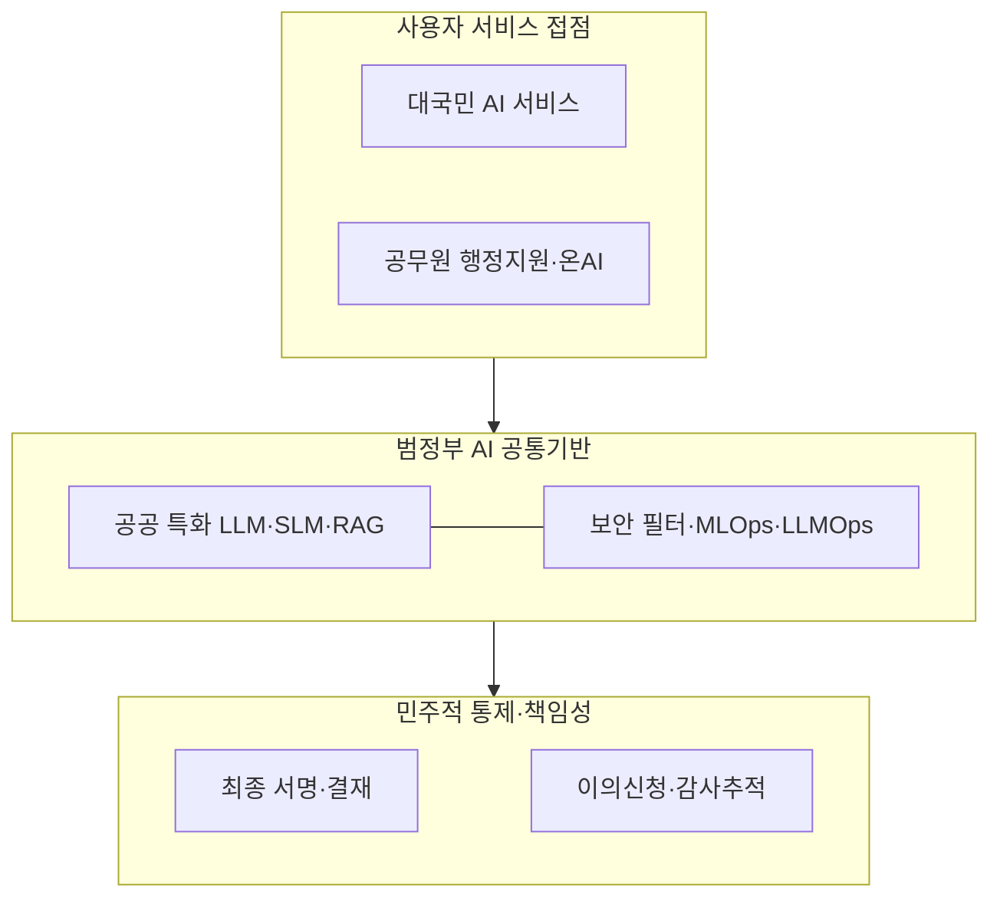
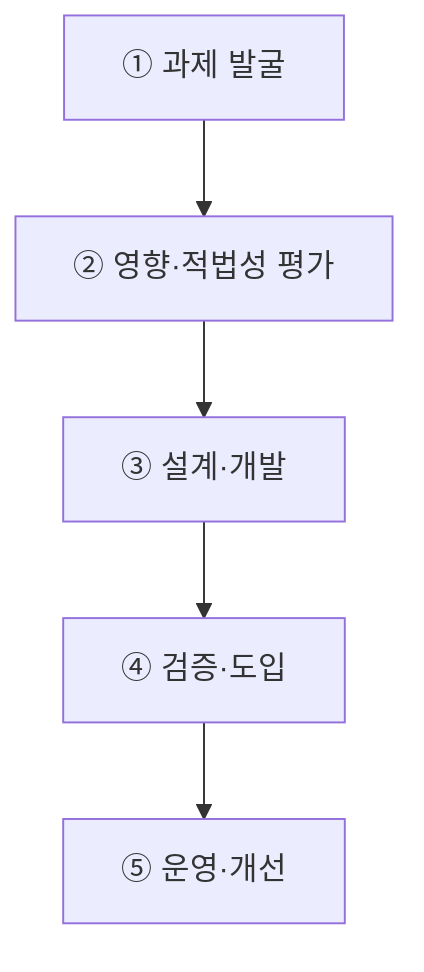
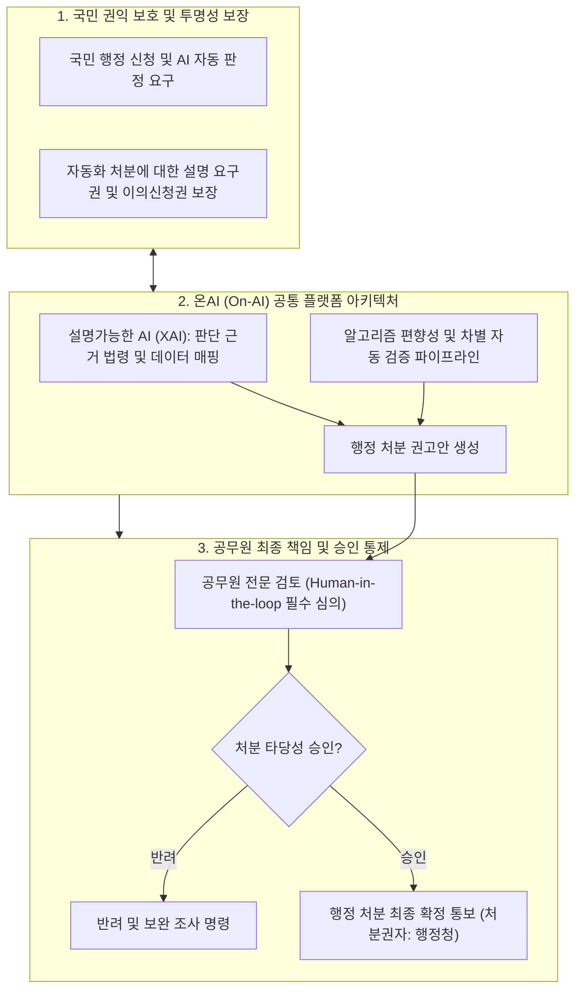

## 지식 로드맵 내 현재 위치

지식 위치: IT 전략·관리 → 전자정부·디지털플랫폼정부 → **AI 민주정부·온AI**

## 30초 인출

- 본질: AI 민주정부·온AI는 생성형 AI를 공공 서비스와 행정 업무에 활용하는 추진 모델이다. 사람의 감독과 행정 책임을 함께 유지해야 한다.
- 메커니즘: 과제 발굴 → 적법성·영향평가 → 공통기반 연계 개발 → 인간 감독·승인 → 이의신청·사후 감사로 공공 AI 책임성을 통제한다.
- 판정 기준: 공무원의 독립적 검토와 시민의 이의제기·처리 기록이 의사결정 과정에 남는지 확인한다.

핵심 용어

- **온AI** : 공무원의 법령 검토·문서 작성·행정 협업을 지원하는 공공 지능형 업무관리 플랫폼
- **RAG(Retrieval-Augmented Generation)** : 외부 지식 베이스에서 관련 문서를 검색하여 생성 모델의 문맥으로 주입하는 검색 증강 생성 기술
- **Human Oversight** : 공공 의사결정 과정에서 AI 출력을 공무원이 검토·승인·중단할 수 있도록 보장하는 인간 감독 통제
- **Contestability** : AI 판단으로 처분을 받은 당사자가 결정 근거를 확인하고 이의를 제기할 수 있는 권리 보장성
- **DPG(Digital Platform Government)** : 민관 데이터와 서비스를 연계해 국민 중심 맞춤형 혜택을 제공하는 디지털플랫폼정부
- **LLM(Large Language Model)** : 대규모 텍스트 코퍼스를 학습하여 복잡한 언어 이해와 추론을 수행하는 거대 언어 모델
- **SLM(Small Language Model)** : 특정 도메인과 온프레미스 보안 환경에 최적화된 경량 소형 언어 모델
- **MLOps(Machine Learning Operations)** : 머신러닝 모델의 개발·배포·운영 수명주기를 자동화하는 협업 프레임워크
- **LLMOps(Large Language Model Operations)** : LLM 기반 서비스의 프롬프트·평가·가드레일·배포를 관리하는 운영 체계

---

## 1교시 예상문제 (10점)

> AI 민주정부의 서비스 구조와 결과 검증·책임 통제를 설명하시오. (예상·10점)

---

## 1교시 10점 답안

### 1. 정의·목적

- 정의: 공공 행정 전반에 AI를 안전하게 도입하여 대국민 행정 서비스를 고도화하되, 국민의 권익 보호·투명성·인간 통제(Human-in-the-loop)를 보장하는 차세대 지능형 행정 모델
- 목적: 행정 생산성 및 정확도 극대화 · AI 행정 처분의 민주적 정당성 및 설명가능성 확보 · 공공 AI 책임 공백 방지

### 2. 핵심 아키텍처 및 메커니즘

- 정의: 생성형 AI와 범정부 공통기반을 통해 대국민 맞춤 서비스와 공무원 행정(온AI)을 지능화하되, 민주적 통제와 인간 감독을 통해 법적 책임성을 담보하는 공공 AX 운영 모델
- 핵심 메커니즘: 대국민 선제 서비스/온AI 접점 → 공공 RAG 및 보안 필터 → 공무원 최종 결재(Human Oversight) → 이의신청권(Contestability) 및 사후 감사추적

### 3. 핵심 통제

- **Grounded Assistance** : 근거검색·출처표시·사용자 확인
- **Contestability** : 통지·정정·이의제기·인간 재검토

---

## 2~4교시 예상문제 (25점)

> AI 민주정부의 개념과 구성체계를 설명하고, 공공부문 AI 서비스의 추진절차 및 문제점·대응책을 제시하시오. **(미출제 예상·25점)**

---

## 2~4교시 25점 답안

## Ⅰ. 국민서비스와 행정업무를 AI로 혁신하는 정부 모델의 개요

> AI 민주정부는 자동처분 정부가 아니라, 공공서비스의 접근성과 행정 생산성을 높이면서 민주적 책임을 유지하는 정부 모델임.

| 구분 | 핵심 |
|---|---|
| 정의 | AI를 활용하여 **국민서비스** · **정책참여** ·공무원 업무를 개선하고 공공 의사결정의 책임성과 투명성을 강화하는 정부 운영모델 |
| 목적 | **선제 안내** · **행정 생산성** · **정책 대응성** · **국민 신뢰** 향상 |

## Ⅱ. AI 민주정부 구성체계

| 계층 | 핵심 기능 | 책임 통제 |
|---|---|---|
| 대국민 | 맞춤 안내·민원·안전·참여 | 고지·접근성·이의제기 |
| 공무원 | 검색·법령검토·초안·업무지원 | 사용자 확인·최종책임 |
| 공통기반 | 모델·RAG·데이터·API·관제 | 평가·권한·기록·보안 |
| 거버넌스 | 정책·위험등급·조달·감사 | 책임자·승인·사고대응 |

## Ⅲ. 공공 AI 서비스 추진절차

> 서비스 편의보다 법적 근거와 국민 권리에 미치는 영향을 먼저 확인해야 함.

## Ⅳ. 전자정부·DPG·AI 민주정부 비교

| 기준 | 전자정부 | DPG | AI 민주정부 |
|---|---|---|---|
| 초점 | 업무·민원 전산화 | 데이터·서비스 연계 | AI 기반 서비스·업무 혁신 |
| 제공방식 | 온라인 신청 | 통합·맞춤 서비스 | 선제 안내·지능형 지원 |
| 기반 | 정보시스템·포털 | API·Cloud·데이터 | AI 공통기반·RAG·Agent |
| 핵심통제 | 보안·개인정보 | 데이터 책임·상호운용 | 영향평가·인적감독·이의제기 |

## Ⅴ. 문제점·대응책

| 위험 | 대책 | 효과 |
|---|---|---|
| 부정확한 안내·초안 | 근거검색·출처표시·사용자 확인 | 오사용 감소 |
| 편향·서비스 배제 | 영향평가·대표성 검토·대체채널 | 접근권 보호 |
| 자동결정 책임 불명확 | Human Oversight·승인기록 | 책임소재 확보 |
| 개인정보 과다결합 | 목적제한·최소처리·접근통제 | 침해위험 완화 |
| 기관별 중복구축 | 범정부 공통기반 우선 검토 | 비용·파편화 감소 |

## Ⅵ. 설명·이의제기 가능한 행정 Quality Gate

### 실전 답안용 기술사적 제언

- 문제: 공공 AI 도입 시 행정청의 처분 권한과 AI의 자동 추천 간 경계가 모호해져 국민의 권익 침해 및 책임성 공백이 발생함.
- 해결 방안: 모든 공공 행정 처분에 대해 공무원의 최종 확인(Human-in-the-loop)과 설명가능성(XAI)을 의무화하고, 온AI(On-AI) 공통 플랫폼을 통해 투명한 알고리즘 감사와 국민 권리구제 절차를 확립함.

## 출제 이력과 검증 출처

- 공식 문제지 원문으로 확인한 직접 기출 없음
- [행정안전부, AI 민주정부 실현 본격 추진](https://mois.go.kr/frt/bbs/type010/commonSelectBoardArticle.do?bbsId=BBSMSTR_000000000008&nttId=128980)
- [NIA, 공공부문 AI 도입·활용 가이드](https://www.nia.or.kr/site/nia_kor/ex/bbs/View.do?bcIdx=29526&cbIdx=37989)
- [행정안전부, 온AI 모바일 서비스](https://www.mois.go.kr/video/bbs/type019/commonSelectBoardArticle.do?bbsId=BBSMSTR_000000000255&nttId=125757)

## 연결 토픽

- 이전 토픽: [AI 고속도로](./051_ai_highway.md)
- 연관 토픽: [범정부 AI 공통기반](./025_pan_government_ai_common_infrastructure.md), [공공 클라우드 전환](./021_public_cloud_native_transition.md)
- 다음 토픽: [AI 프라이버시 위험관리 모델](./054_ai_privacy_risk_management_model.md)
